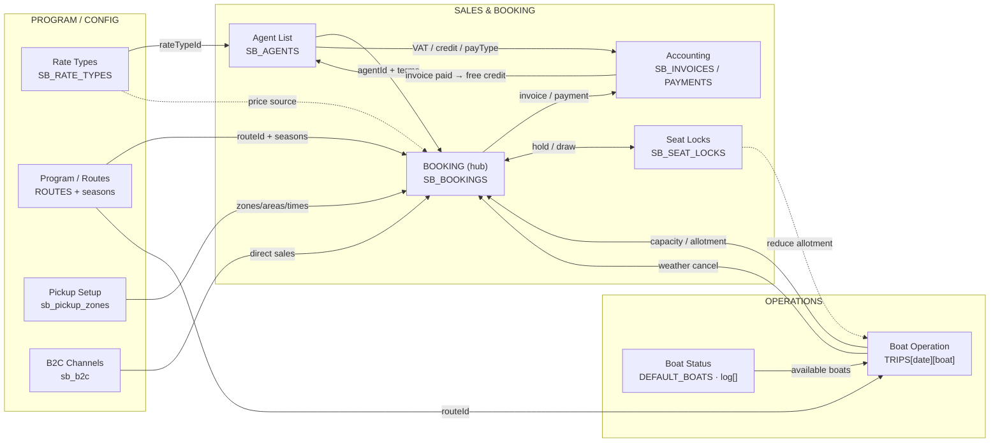

# LOVE Andaman — System Map (Sales & Booking + Operations)

> Machine-readable architecture map of `allotment_v2.html`.
> Purpose: let a human **or an AI assistant** quickly understand the modules, their data stores, key fields, and how they connect — without reading the 2.9 MB source file.
> Scope here: **Program/Routes · Boat Status · Boat Operation · Pickup Setup · Rate Types · B2C Channels · Agent List · Booking · Seat Locks · Accounting · Weather cancellation.**
> Companion file: `CLAUDE.md` (deeper schemas, safety rules, change log). This file = the big picture.
> Last updated: 2026-06-04.

---

## 0. How to read this file

- **Entities** (§2) are the modules/data objects. Each lists: its data store, seed constant, key fields, and one-line role.
- **Relationships** (§3) is an explicit edge list: `SOURCE --(field/mechanism)--> TARGET`. This is the part an AI should parse to reason about data flow.
- **Diagram** (§4) is the same graph in Mermaid (renders on GitHub / most viewers; AIs read it directly).
- **Derived rules** (§5) are the non-obvious calculations (sellable seats, credit, weather) that tie modules together.

All state persists in **one** localStorage key: `loveandaman_v2` (read-modify-write; never clobber). Seed constants (`DEFAULT_*` / `SB_*` / `FL_*`) populate it on first load; after that localStorage is the source of truth.

---

## 1. Module groups (as shown in the app sidebar)

| Group | Modules |
|---|---|
| **SALES & BOOKING** | Rate Types · Agent List · B2C Channels · Pickup Setup · Booking · Accounting |
| **OPERATIONS** | Boat Status · Boat Operation · (Calendar / Daily availability) |
| **PROGRAM / CONFIG** | Programs = Routes + seasons (the catalog everything else references) |

The three groups are linked by one shared idea — a **trip = Route × Date × Boat** — that Booking *sells*, Boat Operation *runs*, and Program *defines*.

---

## 2. Entity catalog

### 2.1 Program / Routes  `(catalog · the spine)`
- **Store:** `ROUTES` (seed `DEFAULT_ROUTES`, ~line 3328) · persisted in `loveandaman_v2`.
- **Key fields:** `id` (`r1`…`r12`), `name`, `islands`, `times[]` (departure times), `color`, `pier` (`tublamu`|`panwa`), `seasons[]` = `{id, type:'open'|'closed', from, to}`.
- **Program family:** routes are grouped into 5 **programs** via `bkV2RouteFamily()` (name-pattern match): `_BKV2_FAMILIES` = Similan Islands · Surin Islands · Phi Phi Bamboo · Krabi + Phang Nga · Whale Shark Phi Phi Maiton.
- **Open/closed on a date:** `bkV2IsRouteOpenOn(routeId, date)` / `getDayStatus(route, date)` read `seasons[]` → off-season routes render hatched/closed.
- **Role:** the master list of what can be sold and run. Everything references a `routeId`.

### 2.2 Boat Status  `(fleet readiness)`
- **Store:** `boats[]` (seed `DEFAULT_BOATS`, ~line 3357) · 15 vessels.
- **Key fields:** `id` (`b1`…), `name`, `type`, `pier` (home pier), `cap` (operational seats), `licensePax`, `crew`, `log[]` = status history `{s:'available'|'fixing'|'unavailable', from, to, loc, note}`. Current status = **last log entry**.
- **Role:** decides **which boats can run today**. A boat with last log `s!=='available'` is out (in-shop / dry-dock) and won't be offered for assignment.

### 2.3 Boat Operation  `(runs the trips · capacity source)`
- **Store:** `TRIPS[date][boatId]` = `{route, type:'normal'|'charter', booked, charterBookingId?}`.
- **Role / two key outputs:**
  1. **Assign boats to a Route × Date** and set whether seat or charter → defines **capacity / allotment** per trip.
  2. **Decide weather cancellation (⛈)** for a Route × Date → writes `SB_WEATHER_CLOSURES`, which Booking then resolves per-booking.
- **Views:** heatmap by day, cell popover (assign boat / mark weather cancel). Reflects locks: cells show `cap − booked − locked`.

### 2.4 Pickup Setup  `(logistics config)`
- **Store:** `sb_pickup_zones` (managed via UI).
- **Key fields:** zones (`PK` Phuket · `KL` Khao Lak · `NoTransfer`), areas (hotels/points) under each zone, per-route pickup times.
- **Role:** feeds the Booking pickup section + manifest (zone pills, pickup time, area name).

### 2.5 Rate Types  `(pricing master)`
- **Store:** `SB_RATE_TYPES` (seed ~line 26210) · key `sb_rate_types`.
- **Key fields:** `id`, `code`, `name`, `routes[]`, `seatRates{route:{zone:{paxType:price}}}`, `routeValidity{route:{from,to}}` (active period · source of truth), `routeBundles` (forced add-on baked into seat price), `charterRates{route:{boatType:{starterPrice,starterIncludes,extraPerPax}}}`, `addOns{longtail{join,charter}, privateTransfer, …}`.
- **Add-on registry:** `RT_ADDON_DEFS` (built-ins longtail/privateTransfer + UI-created custom types in `sb_addon_types`). Add a type once → cascades to Rate Type page, Agent pricing tab, contract PDF, preview.
- **Role:** reusable price packages. Bound to agents; the single source of every price Booking quotes.

### 2.6 B2C Channels  `(direct sales source)`
- **Store:** `sb_b2c`.
- **Role:** non-agent direct sales (OTA/own website). A booking can reference a `b2cChannel` instead of an `agentId`. Behaves like an agent for sourcing but typically prepaid.

### 2.7 Agent List  `(who sells · terms)`
- **Store:** `SB_AGENTS` · key `sb_agents`.
- **Key fields:** `id`, `name`, `code`, contact/commission/sections, `rateTypeId` (**bound to exactly one Rate Type**), `payType` (`invoice`|`proforma`|`prepaid`), `vatMode` (`none`|`exclude`|`include`), `creditLimit`, `creditDays`, `contractVersion`.
- **Tabs:** Info · **Pricing Matrix** (embeds the bound Rate Type's detail) · Recent Bookings (`agTabHist`, filters `b.agentId`) · Additional Services · Contract (PDF + version history).
- **Admin:** **Clear Agents** = hard-confirm bulk delete that **cascade-deletes** linked bookings, contracts, and agent-held seat locks.
- **Role:** the customer-of-record for B2B bookings; supplies terms (payment, VAT, credit) and the price package.

### 2.8 Booking  `(what's sold · central hub)`
- **Store:** `SB_BOOKINGS` · key `sb_bookings`.
- **View:** `#view-booking` → `bkV2Render()`. Tabs (`_bkV2.tab`): `cal` (Calendar/Matrix) · `bytrip` (By-trip-date manifest) · `all` (linear list) · `locks` (Seat Locks).
- **Key fields:** `id`, `agentId` | `b2cChannel`, `rateTypeRef`, `leadPax`/`passengers[]`, `pickupAreaId`/`pickupZone`, `trips[]` = `{routeId, date, zone, pax{ad,chd,inf,foc}, bookingMode:'seat'|'charter', charterBoatId, pickupTime, subtotal, seatSource, lockDraws}`, `addOns[]`, `adjustments[]` (discount/extra), `priceBreakdown`, `status`, `weatherResolve` (§5.3), `rebook`, `history[]` (audit timeline), `incomplete[]` (soft-missing fields).
- **Forecasting record (2026-06-04):** each booking is self-contained for demand/market trend analysis — `bookingDate` (date booked · editable later), `bookedAt` (exact ISO timestamp), `marketSnapshot` `{market, sub, agentId, at}` (frozen at create time so trends stay correct even if the agent later changes market). Pair with `trips[].date` (travel date) to compute **lead time** = travelDate − bookingDate. Query: group by `marketSnapshot.market` × `bookingDate` (booking curve) or × `trips.date` (travel demand).
- **Quote:** `bkV2CalcQuote()` builds price from the bound **Rate Type** (seat + charter + add-ons + bundles) − discounts + extras.
- **Role:** converges Agent + Rate Type + Pickup + Program + Boat Operation capacity into a sellable, priced, manifested trip; emits invoices/payments to Accounting; draws Seat Locks.

### 2.9 Seat Locks  `(held inventory)`
- **Store:** `SB_SEAT_LOCKS` · key `sb_seat_locks`.
- **Key fields:** `scope:'day'|'month'`, `routeId`, `date`/`monthFrom`/`monthTo`, `holderType:'agent'|'office'|'global'`, `holderId`, `qty`, `used`, `status`.
- **Role:** pre-held seats. Reduce the sellable pool everywhere (`getAllotment`), drawn during a booking (own → office → global). Booking has a hard guard that blocks silently eating locked seats.

### 2.10 Accounting  `(money)`
- **Store:** `SB_INVOICES` / `SB_PAYMENTS` / `SB_DEPOSITS` · keys `sb_invoices` / `sb_payments` / `sb_deposits`.
- **Key features:** Invoice / Pro-forma + receipts (print→PDF), partial payments, deposits (FIFO apply), VAT 7% (per agent `vatMode`), per-agent statement, money dashboard (receivables aging / collection / top-outstanding).
- **Credit model (derived, no double-ledger):** `agCreditState(agentId).used` = Σ(confirmed, credit-mode, non-cancelled, **unpaid** bookings). Consumed at confirm; **freed** when the covering invoice is fully paid OR the booking is cancelled/weather-cancelled.
- **Role:** turns bookings into receivables and tracks collection + agent credit exposure.

---

## 3. Relationships (edge list — parse this)

```
Program/Routes      --(routeId)-->                 Boat Operation        # which route a trip runs
Program/Routes      --(routeId, seasons)-->        Booking               # sellable routes + open/closed
Program/Routes      --(family)-->                  Booking (Calendar)    # grouped by program family
Boat Status         --(available boats)-->         Boat Operation        # only available boats can be assigned
Boat Operation      --(TRIPS: boat+capacity)-->    Booking               # capacity / allotment per trip
Boat Operation      --(SB_WEATHER_CLOSURES, weather cancel)--> Booking   # ops decides ⛈ → booking resolves
Pickup Setup        --(zones/areas/times)-->       Booking               # pickup zone, time, area name
Rate Types          --(rateTypeId)-->              Agent List            # agent bound to one rate type
Rate Types          --(seat/charter/add-on rates)--> Booking             # price source for the quote
B2C Channels        --(b2cChannel)-->              Booking               # direct (non-agent) sales
Agent List          --(agentId + payType/VAT/credit)--> Booking          # customer + terms
Agent List          --(payType/VAT/credit)-->      Accounting            # invoice mode + VAT + credit limit
Booking             --(invoice / payment)-->       Accounting            # receivables + collection
Booking             <--(hold / draw)-->            Seat Locks            # draws held seats at commit
Seat Locks          --(locked seats)-->            Boat Operation        # locks reduce displayed allotment
Seat Locks          --(locked seats)-->            Booking               # reduce sellable pool (getAllotment)
Accounting          --(invoice paid)-->            Agent List (credit)   # frees consumed credit
```

Cardinality highlights: `Agent 1—1 RateType` (`rateTypeId`); `Booking N—1 Agent` (`agentId`); `Booking 1—N trips`; `trip N—1 Route`; `Boat Operation: Route×Date 1—N Boats`; `Invoice 1—N Bookings` (combine).

---

## 4. Diagram (Mermaid)



---

## 5. Derived rules (the glue logic)

### 5.1 Sellable seats (allotment)
`getAllotment(route, date)` → `seatsAvailable = availableCapacity − seatsConsumed − lockedSeats`.
- `availableCapacity` = Σ cap of **seat** boats assigned in Boat Operation (Boat Status must be `available`).
- `seatsConsumed` = Σ pax of confirmed seat bookings (`getSeatsConsumed`, excludes `cancelled` / `rejected` / `cancelled_weather`).
- `lockedSeats` = `bkV2LockedTotal(route,date)` from Seat Locks.
Booking commit hard-blocks any booking that would consume locked seats it didn't draw.

### 5.2 Agent credit
Consumed at **confirm** (credit-mode agents, `payType==='invoice'`): `used += booking total`.
Freed when the covering **invoice is fully paid** (`acctBookingPaid`) or the booking is **cancelled / weather-cancelled**. Fully derived — no separate ledger.

### 5.3 Weather cancellation (ops → sales handoff)
1. **Boat Operation** marks a Route × Date cancelled (⛈) → `SB_WEATHER_CLOSURES` + tags affected bookings `weatherResolve={event, status:'awaiting'}`.
2. **Booking (By-trip-date)** resolves **per booking, 2 phases**: `awaiting → notify agent → notified → resolve`.
3. Resolve outcomes: **Reschedule** (moves `trip.date`, booking stays confirmed, leaves a ghost row on the original date), **Refund**, **Credit** (→ `acctCreateDeposit`), **Cancel** (`cancelled_weather`).
4. Cancelled-weather seats auto-release (excluded from `getSeatsConsumed`). Calendars show cancelled state; trip header + Selected-Day show **Original / Rescheduled / Cancelled / Pending** pax counts.
Every step is appended to the booking's `history[]` audit timeline (tags: Created, Edited, Invoice, Payment, Reschedule, Cancel, Refund, Credit, Notify, Weather, FOC, Extra).

---

## 6. Quick reference — data stores

| Module | In-memory | localStorage key (under `loveandaman_v2`) |
|---|---|---|
| Program / Routes | `ROUTES` | (seeded from `DEFAULT_ROUTES`) |
| Boat Status | `boats[]` | (seeded from `DEFAULT_BOATS`) |
| Boat Operation | `TRIPS` | `trips` |
| Pickup Setup | — | `sb_pickup_zones` |
| Rate Types | `SB_RATE_TYPES` | `sb_rate_types` (+ `sb_addon_types`) |
| B2C Channels | `SB_B2C` | `sb_b2c` |
| Agent List | `SB_AGENTS` | `sb_agents` |
| Booking | `SB_BOOKINGS` | `sb_bookings` |
| Seat Locks | `SB_SEAT_LOCKS` | `sb_seat_locks` |
| Accounting | `SB_INVOICES/PAYMENTS/DEPOSITS` | `sb_invoices` / `sb_payments` / `sb_deposits` |
| Weather closures | `SB_WEATHER_CLOSURES` | `sb_weather` |
| Day-of extras | `SB_EXTRAS` | `sb_extras` |
| Demand / market stats | `SB_MARKET_STATS` | `sb_market_stats` |

### Demand / Market Intelligence (2026-06-04)
New module `#view-marketdata` → `renderMarketData()` (nav item "Demand"). Imports Phuket-airport immigration daily reports (`IN1` arrivals / `OUT1` departures, Thai-Buddhist-dated .xls) via **SheetJS** (CDN). Store `SB_MARKET_STATS[YYYY-MM-DD] = {in:{thaiNat:count}, out:{...}}`. Parser: `mdIngest(aoa,fname)` (detects dir + Thai date + per-nationality totals). Dashboard: KPIs (arrivals/departures/net/cumulative net-in-island), in-vs-out trend, top arrivals by nationality, and a **penetration index** — our booking nationality mix vs Phuket arrival mix (`index = ourShare ÷ arrivalShare × 100`; ≤70 = under-indexed opportunity). Joins on 2-letter code via `MD_NAT_TH2CODE` (Thai→code) ↔ booking `leadNationality`. Purpose: demand forecasting + market-gap strategy (pairs with booking `bookingDate`/`marketSnapshot`/lead-time). Note: needs internet for SheetJS CDN. Backup: `BACKUP/allotment_v2_20260604_pre_demand_module.html`.
