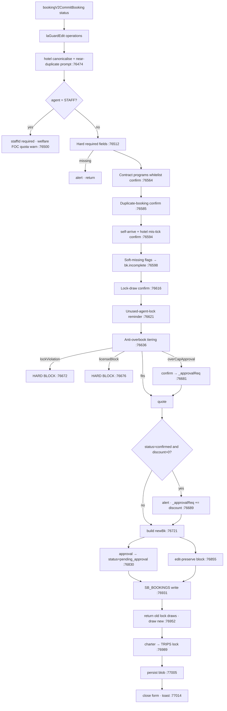
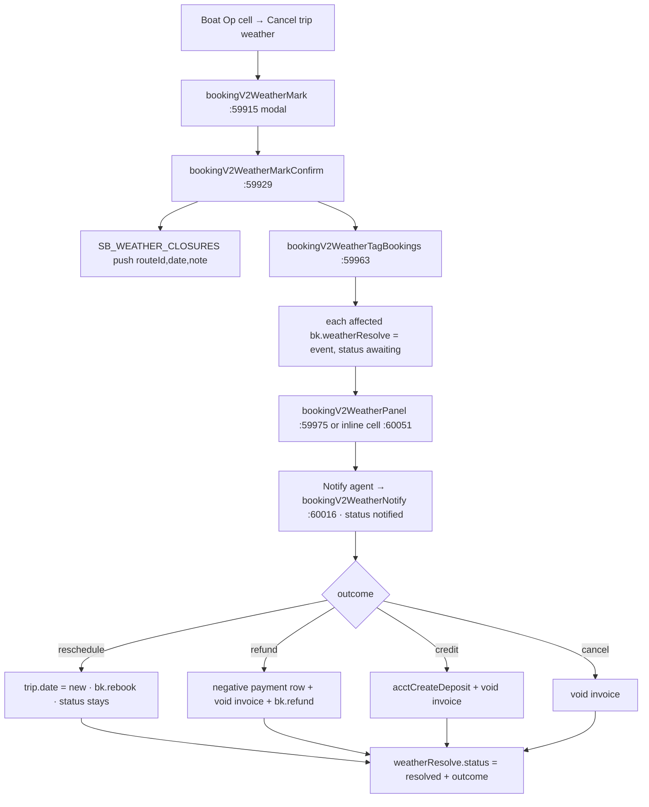

# 01 · Booking Lifecycle

> Scope: everything that creates, prices, guards, mutates and retires a booking record (`SB_BOOKINGS`) in Booking v2 — form, tabs, approvals, seat locks, cancel/reschedule/partial/weather flows. Code: `allotment_v2.html` unless noted. Line numbers are as of commit **`094dde1`** and drift; grep the symbol name instead.

---

## 1. What this does & who uses it

Booking v2 is the sales/ops hub of the app. One booking = one customer group, sold by one agent (or a B2C channel), travelling on **one or more trips** (`routeId` × `date`), each trip carrying its own pax mix and its own `seat`/`charter` mode.

Who touches it:

| Role | What they do here |
|---|---|
| Sales / reservation staff | New booking, edit, quote, FOC reason, discounts, voucher ref |
| Ops / dispatch | By-trip-date manifest, boat/van assign, re-confirm, pickup times |
| Manager | Approvals tab (`pending_approval`), FOC approve/reject |
| Accounting | Reads `priceBreakdown` / `total` / `feeItems`, raises invoices |

The single-file client keeps `SB_BOOKINGS` in RAM (`allotment_v2.html:41531`), loaded from the state blob at boot (`:41533`). The durable store is Postgres. Two schemas coexist: `schemaVer === 2` (native, `trips[]`) and legacy v1 (`programId` + `travelDate` + `pax{adult,child,infant}`). **v1 is read-only** — `bookingV2EditBooking` refuses it (`:77822`).

> `docs/BOOKING.md` is the original Phase-1 spec (dated 2026-05-29) and is now **substantially stale** (it still says the New Booking wizard and Detail view are "pending", and its line numbers are ~35k off). `docs/booking.model.ts` is current and matches the runtime shape. Trust `booking.model.ts` + this doc.

---

## 2. Entry points

| Thing | Where |
|---|---|
| View id | `#view-booking` (CSS block starts `allotment_v2.html:2322`) |
| Sidebar | `Operations → Booking` — `<div class="nav-item" data-view="booking">` at `:4205` |
| Nav dispatch | `renderBooking()` `:68586` → delegates straight to `bookingV2RenderList()` (`:70744`, an alias for `bookingV2Render`). The v1 form code below it only runs if `bookingV2RenderList` is missing. |
| Top render fn | `bookingV2Render()` `:69225` — writes into `#bkv2-host` |
| Client state | `const _bkV2 = {...}` `:68862` |
| Tab switcher | `bookingV2SwitchTab(t)` `:73397` → `_bkV2.tab`; body router `bookingV2RenderTabBody()` `:70813` |
| Topbar / tab strip | `bookingV2RenderTopbar()` `:70746`, meta line `bookingV2TopbarMeta()` `:70781` |

`bookingV2Render` is a 3-way switch (`:69230`–`:69239`):

1. `_bkV2.detailId && !_bkV2.newBooking` → `bookingV2RenderBookingDetail()` `:78043`
2. `_bkV2.newBooking` → `bookingV2RenderNewBooking()` `:69258` (same form for create **and** edit)
3. otherwise → topbar + `bookingV2RenderTabBody()` + lock modal + lock overlays

Everything is wrapped in try/catch; a render throw paints an inline error card with a "Reset to Calendar view" button (`:69251`).

**Tabs** (`_bkV2.tab`, rendered by `bookingV2RenderTabBody` `:70813`):

| tab | Label | Renderer |
|---|---|---|
| `cal` | Calendar (sub-view `_bkV2.view` = `cal`\|`mx`) | `bookingV2RenderCalendar()` `:71029` / `bookingV2RenderMatrix()` `:71499` |
| `bytrip` | "By trip · date" (the ops manifest) | `bookingV2RenderTab2()` `:71907` |
| `all` | All bookings (linear table) | `bookingV2RenderTab3()` `:73315` |
| `locks` | Seat Locks | `bookingV2RenderLocks()` `:42218` |
| `approvals` | "รออนุมัติ" (badge = count of `pending_approval`) | `bookingV2RenderApprovals()` `:70829` |
| `cancel` | Cancellations report | `bookingV2RenderCancelReport()` `:70957` |

Note the tab strip (`:70754`–`:70759`) has **six** tabs; `_bkV2` still documents only three in its comment and `BOOKING.md` documents three. Follow the code.

Sticky-header offsets `--t2-vangroup-top` / `--t2-head-top` are computed in the `requestAnimationFrame` at `:69241` — never hardcode them.

---

## 3. Workflows

### 3.1 Create a booking

**Trigger** `+ New booking` button in the topbar (`:70776`) or the `C` shortcut.

**Steps**

1. `bookingV2NewBooking()` `:73427` — `laGuardEdit('operations')` permission gate, then builds `_bkV2.newBooking` (the draft) with `code: bookingV2GenerateBookingCode()`, `bookingDate` = today, `priceMode:'rate'`, one empty trip from `bookingV2NewTrip()` `:73469`.
2. `bookingV2RenderNewBooking()` `:69258` paints the single-page form. Sections: pickup `:69522`, trips `:69717`, add-ons `:70044`, review `:70247`, passengers `:70450`, dietary/luggage `:70512`, cash-on-tour `:70554`, quote `:70598`, payment `:70649`, FOC `:70680`, attachments `:75128`.
3. Field edits go through small setters that mutate the draft and re-render: `bookingV2SetBookingField` `:76270`, `bookingV2SetTripField` `:73951`, `bookingV2BumpPax` `:74657`, `bookingV2ToggleAddOn` `:74890`, `bookingV2SetPickupArea` `:74925`, `bookingV2AddAdjustment` `:77282`. Text inputs listed in `_BKV2_NO_RENDER_KEYS` skip the re-render so focus survives (`:76295`).
   - Picking an agent auto-fills `rateTypeRef` from `agent.rateTypeId` and applies house-account rules (WALKIN keeps manual pricing; STAFF forces `welfare`→rate / `inspection`→manual ฿0) — `:76274`–`:76288`.
   - Changing `trip.date`/`trip.routeId` is blocked/warned against a **closed program day** via `getDayStatus` (`:73956`–`:73980`).
   - Changing `trip.zone` propagates to `d.pickupZoneFilter`, clears a mismatched pickup area, and for `NoTransfer` auto-picks the pier area matching `route.pier` (`:73988`–`:74006`).
4. Passenger name rows are kept in sync by `bookingV2SyncPassengers()` `:73767` — list is sized to the **largest single trip**, not the sum of trips; lead is passenger #1 and occupies a real seat of its own type (`leadType`), `d.leadFoc` lets the lead take a FOC seat.
5. Pricing recomputes on every render: `bookingV2CalcQuote()` `:77221` → per-trip `bookingV2TripSubtotal()` `:77122` (+ `bookingV2GetRTForTrip` `:77112` promo overlay) and `bookingV2AddOnInfo()` `:77189`.
6. Save: `bookingV2SaveDraft()` `:76298` → `bookingV2CommitBooking('quote')`, or `bookingV2SubmitBooking()` `:76316` → `bookingV2CommitBooking(hasFoc ? 'pending_foc' : 'confirmed')`. Button state from `bookingV2RenderSubmitButton()` `:70719` (disabled while any trip has no rate — `bookingV2NoRateTrips()` `:70707`).
7. `bookingV2CommitBooking(status)` `:76469` runs the whole guard gauntlet (below), builds a **fresh** `newBk`, `SB_BOOKINGS.unshift(newBk)`, draws seat locks, wires charter → `TRIPS`, persists, then lands on `bytrip` at the earliest trip date (`:77023`–`:77028`).

**Guard order inside `bookingV2CommitBooking`** (each `return`s out on failure):



Hard-required fields (`:76516`–`:76559`): agent/B2C channel, ≥1 trip with route+date, pax ≥ 1, lead pax name, Rate Type (unless `priceMode==='manual'`), lead nationality (auto-guessed via `bookingV2GuessNationality` `:73698` first), nationality for every **named** passenger, guide language, hotel when a pickup area is set (except `NoTransfer`), **a pickup point when `status !== 'quote'`** (§pickup guard 2026-07-11), and the route must be running that day (`bookingV2IsRouteOpenOn` `:68978`). B2C bookings (`bookingV2IsB2CBk` `:77777`, id starts `b2c_`) are exempted from guide-language and route-closed hard blocks; those become soft `incomplete` flags instead.

**Anti-overbook tiering** (`:76636`–`:76697`) — the single most important guard:

| Outcome | Condition | Result |
|---|---|---|
| `lockViolation` | `need > seatsAvailable` but `need <= seatsAvailable + lockedSeats` | **Hard block**, no override (`:76672`) |
| `licenseBlock` | `need > licenseAvailable` (over registered seats) | **Hard block** (`:76676`) |
| `overCapApproval` | over company `cap` but within license | `confirm()` → `status = 'pending_approval'` with `bk.approval` (`:76830`) |
| discount > 0 on a `confirmed` save | any | forced to `pending_approval`, reason `discount` (`:76689`) |

When editing, only a genuine **increase** is guarded: `oldNeed` is the same trip's previous general-seat need, and the block fires only if `need > al.seatsAvailable && need > oldNeed` (`:76656`). `getAllotment` is called with `excludeBkId = _bkV2.editingId` so a booking never blocks itself.

**Data written** — `SB_BOOKINGS[]` gains a full `BookingV2` (`:76721`–`:76825`):
`id` (= `d.code`), `schemaVer:2`, `createdAt/createdBy`, `voucherRef`, `agentId`, `rateTypeRef`, `leadPax/leadNationality/leadType/leadFoc/leadPhone/leadEmail`, `attachments[]`, `docCheck`, `pickupAreaId/pickupSelf/pickupArea/pickupZone`, `hotelName/roomNumber`, `dropoffSame/dropoffAreaId/dropoffArea/dropoffHotelName`, `altPickups[]`, `guides{}`, `notes`, `passengers[]` (unnamed rows dropped), `specialMeals{}`, `largeLuggage`, `cashOnTour`, `trips[]`, `addOns[]`, `adjustments[]`, `focApproval`, `paymentSnapshot{}`, `priceBreakdown{}`, `status`, `total`, `soldBy`, `priceMode/manualTotal`, `purpose` (`sale`/`staff_welfare`/`staff_inspection`), `staffId/staffPurpose`, `note`. Then `incomplete` (`:76827`), `approval` (`:76832`), `bookedAt`/`bookingDate`/`marketSnapshot` (`:76843`–`:76845`), `confirmedBy`/`confirmedAt` (`:76847`), `history[]` (`bookingV2AddHistory` `:59946`), and `ops.vanSplits` via `bookingV2SyncAltPickupSplits` `:46258`.

Each `trips[]` entry (`:76756`–`:76785`): `routeId, date, zone, pax{}, pickupTime, bookingMode, charterBoatId, charterPriceMode, charterPriceManual, charterPriceNote, charterDisplacementAck, ovn, ovnReturnDate, ovnCharge, ovnLeg, ovnOf, seatSource{locked,general}, lockDrawSel{}, ops (carried over), lockDraws[] (filled after save), subtotal`.

**Failure modes**
- Any hard-block `alert()` leaves `_bkV2.newBooking` intact — the user is still in the form.
- `_bkV2._b2cClosedWarn` is deliberately **not** cleared before the confirm prompts (§eat, `:76603`) — clearing early made a re-attempt save silently.
- The commit writes the blob directly with `JSON.parse/stringify` of `LS_KEY` (`:77005`) rather than `laBlob()/laBlobSave()`; it's a read-modify-write so sibling keys survive, but it bypasses the `_laBlob` cache. (inferred: harmless because the shim re-reads, but worth knowing when debugging stale-blob issues.)

---

### 3.2 Edit an existing booking

**Trigger** `Edit` button on the detail page (`:78092`).

**Steps**

1. `bookingV2EditBooking(bookingId)` `:77819` — refuses `schemaVer !== 2`; `confirm()`s if status is cancelled/completed/rejected; checks the **advisory edit lock** `bookingV2EditLockActive(bk)` `:77768` (5-min TTL, `BK_EDITLOCK_TTL` `:77765`) and warns if someone else holds it.
2. Deep-clones the booking into `_bkV2.newBooking`, deletes `editLock`, re-hydrates arrays the relational backend drops when empty (`addOns, passengers, adjustments, feeItems, altPickups` → `[]`, `:77833`) — without this the form crashes with "reading 'forEach'".
3. B2C bookings get `priceMode='manual'`, `manualTotal = existing total`, and a `_b2cSnap` of the B2C-owned fields (`:77837`).
4. Sets `_bkV2.editingId`, clears `detailId`, stamps the edit lock (`bookingV2SetEditLock` `:77774`), renders.
5. Save runs the same `bookingV2CommitBooking`. `editing` is looked up at `:76702`; `id` and `createdAt` are preserved, `updatedAt/updatedBy` added.

**The edit-preserve block** (`:76855`–`:76919`) — `newBk` is built from scratch, so anything not explicitly carried over is destroyed:

`history`, `weatherResolve`, `rebook`, `invoiceId`, `paymentStatus`, **`ops`** (boat/van assignment), `b2cOverride`, `upgrades`, `feeItems`, `reschedule`, `partialCancels`, `cancellation`, `cancelCategory`, plus a resolved `approval` record (`:76839`) and a decided `focApproval` (`:76936`).

Two deliberate *un*-preserves inside that block:
- **Travel date changed** → boat + van + van group + `pickupTimeFinal` + per-trip `ops` are wiped (charter keeps its boat) with a history line "วันเดินทางเปลี่ยน … ล้างการจัดเรือ/รถของวันเดิม" (`:76883`–`:76896`).
- **Pickup became self-arrive / NoTransfer** and no alt-pickup still needs a van → clears the **outbound** van only (`vanId`, `vanGroup`, `vanSeq`, splits); `vanReturnId` is kept (`:76900`–`:76911`).

Also: FOC already approved → re-submitting does **not** downgrade to `pending_foc`; it snaps back to `confirmed` (`:76939`).

**Seat-lock accounting on edit** (`:76952`–`:76981`): `bookingV2ReturnBookingDraws(editing,'edit')` returns everything the old version held, then the new draws are taken. Before this existed, editing a booking ten times counted the lock as used ten times (§lkReturn).

**Failure modes** — the edit lock is advisory only (last write wins). `_bkV2DoCloseNewBooking` `:75078` clears the lock on discard; a crashed tab leaves a stale lock that expires after 5 minutes.

---

### 3.3 Cancel a booking (full)

**Trigger** `Cancel` on the detail page (`:78095`) → `bookingV2DetailCancel` `:77404` → `bookingV2CancelModal` `:77434`.

**Steps**

1. Modal asks for a **reason category** (`BKV2_CANCEL_REASONS` `:77414`, 8 codes with `group` = `customer`/`operator`/`other` and a `def` suggested charge), a charge mode (`none`/`full`/`partial`), and a free-text note. Picking a reason auto-selects its suggested charge (`bookingV2CancelPickReason` `:77428`). The agent's contract cancel policy is shown if present.
2. `bookingV2CancelConfirm` `:77465` validates (category required; note required for `other`; partial amount > 0) then calls `bookingV2CancelBooking`.
3. `bookingV2CancelBooking(bookingId, opts)` `:76325`:
   - `bk.status = 'cancelled'`, `bk.cancelledAt`
   - `bk.cancellation = {category, categoryLabel, group, note, reason, chargeType, chargeAmount, at, by}`, plus flat `bk.cancelCategory` / `bk.cancelReason`
   - Accounting: voids the prior invoice (`acctVoidInvoice`) and, if a charge > 0, raises a **fee invoice** via `acctCreateFeeInvoice` (`:76346`)
   - `bookingV2ReturnBookingDraws(bk,'cancel')` returns drawn lock seats (§lkReturn `:76353`)
   - Releases charter holds in `TRIPS[date][boatId]` — deletes `charterBookingId`, sets `type='normal'` (`:76361`)
   - History entry; persists `sb_bookings` (+ `trips` if a charter was released)

**Validation/guards** — `bookingV2DetailCancel` refuses if already `cancelled`/`completed`/`rejected`. Cancelled statuses `['cancelled','cancelled_weather','rejected']` are excluded from every aggregate afterwards.

**Failure modes** — accounting is wrapped in try/catch and only `console.warn`s (`:76350`); a failed invoice void does **not** roll the cancellation back.

---

### 3.4 Restore (un-cancel)

**Trigger** `↩ กู้คืน (Restore)` on the detail page (`:78096`) or in the Tab-2 ghost row (`:72807`).

`bookingV2RestoreBooking(bookingId)` `:76386`:
1. Refuses unless status ∈ `cancelled|cancelled_weather|rejected`; `confirm()`s.
2. Voids any `feeType==='cancellation'` invoice.
3. `status='confirmed'`; deletes `cancellation`, `cancelCategory`, `cancelReason`, `cancelledAt`, `weatherResolve`.
4. **Re-draws** the original lock seats from `trip.lockDraws` — may get back fewer than it wants if someone else used them meanwhile; the shortfall is logged to history, not hidden (`:76401`).
5. Re-applies charter holds in `TRIPS` only where the boat/day is still free; taken slots increment `blocked` and are surfaced in the toast (`:76411`, `:76426`).

---

### 3.5 Partial cancel ("Reduce pax")

**Trigger** `− Reduce pax` on the detail page (`:78094`) → `bookingV2DetailPartial` `:77638` → `bookingV2PartialModal` `:77658`.

**Steps**
1. Modal lists every pax key in `BKV2_PAX_KEYS` `:77632` (12 keys: `ad/ad_fr/ad_th`, `chd*`, `inf*`, `foc*`) with a "remove N" input, plus a **charged vs waived** split (`bookingV2PartialRecalc` `:77646` suggests ฿ amounts from a per-pax figure).
2. `bookingV2PartialConfirm(bookingId, tripIdx)` `:77702` — category required, note required for `other`, at least 1 pax removed; clamps each removal to the current `t.pax[k]`.
3. `bookingV2PartialCancel(bookingId, tripIdx, opts)` `:77728`:
   - decrements `bk.trips[tripIdx].pax[k]` → seats free automatically because `getSeatsConsumed` reads the live pax
   - reduces `bk.priceBreakdown.total` and `bk.total` by the refund amount
   - appends to `bk.partialCancels[]`: `{date, tripIdx, paxRemoved, count, category, categoryLabel, group, note, refundMode, refund, charged{count,amount}, waived{count,amount}, at, by}`
   - history entry, then persists `sb_bookings`

**Guards** — refuses on `cancelled|completed|rejected|cancelled_weather` (`:77640`).
**Failure modes** — it does **not** return seat-lock draws for the removed pax, and it does **not** touch invoices; the refund is a plain reduction of the stored total. (inferred from the code: no `bookingV2ReturnLock` / `acct*` calls in `bookingV2PartialCancel`.)

---

### 3.6 Reschedule (move a trip date)

**Trigger** `Reschedule` on the detail page (`:78093`) → `bookingV2DetailReschedule` `:77624` → `bookingV2RescheduleModal` `:77486`.

**Steps**
1. Modal: `Move from` (a `<select>` when the booking has >1 distinct date), `New date`, fee mode (`none`/`full`/`partial`), fee collection (`invoice` = extra line on this booking's own invoice, or `separate` = record only), a **required** reason, and an optional "open the edit form afterwards to fix pickup".
2. `bookingV2RescheduleConfirm` `:77526` validates (new date required, must differ, reason required, partial amount > 0).
3. `bookingV2RescheduleBooking(bookingId, opts)` `:77545`:
   - moves every `trip.date === from` to `to`; carries the charter `TRIPS` hold with it (`:77561`)
   - **clears the day's assignment** — `ops.boatId` (unless the booking is charter), `vanId`, `vanReturnId`, `vanGroup`, `vanSeq`, `vanSplits`, `pickupTimeFinal`, and deletes `ops.vanCheckin` / `ops.pierCheckin`; repeats the same for every per-trip `t.ops` (`:77572`–`:77589`)
   - writes `bk.reschedule = {fromDate,toDate,reason,chargeType,chargeAmount,collect,at,by}` and `bk.rebook = {from,to,reason:'manual',at}`
   - fee on invoice → pushes to `bk.feeItems[]` **and** tops up the existing invoice's `subtotal/netAmount/total/lineItems` (`:77596`)
   - history + persist

**Guards** — refuses on `cancelled|completed|rejected|cancelled_weather`, and when no trip has a date (`:77626`).
**Failure modes** — the new date is **not** validated against route seasons or allotment. A reschedule can therefore land on a closed day or an over-full trip; only a subsequent edit-and-save would catch it.

---

### 3.7 Weather cancellation and per-booking resolve

The *decision* is made in Boat Operation (`bookingV2WeatherMark` is called from a cell popover, `:10219`); Booking owns the resolution.



Key facts:
- `bookingV2WeatherTagBookings(routeId,date)` `:59963` tags every non-cancelled booking with a matching **seat-mode** trip. Charter trips are excluded (`t.bookingMode!=='charter'`, `:59968`).
- Event key = `routeId + '|' + date` (`bookingV2WeatherKey` `:59962`); `weatherResolve = {event, status:'awaiting'|'notified'|'resolved', notifiedAt, outcome, newDate, resolvedAt}`.
- Non-reschedule outcomes set `bk.status = 'cancelled_weather'` and `bk.cancelReason='weather'` (`:60039`).
- Refund pushes a negative `SB_PAYMENTS` row with `type:'refund'` and sets `bk.refund={amount,status:'due'}` (`:60040`).
- Reschedule **only moves the trip date** — unlike `bookingV2RescheduleBooking` it does **not** clear `ops` boat/van. (Confirmed at `:60032`–`:60037`; a weather-rescheduled booking keeps the old day's boat and van.) This looks like a real inconsistency worth flagging.

---

### 3.8 FOC approval

**Trigger** any trip with `pax.foc > 0`. `bookingV2SubmitBooking` `:76316` requires a `focReason` and commits with `status='pending_foc'`.

- `focApproval = {count, reason, status, requestedAt, requestedBy}` (`:76795`). Status is `'approved'` immediately when the save status is `confirmed`, else `'pending'`.
- Approve: `bookingV2FocApprove(id)` `:77360` — reason is *mandatory* to approve (prompts if missing), sets `status='approved'`, `bk.status='confirmed'`, history, `bookingV2PersistBookings()`.
- Reject: `bookingV2FocReject(id)` `:77387` — `bk.status='rejected'`.
- Boot-time reconcile at `:41622` fixes bookings whose FOC was approved but whose status got stuck in `pending_foc`/`pending`/`quote`.

FOC pricing: `focDiscount` is the *forgone* revenue — `adult-fr rate × foc_fr + adult-thai rate × foc_th` (`:77246`) — stored as a negative number in `priceBreakdown.focDiscount`. FOC pax still occupy real seats in every allotment calc.

---

### 3.9 Approval queue (over-capacity / discount / B2C hold)

**Trigger** tab `รออนุมัติ` (`:70758`) → `bookingV2RenderApprovals()` `:70829`. The list filters purely on `status === 'pending_approval'`.

- `bk.approval = {status, reason, targetStatus, over[], totOver, discount, saleName, requestedBy, requestedAt, approvedBy, approvedAt, note}` (`:76832`).
- Reasons: `over_capacity`, `discount`, `over_capacity+discount`, and (server-side B2C holds) none at all — `bookingV2PendReason(b)` `:70874` infers `closed_day` / `b2c_hold` / `over_cap` and `bookingV2EnsureApproval(b)` `:70886` **creates** the missing `approval` object on button click. Before this fix (§pendNoApproval 2026-07-31) the buttons silently did nothing for B2C-held rows.
- `bookingV2ApprovalImpact(b)` `:70897` recomputes what the seats look like *after* approval (calls `getAllotment(..., b.id)` to exclude the booking's own seats) and `bookingV2ApprovalImpactText` `:70914` renders it into the prompt. Over-license rows trigger a second `confirm()` (`:70930`).
- Approve `bookingV2ApproveBooking(id)` `:70922` — prompts for the approver's name (required), sets `approval.status='approved'`, `bk.status = approval.targetStatus || 'confirmed'`, stamps `confirmedBy/confirmedAt`, `acctPersistBookings()`.
- Reject `bookingV2RejectBooking(id)` `:70942` — `bk.status='rejected'`.

**Seat-holding rule** — `bkPendHoldsSeat(bk)` `:12040`: a `pending_approval` booking holds seats **unless** it was held for over-capacity (`approval.over.length > 0 || approval.totOver > 0`). Rationale in-code: seats that don't physically exist must not make `seatsAvailable` go negative. Discount / B2C / closed-day holds *do* reserve their seats.

---

### 3.10 Seat locks

Store: `SB_SEAT_LOCKS` `:41646`, persisted by `sbSeatLocksPersist()` `:41651` (key `sb_seat_locks`).

**Lock shape** (`bookingV2CreateLock` `:41818`): `{id, scope:'day'|'bulk'|'month', routeId, date, dateFrom, dateTo, dow[], monthFrom, monthTo, month, boatId, holderType:'agent'|'office'|'global', holderId, parentId?, subName?, qty, used, usedBy{date:n}, reason, expiry, releaseDaysBefore, releaseTime, status:'active'|'depleted'|'expired', createdAt, createdBy, log[]}`.

**Multi-day quota** — `bookingV2LockSpansDays(l)` `:41656` is true for `bulk` and `month`. Those get a **per-round** counter `usedBy[date]`; `used` stays as a lifetime total for reporting only (`:41678`, `:41839`).

**Rolling release** — `bookingV2LockReleaseCutoff(l, tripDate)` `:41696` = `tripDate − releaseDaysBefore` at `releaseTime`. `bookingV2LockReleasedForDate` `:41708` makes the lock invisible to `bookingV2LocksFor` for **that trip date only** while remaining active for later dates. `bookingV2LockExpireSweep()` `:41720` expires day locks past `expiry` and range locks only when the whole range has passed — and **reactivates** a range lock wrongly expired by the old expiry-based sweep.

**Pool math**

```
bookingV2LocksFor(routeId,date)      :41738  active locks touching this trip (range + dow + release cutoff)
bookingV2LockPoolHold(l,date)        :41783  parent/standalone → held remaining; child → 0
bookingV2LockedTotal(routeId,date)   :41784  Σ pool hold  → getAllotment().lockedSeats
getAllotment()                  :12145  seatsAvailable = availableCapacity − seatsConsumed − lockedSeats
```

Children must return 0 or a parent's seats are counted twice.

**Drawing** — the form picks sources per-trip:
- `bookingV2DrawSources(routeId,date,agentId)` `:41756` expands each drawable parent into its sub-groups plus the parent's unallocated remainder. Eligible holders: the agent's own + `office` + `global` (`bookingV2LocksForAgent` `:41752`).
- UI: `bookingV2SetTripLockDraw(idx, lockId, qty)` `:74700` writes `trip.lockDrawSel = {lockId:qty}` (total clamped to trip pax) and mirrors the sum into `trip.lockUse`. `bookingV2AutoDrawLocks(idx)` `:74715` fills greedily.
- At commit (`:76952`): old draws returned first, then explicit picks are drawn per source via `bookingV2DrawLock(lockId, qty, bookingId, tripDate)` `:41835`; with no explicit picks it falls back to `seatSource.locked` drawn by holder priority `agent → office → global` (`:76959`, `:76972`). Result stored as `trip.lockDraws = [{lockId, qty}]` and `trip.seatSource = {locked: drawn, general: pax - drawn}`.
- `bookingV2ReturnLock` `:41853` / `bookingV2ReturnBookingDraws` `:41868` are the inverse; `depleted` flips back to `active` when room reappears.

**Audit** — `bookingV2LockClaims(lockId)` `:41877` treats `trips[].lockDraws` on live bookings as the source of truth (not the `used` counter); `bookingV2LockAudit` `:41890` reports `used − live` drift; `bookingV2LockCoverage` `:41902` asks the reverse question (bookings that *should* have drawn but didn't). `bookingV2LockFixUsed` `:41935` / `bookingV2LockFixTree` `:41951` repair the counters.

**UI** — `bookingV2RenderLocks()` `:42218`, create modal `bookingV2LockAddModal` `:42570` / `bookingV2LockCreateSubmit` `:42132`, sub-group create `bookingV2CreateSubLock` `:42173`, release `bookingV2ReleaseLock` `:41981`, add seats `bookingV2LockAddSeats` `:41967`, per-agent KPI `bookingV2LockKpiByAgent` `:41997`.

---

### 3.11 Charter bookings

- `trip.bookingMode = 'charter'` (`bookingV2SetTripBookingMode` `:74725`). Charter trips consume a **whole boat**, never seats: `getSeatsConsumed` skips them (`:12058`), and `baDayBoats` / `baCharterBoatIds` remove chartered boats from the seat pool (`:45336`, `:45445`).
- Picking a boat that already has seat bookings opens a displacement confirmation: `bookingV2SetTripCharterBoat` `:74733` builds `_bkV2CharterConfirm` with the affected bookings (`getBookingsForRouteDate` `:12189`) and `bookingV2RenderCharterConfirmModal` `:70144` renders it; `bookingV2ConfirmCharter` `:74768` sets `charterDisplacementAck = true`.
- Pricing: `bookingV2TripSubtotal` charter branch `:77128` — `starterPrice + max(0, pax − starterIncludes) × extraPerPax + paid longtail bundle`, keyed by `rt.charterRates[routeId][boat.type.toLowerCase()]`. `charterPriceMode:'manual'` overrides and records `manualDelta`.
- At commit (`:76989`, only when `status !== 'quote'`) the boat is locked in Boat Operation: `TRIPS[date][boatId] = {route, type:'charter', charterBookingId: bk.id}`. Editing releases the old holds first (`:76708`).
- `bookingV2CharterBoatHeal(date)` `:45435` mirrors `trip.charterBoatId` → `ops.boatId` so the charter booking appears on its own boat in the manifest.

---

### 3.12 OVN (overnight) legs

- `trip.ovn` = `null` | `'return'` (we bring them back) | `'self'` (one-way). `bookingV2SetTripOvn` `:73919`.
- `bookingV2CreateOvnReturnLeg(idx)` `:73927` appends a second trip with the same route + pax, `date = ovnReturnDate`, `ovnLeg:true`, `ovnOf: idx`. It **reserves seats on the return day but prices at ฿0** — `bookingV2TripSubtotal` returns 0 immediately for `ovnLeg` (`:77125`); the money sits on the outbound `ovnCharge`, added to `totalExtra` in `bookingV2CalcQuote` (`:77271`).
- The return leg keeps a real `zone` (it needs a drop-off van) but must have **no pickup time**. `bookingV2HealOvnLegs()` `:45360`, run at the top of `bookingV2RenderTab2`, clears an inherited `pickupTime` and restores a zone that an older build wrongly set to `NoTransfer`.

---

### 3.13 Calendar / matrix / by-trip drill-down

- `bookingV2Aggregate()` `:69062` → `{byDate: {date: {total, ad, chd, inf, foc, pk, kl, nt, hasFocPending, routes{}, bookings[], revenue}}}`. Skips `['cancelled','cancelled_weather','rejected']` (`:69090`). Revenue uses `bk.total` for single-trip bookings (so adjustments count) and `trip.subtotal` for multi-trip (`:69102`).
- Zone in the aggregate comes from `bookingV2InferZone(bk)` `:69054`, which sniffs the **`bk.pickup` string** — a legacy field the v2 form no longer writes. In practice v2 bookings almost always bucket to `PK`. (Suspicious; the manifest instead uses `bookingV2EffZone(bk,t)` `:46355`.)
- Cell click → `bookingV2SelectDay` `:73405` / `bookingV2SelectCell` `:73406`; "open list" → `bookingV2OpenFiltered(routeId,date)` `:73408` sets `filterRoute`/`filterDate` and switches to `bytrip`.
- Tab 2 date resolution: `bookingV2Tab2ActiveDate()` `:71733` = explicit `filterDate`, else the nearest trip date ≥ today, else today. Extra filters live outside `_bkV2`: `_bkV2T2Cursor` `:71766`, `_bkV2T2Pier` `:71767`, `_bkV2T2Family` `:71770`, `_bkV2T2Sort` `:71772`.
- Tab 2 runs a batch of idempotent self-heals on render (`:71909`–`:71914`): `bookingV2HealOvnLegs`, `bookingV2CharterBoatHeal`, `bookingV2HealAltSplits`, `bookingV2HealSelfArrivePickup`, and (van mode only) `bookingV2VanGroupHeal`.
- Pending-approval rows are split into a separate `pendGroups` bucket before any pax/boat/van maths sees them (§pendSeat, `~:71995`).

---

## 4. Data model touched

`SB_BOOKINGS` element (v2). Full TS in `docs/booking.model.ts`.

| field | type | written by | read by | notes |
|---|---|---|---|---|
| `id` | string | `bookingV2GenerateBookingCode` `:75089` | everything | `BK-YYMMNNNN-XXXX`; random suffix is **required** for multi-user safety |
| `schemaVer` | `2` | commit `:76723` | every reader's branch | `!==2` ⇒ legacy read-only |
| `status` | enum | commit / cancel / approve / weather | all aggregates | `quote·pending_foc·pending_approval·confirmed·cancelled·cancelled_weather·rejected·completed` |
| `agentId` | string\|null | form `:76728` | pricing, credit, manifest | null ⇒ B2C |
| `rateTypeRef` | string | agent's `rateTypeId` `:76276` | `bookingV2GetRT` `:77091` | snapshot at booking time |
| `voucherRef` | string | form | dup check `bookingV2FindDuplicateBookings` `:76435`, manifest | live warn `bookingV2VoucherLiveCheck` `:76468` |
| `bookingDate` / `bookedAt` | date / ISO | `:76843` | demand analytics, lead time | `bookingDate` editable, `bookedAt` frozen |
| `marketSnapshot` | `{market,sub,agentId,at}` | `:76845` | Demand module | frozen at create, never re-derived on edit |
| `trips[]` | array | `:76756` | allotment, manifest, pricing | see below |
| `passengers[]` | array | `bookingV2SyncPassengers` `:73767` | manifest, insurance | unnamed rows dropped at save `:76752` |
| `priceBreakdown` | `{seat,addOn,focDiscount,discount,extra,total}` | `:76808` | Accounting | `focDiscount`/`discount` stored **negative** |
| `total` | number | `:76817` | `acctBookingBase` `:42882` | `acctBookingTotal` = total + Σ`feeItems` |
| `focApproval` | object\|null | `:76795`, `bookingV2FocApprove/Reject` | approvals, detail | |
| `approval` | object | `:76832`, `bookingV2EnsureApproval` `:70886` | approvals tab, `bkPendHoldsSeat` | `over[]` presence decides seat-holding |
| `paymentSnapshot` | `{method,netDays,source,contractVersion}` | `:76802` | Accounting terms | from `agent.payType`/`creditDays` |
| `ops` | object | boat/van modules; day-1 only | dispatch | see §6 |
| `history[]` | array | `bookingV2AddHistory` `:59946` | detail timeline | tags coloured by `bookingV2HistTagColor` `:59952` |
| `incomplete[]` | string[] | `:76827` | ⚠ flags in manifest | `'pickup'`, `'guide-lang'`, `'route-closed'` |
| `cancellation` / `cancelCategory` / `cancelReason` | object / string | `bookingV2CancelBooking` `:76342` | cancel report | |
| `partialCancels[]` | array | `bookingV2PartialCancel` `:77746` | cancel report | |
| `reschedule` / `rebook` | object | `bookingV2RescheduleBooking` `:77590` | detail, history fallback | `rebook` also set by weather reschedule |
| `weatherResolve` | `{event,status,outcome,newDate,…}` | `bookingV2WeatherTagBookings` `:59969` | weather panel, inline cell | |
| `feeItems[]` | array | reschedule `:77598` | `acctBookingTotal` | reschedule/other fees |
| `upgrades[]` / `SB_EXTRAS` | array / separate store | `bookingV2UpgradeSave` `:59871` / `bookingV2ExtraSave` `:59756` | day-of billing | `SB_EXTRAS` is **not** on the booking |
| `editLock` | `{uid,by,at}` | `bookingV2SetEditLock` `:77774` | `bookingV2EditLockActive` `:77768` | advisory, 5-min TTL |
| `b2cOverride[]` | string[] (DB column names) | `:76877` | server sync | fields ops touched that B2C must not overwrite |
| `purpose` / `staffId` / `staffPurpose` | string | `:76821` | Staff & Welfare | `sale`\|`staff_welfare`\|`staff_inspection` |

`trips[]` element:

| field | type | notes |
|---|---|---|
| `routeId`, `date` | string | the trip identity; `date` is local `YYYY-MM-DD` |
| `zone` | `PK`\|`KL`\|`NoTransfer` | pricing zone; drives `seatRates[route][zone]` |
| `pax` | `{ad_fr,ad_th,chd_fr,chd_th,inf_fr,inf_th,foc,…}` | legacy `ad`/`chd`/`inf`/`foc` still tolerated by `bookingV2PaxTot` `:73497` |
| `bookingMode` | `seat`\|`charter` | charter never consumes seats |
| `charterBoatId`, `charterPriceMode`, `charterPriceManual`, `charterPriceNote`, `charterDisplacementAck` | | manual price wins over the rate card |
| `seatSource` | `{locked, general}` | rewritten from actual draws at `:76979` |
| `lockDrawSel` | `{lockId: qty}` | staff picks in the form |
| `lockDraws` | `[{lockId, qty}]` | **authoritative** record of what was drawn |
| `ovn`, `ovnReturnDate`, `ovnCharge`, `ovnLeg`, `ovnOf` | | return leg prices ฿0 |
| `pickupTime`, `subtotal` | | `subtotal` = `bookingV2TripSubtotal(t).total` at save time |
| `ops` | object | per-day boat/van for day 2+ of a multi-day booking |

Related stores: `SB_SEAT_LOCKS` (`:41646`), `SB_WEATHER_CLOSURES` (`:59905`), `TRIPS` (charter holds), `SB_INVOICES`/`SB_PAYMENTS`/`SB_DEPOSITS` (accounting), `SB_EXTRAS` (day-of extras).

---

## 5. Persistence path

```
mutate SB_BOOKINGS (RAM array)
   │
   ├─ acctPersistBookings()  :42877   ← preferred; clears the charter memo (baChMemoClear) then laBlob().sb_bookings = SB_BOOKINGS; laBlobSave()
   ├─ bookingV2PersistBookings()  :77383   ← delegates to acctPersistBookings when present, else manual read-modify-write
   └─ inline JSON.parse(localStorage[LS_KEY]) … obj.sb_bookings = SB_BOOKINGS … setItem
                                        (used by bookingV2CommitBooking :77005, bookingV2CancelBooking :76373,
                                         bookingV2RescheduleBooking :77613, bookingV2PartialCancel :77757)
   │
   ▼
localStorage.setItem(LS_KEY, …)   ← SHIMMED at :80 (Storage.prototype.setItem)
   │  the blob never reaches disk; it lands in the in-RAM `_mem` variable
   ▼
debounce 1s → save(v)             ← only when `_syncReady` (real /api/load succeeded) AND laCanEdit()
   │
   ▼
computeDiff(BASE, cur) → laDiffToOps() :167 → POST /api/v1/_batch  (put / per-field patch / del)
   fallback: any key the REST index doesn't know → legacy whole-diff POST /api/save
```

Notes that matter for this domain:

- **All four write paths are read-modify-write** on the whole blob — none of them clobber sibling keys, but they each re-serialize the entire ~6 MB state. Prefer `acctPersistBookings()` in new code: it goes through the `laBlob()` cache (`:42860`) and invalidates the charter memo.
- `acctPersistBookings` and `sbSeatLocksPersist` are **permission-gated** by `laCanEditArea('operations')` — a view-only user's mutations stay in RAM and are never synced.
- Seat-lock writes go through `sbSeatLocksPersist()` `:41651` (blob key `sb_seat_locks`), independent of the booking write, so a commit that draws locks issues two blob writes; the 1 s debounce collapses them into one batch.
- Load side: boot reads `d.sb_bookings` with `Array.isArray` (`:41533`) and `window._laReloadData()` re-reads it on soft refresh (`:41538`). A key persisted but not listed there vanishes on refresh.
- `TRIPS` is only written to the blob when a charter hold changed (`tripsModified` at `:76990`, `lockMoved` at `:77618`).

---

## 6. Cross-module contracts

**Booking → Boat Operation**
- Charter: booking writes `TRIPS[date][boatId] = {route, type:'charter', charterBookingId}` at commit (`:76994`) and deletes it on cancel (`:76361`) / edit (`:76708`) / moves it on reschedule (`:77561`).
- Booking *reads* `TRIPS` for capacity through `getAssignedBoatsForRouteDate` `:12096` → `getAllotment` `:12145`.

**Booking → boat/van assignment (other agent's domain)**
- Booking owns the **`ops` container**, not the assignment UI. Access it only via `bkOpsRead(b,date)` `:45392` (read) / `bkOpsFor(b,date)` `:45399` (read-write) / `bkOpsClear(b,date,opts)` `:45407`. Day 1 lives on `bk.ops`; day 2+ lives on `trip.ops` (`bkIsFirstDay` `:45387`).
- The assignment functions live in the fleet/dispatch domain: `bookingV2AssignBoat` `:45500` (guard `cap + BA_CAP_TOL(2)` `:45499`), `bookingV2AssignVan` `:45689`, `bookingV2AssignVanReturn` `:45690`, `bookingV2SetReturnSameVan` `:45692`, `bookingV2VanGroupSetVan` `:45828`, `bookingV2VanSplit` `:45857`, `bookingV2BoatSplit` `:46076`.
- **What booking writes into `ops` itself:** only *clearing* — on a date change during edit (`:76886`), on self-arrive/NoTransfer (`:76900`), and on reschedule (`:77572`) — plus `bookingV2SyncAltPickupSplits(newBk)` `:46258`, which builds `ops.vanSplits[]` so each alt-pickup point can ride its own van.
- `bookingV2RetInfo(bk,date)` `:45695` is the contract for "is the return leg handled?" — `{sep, drop, retId, arranged, selfRet, sameVan, alert}`.

**Booking ← Rate Types**
- `bookingV2GetRT()` `:77091` (booking's base rate) and `bookingV2GetRTForTrip(t)` `:77112` (per-trip promo overlay via `bookingV2ResolveRateType` `:77099`, reading `SB_CONTRACTS` where `kind==='promo'`). A promo is adopted only if it actually prices that route.
- Reads `rt.seatRates[routeId][zone]['adult-fr'|'child-fr'|'adult-thai'|'child-thai']`, `rt.routeBundles[routeId].longtail` (gated by `_rtBundleAppliesTo`), `rt.charterRates[routeId][boatType]`, `rt.addOns.longtail` (normalised by `_rtNormalizeLongtail`) and `rt.addOns.privateTransfer[route][zone][vehicle]`.

**Booking ← Agent**
- `sbGetAgent(bk.agentId)` gives `payType` → `paymentSnapshot.method`, `creditDays` → `netDays`, `contractVersion`, `sales` (for discount approval routing `:76691`), `programPeriods`/`programs` (contract route whitelist `:76570`), `bookingChannel.cancelPolicy` (shown in the cancel modal `:77439`).

**Booking → Accounting**
- `acctBookingBase(bk)` `:42882` reads `bk.total || bk.priceBreakdown.total`; `acctBookingTotal` `:42883` adds `feeItems`.
- Booking calls `acctVoidInvoice`, `acctCreateFeeInvoice`, `acctCreateDeposit`, `acctBookingInvoice`, `acctInvoicePaid`, `sbInvoicesPersist`.
- Credit exposure is derived from confirmed, credit-mode, unpaid bookings (see `SYSTEM_MAP.md` §credit) — booking stores no ledger.

**Booking ← Pickup Setup** — `bookingV2GetArea(id)` `:40321` (name + zone) and `bookingV2GetPickupTime(routeId, areaId, date)` `:40338`.

**Booking ← Programs/Routes** — `bookingV2IsRouteOpenOn` `:68978`, `getDayStatus`, `bookingV2RouteFamily` `:68892` / `_BKV2_FAMILIES` `:68882`, `route.pier`.

**Booking ← B2C sync (server)** — bookings with `id` starting `b2c_` are owned by the B2C source. `BKV2_B2C_OWN` `:77781` maps app field → DB column; `bookingV2B2CSnap`/`bookingV2B2CDiff` (`:77785`, `:77788`) record which of those fields ops changed into `bk.b2cOverride[]` so the next sync skips them. Trips, pax, add-ons and money are **always** re-copied from editing on save (`:76867`) — never re-priced locally.

**Booking → Check-in / Travel Summary** — `getSeatsConsumed` subtracts `ckLostByType(bk, date).total` (no-show / on-site cancel) from the seats a trip consumes (`:12061`).

---

## 7. Invariants & gotchas

1. **The edit-preserve block is load-bearing.** `bookingV2CommitBooking` rebuilds `newBk` from the form; anything not copied in the `if(editing){…}` block at `:76855` is destroyed. Required carry-overs: `history`, `weatherResolve`, `rebook`, `invoiceId`, `paymentStatus`, `ops`, `b2cOverride`, `upgrades`, `feeItems`, `reschedule`, `partialCancels`, `cancellation`, `cancelCategory`, resolved `approval`, decided `focApproval`. Losing `ops` silently wiped every boat/van assignment (fixed 2026-06-14, comment at `:76861`).
2. **Cancelled statuses are excluded everywhere:** `['cancelled','cancelled_weather','rejected']` — `getSeatsConsumed` `:12052`, `bookingV2Aggregate` `:69090`, `flBoatBookingsFor` `:12079`, `baSeatBookingsForRoute` `:45452`, `bookingV2FindDuplicateBookings` `:76445`, `bookingV2LockClaims` `:41880`. Add a new aggregate ⇒ add the filter.
3. **A booking can never silently eat locked seats.** `lockViolation` at `:76672` is a hard block with no override; true physical oversell (over company cap, within license) is a soft `confirm()` that saves as `pending_approval`; over license is another hard block.
4. **Locks: children contribute 0 to the pool.** `bookingV2LockPoolHold` `:41783` returns 0 for `parentId` locks — otherwise a parent's seats are double-counted against `getAllotment`.
5. **Month/bulk locks use rolling per-trip release**, not one global expiry — `releaseDaysBefore` + `releaseTime` (`:41696`). Don't carry a stale `expiry` onto a range lock; `bookingV2LockExpireSweep` `:41728` will even reactivate one that was wrongly expired.
6. **`trips[].lockDraws` is the source of truth for lock usage**, not the `used` counter (`bookingV2LockClaims` `:41875` comment). Edit returns then re-draws (`:76956`); cancel returns; restore re-draws and reports shortfalls.
7. **`bkPendHoldsSeat`** `:12040` — over-capacity pendings do **not** hold seats (the seats don't exist); every other pending reason does. Changing this changes availability across the whole app.
8. **Timezone:** build dates with `bookingV2LocalYMD(dt)` `:71746`, never `toISOString().slice(0,10)`. Some commit-path code still uses `toISOString().slice(0,10)` for `createdAt`/`bookingDate` (`:76704`, `:76844`) — those are "today" stamps, and in +07:00 they can land on the previous day before 07:00 local. Worth fixing, not currently guarded.
9. **`esc` / `escapeHTML` is not global.** Every renderer declares its own (`:69260`, `:70830`, `:77436`, `:78045`). A new top-level render fn that forgets it throws silently on click.
10. **Scroll-jump:** replacing `#bkv2-host`'s `innerHTML` while focus is inside it scrolls to top. Text inputs are protected by `_BKV2_NO_RENDER_KEYS` (`:76295`) and by targeted DOM updates like `bookingV2VoucherLiveCheck` `:76468`. Follow that pattern for new inputs.
11. **Booking ids need the random suffix.** `bookingV2GenerateBookingCode` `:75089` uses `MAX` (not count) for the sequence and appends 4 random chars; without it two concurrent tabs generate the same id and the record-level diff merge silently overwrites one booking with the other.
12. **Charter never consumes seats, and availability only drops if the boat is reserved in Boat-Op `TRIPS`.** `getSeatsConsumed` `:12058`, `baDayBoats` `:45445`, `getAssignedBoatsForRouteDate` `:12106` (which also consults `baCharterBoatMapMemo` so a split-charter second boat isn't resold).
13. **`_bkV2` state comment is stale** (`:68863` says 3 tabs, there are 6) and so is `docs/BOOKING.md`. `docs/booking.model.ts` is accurate.
14. **`CHANGELOG.md` referenced by `CLAUDE.md` does not exist in this repo** (checked `find`), so the in-code `§tag` comments are the only surviving history: `§pendSeat` `:12037`, `§lkReturn` `:41849`, `§lkBulk` `:41655`, `§b2cSave` `:76521`, `§b2cEdit` `:76864`, `§eat` `:76603`, `§pickup guard` `:76546`, `§altPickups` `:76748`, `§OVN` `:76759`, `§pendNoApproval` `:70868`, `§bug1` `:76897`, `§apprCap` `:70896`, `§down` `:76302`, `§rate` `:70729`, `§hotelDedupe` `:76478`, `§syncGate` `:157`, `§emptyBlobGuard` `:75`.

**Things that look wrong (flagging, not fixing):**

- `bookingV2WeatherResolveOne` reschedule (`:60032`) moves `trip.date` **without** clearing `bk.ops` boat/van/check-in — unlike `bookingV2RescheduleBooking` `:77572` and the edit-path date-change wipe `:76886`. A weather-rescheduled booking keeps the old day's boat and van.
- `bookingV2PartialCancel` `:77728` reduces pax and money but never returns the corresponding seat-lock draws and never touches the invoice.
- `bookingV2InferZone` `:69054` (used by the calendar aggregate) reads `bk.pickup`, a v1 field the v2 form never writes, so calendar zone splits are effectively all `PK` for v2 bookings.
- `bookingV2StatusLabel` `:69213` has no entry for `pending_approval` or `cancelled_weather`; those render as the raw status string.

---

## 8. Function index

| function | line | purpose |
|---|---|---|
| `renderBooking` | 68586 | Sidebar nav entry; delegates to `bookingV2RenderList` |
| `bookingV2Render` | 69225 | Top render: detail / form / tabs; sets sticky-header CSS vars |
| `bookingV2RenderTopbar` | 70746 | Tab strip (6 tabs), month nav, meta, New-booking button |
| `bookingV2RenderTabBody` | 70813 | Routes `_bkV2.tab` to a tab renderer |
| `bookingV2SwitchTab` / `bookingV2SwitchView` | 73397 / 73398 | Tab + calendar sub-view switch |
| `bookingV2NewBooking` | 73427 | Create the `_bkV2.newBooking` draft |
| `bookingV2NewTrip` | 73469 | Blank trip (date = tomorrow, zone PK, seat mode) |
| `bookingV2RenderNewBooking` | 69258 | The single-page create/edit form |
| `bookingV2SetBookingField` | 76270 | Draft field setter; agent change → rate type + house-account rules |
| `bookingV2SetTripField` | 73951 | Trip field setter; closed-day guard + zone propagation |
| `bookingV2SyncPassengers` | 73767 | Size/typing of the passenger name rows (lead = #1) |
| `bookingV2ToggleLeadFoc` / `bookingV2TogglePassengerFoc` | 73822 / 73831 | Assign FOC seats to specific people |
| `bookingV2GenerateBookingCode` | 75089 | `BK-YYMMNNNN-XXXX`, collision-safe |
| `bookingV2SaveDraft` | 76298 | Save as `quote` (warns about downgrading a confirmed booking) |
| `bookingV2SubmitBooking` | 76316 | Save as `confirmed` / `pending_foc` |
| **`bookingV2CommitBooking`** | **76469** | **All guards + build `newBk` + lock draws + charter holds + persist** |
| `bookingV2CalcQuote` | 77221 | Whole-booking totals; manual/B2C short-circuit |
| `bookingV2TripSubtotal` | 77122 | Per-trip price: seat (fr/th) + bundle, or charter |
| `bookingV2AddOnInfo` | 77189 | Add-on label + amount (longtail join/charter, transfer) |
| `bookingV2GetRT` / `bookingV2GetRTForTrip` / `bookingV2ResolveRateType` | 77091 / 77112 / 77099 | Base rate, per-trip promo overlay |
| `bookingV2AddAdjustment` / `bookingV2SetAdjustment` / `bookingV2RemoveAdjustment` | 77282 / 77299 / 77294 | Discount + extra-charge rows |
| `bookingV2PaxTot` / `bookingV2PaxAllTot` | 73497 / 73502 | Pax sums tolerant of legacy + fr/th shapes |
| `getTripPaxTotal` | 11938 | Same idea, used outside the bookingV2 namespace |
| `getSeatsConsumed` | 12046 | Seats used on route+date (excludes charter, cancelled, no-shows) |
| `getAllotment` | 12145 | Capacity/consumed/locked/available/state for route+date |
| `getAssignedBoatsForRouteDate` | 12096 | Boats in `TRIPS` for route+date, with per-day cap override |
| `bkPendHoldsSeat` | 12040 | Does a `pending_approval` booking reserve seats? |
| `getBookingsForRouteDate` | 12189 | Seat-mode bookings on a trip (charter displacement modal) |
| `bookingV2FindDuplicateBookings` | 76435 | Voucher match, or lead name + shared date/route |
| `bookingV2VoucherDupHtml` / `bookingV2VoucherLiveCheck` | 76457 / 76468 | Live duplicate-voucher warning without re-render |
| `bookingV2EditBooking` | 77819 | Clone booking into the form; edit-lock check + array re-hydration |
| `bookingV2EditLockActive` / `SetEditLock` / `ClearEditLock` | 77768 / 77774 / 77775 | Advisory 5-min multi-user edit lock |
| `bookingV2CloseNewBooking` / `_bkV2DoCloseNewBooking` | 75062 / 75078 | Discard confirm + return to detail |
| `bookingV2OpenDetail` / `bookingV2CloseDetail` | 77310 / 77318 | Detail view toggle |
| `bookingV2RenderBookingDetail` | 78043 | Detail page (actions, FOC card, timeline, voucher) |
| `bookingV2VoucherTicket` | 77864 | Boarding-pass style voucher header |
| `bookingV2CancelBooking` | 76325 | Full cancel: status, `cancellation`, invoice, lock return, charter release |
| `bookingV2CancelModal` / `bookingV2CancelConfirm` | 77434 / 77465 | Reason + charge UI and validation |
| `BKV2_CANCEL_REASONS` / `bookingV2CancelLabel` | 77414 / 77425 | Reason catalogue and display label |
| `bookingV2RestoreBooking` | 76386 | Un-cancel: void fee, re-draw locks, re-lock charter |
| `bookingV2PartialCancel` | 77728 | Reduce pax on one trip + record the charge/waive split |
| `bookingV2PartialModal` / `PartialConfirm` / `PartialRecalc` | 77658 / 77702 / 77646 | Reduce-pax UI |
| `bookingV2RescheduleBooking` | 77545 | Move trips to a new date; clear ops; bill the fee |
| `bookingV2RescheduleModal` / `RescheduleConfirm` | 77486 / 77526 | Reschedule UI |
| `bookingV2FocApprove` / `bookingV2FocReject` | 77360 / 77387 | FOC decision → confirmed / rejected |
| `bookingV2RenderApprovals` | 70829 | Over-capacity / discount queue |
| `bookingV2ApproveBooking` / `bookingV2RejectBooking` | 70922 / 70942 | Manager decision (prompts for approver name) |
| `bookingV2EnsureApproval` / `bookingV2PendReason` / `bookingV2PendLabel` | 70886 / 70874 / 70881 | Synthesise a missing `approval` (B2C holds) |
| `bookingV2ApprovalImpact` / `…ImpactText` | 70897 / 70914 | Seats-after-approval preview |
| `bookingV2WeatherMark` / `…MarkConfirm` | 59915 / 59929 | Mark a route+date weather-closed |
| `bookingV2WeatherTagBookings` | 59963 | Tag affected bookings `weatherResolve.awaiting` |
| `bookingV2WeatherPanel` / `WeatherNotify` / `WeatherResolveOne` | 59975 / 60016 / 60024 | 2-phase per-booking weather resolution |
| `bookingV2AddHistory` / `bookingV2HistTagColor` | 59946 / 59952 | Audit timeline append + chip colour |
| `bookingV2LocksFor` / `bookingV2LocksForAgent` / `bookingV2DrawSources` | 41738 / 41752 / 41756 | Which locks apply, who may draw, expanded sources |
| `bookingV2LockedTotal` / `bookingV2LockPoolHold` / `bookingV2LockHeldRemaining` | 41784 / 41783 / 41775 | Pool reduction feeding `getAllotment.lockedSeats` |
| `bookingV2CreateLock` / `bookingV2DrawLock` / `bookingV2ReturnLock` | 41818 / 41835 / 41853 | Lock lifecycle primitives |
| `bookingV2ReturnBookingDraws` | 41868 | Return everything a booking drew (edit / cancel) |
| `bookingV2LockExpireSweep` / `LockReleaseCutoff` / `LockReleasedForDate` | 41720 / 41696 / 41708 | Expiry + rolling per-trip release |
| `bookingV2LockClaims` / `bookingV2LockAudit` / `bookingV2LockCoverage` | 41877 / 41890 / 41902 | Counter-vs-reality audits |
| `bookingV2SetTripLockUse` / `SetTripLockDraw` / `AutoDrawLocks` | 74690 / 74700 / 74715 | Lock-draw pickers in the form |
| `bookingV2RenderLocks` | 42218 | Seat Locks tab |
| `bookingV2SetTripBookingMode` / `SetTripCharterBoat` / `ConfirmCharter` | 74725 / 74733 / 74768 | Charter mode + displacement confirmation |
| `bookingV2CreateOvnReturnLeg` / `bookingV2HealOvnLegs` | 73927 / 45360 | Overnight return leg create + self-heal |
| `bookingV2Aggregate` | 69062 | Per-day / per-route pax + revenue rollup for the calendar |
| `bookingV2Norm` | 69140 | v1/v2 → common row shape for lists |
| `bookingV2RenderCalendar` / `bookingV2RenderMatrix` | 71029 / 71499 | Month grid / routes × days heatmap |
| `bookingV2RenderTab2` | 71907 | By-trip-date manifest (+ boat/van/reconfirm modes) |
| `bookingV2RenderTab3` | 73315 | All-bookings table |
| `bookingV2RenderCancelReport` | 70957 | Cancellations statistics tab |
| `bookingV2Tab2ActiveDate` / `bookingV2LocalYMD` | 71733 / 71746 | Active manifest date; local-safe `YYYY-MM-DD` |
| `bkOpsRead` / `bkOpsFor` / `bkOpsClear` | 45392 / 45399 / 45407 | Per-day `ops` accessors (day 1 = `bk.ops`, day 2+ = `trip.ops`) |
| `bookingV2SyncAltPickupSplits` | 46258 | Build `ops.vanSplits[]` from `altPickups[]` |
| `bookingV2CharterBoatHeal` | 45435 | Mirror `trip.charterBoatId` → `ops.boatId` |
| `bookingV2RetInfo` | 45695 | Return-leg state (separate drop-off, van arranged, self-return) |
| `acctPersistBookings` / `bookingV2PersistBookings` | 42877 / 77383 | Persist `sb_bookings` into the blob |
| `laSaveToast` | 77044 | Card-style save/cancel/approve toast |
| `bookingV2IsB2CBk` / `bookingV2B2CSnap` / `bookingV2B2CDiff` | 77777 / 77785 / 77788 | B2C ownership + `b2cOverride` diffing |
