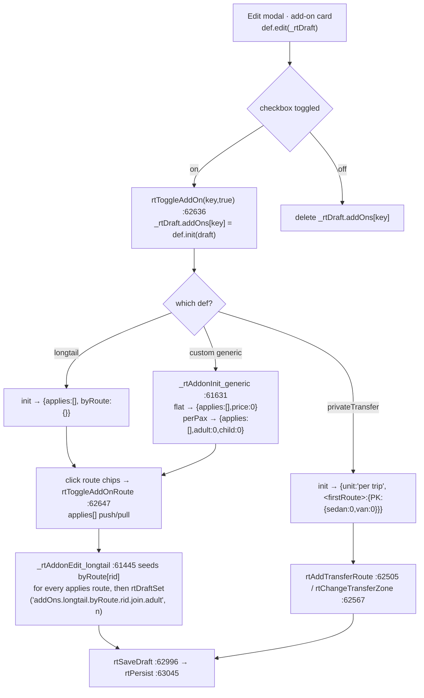

# 02 · Sales, Agents & Pricing

> Scope: the B2B commercial side — agent master data, rate types (price packages), the data-driven add-on system, contracts/renewal, and the pricing engine that turns *(agent, route, date, pax, zone)* into money. Code: `allotment_v2.html` unless noted. Line numbers are as of **094dde1** and drift; grep the symbol name instead.

---

## 1. What this does & who uses it

Sales staff own an **agent** (a B2B buyer: DMC, OTA, hotel counter, street counter). Each agent is bound to exactly one **rate type** (`agent.rateTypeId`) — a reusable price package covering seat rates per route × zone × pax-type, charter rates, forced bundles, and optional add-ons. Booking reads the rate type; accounting reads the agent's `payType` / `vatMode` / `creditLimit`; the contract wizard prints the rate type into a PDF the agent signs.

Roles (`window.LA_ME`, `allotment_v2.html:41802-41817`):

| Role | Sees |
|---|---|
| admin (`role==='admin'`) | every agent, every rate type, may delete agents (`agDelete`, :66139) and set rate-type owners (`rtSetOwner`, :61162) |
| sales user (`salesId` set, not admin) — "scoped" | only agents where `a.sales === salesId` (`laScopeAgents`, :41810); only rate types they own or Shared (`_rtInScope`, :61161) |
| view-only | everything renders, but every persist helper early-returns on `laCanEditArea('sales')` (e.g. `sbAgentsPersist` :39651, `rtPersist` :63046) |

Three **house agents** are auto-seeded and behave like real agents in every aggregate (:39662-39695):
`a_walkin` (WALKIN, market `walkin`, rt003) · `a_staff` (STAFF, market `staff`, `rt_staff`) · `a_b2c` (B2C "Love Andaman", market `b2c`, rt003, `vatMode:'include'`).

---

## 2. Entry points

All routed through `nav(el)` (:6027-6096) which switches `.view` visibility then calls one render function.

| Sidebar item | View id | Render fn | Line |
|---|---|---|---|
| Sales Board | `#view-sales-board` | `renderSalesBoard()` | 67431 |
| B2B Dashboard | `#view-b2b-dash` | `renderB2BDash()` | 79312 |
| Agent List | `#view-agents` | `renderAgents()` | 60897 |
| Rate Types | `#view-rate-types` | `renderRateTypes()` | 60915 |
| Contract Template | `#view-contract-tmpl` | `renderContractTemplates()` | 67756 |
| B2C | `#view-b2c` | `renderB2C()` | 68504 |
| FOC Detail | `#view-focdetail` | `renderFocDetail()` | 43926 |
| Insurance | `#view-insurance` | `renderInsurance()` | 43814 |
| Booking Flow | `#view-bookingflow` | `renderBookingFlow()` | 43589 |
| Add-on Services | `#view-addonsvc` | `renderAddonSvc()` | 78841 |

Modal / overlay entry points (no view of their own):
`agEditOpen(section, agentId)` :63387 · `agNew()` :65868 · `rtOpenNew()` :62365 / `rtOpenEdit(rtId)` :62341 / `rtClone(rtId)` :62350 · `rtOpenAgentPicker(rtId)` :62104 · `rtAddonTypesOpen()` :61755 · `ctDocOpen(agentId, opts)` :66192 · `ctOpenRenewal(agentId)` :65096 · `ctOpenAddPromo(agentId)` :64357 · `agProgPicker(...)` :60630 · `agImportPick()` :60245.

`renderAgents()` has two modes: `_agView==='card'` (sidebar + detail tabs) and `_agView==='table'` (`agRenderTable()` :60764 — a spreadsheet over `SB_AGENTS`).

---

## 3. Workflows

### 3.1 Create an agent

**Trigger** — "＋ Agent" button → `agNew()` (:65868), which seeds `_agNewDraft` and opens the same modal shell as `agEditOpen` with `_agEditSection='new'`.

**Steps**

1. Fill the form → `agNewSetField(k, v, rerender)` (:65882) mutates `_agNewDraft`.
2. Optional: "OCR" a name card / contract → `agNewOcrPick()` (:65905) → `agNewOcrRun(file)` (:65911) runs Tesseract → `_agOcrParse(text)` (:65926) → `agNewOcrApply` (:65976) fills name/tax id/address/phone/email.
3. Live duplicate check `agNewDupCheck()` (:66091) / `agFindDup(name, code, exceptId)` (:66081).
4. Rate Type picker is filtered by the chosen sales owner: `_rtSel = d.sales || laMySalesId()` (:66003) → `rtForSales` (:61146).
5. Save → `agEditSave()` (:64057) sees `_agEditSection==='new'` and delegates to `agCreateSubmit()` (:66100).
6. `agCreateSubmit` builds the object, calls `_seedAgentContractDefaults()` scoped to just the new agent (:66130 — it temporarily swaps `SB_AGENTS` to `[a]`), `SB_AGENTS.unshift(a)`, `agLog(a.id,'created',…)`, `sbAgentsPersist()`.

**Data written** — `SB_AGENTS[]` new element: `{id (LA_UID('a')), code, name, market, sub, sales, payType, vatMode, creditDays, creditLimit, creditBalance:0, contact, email, phone, note, programs:[], rateTypeId?, companyInfo{legalName,taxId,tatLicense,address,website,tel}, agentSignatory{name,designation,tel,signedDate}, activity[]}` plus the contract defaults (`contractStatus`, `contractVersion`, `programPeriods[]`, `bookingChannel`, `contractStart/End`, `contractHistory[]`) from `_seedAgentContractDefaults` (:39698). Blob key `sb_agents`.

**Validation/guards** — hard-required (:66102): `name`, `companyInfo.legalName`, `address`, `market`, `rateTypeId`, `payType`, `vatMode`. Missing → red outlines (`_agNewReqShow`) + `alert`. Near-duplicate name/code → `confirm` (:66106). `sbAgentsPersist` silently no-ops for view-only users.

**Failure modes**
- `code` auto-derives from the name (`d.name.toUpperCase().replace(/[^A-Z0-9]+/g,'').slice(0,8)`) and is **not uniqueness-checked** — two agents can share a code.
- `companyInfo` sub-fields are only written when non-empty (:66116); the relational backend has one column per sub-field, so a flat write elsewhere is silently dropped (see the TRAP comment at :60421).

---

### 3.2 Edit an agent (sectioned modal)

**Trigger** — any "แก้ไข" pencil in the Info tab → `agEditOpen(section, agentId)` (:63387).

**Steps**

1. `agEditOpen` deep-clones only the relevant slice into `_agEditDraft`. Sections: `sales · programs · profile · company · signatory · booking · notes · ratetype · contracttmpl` (:63392-63407). An unknown section returns without opening.
2. `agEditRender()` (:63465) draws the body; `agEditSetField(key,val)` (:63421) / `agEditSetNested` (:63460) mutate the draft.
3. Save → `agEditSave()` (:64057): snapshots `_b` (before), applies only that section's fields, writes an `agLog` diff line, then `sbAgentsPersist()` + `agRenderList()` + `agRenderDetail()`.

**Data written** — per section:

| section | writes |
|---|---|
| `sales` | `a.sales` |
| `programs` | `a.programPeriods[]`, `a.programs[]` (derived = `programPeriods.map(p=>p.routeId)`) |
| `profile` | `a.payType`, `a.creditDays`, `a.vatMode`, `a.creditLimit`, `a.creditBalance` |
| `company` | `a.name`, `a.market`, `a.sub`, `a.email`, `a.color`, `a.companyInfo{…}` |
| `signatory` | `a.agentSignatory` |
| `booking` | `a.bookingChannel` |
| `notes` | `a.note` |
| `ratetype` | `a.rateTypeId` (+ `rtPersist()` so the binding survives) |
| `contracttmpl` | `a.contractTemplateId` |

Every branch appends to `a.activity[]` via `agLog(agentId, kind, text)` (:39654), capped at 200 entries.

**Validation/guards** — `sales` empty → `confirm`. `programs` non-array → `alert('ข้อมูลผิดพลาด')`. `company` requires `name` + `legalName`. `agSubMarketRemember(market, sub)` (:63442) persists a newly typed sub-market so it reappears in the dropdown.

**Failure modes**
- **`esc` is not defined in `agEditBuildRateTypePicker`** (`allotment_v2.html:63867` calls `esc(_salesNm||'เซลล์ผู้ดูแล')`). There is no global `esc` in this file (every occurrence is a function-local `const`). The call sits in the *else* branch of `_G.noSales`, i.e. it fires for **any agent that has a sales owner** — which is most of them. This should throw a `ReferenceError` and blank the picker. Flagged, not fixed.
- The `contracttmpl` branch diffs against `_b.contractTemplateId`, but `_b` (:64063) never captures `contractTemplateId` — so the log line always fires (`undefined → …`). Cosmetic.

---

### 3.3 Bulk-edit agents (table view)

**Trigger** — Agent List → view toggle → `agSetView('table')` (:60534) → `agRenderTable()` (:60764).

**Steps**

1. Rows = `agTblRows()` (:60520) — `laScopeAgents(SB_AGENTS)` then market/sales/gap/search filters. `_agGap` buckets: `all · programs · rate · docs · vat` (`agGapCounts` :60509).
2. Click a cell → `agTblEdit(id,k)` (:60573) → edit → `agTblCommit(save)` (:60582). Tab/Enter walk the grid (`agTblKey` :60598).
3. Tick rows → `agBulkApply()` (:60712) sets one field across the selection, or `agFillDown()` (:60749) copies the focused cell's value down.
4. Programs cell → `agTblProgramsOpen(id)` (:60618) → `agProgPicker(current, onOk, title, rtId)` (:60630). When the agent has no programs yet the picker **pre-ticks every route in the rate type** (`autoFilled`, :60636) and shows each route's period + Active/Upcoming/Expired chip from `rt.routeValidity[rId]` falling back to `rt.validFrom/validTo` (:60639-60650). Routes outside the rate type are pushed into a separate section — ticking one means selling a route with no agreed price.
5. Delete selection → `agTblDeleteSelected()` (:60559).

**Data written** — `SB_AGENTS` fields via `agGet/agSet` (:60480/:60486), which understand dotted `companyInfo.*` paths and **merge** rather than replace. Persist via `agTblPersist()` (:60762) → `sbAgentsPersist()`.

**Validation/guards** — `AG_COLS` (:60432) declares each column's `type` (`text|select|number`) and option list; selects are constrained to `SB_MARKETS` / `SB_SALES` / rate types.

**Failure modes** — writing a company field flat (not through `agSet`) loses it on the next SQL round-trip; the comment at :60421 records that this cost a whole import once.

---

### 3.4 Import agents from a spreadsheet

**Trigger** — "นำเข้า" → `agImportPick()` (:60245) → `agImportFile(file)` (:60253). Template download: `agImportTemplate()` (:60191).

**Steps**

1. Each sheet row → `_agImpRow(o)` (:60158) normalises headers (`_agImpKeys` :60109), maps sales names → ids (`_agImpSales` :60138), rate-type names → ids (`_agImpRate` :60143), program name lists → routeIds (`_agImpPrograms` :60148).
2. `_agImpFind(src)` (:60118) matches an existing agent by code/name.
3. `agImportComputeWrites()` (:60280) computes per-row `action:'create'|'update'` and the exact field list `writes[]`; `agImportSetOverwrite(v)` (:60304) toggles whether non-empty existing values may be overwritten.
4. Apply → `agImportApply()` (:60378): creates or patches, `sbAgentsPersist()`, toast.

**Data written** — `SB_AGENTS` (create: whole object; update: only the listed `writes` paths, with `companyInfo.*` merged, :60394-60398).

**Validation/guards** — only rows with `checked && (create || writes.length)` are applied. `code` falls back to `_agImpCode(name)` (:60132), `companyInfo.legalName` falls back to `a.name`.

**Failure modes** — no id-collision guard beyond `LA_UID`; a row that fails to match creates a duplicate agent rather than erroring.

---

### 3.5 Build / edit a rate type

**Trigger** — Rate Types page → "＋ New" (`rtOpenNew` :62365) · card → Edit (`rtOpenEdit` :62341) · card → Clone (`rtClone` :62350).

**Steps**

1. `_rtDraft = _rtCloneDeep(rt)` (or a blank skeleton at :62366-62385). `_rtDraftIsNew` marks push-vs-replace.
2. `rtModalRender()` (:62683) draws the sections, in order:
   - **Routes covered** — `rtDraftToggleRoute(rId)` (:62456) adds/removes from `routes[]` and seeds an all-zero `seatRates[rId]` skeleton for PK/KL/NoTransfer.
   - **Seat rates** — a 12-cell grid per route. `rtDraftSet(path, value)` (:62396) is a dot-path setter into `_rtDraft`. Per-route **Active period** inputs write `routeValidity.<rId>.from/.to`. Per-route **Bundle Longtail** toggle → `rtToggleBundleLongtail` (:62425) / `rtSetBundleMode` (:62439, `'free'` zeroes adult+child) / `rtSetBundleApplyTo` (:62448, `'seat'|'charter'|'both'`).
   - **Price tiers** — the grid is *one* table switched between three layers by `_rtTier` (`rtSetTier` :62304): `net` writes `seatRates[r][z][p]`, `sell`/`minSell` write `priceTiers[r][z][p].<tier>` (`_rtTierPath` :62332). `rtCopyNetToTier()` (:62306) bulk-copies Net into the open tier. **Only `net` is used for money** — see §9.
   - **Nationality scope** — `nationalityScope: 'both'|'thai'|'fr'` hides TH or FR columns everywhere (`rtNatPax` :62680, `rtNatScopeOf` :62681).
   - **Charter rates** — `rtAddCharterRow()` (:62475) finds the first free (route × boatType) slot from `RT_BOAT_TYPES` (:62337) and seeds `{starterPrice:0, starterIncludes:4, extraPerPax:0}`. Row edits: `rtChangeCharterRoute` :62584, `rtChangeCharterBoatType` :62595, `rtRemoveCharterRow` :62576. Validity is read-only, inherited from §1 `routeValidity`.
   - **Add-ons** — one card per entry in `RT_ADDON_DEFS` (:61750), rendered by `def.edit(_rtDraft)`. See §3.6 / §6.
3. Save → `rtSaveDraft()` (:62996).

**Data written** — `SB_RATE_TYPES[]`: `{id, code, name, note, color, createdDate, owner, active, validFrom, validTo, routes[], seatRates{}, priceTiers{}, routeValidity{}, routeBundles{}, charterRates{}, addOns{}, nationalityScope?}`. Blob key `sb_rate_types` via `rtPersist()` (:63045), which **also** writes a companion `sb_agents_rate_bindings` array `[{id, rateTypeId}]` so bindings survive a rate-type delete.

**Validation/guards** (`rtSaveDraft`, :62996-63027)
- `name` required. `validFrom > validTo` → alert.
- Cleanup: `seatRates` and `charterRates` entries for routes no longer in `routes[]` are **deleted**. (`routeValidity`, `routeBundles`, `addOns.*.applies` are *not* cleaned — orphans linger.)
- New rate types get an auto `code` from `_rtAutoCode(name, owner)` (:61123) = `SALESNAME-RATENAME`, uniquified with `-2`, `-3`…
- Id-collision belt-and-braces loop (:63010) regenerates the id if `LA_UID` ever collides — this was a real incident ("Standard Tier 1" overwritten).

**Failure modes**
- `rtDeleteRT(rtId)` (:63029) `delete a.rateTypeId` on every bound agent after a `confirm` — those agents then have **no price** and every booking for them must be manual.
- `rtToggleZoneNotOffered` (:62410) stores `seatRates[r][z] = null` for "No Offer"; `undefined` (never set) renders as "Not Set". Both are treated as no-rate by the engine.

---

### 3.6 Bind agents to a rate type

Two directions, both end at `agent.rateTypeId`.

**A · from the agent** — `agEditOpen('ratetype', id)` → `agEditBuildRateTypePicker()` (:63783). The list is `rtForSales(agent.sales, currentId)` (:61146): the agent's sales owner's rates + Shared (`owner===''`) + the currently-bound rate even if it belongs to someone else (`keepId`, so the existing value never vanishes). `rtScopeList` (:61141) applies the *logged-in* user's scope first. Inactive rates are greyed and unclickable unless currently selected (then clicking unbinds). `agEditBuildRTPreview(rt)` (:63877) shows the first route's PK/NoTransfer prices. Save → `agEditSave` `sec==='ratetype'`.

**B · from the rate type (bulk)** — `rtOpenAgentPicker(rtId)` (:62104) → multi-select grouped by market (`rtAgentPickerToggle` :62120, `rtAgentPickerToggleGroup` :62126, `rtAgentPickerSearch` :62134) → `rtAgentPickerApply()` (:62136) sets `a.rateTypeId = rtId` for every ticked agent, **skipping agents outside the caller's sales scope** (`laAgentInScope`, :62142) so you cannot accidentally unbind someone else's agent. `rtUnbindAgent(agentId, rtId, ev)` (:62278) is the single-row inverse, with a confirm.

**Data written** — `SB_AGENTS[i].rateTypeId`; persisted by both `rtPersist()` and `sbAgentsPersist()` depending on the path.

**Failure modes** — path B persists via `rtPersist()` only, i.e. through the `sb_agents_rate_bindings` mirror; the authoritative `sb_agents` blob is refreshed on the next `sbAgentsPersist()`. `_rtRestore` (:63059) replays the mirror onto `SB_AGENTS` on boot, which is what makes this safe.

---

### 3.7 Add-on type lifecycle (UI-created types)

**Trigger** — Rate Types page → "จัดการชนิด Add-on" → `rtAddonTypesOpen()` (:61755).

**Steps**

1. `rtAddonTypesRenderBody()` (:61771) lists `RT_ADDON_BUILTIN` (badge `built-in`, not deletable) then `SB_ADDON_TYPES` (deletable).
2. Create → `rtAddonTypeCreate()` (:61804): slugifies the EN name into a `key` (≤24 chars, uniquified against builtins + customs), pushes `{key, label:{en,th}, model:'perPax'|'flat', unit, builtin:false}`, `sbAddonTypesPersist()`, `rtRebuildAddonDefs()`.
3. Delete → `rtAddonTypeDelete(key)` (:61818): removes from `SB_ADDON_TYPES` only — **prices already stored in `rt.addOns[key]` are kept but become invisible**.

**Data written** — `SB_ADDON_TYPES[]`, blob key `sb_addon_types` (`sbAddonTypesPersist`, :61629 — guarded by `laCanEditArea('config')`, not `'sales'`).

**Validation/guards** — EN name required (`alert('Please enter the English name')`).

**Failure modes** — a custom key that collides with a future built-in key would shadow it; `rtRebuildAddonDefs` (:61751) concatenates builtins first, and `RT_ADDON_DEFS.find(d=>d.key===key)` therefore resolves to the built-in — the custom entry becomes dead.

---

### 3.8 Attach an add-on to a rate type



**Data written** — `rt.addOns.<key>`. Longtail canonical shape: `{applies:[rId], byRoute:{rId:{join:{adult,child}, charter:{price,capacity}}}}`. Private transfer: `{unit, <rId>:{<zone>:{sedan,van}}}`.

**Validation/guards** — `rtAddTransferRow` / `rtAddCharterRow` alert if `routes[]` is empty. `_rtEnsureBothZones(pt, rId)` (:62541) keeps PK+KL present on a transfer route.

**Failure modes** — `_rtAddonEdit_longtail` **mutates `ltRaw.byRoute` during render** (:61460-61463) to seed missing routes. That is a render function writing to the draft; it is idempotent, but a route removed from `applies` leaves its `byRoute` entry behind forever.

---

### 3.9 Generate a contract document (PDF)

**Trigger** — Agent detail → Generated Contracts tab → "ออกสัญญา", or per-contract from the Contracts panel → `ctDocOpen(agentId, opts)` (:66192).

**Steps**

1. `ctTmplForAgent(a)` (:67234) resolves the template (`a.contractTemplateId` → `ctTmplGet` → default). `ctDocOpen` **freezes a copy** of the template's section flags and all its text into `_ctDoc.tmplText` — editing the template later never rewrites an open or archived document (:66194-66216).
2. `opts` (Phase 4) can override the rate type / program periods / version / window for this one document: `_ctDocAgentRT()` (:66180) returns `{a, rt}` with the overrides patched over the agent.
3. `ctDocRender(hostId)` (:66517) → `_ctDocRenderPages` (:66589) builds A4 pages from `CT_DOC_SECTIONS` (:66158) grouped as `[cover] [parties,programs] [pricing] [addons,payment] [booking,cancel,custom] [signature]` (mirrored in `ctDocCountPages` :66408). Section bodies: `ctDocRenderCover` :67980 · `…Parties` :68010 · `…Eligibility` :68071 · `…Programs` :68119 · `…Pricing` :68176 · `…AddOns` :68302 · `…Payment` :68313 · `…Booking` :68343 · `…Cancel` :68362 · `…General` :68394 · `…Custom` :68416 · `…Signature` :68463.
4. Inline edits in edit mode → `ctDocSaveField(key, el)` (:66436) into `_ctDoc.overrides['section.field']`; `ctDocResetField` :66446 reverts to template text. Custom clauses: `ctDocAddClause` :66453 / `ctDocFillStandardClauses` :66479.
5. Export → `ctDocExportPDF()` (:66270) → `_ctDocPrintFlow(setup)` (:66242) detaches the modal to `<body>` (CSS `@media print` cannot un-hide ancestors), prints, and on `afterprint` calls `ctArtifactSave()`.

**Data written** — `_CT_ARTIFACTS[agentId].unshift(artifact)` where artifact = `{id:'gc_'+ts, version, generatedAt, lang, sections{}, templateId, templateName, form, accent, accentHex, font, tmplText, overrides, customClauses, rateTypeRef (rt.code), rateTypeName, contractId, pageCount}` (:66331-66352), capped at 20 per agent. Blob key `agent_artifacts` (`ctArtifactsPersist` :66310). If `_ctDoc.contractId` is set, `SB_CONTRACTS[i].docId = artifact.id` (:66359). `agLog(a.id,'contract',…)`.

**Validation/guards** — `ctDocRenderPricing` (:68176) prints only routes that are in **both** `rt.routes` and `a.programPeriods` (:68190). No rate type bound → the pricing/add-on pages render a red "No Rate Type bound" placeholder rather than blank.

**Failure modes** — the artifact is *metadata*, not the rendered PDF; reopening (`ctArtifactReopen` :66381) re-renders from current `SB_AGENTS` + `SB_RATE_TYPES` data with the frozen text, so **prices in a reopened old contract are today's prices**, not the ones printed.

---

### 3.10 Renew a contract

**Trigger** — the amber renewal banner (shown when `ctIsExpiringSoon(a, 60)` :39851 or `ctIsExpired(a)` :39855) → `ctOpenRenewal(agentId)` (:65096).

**Steps**

1. Pre-fills `_ctRenewDraft = {newStart (old end +1d), newEnd (+1y −1d), newVersion (vYYYY+1-1), carry:{programs,prices,addons,booking,signatory:false,company}}` (:65115).
2. 4-step wizard (`ctRenewRender` :65150, `ctRenewNext` :65305, `ctRenewBack` :65313). Step 1 validates `newEnd > newStart`. `ctRenewPeriodPreset(years)` :65141. Carry toggles: `ctRenewToggleCarry(key)` :65136.
3. Activate → `ctRenewActivate()` (:65317).

**Data written**
- `a.contractHistory.unshift({version, archivedAt, contractStart, contractEnd, snapshot:{rateTypeId, programPeriods, addonServices, agentSignatory, prices:SB_AGENT_PRICES[a.id]}})`.
- `a.contractVersion / contractStart / contractEnd / contractStatus='active'`; `a.rateTypeId` if a new one was chosen (:65345).
- Carried programs are **date-shifted** by `newStart − oldStart` days (:65350-65363). Unchecked carries blank the corresponding field (`programPeriods=[]`, `addonServices=[]`, `bookingChannel` zeroed, `companyInfo` zeroed, `SB_AGENT_PRICES[a.id]={}`).

**Validation/guards** — date order only.

**Failure modes**
- **`ctRenewActivate` never calls `sbAgentsPersist()`.** The mutation lives in RAM until some *other* action persists `sb_agents`; a reload before that loses the renewal. (Flagged — verify before relying on it.)
- Unchecking "company" wipes `companyInfo` outright rather than marking it stale.
- Archived snapshots capture `SB_AGENT_PRICES` (the legacy per-agent matrix), **not** the rate type's `seatRates` — so the archived price record is empty for any agent priced purely from a rate type.

---

### 3.11 Promo contract overlay (time-boxed rate override)

**Trigger** — Agent detail → Generated Contracts tab → Contracts panel (`ctContractsPanelHTML` :64309) → "＋ เพิ่ม Promotion" → `ctOpenAddPromo(agentId)` (:64357).

**Steps**

1. Pick a rate type, an active window, per-route travel windows, and a `priority`.
2. Save → `ctSaveAddPromo(agentId)` (:64400) validates (rate required, both dates, `to >= from`, ≥1 route) and pushes to `SB_CONTRACTS`.
3. At booking time `bkV2ResolveRateType(agentId, routeId, travelDate)` (:77099) picks the highest-priority active promo whose `programPeriods` covers *(route, travel date)*; ties break on later `activeFrom`.

**Data written** — `SB_CONTRACTS[]`: `{id, agentId, kind:'promo', rateTypeId, activeFrom, activeTo, priority, version:'promo-<from>', status:'active', createdDate, createdBy, note, docId:null, programPeriods:[{routeId,bookFrom,bookTo,travelFrom,travelTo,note}]}`. Blob key `sb_contracts` (`sbContractsPersist` :39800). Void → `ctVoidContract` (:64348) sets `status`, which drops it out of the resolver.

**Validation/guards** — `bkV2GetRTForTrip` (:77112) is **defensive**: it only adopts the promo rate if that rate actually prices the route (`seatRates[routeId]` or `charterRates[routeId]`), otherwise it silently keeps the base rate.

**Failure modes** — the resolver keys on **travel date**, never booking date; `programPeriods.bookFrom/bookTo` are written but never enforced.

---

### 3.12 FOC · free-of-charge reporting

**Trigger** — sidebar "FOC Detail" → `renderFocDetail()` (:43926).

FOC is not created here — it is a pax bucket (`trip.pax.foc` / `foc_fr` / `foc_th`) set in the booking form, with `bk.focApproval = {count, reason, status, requestedAt, requestedBy}` written by `bkV2CommitBooking` (:76795). This page aggregates: per agent → per date → per route family, split Agent vs Staff (`a.code==='STAFF'`), with `≈ value` = `focPax × (paidRevenue / paidPax)` per family (:43981). Money forgone at quote time is `quote.focDiscount` (:77239-77247) = `Σ foc_fr × adult-fr + foc_th × adult-thai` at the trip's own (possibly promo) rate.

**Data written** — none; read-only view over `SB_BOOKINGS` + `SB_AGENTS` + `SB_SALES`.

---

### 3.13 Agent Pricing Matrix tab

**Trigger** — Agent detail → "Pricing" tab → `agSwitchTab('prices', aId)` (:65731) → `agTabPrices(a)` (:64794).

1. No `rateTypeId` → red "No rate type assigned" card + CTA to `agEditOpen('ratetype')` (:64811-64823); the add-on section is skipped entirely.
2. Otherwise a source chip (rate code, name, Inactive badge, validity hint) then **`rtBuildDetailBody(rt)`** (:61826) — the exact same renderer the Rate Type page uses, so the two pages can never disagree.
3. Mismatch warnings: routes in `a.programs` but not `rt.routes` (amber, "no price to resolve") and vice-versa (grey, informational) (:64854-64865).
4. Section 2 = `agpRenderAddonSection(a)` (:64875) — the **agent-level** add-on services (`a.addonServices`), a different concept from `rt.addOns`; see §9.

---

## 4. Data model touched

### 4.1 `SB_AGENTS` (seed :39569 · blob key `sb_agents`)

| field | type | written by | read by | notes |
|---|---|---|---|---|
| `id` | string | `agCreateSubmit` :66100 | everything | `LA_UID('a')`; legacy seeds are `a01`… |
| `code` | string | `agCreateSubmit`, import | contract, exports | not uniqueness-checked |
| `name` | string | `agEditSave('company')` | everywhere | |
| `market` | `SB_MARKETS.id` | `agEditSave('company')` | KPI, Demand, `mkOf` :43597 | `a_b2c` uses `'b2c'`, which is **not** in `SB_MARKETS` |
| `sub` | string | `agEditSave`, `agSubDDPick` :63452 | filters, analytics | free text remembered per market |
| `sales` | `SB_SALES.id` | `agEditSave('sales')` | scope, sales board, rate filter | |
| `rateTypeId` | `SB_RATE_TYPES.id` | `agEditSave('ratetype')`, `rtAgentPickerApply` | **pricing engine** | primary pricing pointer |
| `payType` | `invoice\|proforma\|cot\|bt` | `agEditSave('profile')` | `paymentSnapshot` :76802, `agCreditState` :42900 | `SB_PAYMENT_TYPES` :39296 |
| `vatMode` | `none\|exclude\|include` | `agEditSave('profile')` | `acctCreateInvoice` :42926 | 7% |
| `creditDays` / `creditLimit` / `creditBalance` | number | `agEditSave('profile')` | `agCreditState`, invoice due date | |
| `programs[]` | routeIds | `agEditSave('programs')` (derived) | legacy display, mismatch warnings | prefer `rt.routes` |
| `programPeriods[]` | `{routeId,bookFrom,bookTo,travelFrom,travelTo,note}` | `agEditPPSet` :64000, renewal | contract Programs page :68119 | |
| `companyInfo{}` | legalName, taxId, tatLicense, address, tel, hotline, fax, website | `agEditSave('company')`, `agSet` | contract Parties page | one SQL column per sub-field |
| `agentSignatory{}` | name, designation, tel, signedDate | `agEditSave('signatory')` | contract Signature page | |
| `bookingChannel{}` | method, cutoff, cancelPolicy, email, phone | `agEditSave('booking')` | contract Booking page | |
| `contractVersion` / `contractStart` / `contractEnd` / `contractStatus` | string | `ctRenewActivate` :65317 | expiry chips, artifacts | |
| `contractHistory[]` | archived snapshots | `ctRenewActivate` | `ctViewContract` :65387 | also migrated into `SB_CONTRACTS` |
| `contractTemplateId` | `SB_CONTRACT_TEMPLATES` id | `agEditSave('contracttmpl')` | `ctTmplForAgent` :67234 | |
| `addonServices[]` | `[{svcId, variants:[{varId, selling, net}]}]` | `agpAddonSaveVariants` :65073 | contract page 5, `aosUsedBy` :78836 | **not** used by the pricing engine |
| `activity[]` | `{at,by,kind,text}` | `agLog` :39654 | `agTabActivity` :65744 | capped 200 |
| `color` | hex | `agEditSave('company')` | list chips | null = auto |

### 4.2 `SB_RATE_TYPES` (seed :39959 · blob key `sb_rate_types`)

| field | type | written by | read by | notes |
|---|---|---|---|---|
| `id`, `code`, `name`, `note`, `color` | string | `rtSaveDraft` :62996 | everywhere | `code` auto-generated `_rtAutoCode` :61123 |
| `owner` | `SB_SALES.id` or `''` | `rtSetOwner` :61162, create | `_rtInScope` :61161, `rtForSales` :61146 | `''` = Shared |
| `active` | bool | `rtToggleActive` :61095 | pickers, `/api/b2c/availability` | inactive is unassignable but still prices existing bookings |
| `validFrom` / `validTo` | ISO date | modal | display only (`_rtValidityStatus` :61080) | **not enforced at pricing** |
| `routes[]` | routeIds | `rtDraftToggleRoute` :62456 | every renderer | |
| `seatRates{r}{zone}{paxType}` | number \| `null` | seat grid (`net` tier) | **`bkV2TripSubtotal` :77160** | `null` = No Offer, `undefined` = Not Set |
| `priceTiers{r}{z}{p}.sell/.minSell` | number | seat grid (`sell`/`minSell` tiers) | contract only (`ctRtHasTiers` :68168) | never used for money |
| `routeValidity{r}{from,to}` | ISO dates | seat-rate row | display / program picker / contract | **not enforced at pricing** |
| `routeBundles{r}.longtail` | `{mode:'free'\|'paid', adult, child, applyTo}` | `rtToggleBundleLongtail` :62425 | `bkV2TripSubtotal` bundle term, `bkV2AddOnFlags` :71846 | `applyTo` gate: `_rtBundleAppliesTo` :62454 |
| `charterRates{r}{boatType}` | `{starterPrice, starterIncludes, extraPerPax}` | `rtAddCharterRow` :62475 | charter branch of `bkV2TripSubtotal` :77132 | `boatType` = lowercased `boat.type` |
| `addOns.longtail` | `{applies[], byRoute{r:{join{adult,child},charter{price,capacity}}}}` | `_rtAddonEdit_longtail` :61445 | `bkV2AddOnInfo` :77199 | old flat shape migrated by `_rtNormalizeLongtail` :62608 |
| `addOns.privateTransfer` | `{unit, r:{zone:{sedan,van}}}` | `_rtAddonEdit_privateTransfer` :61517 | `bkV2AddOnInfo` :77216 | old `{PK:{…}}` shape migrated in `_rtRestore` :63082 |
| `addOns.<customKey>` | `{applies[], price}` or `{applies[], adult, child}` | `_rtAddonEdit_generic` :61706 | contract + detail only | **no booking consumer** |
| `nationalityScope` | `both\|thai\|fr` | modal | `rtNatPax` :62680 | column visibility only |

### 4.3 Supporting stores

| store | seed line | blob key | persist fn | notes |
|---|---|---|---|---|
| `SB_MARKETS` | 39278 | `sb_markets` | `sbMarketsPersist` :39290 | `laApplySort` on load; `walkin` + `staff` idempotently seeded |
| `SB_SALES` | 39308 | `sb_sales` | `sbSalesPersist` :39564 | also holds `targets{YYYY-MM}` and `followup{}` |
| `SB_AGENT_PRICES` | 39914 | *(none)* | — | legacy per-agent matrix, regenerated from seed each boot; only renewal snapshots read it |
| `SB_CONTRACTS` | 39798 | `sb_contracts` | `sbContractsPersist` :39800 | + child table `sb_contracts__programperiods` |
| `SB_ADDON_TYPES` | 61627 | `sb_addon_types` | `sbAddonTypesPersist` :61629 | guarded by `laCanEditArea('config')` |
| `SB_ADDON_SVCS` | 78802 | **none** | **none** | see §9 — RAM only |
| `_CT_ARTIFACTS` | 66298 | `agent_artifacts` | `ctArtifactsPersist` :66310 | `{agentId:[artifact]}` |
| `SB_CONTRACT_TEMPLATES` | `ctTmplLoad` :67187 | `contract_templates` | `ctTmplPersist` :67197 | |
| `SB_B2C` / `SB_B2C_BASE` | 40143 / 40156 | *(none)* | — | channel & campaign catalogue, display only |

---

## 5. Pricing resolution

Given a booking draft `_bkV2.newBooking` with `agentId`, and per trip `{routeId, date, zone, bookingMode, pax{}, charterBoatId?}`:

### Step 1 — base rate type

`d.rateTypeRef` is set when the agent is chosen: `bkV2SetField('agentId')` (:76273) and the typeahead pick (:74467) both do `d.rateTypeRef = agent.rateTypeId || null`. `bkV2GetRT()` (:77091) resolves it to the object.

### Step 2 — per-trip promo overlay

`bkV2GetRTForTrip(trip)` (:77112):
```
rtId = bkV2ResolveRateType(d.agentId, trip.routeId, trip.date)   // :77099
   → active, non-void promo contracts for this agent
   → whose activeFrom..activeTo covers trip.date
   → and whose programPeriods has this routeId with travelFrom..travelTo covering trip.date
   → sort by priority desc, then activeFrom desc, take [0].rateTypeId
if none, or same as base                       → base
if the promo rate has no seatRates/charterRates for this route → base   (defensive, :77119)
```
No promo contracts exist in prod today, so this is currently a pass-through.

### Step 3 — zone

`trip.zone` is set by `bkV2SetPickupArea(areaId)` (:74925) from `SB_PICKUP_AREAS[areaId].zone` (`PK` / `KL` / `NoTransfer`), **except** when the trip carries a private-van add-on (`bkV2TripPrivateVan`) — then the seat stays No-Transfer so the van is not charged twice (:74938-74942). Conversely `bkV2ToggleAddOn('transfer-…')` (:74899) forces the matching trip's `zone` to `NoTransfer`.

### Step 4 — per-trip subtotal · `bkV2TripSubtotal(trip)` :77122

**Guards first:** no rate or no `routeId` → all-zero. `trip.ovnLeg` (overnight return leg) → all-zero, `ovnLeg:true` — the seat is held but not charged twice.

**Charter branch** (`bookingMode==='charter'`, :77128-77156)
```
boatType = BOATS[charterBoatId].type.toLowerCase()
cr       = rt.charterRates[routeId][boatType]        // missing → {total:0, error:'no charter rate'}
totPax   = bkV2PaxAllTot(pax)                        // ad + chd + inf + foc, all nationalities
extras   = max(0, totPax − cr.starterIncludes)
rateTotal= cr.starterPrice + extras × cr.extraPerPax + cBundle
cBundle  = bundle.mode==='paid' && _rtBundleAppliesTo(bundle,true)
           ? bundle.adult × Σad + bundle.child × Σchd : 0
total    = (trip.charterPriceMode==='manual') ? round(trip.charterPriceManual) : rateTotal
```
Returns `manualDelta` so the UI can show "differs from rate".

**Seat branch** (:77158-77187)
```
if !trip.zone                                  → all-zero
routeRates = rt.seatRates[routeId]
sr         = routeRates[trip.zone]
if !routeRates || !sr                          → {noRate:true, reason:'zone not in Rate Type for this route'}
if sr['adult-fr']===0 && sr['adult-thai']===0  → {noRate:true, reason:'both adult rates are 0'}

seatFr = sr['adult-fr']   × (pax.ad_fr  || pax.ad)      // legacy flat pax.ad falls to FR
       + sr['child-fr']   × (pax.chd_fr || pax.chd)
seatTh = sr['adult-thai'] × pax.ad_th
       + sr['child-thai'] × pax.chd_th
bundle = rt.routeBundles[routeId].longtail
         && mode==='paid' && _rtBundleAppliesTo(bundle,false)
         ? bundle.adult × bkV2PaxTot(pax,'ad') + bundle.child × bkV2PaxTot(pax,'chd') : 0
total  = seatFr + seatTh + bundle
```
Infants and FOC contribute **zero** to the seat total (they are counted in `bkV2PaxAllTot` for capacity only). `bkV2PaxTot(pax,kind)` (:73497) = `pax[kind] + pax[kind+'_fr'] + pax[kind+'_th']`.

### Step 5 — add-on layer · `bkV2AddOnInfo(type)` :77189

Uses `bkV2GetRT()` (**base rate, not the per-trip promo** — see §9) and sums across every trip in the booking:

| `type` | resolution |
|---|---|
| `longtail-join` | `ltn = _rtNormalizeLongtail(rt.addOns.longtail)`; for each trip whose route is in `ltn.applies`, `price = ltn.byRoute[route].join` (fallback `ltn.join`); `total += adult×Σad + child×Σchd`. Label `Longtail Join (NA + NC)`. (:77199-77205) |
| `longtail-charter` | one boat per applied trip-route: `total += ltn.byRoute[route].charter.price`. (:77206-77212) |
| `transfer-<routeId>-<zone>-<vehicle>` | `rt.addOns.privateTransfer[rid][zone][vehicle]`. (:77213-77218) |
| anything else (incl. every custom add-on key) | `{label:type, total:0}` — **no price** |

`_rtNormalizeLongtail(lt)` (:62608) is the compatibility shim: it accepts `{byRoute}` (current), `{join,charter}` (flat), and `{adult,child}` (oldest), always returns `{applies, byRoute, join, charter}` where `join`/`charter` are the first route's prices. Old flat data with `applies` is spread across every applied route (:62626). `_rtLongtailForRoute(rt, routeId)` (:62630) is the single-route accessor.

### Step 6 — booking total · `bkV2CalcQuote()` :77221

```
if d.priceMode === 'manual':                                  // walk-in / B2C
    grandTotal = max(0, d.manualTotal)
    B2C: totalAddOn = Σ d.addOns[].amount (from the source)
         totalSeat  = grandTotal − totalAddOn
         perTrip    = trips.map(t => t.subtotal)               // as sent by B2C
    else: totalSeat = grandTotal, totalAddOn = 0
    → return (nothing below runs)

totalSeat   = Σ bkV2TripSubtotal(t).total
focDiscount = Σ over trips: adFrRate × (pax.foc_fr||pax.foc) + adThRate × pax.foc_th
              (uses bkV2GetRTForTrip — promo-aware)
anyBundled  = any trip route has an applicable routeBundles longtail
totalAddOn  = Σ over d.addOns: bkV2AddOnInfo(a.type).total × (a.qty||1)
              skipping type==='longtail-join' when anyBundled     // bundle already paid for it
base        = totalSeat + totalAddOn
totalDiscount = Σ adjustments kind==='discount'  (mode 'percent' → round(base × v/100), else round(v))
totalExtra    = Σ adjustments kind!=='discount'  + Σ trips[].ovnCharge
grandTotal  = max(0, base − totalDiscount + totalExtra)
```

### Step 7 — what is stored on the booking

`bkV2CommitBooking` (:76469) writes (:76786-76815):
- `trips[i].subtotal = bkV2TripSubtotal(t).total`
- `addOns[] = {type, label, amount: info.total × qty, qty, note}` — **the amount is frozen at save time**
- `priceBreakdown = {seat: totalSeat, addOn: totalAddOn, focDiscount: −focDiscount, discount: −totalDiscount, extra: totalExtra, total: grandTotal}`
- `total = grandTotal`, `rateTypeRef = d.rateTypeRef`
- `paymentSnapshot = {method: payType==='invoice'?'credit':'prepaid', netDays: agent.creditDays, source:'contract', contractVersion: agent.contractVersion}`

### Step 8 — downstream money

- **Invoice**: `acctCreateInvoice(agentId, bookingIds, dueDays)` (:42921) sums `acctBookingTotal` then applies `agent.vatMode`: `exclude` → `net=subtotal, vat=round(net×0.07), total=net+vat`; `include` → `total=subtotal, net=round(subtotal/1.07), vat=subtotal−net`; `none` → all equal.
- **Credit**: `agCreditState(agentId)` (:42900) — only for `payType==='invoice'`; `used` = Σ `acctBookingTotal` over non-cancelled, non-draft, unpaid bookings; `available = limit − used`.
- **Travel Summary net**: `tsNetOf(r)` (:52266) re-derives the trip's net independently (promo-aware, with its own zone-guessing fallback at :52289-52297 for legacy/B2C rows that have no `t.zone`). Returns `null` rather than a wrong number when no rate resolves.
- **Public API**: `GET /api/b2c/availability?route=&dateFrom=&dateTo=[&rateTypeId=]` (`server.js:2463`) returns per-date seat availability plus a `pricing[]` array read straight from `sb_rate_types__seatrates` for **active** rate types only.

---

## 6. Extending the add-on type system

`RT_ADDON_DEFS` (:61750) = `RT_ADDON_BUILTIN` (:61603) + `SB_ADDON_TYPES.map(_rtGenericDef)` (:61739), rebuilt by `rtRebuildAddonDefs()` (:61751). Every consumer iterates `RT_ADDON_DEFS`, so a new entry cascades automatically to:

- Rate Type detail page + Agent Pricing tab — `rtBuildDetailBody` calls `def.detailPresent(rt)` then `def.detail(rt, subNo)`
- Rate Type edit modal — `rtModalRender` calls `def.edit(_rtDraft)`
- Contract PDF — `ctDocRenderAddOns` (:68302) calls `def.contract(rt, ctx)`
- Rate-type card preview — `_rtAddonPreview` (:61597) calls `def.summary(rt)`
- Enable/disable checkbox — `rtToggleAddOn(key, true)` (:62636) calls `def.init(_rtDraft)`

**No-code path (non-technical staff):** Rate Types → "จัดการชนิด Add-on" → create. You get a generic `perPax` (adult/child) or `flat` (single price) type with per-route `applies[]`. It appears in every rate type, prints in the contract, and shows on both detail pages. **It will not price a booking** — `bkV2AddOnInfo` (:77189) has no branch for it.

**Code-level path (new built-in):**

1. Push one object into `RT_ADDON_BUILTIN` (:61603) with:
   - `key` — the storage key under `rt.addOns` and the `bk.addOns[].type` prefix. Must not collide with an existing built-in or custom key.
   - `label:{en, th}`
   - `detailPresent(rt) -> bool` — "does this rate type carry this add-on?"
   - `detail(rt, subNo) -> html` — §3.N block on the detail page
   - `contract(rt, ctx) -> html` — `ctx = {T, fmtN, rName, lang}`
   - `edit(draft) -> html` — must bind inputs to `rtDraftSet('addOns.<key>....', value)` and the master checkbox to `rtToggleAddOn('<key>', this.checked)`
   - `summary(rt) -> {preview, lbl} | null` — one-line card preview
   - `init(rt) -> object` — the empty shape written when the checkbox is ticked
2. Write the five functions as `_rtAddon{Detail,Contract,Edit,Summary,Init}_<key>` next to the longtail/privateTransfer pair (:61251-61596) and reference them from the def object. Follow the existing signature exactly.
3. If routes matter, include `applies:[]` in `init` and render route chips wired to `rtToggleAddOnRoute('<key>', rId)` (:62647).
4. **To make it price a booking** (this is the part the data-driven registry does *not* cover):
   - add a branch in `bkV2AddOnInfo(type)` (:77189) returning `{label, total}`;
   - add the picker UI in the booking review that calls `bkV2ToggleAddOn('<key>…')` (:74890);
   - if it affects operations (boat/van counts), teach `bkV2AddOnFlags(bk, routeId)` (:71835) about it — today it only recognises `longtail-charter`, `longtail-join`, `transfer-*`, and a `/longtail|หางยาว/i` text fallback.
5. If the shape is new, add a normaliser (the `_rtNormalizeLongtail` pattern, :62608) and call it from every reader — never read `rt.addOns.<key>` raw.
6. Persistence: `rt.addOns` is one JSON column, so no mapper change is needed for a new key inside it. A new **top-level** rate-type field would need a REST-index/mapper entry (see `server.js:1645-1650` for how `pricetiers`, `nationalityscope`, `owner` were added).
7. Backup first — this touches `RT_ADDON_BUILTIN` and the rate-type render path.

---

## 7. Persistence path

Everything here follows the house pattern (CLAUDE.md §2): mutate the RAM array → call the store's persist helper → the `localStorage` shim over `loveandaman_v2` syncs the diff to `POST /api/v1/_batch`.

| helper | line | writes key | edit-area guard |
|---|---|---|---|
| `sbAgentsPersist()` | 39651 | `sb_agents` | `sales` |
| `rtPersist()` | 63045 | `sb_rate_types` **+ `sb_agents_rate_bindings`** | `sales` |
| `sbContractsPersist()` | 39800 | `sb_contracts` | `sales` |
| `sbAddonTypesPersist()` | 61629 | `sb_addon_types` | `config` |
| `sbMarketsPersist()` | 39290 | `sb_markets` | `config` |
| `sbSalesPersist()` | 39564 | `sb_sales` | `sales` |
| `ctArtifactsPersist()` | 66310 | `agent_artifacts` | `sales` |
| `ctTmplPersist()` | 67197 | `contract_templates` | `sales` |

All are read-modify-write on the parsed blob — they never replace the whole object.

**Load** happens twice per key: once in an IIFE next to the seed (boot from whatever the shim already holds) and once in `window._laReloadData` (:41535) after every `/api/load`. Domain keys loaded there: `sb_agents` :41544, `sb_rate_types` :41545, `sb_contracts` :41546, `sb_markets` :41552 (with `laApplySort`), `sb_sales` :41553, `sb_addon_types` :41555, `agent_artifacts` :41560, `contract_templates` :41563. **A key persisted but not listed here vanishes on refresh.**

**Boot-time migrations** (idempotent, run once per load):
- `_seedAgentContractDefaults()` :39698 — fills `contractStatus/Version/programPeriods/companyInfo/agentSignatory/bookingChannel/creditBalance/contractStart/End/contractHistory`.
- `_sbMigrateContracts()` :39804 — each agent → one `ct_main_<agentId>` contract; each `contractHistory[i]` → `ct_hist_<agentId>_<version>`, status `expired`. Skips ids already present.
- `_rtRestore()` :63059 — charter `{high,low}` → `{starterPrice,starterIncludes,extraPerPax}`; privateTransfer `{PK:{sedan,van}}` → per-route×zone; replays `sb_agents_rate_bindings`.
- `_rtEnsureStaff()` :63114 — re-injects `rt_staff` from `_RT_STAFF_SEED` (:40135) if a pre-`rt_staff` saved list overrode the seed.
- `_rtBackfillOwners()` :61115 — one-time `rateTypeId → salesId` map, only where `owner == null`.
- House-agent seeds + `a_b2c` name/`vatMode` back-fills :39662-39695.

**Relational schema** (`server.js` `ensureCols`): `sb_agents.companyinfo_taxid` :1593 · `sb_rate_types.pricetiers` :1645 · `.nationalityscope` :1647 · `.owner` :1650 · `sb_agents.contracttemplateid` :1654 · `sb_contracts` + `sb_contracts__programperiods` :1662-1664. Seat rates live in a flat child table `sb_rate_types__seatrates` with one column per zone×paxType (`pk_adult_fr`, `kl_child_thai`, …) — that flatness is why `seatRates` must not change shape and why the extra price tiers were parked in a single `pricetiers` JSON column (:62375-62379).

---

## 8. Cross-module contracts

| Consumer | Reads | Where |
|---|---|---|
| **Booking v2** | `agent.rateTypeId` → `bk.rateTypeRef`; `rt.seatRates` / `charterRates` / `routeBundles` / `addOns`; `agent.payType` + `creditDays` → `paymentSnapshot` | :77091-77275, :76802 |
| **Booking (hard gate)** | Rate Type is a **required field** unless `priceMode==='manual'` or the booking is B2C | :76523 |
| **Accounting** | `agent.vatMode` (invoice VAT), `payType` (credit vs prepaid), `creditLimit`/`creditDays` | :42900, :42921 |
| **Travel Summary** | recomputes net from the rate type per trip, promo-aware | `tsNetOf` :52266 |
| **Ops / trip prep** | `bkV2AddOnFlags(bk, routeId)` decides the Longtail Join / เหมา chips and the boat count; it also honours a Rate-Type **bundle** that was never materialised as a booking add-on | :71835-71853 |
| **Contract PDF** | agent identity + `programPeriods` ∩ `rt.routes`; `rt.seatRates`, `priceTiers`, `charterRates`, `addOns` via `RT_ADDON_DEFS[].contract` | :68119-68310 |
| **Sales Board** | `SB_SALES.targets{YYYY-MM}` vs `salesPaxAgg(ym)` (pax attributed via `agent.sales`) | :11955-12016 |
| **B2B Dashboard** | trip-lines over `SB_BOOKINGS × SB_AGENTS × SB_SALES × SB_MARKETS` | :79312 |
| **FOC / Booking Flow / Insurance** | read-only over bookings + agents | :43926 / :43589 / :43814 |
| **B2C webshop** | `GET /api/b2c/availability` returns `pricing[]` from `sb_rate_types__seatrates` (active rate types only) | `server.js:2463-2630` |
| **B2C import** | `mapB2CItemBooking` sets `agentId='a_b2c'` and (today) drops `addonsSelected`; ops does **not** re-price B2C from its own card | `server.js` · `docs/B2C_LONGTAIL_ADDON.md` |

---

## 9. Invariants & gotchas

**Pricing**
1. **`seatRates` is the only money layer.** `priceTiers.sell` / `.minSell` are contract print-outs; nothing computes from them (`ctRtHasTiers` :68168 is the only reader).
2. **Validity dates never gate a price.** `rt.validFrom/validTo` and `rt.routeValidity` drive chips, the program picker, and the contract — `bkV2TripSubtotal` never looks at them. An expired rate still prices a booking. Only `active===false` removes a rate from *pickers* (and from the public availability API), not from existing bindings.
3. **Add-ons are priced from the base rate, not the promo rate.** `bkV2AddOnInfo` (:77190) calls `bkV2GetRT()`, while seats and FOC use `bkV2GetRTForTrip()`. A promo that changes longtail prices will not take effect. (Currently harmless — no promos exist.)
4. **`noRate` has two causes**: the zone cell is `null`/missing, or both adult rates are 0 (:77163-77173). `null` is a deliberate "No Offer" marker written by `rtToggleZoneNotOffered` (:62410).
5. **Legacy flat pax falls to foreigner rates.** `pax.ad` with no `ad_fr`/`ad_th` is priced at `adult-fr` (:77177).
6. **Infants and FOC are always ฿0 in the seat total** but count toward capacity via `bkV2PaxAllTot` — including charter `extras` over `starterIncludes` (:77134).
7. **Charter `extraPerPax` is per pax over `starterIncludes`, not per pax overall.**
8. **A `paid` bundle suppresses the `longtail-join` add-on** for the whole booking (`anyBundled`, :77253) — not per trip. A two-route booking where only one route bundles will drop the join charge on the other route too.
9. **`applyTo` defaults to `'seat'`** (`_rtBundleAppliesTo` :62454) — a bundle created before that field existed does not apply to charter trips.
10. **Prices are frozen on the booking at save time** (`trips[].subtotal`, `addOns[].amount`, `priceBreakdown`). Changing a rate type never retro-prices existing bookings.

**Structure / data**
11. `SB_ADDON_SVCS` (the Add-on Services master list behind `#view-addonsvc`, :78802) is **never loaded from and never written to the blob** — `aosSaveModal` (:79018) mutates the array and re-renders, nothing more. Every edit is lost on reload; only the three seeded services survive. `a.addonServices[].svcId` points into it, so agent-level add-on pricing depends on an unpersisted list.
12. **Two unrelated "add-on" concepts.** `rt.addOns` (rate type, priced by the booking engine) vs `a.addonServices` (agent-level `{svcId, variants:[{selling, net}]}`, printed on contract page 5 and edited by `agpAddonOpenVariantModal` :65031). They never interact.
13. `a_b2c.market === 'b2c'` but `SB_MARKETS` has no `b2c` entry — `sbGetMarket('b2c')` returns `undefined`. Callers hard-code a fallback (`renderBookingFlow` :43597). Don't assume `agent.market` resolves.
14. `agent.programs[]` is legacy display; `rt.routes[]` is what prices. `agTabPrices` surfaces the divergence as amber/grey warnings (:64854).
15. `rtSaveDraft` prunes orphaned `seatRates`/`charterRates` but **not** `routeValidity`, `routeBundles`, or `addOns.*.applies` — those keep pointing at removed routes.
16. `_rtAddonEdit_longtail` writes to the draft while rendering (:61460) to seed `byRoute` entries. Idempotent, but it means "just re-render" is not side-effect-free here.
17. `rtDeleteRT` detaches every bound agent (`delete a.rateTypeId`) — the agents survive with no price.
18. Deleting a custom add-on type hides but does not remove `rt.addOns[key]` data (:61819).
19. `agLog` caps `activity[]` at 200 and is the only audit trail; **rate-type price edits are not versioned at all** (BACKLOG.md:91 — the recommended workaround is Clone rather than in-place edit).

**Known-suspicious (verify before trusting)**
20. **`esc` is undefined at `allotment_v2.html:63867`** inside `agEditBuildRateTypePicker`, in the branch taken whenever the agent has a sales owner. No global `esc` exists in this file. Expected symptom: the Rate Type picker throws and renders nothing for most agents.
21. **`ctRenewActivate` (:65317) never persists.** It mutates `a.contractVersion/Start/End/Status`, `contractHistory`, `programPeriods` and returns — no `sbAgentsPersist()`.
22. `_seedContractExpiryVariety()` (:39725) is demo data: it force-sets `contractEnd` on `a01/a10/a30` to "today + 25 days" and expires `a40` **on every boot**, relative to a hard-coded `2026-09-02`. It runs unconditionally against whatever is loaded.
23. `SB_AGENT_PRICES` is regenerated from `_seedAgentPrices()` on every boot (:39914) and never persisted — the renewal snapshot that captures it (:65332) therefore records synthetic prices, not real ones.

---

## 10. Function index

| function | line | purpose |
|---|---|---|
| `nav(el)` | 6027 | view router; dispatches to every render fn below |
| `salesPaxAgg(ym)` | 11955 | pax + FOC per sales / per agent for a month |
| `salesTargetFor(salesId, ym)` | 11972 | monthly pax target from `SB_SALES.targets` |
| `salesSetTarget(salesId, ym, pax)` | 11978 | write + persist a target |
| `agentTrend(p, pp)` | 12022 | up/down/new/gone classification for an agent |
| `sbGetMarket(mId)` / `sbGetAgent(aId)` | 42795 / 42796 | store lookups |
| `agCreditState(agentId)` | 42900 | `{limit, used, available, pct, mode}` for credit agents |
| `acctCreateInvoice(agentId, ids, dueDays)` | 42921 | invoice + VAT from `agent.vatMode` |
| `renderBookingFlow()` | 43589 | booking-intake funnel analytics |
| `renderInsurance()` | 43814 | per-trip passenger insurance manifest |
| `renderFocDetail()` | 43926 | FOC aggregation by agent / date / route family |
| `sbAgentsPersist()` | 39651 | write `sb_agents` (guard `sales`) |
| `agLog(agentId, kind, text)` | 39654 | append to `agent.activity[]` + persist |
| `_seedAgentContractDefaults()` | 39698 | fill missing contract fields on every agent |
| `sbContractsPersist()` | 39800 | write `sb_contracts` |
| `_sbMigrateContracts()` | 39804 | agent contract fields → `SB_CONTRACTS` rows |
| `ctDaysUntilExpiry(a)` / `ctIsExpiringSoon` / `ctIsExpired` | 39844 / 39851 / 39855 | contract expiry maths (60-day threshold) |
| `_seedAgentPrices()` | 39872 | legacy per-agent price matrix generator |
| `getRateType(rtId)` | 40138 | `SB_RATE_TYPES` lookup |
| `getAgentsUsingRateType(rtId)` | 40140 | reverse binding lookup |
| `_laReloadData()` | 41535 | re-hydrate every store after `/api/load` |
| `laScopeAgents(list)` / `laAgentInScope(a)` | 41810 / 41817 | per-sales row-level scope |
| `tsNetOf(r)` | 52266 | Travel Summary net per trip (independent rate read) |
| `agImportApply()` | 60378 | commit a spreadsheet import into `SB_AGENTS` |
| `agGet(a,k)` / `agSet(a,k,v)` | 60480 / 60486 | dotted-path get/merge-set (handles `companyInfo.*`) |
| `agProgPicker(cur,onOk,title,rtId)` | 60630 | route picker pre-ticked from the rate type |
| `agRenderTable()` | 60764 | spreadsheet view over `SB_AGENTS` |
| `renderAgents()` | 60897 | Agent List entry (card or table mode) |
| `renderRateTypes()` | 60915 | Rate Types entry |
| `rtRenderAgentColumn(rtId)` | 60984 | 3-col mode: agents bound to this rate |
| `_rtValidityStatus(rt)` | 61080 | Always / Upcoming / Active / Expiring / Expired |
| `rtToggleActive(rtId, ev)` | 61095 | flip `rt.active` |
| `_rtAutoCode(name, ownerSalesId)` | 61123 | generate a unique rate-type code |
| `rtScopeList(list, keepId)` / `rtForSales(salesId, keepId)` | 61141 / 61146 | scope + own/shared/other grouping for pickers |
| `rtRenderList()` | 61169 | rate-type sidebar cards |
| `_rtAddonDetail_longtail(rt, subNo)` | 61251 | §3.x longtail block on the detail page |
| `_rtAddonContract_longtail(rt, ctx)` | 61362 | longtail block in the contract PDF |
| `_rtAddonEdit_longtail(d)` | 61445 | per-route Join/Charter price grid in the modal |
| `_rtAddonPreview(rt)` | 61597 | first non-null `def.summary` for the card |
| `RT_ADDON_BUILTIN` | 61603 | built-in add-on defs (longtail, privateTransfer) |
| `sbAddonTypesPersist()` | 61629 | write `sb_addon_types` (guard `config`) |
| `_rtGenericDef(cfg)` | 61739 | wrap a `SB_ADDON_TYPES` entry into a full def |
| `rtRebuildAddonDefs()` | 61751 | `RT_ADDON_DEFS = builtins + customs` |
| `rtAddonTypeCreate()` / `rtAddonTypeDelete(key)` | 61804 / 61818 | UI CRUD for custom add-on types |
| `rtBuildDetailBody(rt)` | 61826 | shared §1/§2/§3 detail renderer (Rate Type page + Agent Pricing tab) |
| `rtRenderDetail(rtId)` | 62015 | rate-type detail panel shell |
| `rtOpenAgentPicker(rtId)` / `rtAgentPickerApply()` | 62104 / 62136 | bulk-bind agents to a rate type |
| `rtUnbindAgent(agentId, rtId, ev)` | 62278 | single unbind with confirm |
| `rtSetTier(t)` / `rtCopyNetToTier()` / `_rtTierGet` / `_rtTierPath` | 62304 / 62306 / 62327 / 62332 | Net / Selling / Min-sell layer switching |
| `rtOpenEdit` / `rtClone` / `rtOpenNew` | 62341 / 62350 / 62365 | open the rate-type modal |
| `rtDraftSet(path, value)` | 62396 | dot-path setter into `_rtDraft` |
| `rtToggleZoneNotOffered(rId, zone)` | 62410 | mark a zone `null` = No Offer |
| `rtToggleBundleLongtail` / `rtSetBundleMode` / `rtSetBundleApplyTo` | 62425 / 62439 / 62448 | forced longtail bundle per route |
| `_rtBundleAppliesTo(b, isCharter)` | 62454 | does the bundle apply to this trip mode |
| `rtDraftToggleRoute(rId)` | 62456 | add/remove a route + seed empty seat rates |
| `rtAddCharterRow()` | 62475 | first free (route × boat type) charter slot |
| `_rtNormalizeLongtail(lt)` | 62608 | migrate/normalise longtail to `{applies, byRoute, join, charter}` |
| `_rtLongtailForRoute(rt, routeId)` | 62630 | effective longtail price for one route |
| `rtToggleAddOn(key, on)` / `rtToggleAddOnRoute(key, rId)` | 62636 / 62647 | enable an add-on / toggle its route |
| `rtCopyFromRT(srcId)` | 62656 | clone routes + all price layers from another rate |
| `rtNatPax(scope)` / `rtNatScopeOf(rt)` | 62680 / 62681 | nationality column visibility |
| `rtModalRender()` | 62683 | the whole edit modal body |
| `rtSaveDraft()` | 62996 | validate, prune, push/replace, persist |
| `rtDeleteRT(rtId)` | 63029 | delete + detach bound agents |
| `rtPersist()` | 63045 | write `sb_rate_types` + `sb_agents_rate_bindings` |
| `_rtRestore()` | 63059 | boot migration of charter/transfer shapes |
| `agRenderFilters()` / `renderAgKPI()` / `agRenderList()` | 63125 / 63200 / 63235 | Agent List chrome |
| `agIncompleteFields(a)` | 63225 | which required fields are still blank |
| `agEditOpen(section, agentId)` | 63387 | open the sectioned edit modal |
| `agEditRender()` | 63465 | modal body per section |
| `agEditBuildRateTypePicker()` | 63783 | scoped rate-type list (⚠ `esc` bug at :63867) |
| `agEditBuildRTPreview(rt)` | 63877 | first-route price preview in the picker |
| `agEditPPAddMissing()` | 64027 | add every rate-type route missing from `programPeriods` |
| `agEditSave()` | 64057 | apply one section + audit log + persist |
| `agRenderDetail(aId)` | 64140 | agent detail shell (scope-guarded) |
| `ctContractsPanelHTML(agentId)` | 64309 | Main + Promo contract rows |
| `ctOpenAddPromo` / `ctSaveAddPromo` | 64357 / 64400 | create a `kind:'promo'` contract |
| `ctVoidContract(contractId, agentId)` | 64348 | void a promo → falls back to Main |
| `agTabInfo(a)` | 64429 | Info tab |
| `agTabPrices(a)` | 64794 | Pricing Matrix tab (delegates to `rtBuildDetailBody`) |
| `agpRenderAddonSection(a)` | 64875 | agent-level `addonServices` block |
| `agpAddonSaveVariants()` | 65073 | write `a.addonServices[].variants[].selling/net` |
| `ctOpenRenewal(agentId)` | 65096 | renewal wizard, pre-filled +1 year |
| `ctRenewActivate()` | 65317 | archive old contract, activate new (⚠ no persist) |
| `ctViewContract(agentId, version)` | 65387 | open an archived contract snapshot |
| `agUpdateExpiringBadge()` | 65594 | sidebar count of expiring/expired contracts |
| `agTabContracts(a)` | 65617 | Generated Contracts tab + Contracts panel |
| `agTabHist(a)` / `agTabActivity(a)` | 65683 / 65744 | recent bookings · audit timeline |
| `agSwitchTab(tab, aId)` | 65731 | tab dispatcher |
| `agClearExecute()` | 65841 | bulk-delete agents (typed confirmation) |
| `agNew()` / `agCreateSubmit()` | 65868 / 66100 | add-agent draft → commit |
| `agNewOcrRun(file)` / `_agOcrParse(text)` | 65911 / 65926 | OCR a name card into the draft |
| `agDelete(id)` | 66139 | admin-only agent delete |
| `_ctDocAgentRT()` | 66180 | `{a, rt}` with per-contract overrides applied |
| `ctDocOpen(agentId, opts)` | 66192 | open the contract wizard, freezing template text |
| `ctDocExportPDF()` / `_ctDocPrintFlow(setup)` | 66270 / 66242 | print flow (detach modal → `window.print`) |
| `ctArtifactsFor(agentId)` / `ctArtifactSave()` / `ctArtifactReopen()` | 66319 / 66325 / 66381 | contract artifact history |
| `ctDocSaveField(key, el)` | 66436 | inline edit → `_ctDoc.overrides` |
| `ctDocRender(hostId)` / `_ctDocRenderPages` | 66517 / 66589 | build the A4 page stack |
| `ctTmplForAgent(a)` / `ctTmplGet(id)` | 67234 / 67228 | contract template resolution |
| `renderSalesBoard()` | 67431 | per-salesperson pax vs target board |
| `renderContractTemplates()` | 67756 | `#view-contract-tmpl` editor |
| `ctRtHasTiers(rt)` | 68168 | does the rate carry Selling/Min-sell values |
| `ctDocRenderPricing(a, rt, lang, fmt)` | 68176 | contract §04 seat + charter tables |
| `ctDocRenderAddOns(a, rt, lang, fmt)` | 68302 | contract add-on tables via `RT_ADDON_DEFS[].contract` |
| `renderB2C()` | 68504 | direct-channel & campaign cards |
| `bkV2AddOnFlags(bk, routeId)` | 71835 | join / charter / transfer flags for ops (bundle-aware) |
| `bkV2PaxTot(pax, kind)` / `bkV2PaxAllTot(pax)` | 73497 / 73502 | pax roll-ups across nationality suffixes |
| `bkV2ToggleAddOn(type)` | 74890 | add/remove a booking add-on (+ zone side-effects) |
| `bkV2SetPickupArea(areaId)` | 74925 | sets `trip.zone` from the pickup area |
| `bkV2CommitBooking(status)` | 76469 | validates, freezes the quote, writes the booking |
| `bkV2GetRT()` | 77091 | booking's base rate type |
| `bkV2ResolveRateType(agentId, routeId, travelDate)` | 77099 | promo-contract overlay resolver |
| `bkV2GetRTForTrip(trip)` | 77112 | promo-or-base rate for one trip (defensive) |
| `bkV2TripSubtotal(trip)` | 77122 | **the seat/charter price engine** |
| `bkV2AddOnInfo(type)` | 77189 | add-on label + amount (longtail/transfer only) |
| `bkV2CalcQuote()` | 77221 | whole-booking totals, FOC, adjustments |
| `SB_ADDON_SVCS` / `renderAddonSvc()` | 78802 / 78841 | add-on services master list (⚠ not persisted) |
| `aosSaveModal()` | 79018 | commit a service/variant edit (RAM only) |
| `renderB2BDash()` | 79312 | B2B sales dashboard over trip-lines |
