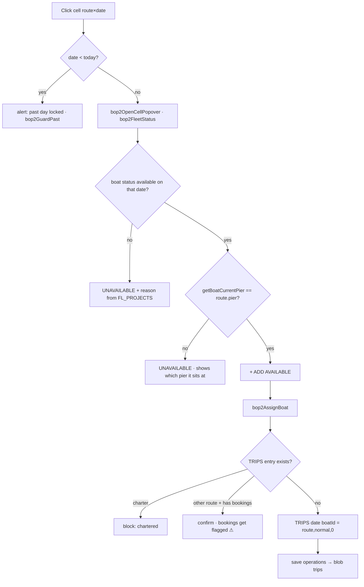
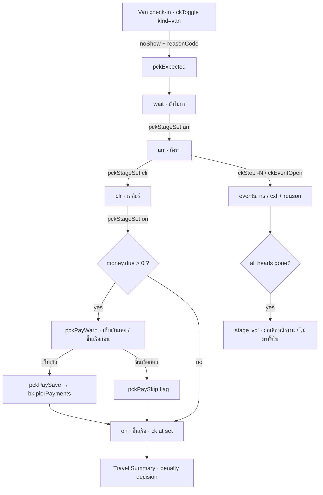

# 03 · Daily Boat Operations & Pier

> Scope: everything between "the bookings exist" and "the day is closed" — deploying boats to route×date, putting bookings on those boats, the four per-pier back-office pages, day-of check-in at the pier, and the closing documents. Code: `allotment_v2.html` unless noted. Line numbers are as of `094dde1` and drift; grep the symbol name instead.

---

## 1. What this does & who uses it

Three different teams share this domain, and the code keeps them apart:

| Who | What they do here | Views |
|---|---|---|
| **Ops / dispatch office** (Phuket HQ) | Decide which boat runs which route on which date; assign each booking to a boat; cancel trips for weather. | Boat Operation, Fleet Calendar, Booking▸By-trip "Boat Assign mode" |
| **Sales-ops / admin** | Verify agent paperwork, re-confirm pickup times with agents, publish the pre-departure report. | ตรวจเอกสาร (Doc-Check), Re-confirm, Daily Report |
| **Pier staff** (Visit Panwa / Tub Lamu / Ranong) | Crew the boats, issue equipment, keep the duty roster and marine licences, check guests in, take money, print the guide/crew job sheets, close the day. | เช็คอินหน้าท่า, the four Pier-Office pages, Travel Summary |

Two of the permission areas in `LA_AREAS` (`allotment_v2.html:407`) cover this domain: **`operations`** (Boat Op, Boat Assign, pier check-in, Travel Summary, Daily Report, Doc-Check, Re-confirm) and **`pier`** (the four `po*` pages). `poCanEdit()` (`allotment_v2.html:79712`) deliberately falls back to `operations` for accounts created before `pier` was split out.

The pivot of the whole domain is the single line **`TRIPS[date][boatId] = {route, type, booked, charterBookingId?}`**. Boat Operation writes it, everything else reads it.

---

## 2. The operational day

A trip date `D` moves through these stages. Each row is one screen.

| When | Step | View / function |
|---|---|---|
| D−30 … D−1 | **Deploy the fleet.** For each route × date, pick which boats run it. Only boats whose `getCurStatus()` is `available` on that date and whose pier matches the route's pier are offered. | Boat Operation `renderOp` `:11209` → `bop2AssignBoat` `:10266` |
| any | **Sanity read** of a whole month (which boat is out, which is spare, which is in the shop, which route is weather-closed). Read-only — clicking a day jumps back to Boat Operation. | Fleet Calendar `renderFleetCal` `:10386`, `fcOpenDay` `:10327` |
| D−n | **Weather cancel** a route × date → tags every affected booking `weatherResolve` for Sales to resolve. | popover button → `bkV2WeatherMark` `:59915` → `bkV2WeatherMarkConfirm` `:59929` |
| D−3 … D−1 | **Check agent documents** (voucher / date / name / pax / route / payment) against the attached files, optionally OCR-assisted. | ตรวจเอกสาร `renderDocCheck` `:75902`, `docCheckRunPre` `:75217` |
| D−2 … D−1 | **Assign bookings to boats.** Per route, drop each seat booking onto one of that route's deployed boats. Auto-assign fills first-fit. | Booking ▸ By-trip ▸ 🚤 Boat Assign mode (`bkV2ToggleBoatMode` `:45676`) → `bkV2AssignBoat` `:45500`; legacy standalone page `renderBoatAssign` `:55235` |
| D−1 | **Re-confirm** every agent's pickup list by WhatsApp/phone; print a per-agent sheet. | Re-confirm `renderReconfirm` `:44688`, `rcSheet` `:44618` |
| D−1 | **Crew the boats** — captain / assistant / crew / island staff per boat, wristband colour, boat-specific notes; licence check per boat. | ใบงานเรือ `renderPierJob` `:82990` → `pjPick` `:82695` |
| D−1 | **Assign guides** and issue the government guide job order (มัคคุเทศก์). | `goSetupOpen` `:50714` → `goSetupSave` `:50753`, sheet `goSheet` `:50540` |
| D−1 evening | **Pre-departure management report** (pax, boats, vans, finance) + emailable HTML. | Daily Report `renderDailyReport` `:54603`, `drData` `:52795`, `drMailShow` `:54485` |
| D morning | **Van check-in** at the hotels — actual pax vs booked, no-show reasons. | เช็คอินรถ `renderVanCheckin` `:48205` → `ckToggle(...,'van')` `:47755` |
| D morning | **Pier check-in** — three stages per booking: ถึงท่า → เคลียร์ → ขึ้นเรือ; collect money; sell extras; record meals/allergies. | เช็คอินหน้าท่า `renderPierCheckin` `:51256` → `pckStageSet` `:47392` |
| D morning | **Kitchen order** per boat (heads that will actually travel, not booked heads). | `pckMealSend` `:51217` → `taSet` `:57712` |
| D morning | **Print the guide job sheet** (crew-facing manifest, one A4 landscape page per boat). | `pckGuideJobOrder` `:50815` → `pckGuideJobSheet` `:49898` |
| D morning | **Issue equipment** to each boat (towels, masks, fins …). | เบิก-คืนอุปกรณ์ `renderPierOffice` `:80026` → `poIssueOpen` `:80237` / `poIssueSave` `:80283` |
| D — boat leaves | (no explicit "departed" flag; `pierCheckin.at` on every row is the de-facto signal) | — |
| D afternoon | **Equipment close-out** — what came back, what is dirty / to repair / lost (+ fine). | `poCloseOpen` `:80301` → `poCloseSave` `:80349` |
| D evening | **Travel Summary** — the day-close document: who actually travelled, penalty decisions for no-shows/on-site cancels, cash collected by method, Cash-on-Tour settlement, and the full manifest. | Travel Summary `renderTravelSum` `:54632`, `tsRows` `:51587`, print `tsPrintSheet` `:52192` |
| monthly | **Duty roster** — auto-derived from the boat job sheets over a 26→25 cycle, hand-overridable per cell. | ตารางการทำงาน `renderPierAtt` `:81159` |
| rolling | **Marine licences** — captain/engineer certificates, expiry warnings, per-boat coverage check. | ใบอนุญาต `renderPierLic` `:81938`, `plCheckBoat` `:81870` |

---

## 3. Entry points

Router: `nav(el)` at `allotment_v2.html:6027`; the four `po*` prefixes are matched longest-first at `:6080-6083`.

| view id | sidebar label | render fn:line | purpose |
|---|---|---|---|
| `#view-operation` | `Boat Operation` (`:4221`) | `renderOp` `:11209` (shell `bop2RenderShell` `:11216`) | Route × date heat-map; assign/unassign boats; weather-cancel. Host `#bop2-host` `:4700`. |
| `#view-fleetcal` | `Fleet Calendar` (`:4225`) | `renderFleetCal` `:10386` | Read-only month calendar of the whole fleet per day. Host `#fc-host` `:4705`. |
| `#view-boatassign` | *(none — not in `LA_NAV` `:411`)* | `renderBoatAssign` `:55235` | Legacy standalone booking→boat page. Superseded by By-trip "Boat Assign mode"; `bkV2GoBoatAssign` `:45683` redirects there. |
| `#view-doccheck` | `ตรวจเอกสาร` (`:4217`) | `renderDocCheck` `:75902` | Verify B2B booking data against attached documents, with Tesseract OCR pre-check. |
| `#view-reconfirm` | `Re-confirm` (`:4209`) | `renderReconfirm` `:44688` | Per-agent / per-trip re-confirmation of the day's bookings + printable sheet. |
| `#view-vancheckin` | `เช็คอินรถ` (`:4241`) | `renderVanCheckin` `:48205` | Van-side check-in (adjacent domain; feeds `pckExpected`). |
| `#view-piercheckin` | `เช็คอินหน้าท่า` (`:4245`) | `renderPierCheckin` `:51256` | The pier operations console: boat → trip → zone → van-group → booking. |
| `#view-travelsum` | `Travel Summary` (`:4249`) | `renderTravelSum` `:54632` | Day-close document: real pax, penalty decisions, cash, COT settlement, manifest. |
| `#view-dailyreport` | `Daily Report` (`:4253`) | `renderDailyReport` `:54603` | 5-tab management summary for a date + emailable HTML. |
| `#view-poj-{panwa,tublamu,ranong}` | `ใบงานเรือ` (`:4270`, `:4291`, `:4312`) | `renderPierJob(pier)` `:82990` | **Boat job sheet** — crew each boat for the day, wristband, notes, licence check. Host `#pj-host-<pier>`. |
| `#view-po-{…}` | `เบิก-คืนอุปกรณ์` (`:4274`, `:4295`, `:4316`) | `renderPierOffice(pier)` `:80026` | **Equipment issue/return** ledger + stock + laundry cycle. Host `#po-host-<pier>`. |
| `#view-poa-{…}` | `ตารางการทำงาน` (`:4278`, `:4299`, `:4320`) | `renderPierAtt(pier)` `:81159` | **Work schedule / duty roster**, 26→25 cycle, derived from the job sheets. Also the registry hub (see §4.10). |
| `#view-pol-{…}` | `ใบอนุญาต` (`:4282`, `:4303`, `:4324`) | `renderPierLic(pier)` `:81938` | **Marine licences** of pier staff (captain / engineer), expiry + coverage. Host `#pl-host-<pier>`. |

Pier group headers (`Phuket` / `Tub Lamu` / `Ranong`) collapse via `poNavGroup` `:5990`; state in `localStorage.la_pogrp`.

> `panwa` is labelled **Phuket** in the sidebar (`:4265`) but the enum value is `panwa` and the long name is `ท่าวิสิษฐ์พันวา` (`bop2PierName` `:10716`). Never write `visitpanwa`.

---

## 4. Workflows

### 4.1 Deploy a boat to a route × date (Boat Operation)

**Trigger** — ops opens Boat Operation and clicks a cell in the route × day matrix.

**Steps**
1. Click a heat-map cell → `bop2SelectCell(routeId, date)` `:10079` sets `_bop2.selRoute/selDate`, re-renders, then opens the popover.
2. `bop2OpenCellPopover(routeId, dateStr, anchorEl)` `:10086` builds three lists from `bop2FleetStatus(dateStr)` `:10552`:
   - `assigned` — boats already in `TRIPS[date]` with a route;
   - `available` — status `available` that day and **not** in `TRIPS[date]`;
   - `unavailable` — status ≠ `available`, reason enriched with the open `FL_PROJECTS` entry (`:10562-10567`).
3. The available list is then re-filtered by the **route's pier**: a boat whose `getBoatCurrentPier(boat, dateStr)` `:9920` ≠ `route.pier` is moved into the unavailable group with a reason such as `ท่าทับละมุ` or `อยู่ที่อู่ · <shop>` (`:10104-10114`). It is never silently dropped.
4. Click a boat under `+ ADD AVAILABLE` → `bop2AssignBoat(routeId, date, boatId)` `:10266`.
5. Click ✕ on an assigned boat → `bop2UnassignBoat(date, boatId)` `:10287`.

**Data written** — `TRIPS[date][boatId] = {route: routeId, type:'normal', booked:0}` (`:10282`), or `TRIPS[date][boatId].route = routeId` when the boat is re-pointed (`:10280`). Persisted by `save('operations')` `:5805` → blob key `trips`.

**Validation / guards**
- `bop2GuardPast(ds)` `:10261` — any date `< TODAY_STR` is hard-blocked with `'วันที่ … ผ่านมาแล้ว · แก้เรือที่ deploy ไม่ได้'`, because closed days already fed Daily Report / Travel Summary / trip P&L.
- A boat carrying `charterBookingId` cannot be re-routed (`'Boat is chartered · cannot reassign'`, `:10270`) nor unassigned (`:10291`).
- Re-routing or unassigning a boat that already has seat bookings on it prompts a confirm listing `baAssignedBookings(date, boatId)` count/pax (`:10274-10278`, `:10295-10299`); the bookings are **not** moved, they get flagged ⚠ "จัดเรือใหม่" on the assign screens via `bkV2BoatPulled` `:45465`.

**Failure modes**
- Assign a boat, then mark it `fixing` in Boat Status → `bop2RouteDaysNeedingBoats` `:10599` raises `reason:'boat_broken'` and the day is flagged even with 0 pax, because the schedule is now invalid.
- Pax exist with no boat at all → `reason:'no_boat'` (`:10616`).
- A charter booking split over 2+ boats: only the first boat is flagged in `TRIPS`; `getAssignedBoatsForRouteDate` `:12096` therefore consults `baCharterBoatMapMemo(dateStr)` and forces `type:'charter'` for the extra hulls (`:12108-12115`), otherwise those hulls would be resold as seats.



### 4.2 Weather-cancel a route × date

**Trigger** — ⛈ button at the bottom of the Boat-Operation cell popover (`:10218-10220`); hidden on past dates.

**Steps**
1. `bkV2WeatherMark(routeId, date)` `:59915` opens a modal asking for a note (`'high waves 3m · port closed …'`).
2. `bkV2WeatherMarkConfirm` `:59929` pushes `{routeId, date, reason:'weather', note, at}` into `SB_WEATHER_CLOSURES`, calls `bkV2WeatherTagBookings` `:59963`, persists with `sbWeatherPersist()` `:59906`, and re-renders Boat Operation + By-trip.

**Data written** — `SB_WEATHER_CLOSURES[]` (blob key `sb_weather`) and, per affected booking, `bk.weatherResolve` + a `Weather` history entry.

**Guards** — `sbWeatherPersist` is a no-op for view-only `operations` users.

**Failure modes** — the boats stay in `TRIPS`; Fleet Calendar compensates by listing the route under `out.wx` and treating its boats as spare (`fcDay` `:10370-10376`). Boat Operation does not.

### 4.3 Assign bookings to boats

**Trigger** — Booking ▸ By-trip-date, header toggle 🚤 (`bkV2ToggleBoatMode` `:45676`), or the ⚠ chip "Boat · N" at `:72087`. The standalone `#view-boatassign` page still works but has no menu entry.

**Steps**
1. Per row the Boat cell is rendered by `baBoatCellHTML(bk, routeId, date, alloc)` `:45567`. A charter booking's cell is locked (`baBoatSplitCellHTML` `:45607`) — its boat is `trip.charterBoatId` and changing it means editing the booking.
2. Pick a boat → `bkV2AssignBoat(bkId, boatId, date)` `:45500`.
3. Bulk: tick rows (`bkV2BoatSelToggle` `:45534`) → `bkV2BoatAssignSelected(date, routeId, boatId)` `:45537`.
4. Auto: `baAutoAssign(date, routeId)` `:55208` — keeps existing assignments, then first-fit into a boat with room ≤ `cap`, else the least-loaded boat that still fits within `cap + BA_CAP_TOL`, else leaves the booking unassigned.
5. Emergency move: `bkV2BoatUpgrade(bkId)` `:55223` prompts reason + charge, writes `b.ops.upgrade`, and from then on the picker offers **every** boat running that day (`renderBoatAssign` pool switch at `:55247`).

**Data written** — `bkOpsFor(b, date).boatId` (`:45527`) — i.e. `b.ops.boatId` on the **first** travel day and `trip.ops.boatId` on any later day (see §9). `b.ops.upgrade = {reason, charge, by, at}` `:55231` + `bkV2AddHistory(...,'Edit')`. Persisted with `acctPersistBookings()` `:42877`.

**Validation / guards**
- Boat used as a charter on any of the booking's dates → hard alert, assignment refused (`:45508`).
- Cap: `next = baAssignedPax(date, boatId) − self + myPax`; if `next > cap + BA_CAP_TOL` the assignment is refused with an explicit message (`:45520-45522`). `cap` comes from `boatCapFor(boatId, date)` `:47018`, which honours the per-day cap override `BOAT_CAP_OVR`.
- Bulk assign skips (does not block) the rows that would overflow and reports them (`:45560`).
- Picking one boat for a booking that is currently split across hulls asks for confirmation and deletes `ops.boatSplits` (`:45505`).

**Failure modes**
- Boat pulled out of `TRIPS` after assignment, or now serving another route, or chartered by someone else → `bkV2BoatPulled` `:45465` paints the cell red with ⚠ `เรือถูกถอดจาก Boat Operation · จัดเรือใหม่`. A charter's own boat and an OVN return leg are explicitly exempt (`:45476`, `:45483`).
- Nothing deployed on the route yet → auto-assign alerts `'No boat assigned to this route yet · assign boats in Boat Operation first'` (`:55209`).

### 4.4 Split one booking across several boats

**Trigger** — ⇄ button on the boat cell, shown when the booking has ≥2 heads on that date or is already split (`:45581`).

**Steps** — `bkV2BoatSplit(bkId, date)` `:46076` seeds a modal with the day's pax pool (`bkBoatPoolOn` `:46022`) split into parts; edit parts; save writes `ops.boatSplits`.

**Data written** — `bkOpsFor(b,date).boatSplits = [{boatId, ad, chd, inf, foc}]`.

**Downstream** — every load calculation is split-aware: `bkBoatIdsOn` `:46036`, `bkBoatPaxOnBoat` `:46042`, `baAssignedPax` `:45457`, `baAssignedBookings` `:45489`, and the pier check-in row expander `pckExpandBoatSplits` `:49181` (1 row per hull).

**Failure modes** — a split whose parts do not add up to the day pool silently leaves people unassigned; the split row cell shows `⚠ ยังไม่เลือกลำ` when a part has no boat (`:45598`).

### 4.5 Pier check-in — the three-stage machine

**Trigger** — pier staff open เช็คอินหน้าท่า for today.

**Page build** (`renderPierCheckin` `:51256`)
1. `bkV2CharterBoatHeal(date)` `:45435` mirrors `trip.charterBoatId` → `ops.boatId` for charters that were never assigned manually.
2. Every non-cancelled booking with a trip on that date becomes a row `{b,t,O,booked,expect,ck,van,vanId,bid,arr,money,_vd}` (`:51271-51276`); OVN return legs go to a separate `ovnAll` bucket so their money is not counted twice (`:51280-51285`).
3. Rows are expanded per hull (`pckExpandBoatSplits`) and nested **boat → trip(route) → arrival zone → van group → row** (`:51326-51344`, zone loop `:51413`). Zones: `PK` / `KL` / `OWN` (self-arrive or agent car) / `NOVAN` (`pckArrivalOf` `:48337`, labels `PCK_ARR_LBL` `:48343`).

**Stages** — `PCK_STAGES` `:47250`: `arr` **ถึงท่า** → `clr` **เคลียร์** → `on` **ขึ้นเรือ**. `'on'` is the pre-existing `ck.at`, so old data needs no migration (`:47249`).

**Steps**
1. Click a stage chip → `pckStageSet(bkId, date, stage)` `:47392`. Clicking a stage you already passed steps **back** one (`to = (at===want) ? want-1 : want`, `:47398`). Reaching `on` delegates to `ckToggle(bkId,date,'pier')` `:47755` because that path counts pax and asks for a reason.
2. ± buttons adjust the travelling count → `ckStep(bkId,date,'pier',delta)` `:47741`, clamped to `[0, cap]` where `cap = pckExpected(...)`.
3. Any reduction with no reason opens `ckReasonOpen` `:47452`; on-site cancels / no-shows are recorded as **events** via `ckEventOpen` `:47526` / `ckEvSave` `:47606`, and can be undone with `ckEventUndo` `:47373`.

**Data written** — all under `bkOpsFor(b,date).pierCheckin` (and `.vanCheckin` for the van stage) through `ckWrite` `:47239`:
`{actualPax, noShow, expected, at, by, events:[{type:'ns'|'cxl', pax, reasonCode, note, at, by, ts}], reasonCode, reasonNote, reasonAt, arrivedAt, arrivedBy, clearedAt, clearedBy, reinstate}`.
`CK_STAGE_KEYS` `:47238` is merged forward on every write so `arrivedAt/clearedAt/reinstate` survive a ± press.

**Validation / guards**
- `ckGuard()` `:47208` — needs `laCanEditArea('operations') || laCanEditArea('pier')`. Before this existed, pier-only accounts could click check-in and have it silently discarded (comment `:47197-47202`).
- `ckPersist()` `:47213` writes `laBlob().sb_bookings` directly (**not** `acctPersistBookings`, which requires `operations`).
- Boarding a booking that still owes money pops `pckPayWarn` (see 4.6) — a warn, not a block: "เรือรอไม่ได้" (`:47760`).

**Failure modes**
- A booking with no boat lands in the `noBoat` bucket and never appears on any job sheet (`pckGuideJobOrder` skips `!row.bid`, `:50832`).
- `pckExpected` `:48896` subtracts van no-shows — unless the reason is one of the "will come to the pier themselves" codes (`ckExpectAtPier` `:47161`), in which case the pier still expects them.
- `ckPierReinstate` `:47169` lets the pier overrule a van no-show; `ckLostByType` `:47123` then stops counting those heads as lost.



### 4.6 Collect money at the pier

**Trigger** — the money column button `เก็บเงิน` / `แนบสลิป` / `ดูรายการ` (`:48429`), or automatically when boarding an unpaid booking.

**Steps**
1. `pckPayGuard(bkId, date)` `:48496` → `pckPayWarn` `:48504` shows the breakdown (COT / B2C balance / uncollected upgrade / already collected) with two exits: `ขึ้นเรือก่อน · ยังไม่เก็บ` (`pckPaySkipOn` `:48503`, sets a one-shot skip flag) or `เก็บเงินเลย`.
2. `pckPayOpen(bkId, thenCk)` `:48538` opens the split-payment form; each line is `{m:'cash'|'transfer'|'card', amt, feeMode, feePct, fee, note, slips[]}` (`pckLineNew` `:48534`).
3. `pckPaySave()` `:48596` — drops zero lines, confirms over-payment, appends one `pierPayments` entry per line, then if the balance is now zero and the form was opened from a check-in click, boards the guest automatically (`:48634-48637`).

**Data written** — `bk.pierPayments[] = {id, date, amount, method, fee, feePct, note, slips[], by, at}` (`:48610-48616`) + a `Pier`-tagged history entry (`:48620`). Persisted via `acctPersistBookings()`.

**Validation / guards**
- Card fee is stored **separately** from `amount`: `amount` reduces the booking debt, `fee` is pass-through to the bank; `amount+fee` is what the EDC slip shows (`:48438-48440`). Merging them would inflate revenue.
- Non-cash lines without a slip are counted by `pckNoSlip` `:48449` and shown as `⚠ รอสลิป n` — the day cannot be reconciled without them.

**Failure modes** — pier money is intentionally **not** written to `SB_PAYMENTS`; it is a separate pot that must be reconciled at day close (comment `:48435-48436`). Anything that reads only `SB_PAYMENTS` will not see it.

**Money model** — `pckMoney(b,date)` `:48350`: `due = max(0, (cashOnTour + uncollected upgrades + paymentSnapshot.balance) − pierPaid)`. OVN return legs return `ovnSettled` and zero out COT/balance/upgrades so the pier does not charge twice (`:48351-48356`).

### 4.7 Guides — assignment, government order, job sheet

Three different documents; do not confuse them.

**a) ใบสั่งงานมัคคุเทศก์ (`goSheet` `:50540`)** — the Tourism-Department form declaring who guided which boat. Assign guides with `goSetupOpen(bid)` `:50714` → `goSetupSave(bid, doPrint)` `:50753`; print via `goPrint` `:50642`.
- Registry: `goGuides()` / `goGuidesSet()` `:50457-50458` → blob key **`guides`** via `ctRead`/`ctWrite` (`:55967`, `:55972`).
- Record shape (`goRegAdd` `:50806`): `{id, name, nick, license, lang:[], role:'guide'|'trainee'|'intern'|'staff', active}`. Roles `GO_ROLES` `:50445` = `ไกด์ / ไกด์ฝึกหัด / นักศึกษาฝึกงาน / สตาฟ`.
- Assignment: `goAsn(date,bid)` `:50468` / `goAsnSet` `:50473` → blob key **`go_asn`**, key `date|boatId`, value `{g:[guideId], other:Number, sign:Number}`.
- Document number: `goNoFor(date,bid,issue)` `:50478` → blob key `go_no`; issued **once** per (date, boat), so reprinting does not burn a number.
- Counting rule (`:50544-50549`): only `guide`/`trainee` count as `มัคคุเทศก์ (ผู้ติดตาม)`; `intern`/`staff` roll into `อื่นๆ` together with the manual `A.other` count.
- Pax on the form come from `goCounts(date,bid)` `:50519` — heads that actually travelled (`ckPaxLeft`), FOC folded into adults.

**b) ใบงานไกด์ (`pckGuideJobOrder` `:50815` → `pckGuideJobSheet` `:49898`)** — the crew-facing manifest, A4 landscape, one page per boat, printed from the pier check-in boat card (`:51393`).
- Excludes bookings with no boat (`:50832`) and bookings voided on site (`pckVoidInfo`, kept only as a header tally `:50838`).
- Header stats from `pckTripStats(rows, date)` `:49746` — real pax by type, guide-language counts, special meals, longtail join/charter counts. Every per-head figure uses **travelled** heads, not booked (`:49749-49752`).
- Layout auto-fits to one page by measuring a 210 mm probe and stepping density `d1 → d2`, then padding rows to fill the page (`:50865-50891`).

**c) Guide **languages** requested by the customer** live on the booking: `b.guides = {english, russian, chinese, otherLang}` → normalised by `pckGuideLangs(b)` `:50211` / `pckLangNorm` `:50196` (strips "Guide"/"speaking", maps to 2-letter codes via `PCK_LANG_MAP` `:50181`). This is a *request*, not an assignment.

**Guards** — `goSetupSave` and the registry go through `ctWrite`, i.e. the ordinary blob path; `pjGuideOpen(bid)` `:82776` reuses the same modal from the boat job-sheet page after syncing `_pckDate = _poDate`.

**Failure modes** — before commit `9500688` the sheet read only `G[0..2]`, so guides 4-5 vanished silently, and interns/staff never reached the job sheet at all. `pjGuidesFull(date, boatId)` `:82142` now returns every assigned person with `{id,name,langs,role,guide}`; `pjGuides` `:82155` keeps the old string-array shape for the kitchen sheet.

### 4.8 ใบงานเรือ — the pier boat job sheet (`poj`)

**Trigger** — pier supervisor opens `Pier Office ▸ <pier> ▸ ใบงานเรือ` the day before.

**Steps**
1. `renderPierJob(pier)` `:82990` lists every boat that belongs to that pier that day via `pjAllBoats(date, pier)` `:82281` — boats running from the pier (`poBoats` `:79771`) plus every other boat whose `pjPierOf(boat,date)` `:82273` is this pier.
2. Each boat gets a status from `pjBoatSt` `:82228` → one of `PJ_ST` `:82194`: `clash` (deployed but the shop says it is not available), `run`, `away` (running from another pier today), `idle`, `broke`, `maint`, `dd` (ขึ้นคาน), `donor`, `off`. Grouped `go | ready | work | down` (`pjGrp` `:82206`) and used as the filter chips.
3. Fill the crew selects → `pjPick(bid, slot, val)` `:82695` where `slot` is `cap`, `asst`, `crew<i>` or `island<j>`. Options come from `pjOpts(pier, sel, roles)` `:82640` — staff from all three piers, other piers grouped as "มาช่วย".
4. Other per-day fields: wristband `pjWbSet(bid,t,c)` `:82722` (palette `PJ_WB` `:82159`), note `pjNote` `:82706` (400 chars), meal venue `pjMvSet` `:82705`, maintenance job `pjMjPick` `:82254`, lock `pjLockSet` `:82717`.
5. `pjCopyYday(pier)` `:82758` copies yesterday's sheets, **skipping locked ones**, and reports `คัดลอกมา N ลำ · ข้าม M ลำที่กดจัดเสร็จแล้วไว้`.
6. `pjTeamSave(bid)` `:82750` promotes today's crew to the boat's standing team.

**Data written**
- `PIER_JOB['YYYY-MM-DD::boatId'] = {cap, asst, crew[], island[], note, wb, wbc, lock, mv, mj}` — writer `pjSet` `:82106`.
- `PIER_TEAM[boatId] = {cap, asst, crew[]}` — the standing crew.
- `PIER_CFG.stBand[statusKey]` for custom status colours (`pjStColor` `:82213`).
- Route colour edits write `ROUTES[i].color` straight into `laBlob().routes` on purpose, not through `save('config')` (`:82730-82739`).

**Validation / guards** — every writer calls `poGuard()` `:79724` (`pier`, falling back to `operations`). `pjOf(d,b)` `:82096` returns the standing team with `_std:true` when the day has no record — **displayed but not written**. The whitelist inside `pjOf` (`:82102-82104`) is why `lock` and `mv` carry explicit warnings: a field missing from that list is dropped on the next save.

**Failure modes** — licence coverage is checked per card with `plBoatBad(bid, [cap, asst, ...crew])` `:81899`; a boat can be crewed by people whose certificate does not cover its GT/BHP and it only shows as a warning.

### 4.9 เบิก-คืนอุปกรณ์ — equipment issue/return (`po`)

**Trigger** — pier staff hand out towels/masks/fins before departure; close out after the boat returns.

**Steps**
1. `renderPierOffice(pier)` `:80026` — three sections: `1 เบิก – คืน รายลำ` `:80076`, `2 สต็อกคงเหลือ · แยกตามถัง` `:80079`, `3 วงจรผ้าเช็ดตัว` `:80081`.
2. Issue: `poIssueOpen(bid)` `:80237` (suggests `min(boat pax, ready)` for single-SKU kinds, `:80257`) → `poIssueSave(bid)` `:80283`.
3. Close-out: `poCloseOpen(bid)` `:80301` → `poCloseCalc` `:80326` → `poCloseSave(bid)` `:80349`.
4. Laundry cycle: `poLaundryOutOpen` `:80604` / `poLaundryInOpen` `:80615` → `poLaundrySave(isOut)` `:80626`.

**Data written** — one append-only ledger row per action, via `poAdd(o)` `:79852` which stamps `id`, `at`, `by`:
`PIER_MOVES[] = {id, date, pier, itemId, boatId, type, qty, note, at, by}` with `type ∈ issue | return | repair | fixed | writeoff | lost | laundry_out | laundry_in | adjust`. Lost items may also carry `fine` / `finePaid:false` (`:80368`).
Crew-on-duty for equipment: `PIER_DUTY['date::boatId'] = [staffId]` (`poDutySave` `:80389`).

**Validation / guards**
- Balances are **never stored**: `poBal(itemId)` `:79747` replays the whole ledger from `item.total` into buckets `ready / onboat / dirty / laundry / repair / gone` (`:79754-79764`). A returned towel goes to `dirty`, everything else back to `ready` (`:79756`).
- Close-out refuses to save unless the shortfall is fully explained: `sum !== miss` → `'· ระบุของที่ขาดได้ N จาก M'` (`:80358`); a return quantity outside `[0, outstanding]` → `'· จำนวนคืนไม่ถูกต้อง'` (`:80355`).
- Closing a boat that never drew anything alerts `'ลำนี้ยังไม่มีการเบิกของในวันที่เลือก'` (`:80306`).

**Failure modes** — the ledger is the truth; correcting a mistake means adding an `adjust` move (`poAdjOpen` `:80571`), never editing history.

### 4.10 ตารางการทำงาน — duty roster (`poa`)

**What it is** — a monthly crew roster that **derives itself from the boat job sheets** and lets you override cell by cell. Subtitle at `:81263`: `ขึ้นเองจากใบงานเรือ · แก้ทับรายช่องได้`.

**Cycle** — `paCycleStart()` `:80677` reads `PIER_CFG.cycleStart` clamped to 1..28, **default 26**. `paCycle(anchor)` `:80761` builds `from = <cycleStart> of the month` → `to = day before <cycleStart> of the next month`, so the standard period is **26 → 25** and always straddles two calendar months (header spans at `:81185`).

**Cell resolution — four layers** (`paCell(date, pier, staff, dayIndex)` `:80809`):
1. manual override (`PIER_SHIFT[date::staffId]` with no `plan` flag) → wins;
2. otherwise the job-sheet assignment for that day, indexed by `paDayIdx` `:80783` straight off `PIER_JOB` (covering `cap`, `asst`, `crew[]`, `island[]`); the code becomes the dry-dock code, the maintenance code, or `paRouteCode(rid) || paOnBoatCode()` (`:80818`);
3. otherwise the "plan" layer (a `PIER_SHIFT` entry with `plan:1`);
4. otherwise empty, marked `todo` if the person's pier had work that day.

**Steps**
1. Click a cell → `paPick(ev,date,sid)` `:81302` → pick a code → `paSet(date,sid,code,plan)` `:81413` → `paSetManual` `:80775` → `poPersist()`.
2. Bulk fill a date range (+ weekday filter, + overwrite flag) → `paRangeOpen` `:81697` / `paRangeApply` `:81743`. Defaults to the *plan* layer and skips existing manual cells unless overwrite is ticked.
3. Reorder rows by drag (`paDragStart` `:80877` … `paDrop` `:80890`) → writes `staff.ord`.
4. Export `paExport()` `:81767` (CSV) / print `paPrint()` `:81789` (`CREW DUTY ROSTER · from – to · PIER`, `:81191`).

**Data written** — `PIER_SHIFT['YYYY-MM-DD::staffId'] = {c, by, at, plan?}` — **only hand-touched cells**. `PIER_SECT` for row groups, `PIER_STAFF[].ord/.sect/.defCode/.note` for layout.

**Registry hub (commit `3f96494`)** — every registry button in the Pier Office now lives on this page's toolbar (`:81280-81286`), each renamed to start with `ทะเบียน`:

| button | handler |
|---|---|
| `ทะเบียนพนักงาน` | `poStaffOpen()` `:80395` |
| `ทะเบียนไกด์` | `goRegOpen('')` `:50764` |
| `ทะเบียนกลุ่ม` | `paSectOpen()` `:81534` |
| `ทะเบียนรหัส` | `paCodesOpen()` `:81621` |
| `ทะเบียนประเภทใบ` | `plTypesOpen()` `:81997` |

They were removed from `po` (staff), `poj` (staff), `pol` (staff + licence types) and from the unlabeled gear on pier check-in. `ทะเบียนของ` (items) stays on the `po` page — it is things, not people; `ทะเบียนไกด์` also stays inside the guide-assignment modal (`:50746`) because it returns to that modal instead of jumping pages. Two empty-state strings now point people here (`:80385`, `:81991`).

**Codes** — `PIER_CODES` `:79636`, seeded at `:79662-79674`: `PP` ทำงาน (ลงเรือ), `SE` เข้าเวร, `OFF` หยุดประจำสัปดาห์, `PH` วันหยุดนักขัตฤกษ์, `LWOP`, `LWP`, `SC`, `SR`, `5`, `ABS` ขาดงาน, `MT` งานซ่อม / ขึ้นคาน; each has `kind ∈ work|off|leave|none` which drives the summary totals. Route codes come from `ROUTES[].code` or the guess table `RT_CODE_GUESS` `:80684` (`WS/KB/SR/SL/PP/RY/CR/JB`); `paCodeMeta(code)` `:80715` lets a route's meaning override the registry entry.

### 4.11 ใบอนุญาต — marine licences (`pol`)

**Trigger** — checking whether the people you just put on a boat may legally run it.

**Steps** — `renderPierLic(pier)` `:81938` lists staff **home-based at this pier**, each with their licences and a state chip. Add `plAdd(staffId)` `:82066` → `plSave` `:82078`; delete `plDel` `:82086`; class/type registry `plTypesOpen` `:81997` (now reached from the `poa` toolbar).

**Data written** — `PIER_LICENSES[] = {id:'pl_…', staffId, classId, no, exp, issuedAt, issuer, note}`; taxonomy in `PIER_LIC_TYPES` (`{id, side:'deck'|'eng', short, formal, perBoat, active}`, seeded `:79680`) and `PIER_LIC_CLASSES` (`{id, typeId, name, maxGt, maxBhp, ord}`, seeded `:79684` — deck ≤500/≤60 GT, eng ≤3000/≤1000 BHP). Warning window in `PIER_CFG.licWarnDays` (`plWarnDays` `:81836`, default 60).

**Validation** — `plState(l)` `:81846` → `noexp | bad | soon | ok`; `plCovers(l, boat)` `:81849` compares the class ceiling against the boat's GT/BHP. The load-bearing call is `plCheckBoat(boatId, crewIds)` `:81870`, which per licence type needing `perBoat` holders reports: expired-only (`'…หมดอายุแล้ว … — ยังจ่ายงานได้ แต่ต้องรีบต่อ'` `:81891`), class-too-small (`'…ชั้นไม่ครอบคลุมลำนี้ (ลำนี้ X ตันกรอส · Y แรงม้า)'` `:81892`), or missing (`'ยังขาด<type> N ใบ'` `:81894`).

**Failure modes** — `plBoatBad` `:81899` is only a badge on the job-sheet card (`:83004`); nothing blocks dispatching an under-licensed crew.

### 4.12 Doc-Check + OCR pre-check

**Trigger** — admin opens `ตรวจเอกสาร` for a travel date and works the list.

**Steps**
1. `renderDocCheck` `:75902` lists via `_docCheckList(date)` `:75370` → every booking where `_docIsB2B(b)` (`schemaVer===2 && agentId`, `:75341`), status ≠ `rejected`, with a trip on that date. Cancelled bookings stay, greyed with `✕ ยกเลิก`. Ordering/filtering by `_docCheckOrdered` `:75372` (route → voucher).
2. Open a row → drawer with the 6-item checklist `DOCCHK_ITEMS` `:75162`: `route` เส้นทาง / โปรแกรม, `date` วันเดินทาง, `lead` ชื่อ, `pax` จำนวนคน, `voucher` Voucher / Ref, `payment` Payment.
3. Optional **OCR pre-check** — `docCheckRunPre(bkId)` `:75217`: lazy-loads **Tesseract.js v5** from `cdn.jsdelivr.net` (`_docOcrEnsureLib` `:75172`), one shared worker, language **`eng` only** (`:75189`). Image attachments only; PDFs are skipped with `'Pre-Check supports image attachments only (PDF must be checked manually).'` (`:75220`). Each image is fetched from `/api/attach/<id>` and the texts concatenated (`:75226`).
4. `_docPreCheckMatch` `:75251` fuzzy-matches the six fields — **it does not read MRZ**. Voucher = alphanumeric substring / last-8 tail; date = ~14 format candidates; lead = order-independent token match; pax = regex on `adult|child|infant|pax|ท่าน|คน` compared per type with FOC folded into adults; route = keyword score ≥0.5; payment = keyword set per `agent.payType`.
5. Items scoring `match` are auto-ticked when `laCanEditArea('operations')`; then `_docCheckPersist()`.
6. Decide: `✅ ถูกต้อง` / `⚠ มีปัญหา` → `docCheckSetStatus` `:75368`.
7. Print A4 pack: `docCheckPrintPack()` `:75547` — 1 voucher = 1 page; `{onlyIncomplete:true}` keeps rows where `attachments.length < pax`. PDFs are rasterised with pdf.js 3.11 from cdnjs.

**Data written** — on the booking: `bk.docCheck = {status, items:{}, note, by, at, pre}` where
`bk.docCheck.pre = {at, lang:'eng', autoTick, results, summary:{match,maybe,mismatch,none}, text}` (`text` truncated to 3000 chars, `:75234-75240`). Persisted by `_docCheckPersist` `:75344` → `acctPersistBookings()` with a raw-localStorage fallback. `docCheckSetStatus` also appends a `DocCheck`-tagged history entry.

**Validation / guards** — `laGuardEdit('operations')` on toggle and status; `docCheckSetNote` `:75369` is **not** guarded (writes without permission check, deliberately no re-render to keep focus).

**Failure modes**
- No network → the CDN load rejects with `'OCR library load failed (no network?)'` and the bar shows `Pre-Check ไม่สำเร็จ: …` + `ลองใหม่`. The error object is written to `bk.docCheck.pre` but **not persisted** (`:75242-75244`).
- Status derivation: `docCheckStatus(bk)` `:75342` = explicit `bk.docCheck.status`, else `pending` if there are attachments, else `nofiles`. Enum: `verified | issue | pending | nofiles`. Other views (Travel Summary `:52315`, Daily Report `:53774`) call this same function so the counts always agree.

### 4.13 Re-confirm

**Trigger** — the day before travel, sales-ops walks the agent list confirming pickup times.

**Steps**
1. `renderReconfirm` `:44688` builds two groupings from `_rcActiveRows(date)` `:44585` — by agent (default) and by trip. Agent key `_rcAgentKey(bk)` `:44579` = `agentId || 'b2c:<channel>'`.
2. Per booking: click the status cell → `rcStatusPop` `:44534` → `rcSetStatus(bkId, v)` `:44513`.
3. Per agent: `Send re-confirm` → `rcSendAgent(key)` `:44606` marks every one of that agent's non-cancelled bookings that day as done; `Undo` → `rcUnsendAgent` `:44611`.
4. `Sheet` → `rcSheet(key)` `:44618` opens a printable A4-landscape per-agent sheet grouped by route (columns `#, Booking #, Customer, Phone, AD, CHD, INF, FOC, Pick-up, Hotel, Room, Zone, Add-on, Special request, Payment`), ref `RC-YYMMDD-<agentCode>`.

**Data written** — `bk.ops.reconfirm = {status, via:'reconfirm', at, by}` (`:44515`) — the **same field** the By-trip "Re-Confirm mode" writes (`bkV2Reconfirm` `:45680` uses `via:'list'|'phone'`), so both surfaces stay in sync. History entries tagged `Notify`.

**States** — `RC_STATES` `:44504`: `''` Not started · `wa` WhatsApp sent · awaiting · `noans` Called · no answer · `off` Called · phone off · `callback` Call back later · `done` Confirmed. Only `done` counts as confirmed.

**Guards** — none. `rcSetStatus` / `rcSendAgent` / `rcUnsendAgent` have **no** `laGuardEdit` call; they rely on `acctPersistBookings()` silently refusing to persist for view-only users.

**Colours** — user-editable per state, stored as a JSON string under the top-level blob key `rc_status_colors` (`rcSaveStatusColor` `:44532`), memoised in `_rcColorCache` because re-parsing the ~9 MB blob per cell cost 1.3 s on a 43-row page (`:44519`).

### 4.14 Travel Summary — closing the day

**Trigger** — end of the operating day; pier/ops decide what to charge for the people who did not travel and reconcile the cash.

**Steps**
1. `renderTravelSum` `:54632` builds `tsRows(date)` `:51587`: every non-cancelled booking with a trip that day, carrying `booked`, `travelled = booked − noShow`, the raw `events[]` from both check-in stages, van/boat ids, `amount` (`tsTripAmount`), `policy` (`tsPolicyText`), and the existing decision.
2. Rows land in **section 2 "ตัดสินค่าปรับ"** only when someone really did not travel: `issue = noShow>0 || ckLostByType(...).total>0 || decision already exists` (`:51612-51615`) — pressing something at the pier is not enough.
3. Decide per row: `tsPick(bkId,date,kind,amt)` `:51708` (shortcut buttons), `tsCustom` `:51714` (typed amount), `tsPostpone` `:51721`, `tsClear` `:51713`.
4. Cash-on-Tour settlement: `tsCotPick(bkId,date,mode,cot)` `:51649` with `mode ∈ full|part|none|payout`, suggested by `tsCotSugMode(M)` `:51645` (`'none'` when the agent handles COT separately); reference `tsCotRefSave` `:51666`, undo `tsCotClear` `:51668`.
5. Print the day-close pack: `tsPrintSheet()` `:52192` — four sections in one document (`§tsManifest`, `:51727`): route summary · penalty decisions · on-site money by method · **`04 Manifest ประจำวัน`** (`:55031`). Reference list `tsRefPackList` `:52179` uses the identical ordering.
6. Cross-navigation: `tsGoDoc(bkId,date)` `:52342` jumps to Doc-Check; `tsSendBack(b,date)` `:52356` sends a row back.

**Data written**
- `TRAVEL_SUM['YYYY-MM-DD::bookingId'] = {decision, amount, note, by, at}` — `tsSet` `:51546`, store declared `:51537`, blob key **`travel_sum`** via `tsPersist` `:51539`.
- `TS_COT['YYYY-MM-DD::bookingId'] = {mode, deduct, payout, ref, by, at}` — declared `:51634`, blob key **`ts_cot`** via `tsCotPersist` `:51638`.
- Money itself is not re-written here; it is read from `bk.pierPayments` (pier), `SB_EXTRAS` (on-site sales) and the invoices.

**Validation / guards** — `tsSet` calls `laGuardEdit('operations')` and tells the user when they are view-only (`:51547`); `tsPersist`/`tsCotPersist` additionally bail on `!laCanEditArea('operations')`. Both go through `laBlob()`/`laBlobSave()` — raw localStorage writes here would clobber other modules (`:51541`).

**Failure modes** — sorting is route → agency A-Z → voucher (`:51624-51630`), matching the reference pack; changing one without the other breaks the paper cross-check. OVN return legs appear in the manifest (they are on the boat) but `tsTripAmount` returns 0 for them so the money is not double-counted (`:51592-51593`).

### 4.15 Daily Report + email

**Trigger** — the evening before travel ("สรุปก่อนวันเดินทาง", subtitle at `:54620`).

**Steps**
1. `renderDailyReport` `:54603` computes `drData(date)` `:52795` once and renders one of five tabs, `DR_TABS` `:52675`: `ov` **ภาพรวม** (`drPaneOv` `:53320`) · `px` **ผู้โดยสาร** (`drPanePx` `:53437`) · `bt` **เรือ** (`drPaneBt` `:53548`) · `vn` **รถรับส่ง** (`drPaneVn` `:53633`) · `fi` **การเงิน** (`drPaneFi` `:53727`).
2. Date stepper + `🖨 พิมพ์ / PDF` (`drPrint` `:53837`) + `✉ ส่งอีเมล` (`drMailShow` `:54485`).
3. The mail composer builds a self-contained HTML mail (`drMailHTML` `:54114`, subject `drMailSubject` `:54433`, text alternative `drMailText` `:54437`) with PNG-rendered trend/donut charts (`drmPngTrend` `:54008`, `drmPngDonut` `:54064`, uploaded through `drmUpload` `:54086`); output via clipboard (`drMailCopy` `:54494`), `.eml` file (`drMailEml` `:54521`) or `mailto:` (`drMailto` `:54550`).
4. Trend window toggles between travel-date and booking-date via `_drTrendMode` `:52673` / `drTrendMode` `:52674`; series from `drTrend` `:52959` / `drTrendBooked` `:52989`, drawn by `drChart` `:53031`.

**Data written** — the report itself writes nothing about bookings. Configuration only: `drCfg`/`drCfgSet` `:52677`/`:52683` → blob key `dr_cfg`, and mail settings `drMailCfg`/`drMailSet` `:53845`/`:53850` → blob key `dr_mail`, both through `ctRead`/`ctWrite` (`:55967`, `:55972`).

**Failure modes** — `drData` is wrapped in try/catch; a throw renders `โหลดข้อมูลไม่สำเร็จ · <message>` instead of a blank page (`:54607-54609`). Chart PNG generation and mail upload need network.

---

## 5. Data model touched

**Written by this domain**

| Store | Key / shape | Written by |
|---|---|---|
| `TRIPS` | `TRIPS[date][boatId] = {route, type:'normal'\|'charter', booked, charterBookingId?}` · blob key `trips` | `bop2AssignBoat` `:10266`, `bop2UnassignBoat` `:10287` |
| `SB_WEATHER_CLOSURES` | `[{routeId, date, reason:'weather', note, at}]` · blob key `sb_weather` | `bkV2WeatherMarkConfirm` `:59929` |
| booking `ops` (per day) | `.boatId`, `.boatSplits[]`, `.upgrade`, `.vanCheckin`, `.pierCheckin`, `.reconfirm` | `bkV2AssignBoat`, `ckWrite` `:47239`, `rcSetStatus` |
| booking fields | `bk.pierPayments[]`, `bk.docCheck{}`, `bk.history[]` | `pckPaySave` `:48596`, `docCheckSetStatus` `:75368` |
| `TRAVEL_SUM` | `['date::bookingId'] = {decision, amount, note, by, at}` · blob key `travel_sum` | `tsSet` `:51546` |
| `TS_COT` | `['date::bookingId'] = {mode, deduct, payout, ref, by, at}` · blob key `ts_cot` | `tsCotPick` `:51649` |
| `TRIP_ACT` | `['date::boatId'] = {meal:{venueId,name,ad,chd,priceAd,priceCh,amount,at,by}, …}` · blob key `trip_actuals` | `taSet` `:57712` (from `pckMealSend` `:51217`) |
| `PIER_JOB` | `['YYYY-MM-DD::boatId'] = {cap, asst, crew[], island[], note, wb, wbc, lock, mv, mj}` | `pjSet` `:82106` |
| `PIER_TEAM` | `[boatId] = {cap, asst, crew[]}` | `pjTeamSave` `:82750` |
| `PIER_MOVES` | append-only `{id, date, pier, itemId, boatId, type, qty, note, fine?, at, by}` | `poAdd` `:79852` |
| `PIER_ITEMS` / `PIER_KINDS` | item + category registries | `poItemsSave` `:80543`, `poKindAdd` `:80444` |
| `PIER_STAFF` | `{id:'ps_…', pier, nick, name, role, phone, active, defCode, ord, sect, note}` | `poStaffAdd` `:80420`, `paStaffFld` `:81383` |
| `PIER_DUTY` | `['date::boatId'] = [staffId]` | `poDutySave` `:80389` |
| `PIER_SHIFT` | `['YYYY-MM-DD::staffId'] = {c, by, at, plan?}` — hand-touched cells only | `paSetManual` `:80775` |
| `PIER_CODES` / `PIER_SECT` | roster code + row-group registries | `paCodesOpen` `:81621`, `paSectOpen` `:81534` |
| `PIER_LIC_TYPES` / `_CLASSES` / `PIER_LICENSES` | licence taxonomy + records | `plSave` `:82078`, `plClassAdd` `:82032` |
| `PIER_CFG` | `{licWarnDays, cycleStart, onBoatCode, mtCode, ddCode, defCode, stBand{}}` | `plSetWarn` `:81994`, `pjStColor` `:82213` |
| guide stores | blob keys `guides` (registry), `go_asn` (`date\|boatId` → `{g[],other,sign}`), `go_no`, `go_cfg` | `goGuidesSet` `:50458`, `goAsnSet` `:50473`, `goNoFor` `:50478` |
| UI colour prefs | blob keys `rc_status_colors`, `pck_svc_colors`, `pck_svc_rules` | `rcSaveStatusColor` `:44532`, `_pckSvcWrite` `:50228` |

**Read but never written here** — `BOATS` (+ `log[]`, `assignments[]`), `ROUTES` (`pier`, `times[]`, `color`, `seasons[]`), `SB_BOOKINGS` identity/pricing, `SB_VEHICLES`, `FL_MAINT`, `FL_PROJECTS`, `SB_EXTRAS`, `BOAT_CAP_OVR`.

---

## 6. Capacity & assignment rules

**`cap` vs `licensePax`** — `boat.cap` is the *booking* cap (what the company sells); `boat.licensePax` is the registered seat count (the physical/legal maximum). `getAllotment` `:12145` tracks both: `availableCapacity` from `cap`, `licenseCapacity` from `licensePax` with a fallback to `cap` when the licence figure is missing (`:12162`).

**Per-day cap override** — `boatCapFor(boatId, date)` `:47018` (backed by `BOAT_CAP_OVR`, setter `boatCapSet` `:47027`) is what every assignment path uses, not `boat.cap` directly. `boatCapSet` clamps the override to `licensePax` (`:47031-47032`).

**The seat pool** — `getAllotment(routeId, dateStr)` `:12145`:
```
totalCapacity      = Σ boatCapFor(boat, date)   over TRIPS[date] boats on this route
charterCapacity    = Σ cap of the chartered subset
availableCapacity  = totalCapacity − charterCapacity
seatsConsumed      = getSeatsConsumed(routeId, date)
lockedSeats        = bkV2LockedTotal(routeId, date)
seatsAvailable     = max(0, availableCapacity − seatsConsumed − lockedSeats)
licenseAvailable   = max(0, licenseCapacity − seatsConsumed)
state              = all-chartered | full | tight (fill ≥80%) | open | no-allotment
```

**Charter exclusion** — three independent mechanisms, because `TRIPS` alone is not trustworthy:
1. `getSeatsConsumed` `:12046` skips `t.bookingMode==='charter'` (`:12058`) — a charter consumes a hull, not seats.
2. `baDayBoats(date)` `:45445` filters out both `op.charterBookingId` **and** anything in `baCharterBoatIds(date)` `:45336`, so a chartered hull is never offered to a seat booking.
3. `baCharterBoatMap(date)` `:45315` derives charter hulls from the **bookings**, not from `TRIPS`, because a split charter (`ops.boatSplits`) only ever flagged its first hull in Boat Operation; without this the 2nd hull was resold as seats (`:45312-45314`). `getAssignedBoatsForRouteDate` `:12096` applies the same map.
4. `bkV2CharterBoatHeal(date)` `:45435` mirrors `trip.charterBoatId` → `ops.boatId` (idempotent, skips bookings that already have `boatSplits`) so charters count as "assigned" everywhere that keys off `ops.boatId`.

**Assignment tolerance** — `BA_CAP_TOL = 2` (`:45499`). A boat may be filled to `cap + 2`; beyond that `bkV2AssignBoat` refuses outright (`:45520`). `baAutoAssign` prefers a boat under `cap` and only uses the tolerance as a second pass (`:55217-55218`).

**Over-cap → `pending_approval`** — set on the booking side, not here. What this domain must know is `bkPendHoldsSeat(bk)` `:12040`: a `pending_approval` booking whose `approval.over[]` is non-empty (or `totOver > 0`) **does not hold a seat** and is excluded from `getSeatsConsumed`. Any other pending booking does hold its seats.

**Cancelled statuses** — `['cancelled','rejected','cancelled_weather']` are excluded from every count in this domain: `getSeatsConsumed` `:12052`, `baDayBoats` consumers, `poBoats` `:79785`, `pjPax` `:82129`, `tsRows` `:51590`, `goRows` `:50503`, `pckGuideJobOrder` `:50821`, `_rcActiveRows` (`_RC_CXL` `:44501`).

**On-site losses feed back into capacity** — `getSeatsConsumed` subtracts `ckLostByType(bk,date).total` (`:12061`), so a booking whose guests no-showed at the pier frees its seats in the allotment for that (past) day.

---

## 7. Persistence path

Everything in this domain lands in the one RAM blob keyed `loveandaman_v2` and is synced by the boot shim (`save(v)` at `:211`) to `POST /api/v1/_batch`. Four different writers appear here — using the wrong one is the usual cause of "I saved it and it came back empty":

| Writer | Line | What it writes | Permission area |
|---|---|---|---|
| `save(area)` | `:5805` | `routes`, `boats`, **`trips`** — read-modify-write of the raw key | `'operations'` for Boat Op, `'config'` for programs |
| `acctPersistBookings()` | `:42877` | `sb_bookings` via `laBlob()`; clears `_baChMemo` first | `operations` — **silently returns** otherwise |
| `ckPersist()` | `:47213` | `sb_bookings` via `laBlob()` | `operations` **or** `pier` — exists precisely because pier-only staff could not persist a check-in (`:47197`) |
| `poPersist()` | `:79690` | the 13 `pier_*` blob keys (`:79702-79707`) | `pier`, falling back to `operations` for legacy accounts |

Other small writers: `sbWeatherPersist` `:59906` (`sb_weather`), `tsPersist` `:51539` (`travel_sum`), `tsCotPersist` `:51638` (`ts_cot`), `taSet` `:57712` (`trip_actuals`), `ctWrite(k, val)` `:55972` — the generic **JSON-string** blob-key writer used for `guides`, `go_asn`, `go_no`, `go_cfg`, `dr_cfg`, `dr_mail` (matching reader `ctRead` `:55967` parses the string back).

Rules that hold everywhere here:
- Always go through `laBlob()` / `laBlobSave()` (`:42860`, `:42869`). `poPersist` documents why (`:79692-79695`): a raw `localStorage.getItem` reads a stale snapshot and overwrites whatever another module just wrote — the symptom staff report is "กรอกแล้วรีเฟรชเด้งกลับ".
- Read-modify-write; never assign a fresh object to the blob.
- A new persisted field also needs a mapper / REST-index entry server-side or it is dropped on the next SQL round-trip.
- `TRIPS` is the only store here written through the old `save()` path.

**View-state that is *not* in the blob** — `_bop2` `:10005`, `_fc` `:10314`, `_baDate` `:45307`, `_pckDate`/`_pckFam`/`_pckRoute`/filters `:48319-48324`, `_tsDate` `:51553`, `_drDate`/`_drTab` `:52671-52672`, `_docCheck` `:75161`, `_rcDate`/`_rcView` `:44500`, `_poPier`/`_poDate` `:79737-79738`, `_paDate` `:80671`. A few UI prefs go to real `localStorage`: `pck_showby` `:48324`, `la_pjw` `:83075`, `la_pjf` `:83078`, `la_pogrp` `:5997`.

---

## 8. Cross-module contracts

### 8.1 Booking → this domain: `bk.ops` is **per travel day**

The single most important contract (`§Per-trip ops`, block comment at `:45341-45355`):

- Day 1 of a booking lives in **`b.ops`**; every later day lives in **`trip.ops`** (its own DB columns on `sb_bookings__trips`).
- Read with `bkOpsRead(b, date)` `:45392` (never creates), write with `bkOpsFor(b, date)` `:45399` (creates on demand), clear with `bkOpsClear(b, date, opts)` `:45407`, resolve the target day with `bkOpsDate(b, date)` `:45421`.
- `bkIsFirstDay(b,date)` `:45387` returns true for single-day bookings, so all legacy call sites keep working.
- Reading `b.ops` directly on a multi-day booking gives you **day 1's** boat/van — that was the bug where an overnight's return leg showed the outbound boat, the outbound van, and a hotel pickup for someone coming back from the island.
- `bkOpsClear` also deletes `vanCheckin`/`pierCheckin` (`:47417` / `:45417`) — moving a trip to a new date must not carry yesterday's "boarded" state.

Fields this domain owns inside `ops`: `boatId`, `boatSplits[]`, `upgrade`, `vanCheckin`, `pierCheckin`, `reconfirm`, `pfm`. Fields the van domain owns: `vanId`, `vanReturnId`, `returnSameVan`, `vanGroup`, `vanSeq`, `vanSplits[]`, `pickupTimeFinal`.

> **Edit-preserve:** `bkV2CommitBooking` rebuilds a fresh booking object on edit. Its `if(editing)` block must carry `ops` over, or every boat/van assignment and both check-ins are wiped. See CLAUDE.md §3.4.

### 8.2 Boat Operation → Booking

`TRIPS[date][boatId]` is the capacity source. `getAllotment` `:12145` and `getSeatsConsumed` `:12046` turn it into sellable seats; Booking's calendar, the seat-lock guard and the over-cap approval queue all read those two.

### 8.3 Boat Status / Fleet → Boat Operation

- `getCurStatus(boat, ds)` `:5879` — the log entry covering `ds`, latest `from` wins and, on ties, the later-recorded entry wins (`:5880-5885`). Anything other than `available` removes the boat from the picker.
- `getBoatCurrentPier(b, ds)` `:9920` — 4-step resolution: active maintenance job with a location and a non-available target status → `'shop'`; else an active `b.assignments[]` row covering `ds` → `toPier`; else keyword match on the status `loc`; else `b.pier`. This is what makes a Panwa boat unavailable for a Ranong route.
- `FL_PROJECTS` supplies the `[PROJ]`/`[HOLD]` reason strings in the unavailable list (`:10562`).

### 8.4 This domain → Van / Transfer

- Pier check-in groups rows by `ops.vanId` and orders van groups by `ops.vanGroup` then `ops.vanSeq` (`:51417-51431`), i.e. exactly the ordering the van job order uses.
- `pckArrivalOf(r)` `:48337`: `OWN` when `bk.pickupSelf` or the effective zone is `NoTransfer`; `NOVAN` when a transfer zone has no van yet; otherwise `PK`/`KL`.
- Van check-in no-shows flow into the pier via `pckExpected` `:48896`, unless the reason is "will come to the pier themselves" (`ckExpectAtPier` `:47161`) or the pier reinstates them (`ckPierReinstate` `:47169`).
- OVN return legs read `ops.vanReturnId || ops.vanId` (`:51283`, `tsRows` `:51609`).
- Van job order printing lives in the van domain: `bkV2VanJobOrder(date, vanId, routeId, leg)` `:55138`.

### 8.5 This domain → Accounting

- Pier cash is **not** posted to `SB_PAYMENTS`. It lives on `bk.pierPayments[]` and must be reconciled at day close (`:48435-48436`). Card fees are held separately from `amount` so revenue is not inflated.
- Travel Summary decisions (`TRAVEL_SUM`, `TS_COT`) are the input to that reconciliation, not ledger entries themselves.

### 8.6 This domain → Trip P&L / Costing

`taSet(date, boatId, {meal:{…}})` `:57712` writes the actual meal cost per boat-day into `TRIP_ACT` (`trip_actuals`), which the trip P&L reads. Meal venue per boat-day is `PIER_JOB[...].mv`, resolved by `mvForTrip(date, bid, routeId)` `:56305`.

### 8.7 Pier Office ↔ guides

Guides are administered from the work-schedule page (`ทะเบียนไกด์` `:81282`) and assigned from the boat job-sheet card (`pjGuideOpen` `:82776` → `goSetupOpen`), but they are stored entirely in the guide-order module's blob keys (`guides` / `go_asn` / `go_cfg`) — **outside** `poPersist()`. A monkey-patch wrapper on `goSetupSave` (`:82777-82784`) re-renders the `poj` page when it is the active view.

---

## 9. Invariants & gotchas

1. **`bk.ops` is day 1 only.** Use `bkOpsRead` / `bkOpsFor` / `bkOpsDate` with an explicit date. Any new dispatch screen that reads `bk.ops` directly is wrong for overnight and multi-programme bookings.
2. **Past days are frozen in Boat Operation.** `bop2GuardPast` `:10261` blocks edits because the day already produced Daily Report / Travel Summary / trip-P&L numbers.
3. **A chartered hull never carries seat pax** — and `TRIPS` is not sufficient to know which hulls are chartered. Always go through `baCharterBoatIds` / `baCharterBoatMapMemo` `:45331`. Call `baChMemoClear()` `:45330` after any booking write; `acctPersistBookings` and `ckPersist` already do.
4. **`_baChMemo` lives one microtask.** It is cleared on the next `Promise.resolve().then()` (`:45332`), which is safe only because rendering is synchronous. Do not make a render async without revisiting this.
5. **`cap` is `boatCapFor(id, date)`, not `boat.cap`.** The per-day override exists and the assignment guard honours it.
6. **`ckWrite` rebuilds the whole check-in object.** Anything not in `CK_STAGE_KEYS` `:47238` is lost on the next ± press — that is why `arrivedAt`, `clearedAt` and `reinstate` are listed there. Same class of bug as `events` disappearing.
7. **`pjOf` has a field whitelist** (`:82102-82104`). A new per-day job-sheet field that is not added there is silently dropped on the next `pjSet`; the comments call this out for `lock` (`§pjLock`) and `mv` (`§mealTrip`).
8. **`ckPersist` ≠ `acctPersistBookings`.** The former accepts the `pier` permission area; the latter does not. Using the wrong one makes pier staff's work vanish with no error.
9. **Equipment balances are derived, never stored.** `poBal` `:79747` replays `PIER_MOVES` from `item.total`. Fix mistakes with an `adjust` move, never by editing a past row.
10. **The roster is derived too.** `PIER_SHIFT` holds only manually-touched cells; everything else re-reads `PIER_JOB` each render (`paDayIdx` `:80783`). Backfilling `PIER_SHIFT` for every cell would break the "job sheet changed → roster follows" behaviour.
11. **The roster cycle is 26 → 25 by default**, spanning two months (`paCycleStart` `:80677`, `paCycle` `:80761`). Any month-based assumption in new roster code will be off.
12. **Pier enum:** `tublamu` · `panwa` · `ranong` (+ the pseudo-pier `'shop'` returned by `getBoatCurrentPier`). `panwa` is displayed as "Phuket" in the sidebar and "ท่าวิสิษฐ์พันวา" in the popover — different labels, same value.
13. **Dates:** build `YYYY-MM-DD` with `bkV2LocalYMD` / `poYMD` `:79733`. `bop2GetDates` `:10028` deliberately constructs month days at 12:00 to dodge the UTC shift (`:10033`); several older `dr*` helpers still use `toISOString().slice(0,10)` (`drDateShift` `:52758`) — a latent +07:00 bug.
14. **`esc` is local.** `ckEsc` `:47196` and `poE` `:79730` are the shared helpers in this domain; a new top-level render function that calls a bare `esc(...)` throws silently on click.
15. **Cancelled-status list is duplicated ~10 times** as a literal array. Grep `'cancelled_weather'` before adding a new aggregate and copy the same triple.
16. **Guide roles:** only `guide` and `trainee` count as guides on the government form; `intern` and `staff` go to "อื่นๆ" (`goIsGuide` `:50450`, used at `:50547`). Data as of Aug 2026 had interns on 18 of 20 sheets, so this is not an edge case.
17. **Nothing blocks an under-licensed crew.** `plBoatBad` `:81899` is advisory only.
18. **OCR needs the internet** and reads English only. It never reads MRZ; it fuzzy-matches six fields. Treat auto-ticks as a hint — the UI says so: `ระบบติ๊กช่องที่ตรงให้อัตโนมัติ — โปรดตรวจขั้นสุดท้ายก่อนกด ✅`.
19. **Re-confirm has no permission guard** on its writers; it relies on `acctPersistBookings` refusing. If you add a stricter persist path, add the guard too.
20. **Pier money is a separate pot** from `SB_PAYMENTS`. Never "helpfully" post `pierPayments` into the ledger without the day-close reconciliation.
21. **Scroll-jump:** `tsAfter` `:51557` and `drAfter` `:52762` capture and restore `window.scrollY` around a full re-render — follow that pattern for any new full-page re-render in this domain.

---

## 10. Function index

| function | line | purpose |
|---|---|---|
| `nav` | 6027 | View router; matches `poa-`/`pol-`/`poj-`/`po-` prefixes longest-first |
| `poNavGroup` | 5990 | Collapse/expand a pier group in the sidebar |
| `renderOp` | 11209 | Boat Operation page entry |
| `bop2RenderShell` | 11216 | Builds the whole Boat-Operation shell (KPIs, matrix, fleet pool) |
| `bop2GetDates` | 10028 | Week or month date list for the matrix (noon-anchored) |
| `bop2FleetStatus` | 10552 | Split the fleet into assigned / available / unavailable for a date |
| `bop2OpenCellPopover` | 10086 | Route×date popover; pier-filters the available list |
| `bop2AssignBoat` | 10266 | Write `TRIPS[date][boatId]` |
| `bop2UnassignBoat` | 10287 | Remove a boat from a day, with a bookings-attached confirm |
| `bop2GuardPast` | 10261 | Hard block on editing a past operating day |
| `bop2RouteDaysNeedingBoats` | 10599 | Scan for `no_boat` / `boat_broken` route-days |
| `bop2BoatsOnRouteDate` | 10627 | Boats serving one route on one date (heat-map cells) |
| `renderFleetCal` | 10386 | Read-only fleet month calendar |
| `fcDay` | 10343 | One day's routes / charters / ready-by-pier / fixing / weather |
| `fcOpenDay` | 10327 | Jump from the calendar into Boat Operation for that day |
| `getCurStatus` | 5879 | Boat status on a date from `log[]` (latest `from`, later entry wins) |
| `getBoatCurrentPier` | 9920 | Pier of a boat on a date: shop → assignment → loc keyword → home |
| `getSeatsConsumed` | 12046 | Seat pax on a route×date; excludes charter, cancelled, non-holding pending, on-site losses |
| `getAssignedBoatsForRouteDate` | 12096 | `TRIPS` rows for a route×date, charter-corrected |
| `getAllotment` | 12145 | Full capacity object for a route×date |
| `bkPendHoldsSeat` | 12040 | Whether a `pending_approval` booking still occupies seats |
| `boatCapFor` | 47018 | Per-day effective cap (override-aware) |
| `bkOpsRead` / `bkOpsFor` / `bkOpsClear` / `bkOpsDate` | 45392 / 45399 / 45407 / 45421 | Per-travel-day ops accessors |
| `bkV2CharterBoatHeal` | 45435 | Mirror `trip.charterBoatId` → `ops.boatId` (idempotent) |
| `baCharterBoatMap` / `baCharterBoatIds` | 45315 / 45336 | Which hulls are chartered that day, derived from bookings |
| `baDayBoats` / `baBoatsForRoute` | 45445 / 45450 | Non-charter deployed boats for a date / route |
| `baSeatBookingsForRoute` | 45451 | Seat bookings on a route×date |
| `baAssignedPax` / `baAssignedBookings` | 45457 / 45489 | Load on a boat that day (split-aware) |
| `bkV2BoatPulled` | 45465 | Flag "boat removed / re-routed / chartered by someone else" |
| `bkV2AssignBoat` | 45500 | Assign one booking to a boat, with the cap+TOL guard |
| `bkV2BoatAssignSelected` | 45537 | Bulk assign ticked rows; skips overflowing ones |
| `baAutoAssign` | 55208 | First-fit auto assignment per route |
| `bkV2BoatUpgrade` | 55223 | Emergency upgrade; unlocks the all-boats picker |
| `bkV2BoatSplit` | 46076 | Split one booking's pax across several hulls |
| `bkBoatIdsOn` / `bkBoatPaxOnBoat` | 46036 / 46042 | Split-aware hull and head lookups |
| `renderBoatAssign` | 55235 | Legacy standalone Boat Assign page |
| `bkV2GoBoatAssign` | 45683 | Redirect to Booking ▸ By-trip with boat mode on |
| `bkV2WeatherMark` / `…Confirm` | 59915 / 59929 | Weather-cancel a route×date and tag its bookings |
| `renderPierCheckin` | 51256 | Pier check-in console (boat → trip → zone → van group) |
| `pckStage` / `pckStageSet` | 47273 / 47392 | Stage of a booking and the stage state machine |
| `ckToggle` / `ckStep` | 47755 / 47741 | Board/unboard; adjust the travelling count |
| `ckWrite` / `ckRead` | 47239 / 47235 | Per-day check-in block accessors (merges `CK_STAGE_KEYS`) |
| `ckLostByType` | 47123 | Heads really lost, split ns/cxl, honouring self-arrive + reinstate |
| `pckExpected` | 48896 | Heads the pier should expect after the van stage |
| `pckMoney` / `pckMoneyCell` | 48350 / 48379 | Money owed/collected for a booking at the pier |
| `pckPayGuard` / `pckPayWarn` | 48496 / 48504 | Unpaid-boarding warning with skip / collect exits |
| `pckPaySave` | 48596 | Append split payment lines to `bk.pierPayments` |
| `pckGuideJobOrder` / `pckGuideJobSheet` | 50815 / 49898 | Print the crew-facing manifest, one A4 page per boat |
| `pckTripStats` | 49746 | Real pax, guide languages, meals, longtail counts for a sheet |
| `pckMealSend` | 51217 | Send the kitchen order and record the meal cost in `TRIP_ACT` |
| `pckGuideLangs` / `pckLangNorm` | 50211 / 50196 | Guide languages requested on a booking, normalised |
| `goGuides` / `goAsn` / `goNoFor` | 50457 / 50468 / 50478 | Guide registry, per-boat-day assignment, one-time doc number |
| `goSheet` / `goSetupOpen` | 50540 / 50714 | Government guide job order + its assignment modal |
| `renderPierJob` | 82990 | ใบงานเรือ — per-pier boat job sheets |
| `pjOf` / `pjSet` | 82096 / 82106 | Read (with standing-team fallback) / write a day's job sheet |
| `pjAllBoats` / `pjBoatSt` | 82281 / 82228 | Every boat of a pier that day + its status bucket |
| `pjPax` | 82126 | Heads on a boat that day, by type, + requested guide languages |
| `pjGuidesFull` / `pjGuides` | 82142 / 82155 | All assigned guides with role+languages / names only |
| `pjCopyYday` / `pjTeamSave` | 82758 / 82750 | Copy yesterday (skipping locked) / promote today's crew to standing |
| `renderPierOffice` | 80026 | เบิก-คืนอุปกรณ์ page |
| `poBal` | 79747 | Replay `PIER_MOVES` into stock buckets |
| `poBoats` / `poUnassigned` | 79771 / 79806 | Boats leaving this pier today / pax with no boat yet |
| `poIssueSave` / `poCloseSave` | 80283 / 80349 | Issue equipment / close out a boat with shortfall reasons |
| `poAdd` | 79852 | Append one stamped ledger row |
| `poPersist` / `poCanEdit` / `poGuard` | 79690 / 79712 / 79724 | Pier-Office persistence and permission trio |
| `renderPierAtt` | 81159 | ตารางการทำงาน — duty roster + registry hub |
| `paCycle` / `paCycleStart` | 80761 / 80677 | 26→25 roster cycle |
| `paCell` / `paDayIdx` | 80809 / 80783 | Four-layer cell resolution / job-sheet index for a day |
| `paSet` / `paSetManual` | 81413 / 80775 | Write a manual (or plan) roster override |
| `renderPierLic` | 81938 | ใบอนุญาต — marine licences per pier |
| `plCheckBoat` / `plBoatBad` | 81870 / 81899 | Licence coverage of a crew for a boat |
| `renderDocCheck` | 75902 | ตรวจเอกสาร page |
| `docCheckRunPre` | 75217 | Tesseract OCR pre-check → `bk.docCheck.pre` |
| `docCheckStatus` | 75342 | `verified\|issue\|pending\|nofiles` — shared by 3 views |
| `docCheckPrintPack` | 75547 | A4 document pack, 1 voucher per page |
| `renderReconfirm` | 44688 | Re-confirm page (by agent / by trip) |
| `rcSetStatus` / `rcSendAgent` | 44513 / 44606 | Per-booking / per-agent re-confirm state |
| `rcSheet` | 44618 | Printable per-agent re-confirmation sheet |
| `renderTravelSum` | 54632 | Travel Summary day-close page |
| `tsRows` | 51587 | The day's rows with booked/travelled/events/decision |
| `tsSet` / `tsCotPick` | 51546 / 51649 | Penalty decision / Cash-on-Tour settlement |
| `tsPrintSheet` | 52192 | 4-section day-close document incl. the full manifest |
| `renderDailyReport` | 54603 | Daily Report page (5 tabs) |
| `drData` | 52795 | Aggregate a date into the report model |
| `drMailHTML` / `drMailShow` | 54114 / 54485 | Emailable HTML report and its composer |
| `save` | 5805 | Persist `routes`/`boats`/`trips` (area-guarded) |
| `acctPersistBookings` | 42877 | Persist `sb_bookings` (`operations` only) |
| `ckPersist` | 47213 | Persist `sb_bookings` for pier staff (`operations` **or** `pier`) |
| `ctRead` / `ctWrite` | 55967 / 55972 | Generic JSON-string blob-key accessors (guides, `go_*`, `dr_*`) |
| `taSet` | 57712 | Write per-boat-day actuals (`trip_actuals`) |
