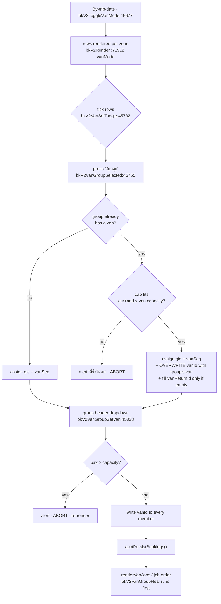

# 04 · Transfer Fleet, Vans & Pickup

> Scope: everything between "which hotel does the guest stand in front of" and "which van, with which driver, prints on which job order" — vehicles, pickup areas/times, van grouping, job orders, van check-in. Code: `allotment_v2.html` unless noted. Line numbers are as of **094dde1** and drift; grep the symbol name instead.

---

## 1. What this does & who uses it

The marine tours sell a *seat on a boat*, but almost every guest also needs a **road transfer**: a van collects them at their hotel in the morning, drives to the pier, and (usually) brings them back in the afternoon. This domain is the dispatcher's half of the product.

Five screens, one shared data spine:

- **Transfer Fleet** — the vehicle registry (own vans, rented vans, partner vans / "รถร่วม"), per-day status, and a month matrix that says *which van runs which program on which day*.
- **Pickup time setup** — the master data: pickup **areas** (Patong, Kata, Maikhao…), the **time groups** they share, and a per-season **schedule profile** holding `route × area → "07:30-07:45"`.
- **Booking → By-trip-date → Van Assign mode** — where the actual grouping happens. This lives in the Booking module (`bkV2Render`), not in a van-specific view, but every function it calls is documented here.
- **ใบงานรถ (Van Jobs)** — the printable/shareable driver sheet, one per van × program × day, with an outbound section and a return section.
- **เช็คอินรถ (Van Check-in)** — morning-of, the dispatcher ticks who actually boarded each van.

Users: the ops/dispatch desk (Thai-speaking), plus drivers who receive a printed or PNG job order. Almost every label on these screens is Thai; alerts and console logs are English per CLAUDE.md §1.

A guiding rule the code repeats in several comments: **the system never guesses a van** ("ห้ามเดา"). It will warn loudly that a booking has no van, or that a group has two vans, but it will not silently pick one — except in the one explicit, user-triggered `bkV2VanAutoAssign` button and the deliberately narrow `bkV2VanGroupHeal` safety net.

---

## 2. Entry points

| view id | sidebar label | render fn : line | purpose |
|---|---|---|---|
| `view-vehicles` (`allotment_v2.html:5072`) | `Transfer Fleet` (`:4235`) | `renderVehicles` `:55734` → host `#vehicles-host` | Vehicle registry + 4 tabs: `สถานะ` / `ตารางเดือน` / `ทะเบียน` / `รายวัน` (`:55746`) |
| `view-vanjobs` (`:5075`) | `ใบงานรถ (Van Jobs)` (`:4239`) | `renderVanJobs` `:46547` → host `#vanjobs-host` | Per-day list of van jobs; preview / full-screen / print / PNG of the job order |
| `view-vancheckin` (`:5076`) | `เช็คอินรถ` (`:4243`) | `renderVanCheckin` `:48205` → host `#vancheckin-host` | Morning boarding check-in per van group |
| `view-pickup-setup` (`:4960`) | `Pickup time setup` (in `LA_NAV`, `:416`) | `renderPickupSetup` `:40413` → host `#psu-host`, shell `psuRenderShell:40419` | Tabs: `📅 Schedule Profiles` / `📍 Pickup Areas` / `⏱ Time Matrix` / `🏨 ชื่อโรงแรมซ้ำ` (`:40509`) |
| `view-pickupmap` (`:5138`) | `แผนที่จุดรับ` (`:417`, SALES group) | `renderPickupMap` `:44792` → host `#pickupmap-wrap` | Leaflet dot-density map of pickup demand by area/market/agent |

The view dispatcher is a single `if/else` chain in `nav`/`showView` at `:6071–6092`. Area gating: all of `vehicles`, `vanjobs`, `vancheckin`, `pickup-setup` are area `operations`; `pickupmap` is area `sales` (`LA_VIEW_AREA` `:409`). Persist helpers in this domain all early-return when `laCanEditArea('operations')` is false.

The **real van-grouping UI is not one of these views** — it is Booking → tab `bytrip` with `_bkV2.vanAssignMode === true` (toggled by `bkV2ToggleVanMode:45677`). See §4.2.

---

## 3. The four "where" concepts

CLAUDE.md §3.3 flags this as a known trap. Four separately-stored notions of "where", with partial and *non-obvious* overlap.

### 3.1 Pier — where the boat leaves from

- **Stored on:** `route.pier` and `boat.pier`.
- **Enum (exact):** `'tublamu'`, `'panwa'`, planned `'ranong'`. Never `'visitpanwa'` or the display strings.
- **Read by:** the Pickup-Setup matrix pier filter (`_psuMatrixPier`, `:40405`), the job-order pier name (`vanJobsOrderInner:46839` → `'Visit Panwa Pier'` / `'Tub Lamu Pier'`), and — critically — `_vehRouteZone`.

### 3.2 Van zone (a.k.a. pickup zone) — which pool of vans / which price band

- **Values:** `'PK'` (Phuket), `'KL'` (Khao Lak), `'NoTransfer'` (aliased `'NT'` in many guards — always test both).
- **Stored on:** `trip.zone` (per trip), `bk.pickupZone` (booking fallback), `vehicle.zoneBase` + `vehicle.zoneOverrides[]` + `vehicle.dayZone[date]` (per vehicle).
- **Effective value for van ops** is `bkV2EffZone(b,t)` (`:46355`): the seat zone unless it is No-Transfer *and* the booking bought a private van add-on, in which case the van's zone wins. The comment at `:46353` is explicit: **this is for van ops only, never for seat pricing** — pricing stays on `t.zone`.
- **Effective value for a vehicle** is `vehEffectiveZone(v,date)` (`:46419`), resolved in this order: (1) if the van has a `dayRoute[date]`, the zone implied by that route's pier; (2) `dayZone[date]`; (3) a matching `zoneOverrides[]` range; (4) `zoneBase`.
- Zone labels/ordering/colors: `bkV2ZoneLabel:71715`, `bkV2ZoneOrder:71718`, `bkV2ZoneColor:71719`.
- A fifth pseudo-zone exists purely for grouping: `'__CHARTER__'` (`_bkV2InZone:45737`) so charter (เหมาลำ) van groups never collide with seat groups.

### 3.3 Rate-type zone — which seat price applies

Same three tokens `PK / KL / NoTransfer`, but a *different store*: `rateType.seatRates[route][zone][paxType]` (CLAUDE.md §3.2). Nothing in this domain writes it. The only coupling is `bkV2SetPickupArea:74925`, which copies the chosen **area's** zone onto `t.zone` — and deliberately **skips** trips that carry a private-van add-on (`:74940`), because pushing a No-Transfer seat onto a PK zone can land on a rate cell that does not exist ("no rate").

### 3.4 Pickup area — the actual named collection point

- **Store:** `SB_PICKUP_AREAS` (`:40173`), an array of `{ id, name, zone, region, timeGroup }`.
- **Booking field:** `bk.pickupAreaId` (booking-level, not per-trip). Drop-off counterpart: `bk.dropoffAreaId` with `bk.dropoffSame === false`.
- ~38 seeded areas: 33 `PK`, 2 `KL` placeholders, 2 `NoTransfer` pier entries (`nt-panwa-pier`, `nt-tublamu-pier`, both named "… (self-arrive)").
- `region` is a loose grouping label only (`'phuket-north'`, `'phang-nga'`, …) used for sort order in the marketing-card export (`psuGroupAreasByTime:41316`). It is **not** a zone.
- `timeGroup` is the join key to pickup times: several areas that leave at the same minute share one group (`pk-w2` = Patong + Karon + Kata). It is required on save (`psuSaveArea:41040`).

### 3.5 How they overlap — and the trap

```
route.pier ──(_vehRouteZone:55400)──▶ van zone  'panwa'→'PK'  'tublamu'→'KL'
area.zone  ──(bkV2SetPickupArea)────▶ trip.zone ─▶ rate-type zone lookup
                                             └──▶ bkV2EffZone ─▶ van pool / van grouping key
area.timeGroup ─▶ (legacy) SB_PICKUP_TIMES[route][timeGroup]
area.id        ─▶ (current) profile.times[route][areaId]
```

Two things bite here:

1. **`_vehRouteZone` maps Tub Lamu routes to `KL`, but Tub Lamu routes pick up from `PK` areas.** The seeded Similan schedule (`r5`, `:40259`) is all `pk-*` groups, yet `_vehRouteZone('r5')` returns `'KL'`. This only matters where the two are mixed: `bkV2VanAutoAssign:45708` computes `z=_vehRouteZone(routeId)` and, *if no van has been assigned to the program in the month matrix*, falls back to `vanVehiclesForZone(z,date)` — i.e. Khao Lak vans for a Phuket pickup run. The primary path (`dayVans`, `:45709`) avoids this entirely, and the manual per-group dropdown uses `vanVehiclesForRoute` which ignores the zone. **(inferred: latent; not observed as a live bug, but the fallback branch is reachable.)**
2. **Adding a real new zone touches ~5–6 places** and per CLAUDE.md §3.3 the decision (2026-06-01, Option A) is *not* to refactor to a central `SB_ZONES` yet. The Pickup Setup UI creates **Areas only** — the zone dropdown is hardcoded to `['PK','KL','NoTransfer']`.

---

## 4. Workflows

### 4.1 Set up a pickup area and its times

**Trigger:** ops adds a new hotel cluster (e.g. a new resort strip) or a new season's departure times land.

**Steps**

1. Sidebar → `Pickup time setup` → `nav()` → `renderPickupSetup:40413` → `psuRenderShell:40419`.
2. Tab `📍 Pickup Areas` → `psuRenderAreasTab:40920`. `+ Add` → `psuOpenAddArea:40998` seeds `_psuAreaDraft = {id:'', name:'', zone:'PK', region:'', timeGroup:'', isNew:true}`.
3. Fill name / zone / region / **time group** → `psuSetDraftField:41010` (only re-renders on `zone` so text inputs keep focus).
4. Save → `psuSaveArea:41035`. Id is slugged `${pk|kl|nt}-${name-slug}` and de-duplicated with a numeric suffix (`:41044–41049`).
5. `_psuInheritTimesForArea:41019` runs: for every profile × route, if this area has no time yet, copy one from a sibling in the same `timeGroup`; else fall back to the legacy `SB_PICKUP_TIMES[route][timeGroup]`. **Only fills empty cells, never overwrites.** A toast reports how many cells were filled.
6. Times are then edited on tab `⏱ Time Matrix` → `psuRenderMatrixTab:41131`, cell → `psuSetTimeCell:41284`.

**Data written**
- `SB_PICKUP_AREAS[]` — push or in-place field update.
- `SB_PICKUP_TIME_PROFILES[i].times[routeId][areaId] = 'HH:MM-HH:MM'`.
- Persisted by `psuPersist:40357` → read-modify-write of `loveandaman_v2` keys `sb_pickup_areas`, `sb_pickup_times`, `sb_pickup_time_profiles`.

**Validation/guards**
- Name required, time group required (`:41039–41040`).
- `psuPersist` no-ops if `laCanEditArea('operations')` is false.
- `psuSetTimeCell` aborts with a `console.warn` if there is no active profile and **does not re-render** (keeps the cursor in the cell).
- Delete (`psuDeleteArea:41070`) confirms and notes that existing bookings are unaffected — they snapshot area name + zone.

**Failure modes**
- Deleting an area leaves orphan `pickupAreaId`s on old bookings; `bkV2GetArea` returns `undefined` and downstream code falls back to `b.hotelName` / raw id. Not fatal, but the check-in and job-order "Area" column will read blank.
- An area with no `timeGroup` sibling and no legacy entry inherits nothing → the matrix cell stays blank → §5 resolution returns `null`.

### 4.2 Group bookings into a van (the core workflow)

**Trigger:** dispatcher opens Booking → `By trip date` for tomorrow and presses the Van-Assign toggle.



**Steps**

1. `bkV2ToggleVanMode:45677` sets `_bkV2.vanAssignMode = true` (and clears boat/reconfirm modes — they are mutually exclusive).
2. Rows are expanded into **allocations** by `_allocsOf` (`:72374`): a booking with `ops.vanSplits[]` becomes one row per split, keyed `bkId@index`; otherwise one row keyed `bkId`. Boat-splits take priority over van-splits when both exist (`:72380`).
3. Tick rows → `bkV2VanSelToggle:45732`. The stored value is the **tick order**, later used as the pickup sequence.
4. Press the group button → `bkV2VanGroupSelected(date, routeId, zone, groupId):45755`.
   - `groupId === 'new'` → `_bkV2VanNextGroup:45743` returns `max(vanGroup)+1` scanned across the whole **day + route, all zones and charter**. (It used to number per-zone, which produced duplicate "กรุ๊ป 2" badges in the top VANS strip — see the comment at `:45738`.)
   - Members are filtered to the same `date|routeId|zone` via `_bkV2InZone:45737`.
5. Header controls per group (`_grpHeaderRow`, `:72417` for the editable form, `:72426` for the read-only pill):
   - van dropdown → `bkV2VanGroupSetVan:45828`
   - group pickup time → `bkV2VanGroupSetTime:45837` (writes `ops.pickupTimeFinal` on every member; no re-render, to keep input focus)
   - return-van dropdown → `bkV2VanGroupSetReturn:45851`
   - inline driver/phone/plate → `vanJobsSetDriver` (same store the Van Jobs page edits — §4.3)
   - `✓ Save` → `bkV2VanGroupSave(date):45840` renumbers `vanSeq` by tick order, per group
   - `↻ เรียงตามเวลา` → `bkV2VanGroupClearSeq:45838`
   - `ยกเลิกกรุ๊ป` → `bkV2VanGroupDisband:45836`

**Data written** (all under the *per-day* ops block — see §6.2)

```
ops.vanGroup            : number   (0 / absent = ungrouped)
ops.vanSeq              : number   (manual pickup order inside the group)
ops.vanId               : string|null  (the OUTBOUND van)
ops.vanReturnId         : string|null  (per-booking; null = same van back)
ops.returnSameVan       : boolean  (dispatcher confirmed "↩ กลับคันเดิม")
ops.pickupTimeFinal     : string   (dispatcher's override, wins over trip.pickupTime)
ops.vanSplits[i].{vanGroup,vanSeq,vanId,vanReturnId,pax,ad,chd,inf,foc}
```

Persisted by `acctPersistBookings()` after every mutation.

**Validation/guards**
- **Capacity on join** (`:45766–45774`): if the target group already has a van, the incoming pax are summed and compared to `vehicle.capacity`; over → `alert('ที่นั่งไม่พอ · กรุ๊ป N …')` and abort.
- **Capacity on van select** (`bkV2VanGroupSetVan:45830`): same check, aborts and re-renders.
- **One van per group is enforced by overwrite**: `:45776` writes `s.vanId = _gVan` / `o.vanId = _gVan` unconditionally when the group has a van. The comment at `:45775` spells out why — otherwise the booking keeps its old van, the job order routes it to the wrong van, and the group header lies.
- **Return van is only inherited if empty** (`if(_gRet && !s.vanReturnId)`), because it is per-booking by design.
- **A van already used by another group is disabled** in the dropdown (`usedByOthers`, `:72462`) — 1 รถ = 1 กรุ๊ป.
- The van dropdown pool is `vanVehiclesForRoute(date, routeId, zone):46426` = **only vans assigned to this route in the Transfer-Fleet month matrix**, with no zone fallback (comment at `:46424`: "a van not assigned in the month matrix must NOT be pickable here"). The return-van pool is deliberately wider — matrix vans plus any usable van in the zone (`:72472`).

**Failure modes**
- A group with no van renders with a red frame and `⚠ ยังไม่เลือกรถ` (`:72477–72479`).
- Two different vans inside one group → "รถปนกัน" (§4.8).
- Editing the booking wipes `ops` unless `bkV2CommitBooking`'s `if(editing)` block carries it over — CLAUDE.md §3.4 / §6. `ops` is first in that list precisely because losing it loses the van assignment.

### 4.3 Assign a driver / phone / plate for one day

**Trigger:** partner vans (`รถร่วม`) send a different driver and often a different plate every day.

**Steps**
1. Van Jobs page → expand a row (`vanJobsToggleExpand:46531`) → panel at `:46646`, **or** the same three inputs inline on the By-trip group header (`:72485`).
2. `vanJobsSetDriver(date, vanId, field, el):46539` writes and persists on every keystroke; **it does not re-render** (focus preservation).
3. `↺ คืนค่าตั้งต้น` → `vanJobsResetDriver:46540` deletes the whole key and re-renders.

**Data written**
- `VANJOB_DRIVER['YYYY-MM-DD::vanId'] = { driver?, phone?, plate? }` (`:46535`).
- Persisted by `vanJobsDriverPersist:46537` → `loveandaman_v2.vanjob_driver`.

**Resolution:** `vanJobsDriverInfo(vanId, date):46538` returns `{driver, phone, plate, override, plateOverride}` — the per-date override if non-blank, else `vehicle.driver` / `vehicle.driverPhone` / `vehicle.plate`. A 📌 pin glyph marks an override wherever the value is shown.

**Guards / failure modes**
- The plate input only appears for `ownership === 'partner'` (`:46651`).
- Persist is a no-op without `operations` edit rights, so a view-only user types into an input that silently never saves. *(inferred from the guard; there is no UI feedback.)*
- The key is `date::vanId` with **no route component**, so a van running two programs on one day shares one driver record. That is intentional (one van, one driver, one day).

### 4.4 Self-arrive (ขารับ: ลูกค้ามาเองที่ท่าเรือ)

**Trigger:** the guest makes their own way to the pier; the seat rate is unchanged.

Two independent ways a booking becomes self-arrive on the outbound leg:
- an explicit checkbox `bk.pickupSelf` (`:69630`, toggled by `bkV2TogglePickupSelf` → `:74960`); or
- the effective zone is `NoTransfer` / `NT` (i.e. a No-Transfer seat with no private-van add-on), or the pickup **area** is one of the `nt-*` pier entries.

**Effects**
| Place | Behaviour | Line |
|---|---|---|
| Job order OUTBOUND section | row skipped entirely | `46809` |
| Van Jobs aggregation | not counted as an assigned van job, **and not counted as unassigned** | `46574–46576` |
| Van Jobs late-booking guard | excluded | `46958` |
| Van Check-in | never lands in `unassigned` | `48223` |
| By-trip van cell | renders the italic string `self-arrive` | `55174` |
| Pickup-time heal | `bkV2HealSelfArrivePickup:46361` rewrites a stale clock time (`07:30-07:45`) back to the area default (`Before 08:30 at pier`) and clears `ops.pickupTimeFinal` | `46372–46376` |

**Mis-tick guard:** `renderVanJobs:46577` collects `selfWarn[]` — bookings ticked self-arrive that *still* sit on a transfer zone or *still* carry a van. These are surfaced on the page because they would otherwise silently vanish from the outbound sheet.

**Self-return** is the mirror on the way back and is computed, not stored: `bkV2RetInfo(bk,date):45695` sets `selfRet = true` when the booking has a separate drop-off (`dropoffSame === false`) whose area is `NoTransfer`/`NT`, **or** whose name matches `/self-?arrive|กลับเอง|self[\s-]?return/i`. A `selfRet` booking is dropped from the return job order (`:46808`) and never raises the "ยังไม่จัดรถกลับ" alert.

### 4.5 Split a booking across two vans (✂ แยกคน)

**Trigger:** a 16-pax booking will not fit in one 9-seat van, or one couple is picked up somewhere else.

**Steps**
1. Row action → `bkV2VanSplit(bkId, date):45857`. The pool is the first split's breakdown if already split, else the largest trip's `{ad,chd,inf,foc}`.
2. Modal `bkV2SplitRender:45902` lets the dispatcher set each pax type individually (`bkV2SplitSet:45875`, `bkV2SplitAll:45880`). This replaced an older `prompt()` that only asked "how many", after which the system guessed who was a child — and guessed wrong.
3. Apply → `bkV2SplitApply:45881`.

**Data written**
- First split ever: `ops.vanSplits = [ {…keep, pax, vanGroup, vanId, vanReturnId}, {…moved, pax, vanGroup:0, vanId:null, vanReturnId:null} ]`, then `delete ops.vanGroup; delete ops.vanId` — the "main" allocation now lives in `vanSplits[0]` (`:45894–45896`).
- Subsequent splits: `vanSplits[0]` is decremented and a new element pushed (`:45889–45892`).
- Undo: `bkV2VanUnsplit:45956` folds `vanSplits[0]`'s van fields back to flat `ops.*` and deletes `vanSplits` + `altSplitAuto`.

**Validation/guards**
- Cannot split a 1-pax allocation (`bkPaxSum(pool) < 2` → toast `แยกไม่ได้`, `:45866`).
- Must leave ≥ 1 pax behind (`n >= 1 && n < tot`, `:45886` / `:45910`).
- Warns (does not block) if either side ends up with children/infants and **no adult** (`strand`, `:45908`).
- `pax` (headcount) and the `ad/chd/inf/foc` breakdown are always written together (`:45891`) — a past bug let them drift, which made the job sheet print a child as an adult.

**Auto-splits from multi-point pickup (`bk.altPickups`)** are a separate producer of `vanSplits`: `bkV2SyncAltPickupSplits:46258` rebuilds them (marking each with `fromAlt`, `pickAreaId`, `pickHotel`, `pickZone`, `altWho`) and **leaves manual splits alone** (`:46268`). Because the `altSplitAuto` flag is a scalar that the relational backend does not map, auto-ness is re-detected from the surviving split markers by `_bkV2IsAltAutoSplit:46295`.

**Failure modes**
- `bkV2HealSplitPax:46304` repairs splits whose headcount and breakdown disagree, trusting the headcount and re-dealing types (adults to the split-off parts first), then swapping 1:1 so no van carries children without an adult. Called from `bkV2HealAltSplits:46381` on every Van-Jobs render.

### 4.6 Disband a group

**Trigger:** the plan changed; the group should go back to unassigned.

`bkV2VanGroupDisband(date, routeId, zone, gid):45836` — one line, but the comment on it records two separate bugs:

```js
if(s){ s.vanGroup=0; s.vanId=null; s.vanReturnId=null; delete s.vanSeq; }
else  { delete o.vanGroup; delete o.vanSeq; o.vanId=null; o.vanReturnId=null; }
```

- It **must** null `vanId` *and* `vanReturnId`. The non-split branch used to leave them set, so a disbanded booking still shipped on the old van's job order and re-grouping it elsewhere produced "รถปนกัน".
- It **must** delete `vanSeq`, or a stale manual pickup order freezes the row's position after re-grouping.

Then `acctPersistBookings()` + `bkV2Render()`.

### 4.7 Arrange the return leg

**Trigger:** the guest is being dropped somewhere other than where they were collected (hotel change, airport, a different beach).

**Model:** *the group has one outbound van; the return van is per booking.* There is no group-level return assignment stored — `bkV2VanGroupSetReturn:45851` is a convenience that writes the same value onto every member, and `bkV2VanGroupHeal` is explicitly forbidden from spreading it (§9).

**State machine** — `bkV2RetInfo(bk, date):45695` returns:

| field | meaning |
|---|---|
| `sep` | `bk.dropoffSame === false` and some drop-off is named |
| `drop` | the drop-off text |
| `retId` | `ops.vanReturnId` (or the first split's) |
| `arranged` | a return van is set (for splits: **all** splits have one) |
| `selfRet` | drop-off is a self-arrive pier / matches the self-return regex |
| `sameVan` | `ops.returnSameVan` — dispatcher pressed `↩ กลับคันเดิม` |
| `alert` | `sep && !arranged && !selfRet && !sameVan` |

**Actions**
- `bkV2AssignVanReturn(bkId, vanId, date):45690` — picks a different return van; also clears `returnSameVan`.
- `bkV2SetReturnSameVan(bkId, val, date):45692` — confirms the outbound van brings them back to the new place; clears `vanReturnId`. Mutually exclusive with the above.
- `bkV2AssignVanReturnSplit(bkId, ai, vanId, date):55171` — per-split variant.

**Where it surfaces**
- Van Jobs hero banner: amber `↩ ยังไม่จัดรถกลับ` with a per-route breakdown (`:46578–46598`).
- By-trip header warn-chip `รถกลับ · …` (`:72089`).
- Job order: the return section is collected with `rv = ops.vanReturnId || ops.vanId` (`:46818–46819`) — i.e. **the outbound van is the default return van**. Rows that arrived on a different van are sorted last and tagged `· มาจากรถอื่น (ขาไป X)`; rows on the same van are tagged `· กลับคันเดิม` (`:46879`).

**Overnight (OVN) special cases** — these were real dispatch failures:
- On an OVN **return day** the guest arrives by boat, so there is no hotel pickup: the leg is forced to `NoTransfer` (`:46567`), the pickup cell prints the pier name, and the row is excluded from the outbound section (`:46816`).
- On an OVN **outbound day** there is no return run at all (`:46812`), and the drop-off cell prints `🌙 ค้างคืนบนเกาะ · กลับ <date>` (`:46883`).

### 4.8 Detect and resolve "รถปนกัน" (mixed van in one group)

**Trigger:** every render — this is a passive scan, not a user action.

`bkV2VanGroupConflicts(date):45799` buckets every non-cancelled allocation by `date|routeId|zone|gid` (skipping `NoTransfer`/`NT`), counts distinct `vanId`s, and returns every bucket with **2 or more**:

```js
[{ date, routeId, zone, gid, routeName, vans:{vanId:count}, pax }]
```

The header comment (`:45795–45798`) is the design statement: this *should* be impossible now that `bkV2VanGroupSelected` and `bkV2VanGroupSetVan` always write the group's van, but every group is re-scanned on every render as a safety net for legacy data and future code paths — and **there is deliberately no auto-pick** ("per user: ห้ามเดา"). Resolution is manual: re-select the group's van.

**Surfaces**
| Where | Line |
|---|---|
| By-trip sticky header chip `รถปนกัน · …` (purple `#7A1FA2`), click → enter Van mode | `72081`, `72090` |
| Per-group chip in the group header, listing the conflicting van names | `72422–72424`, `72480` |
| Printed job order banner `⚠ รถปนกันในกรุ๊ป — บาง booking ถูกจัดไปคนละคัน ใบงานนี้อาจไม่ครบ/ผิดคัน`, filtered to conflicts involving *this* van | `46967–46969` |

**Related but distinct:** `bkV2VanGroupHeal(date):45782` fixes the *opposite* problem — a member with **no** van in a group where someone has one. It is idempotent, scoped to one date, and heals `vanId` only (§9).

### 4.9 Print / send the van job order

**Trigger:** the plan is final; drivers need paper or a LINE image.

**Steps**
1. `renderVanJobs:46547` runs three heals first (`bkV2HealOvnLegs`, `bkV2HealAltSplits`, `bkV2VanGroupHeal`, `:46552–46554`), then aggregates.
2. A "job" is keyed **`vanId~routeId`** (`_addTo`, `:46572`) — a van running two programs in a day prints two separate sheets.
3. Row click → drawer preview `vanJobsOpenPreview:46520`; drag-resize `vjResizeStart:46511`, auto-fit `vjFit:46479`, zoom `vanJobsSetZoom:46522`, full-screen `vanJobsOpenFull:46528`.
4. Print → `bkV2VanJobOrder(date, vanId, routeId, leg):55138` opens a popup with `vanJobsOrderCss(false)` + `vanJobsOrderInner(...)` and auto-`print()`.
5. PNG → `vanJobsSaveImage:55150` lazy-loads html2canvas from a CDN and renders offscreen at scale 2. **Needs network.**
6. `ส่งคนขับ` toggle → `vanJobsToggleSent:46453` stamps `VANJOB_SENT['date::vanId~routeId'] = ISO`, preserving `window.scrollY` across the re-render.

**Sheet content** (`vanJobsOrderInner:46797`)
- Header wears the van's identity colour (`vehColor:39362` / `vjShade:39355`).
- Two tables with shared `<colgroup>` widths (`:46826`) so outbound and return align.
- Row sort (`:46821–46823`): return rows that came from another van go last; then manual `vanSeq`; then pickup time.
- Per-row: pickup location (+ user-typed Thai label from `VANJOB_PICKUP_TH`), area with Thai name from `VANJOB_AREA_TH:46758`, `AD/CHD/INF/FOC` breakdown, special request, drop-off.
- **Return rows show the drop-off area's zone, not the pickup's** (`_dropAreaObj`, `:46850`) — a real bug fix: a Patong→Chalong return used to print "Patong".
- Late-booking guard banner: any booking on this van's route(s) that day with no van at all, excluding rows already on this sheet (`:46953–46965`).

**Editable-per-sheet overrides**, all keyed independently of the booking record:
| Store | Key | Fallback | Persist |
|---|---|---|---|
| `VANJOB_DRIVER` `:46535` | `date::vanId` | vehicle registry | `:46537` |
| `VANJOB_PICKUP_TH` `:46433` | pickup location **name** (global, reused everywhere) | none | `:46435` |
| `VANJOB_SREQ` `:46440` | `bookingId` | `vanJobsSreqAuto` = `bk.notes` | `:46442` |
| `VANJOB_SENT` `:46449` | `date::vanId~routeId` | — | `:46451` |

`VANJOB_SREQ` stores `''` deliberately — an empty override means "deleted from the sheet", distinct from "no override" (`vanJobsSreqFinal:46444` tests `b.id in VANJOB_SREQ`).

### 4.10 Van check-in (เช็คอินรถ)

**Trigger:** the morning of travel, as each van loads.

**Steps**
1. `renderVanCheckin:48205` runs `bkV2VanGroupHeal(date)` and `bkV2HealSelfArrivePickup(date)` first (`:48208–48209`).
2. Bookings are bucketed by `vanId~routeId` (`:48222`); OVN return legs are excluded (they are drop-offs, not pickups, `:48215`); a transfer-zone booking with no van and not `pickupSelf` lands in `unassigned` (`:48223`).
3. Group headers are ordered by zone (`bkV2ZoneOrder`) then route name then van id, and show the group number, van pill, plate/driver/phone from `vanJobsDriverInfo`.
4. Per row: `−/+` headcount (`ckStep:47741`), `No-show` / `CXL` event buttons (`ckEventOpen:47526`), and the ✓ check-in toggle (`ckToggle:47755`).

**Data written**
- `ops.vanCheckin = { actualPax, noShow, expected, at, by, events[], reasonCode, reasonNote, reasonAt }`, written through `ckWrite:47239` which merges forward the pier-stage keys `CK_STAGE_KEYS:47238` so `+/−` never drops them.
- The pier equivalent is `ops.pierCheckin` (different screen, same helpers).

**Validation/guards**
- `ckGuard()` on every mutation.
- Headcount clamped to `[0, cap]` where `cap = ckCap(...)`.
- Reducing the count with no reason immediately opens the reason modal (`:47753`).
- Toggling ✓ again un-checks but keeps the counted values (`:47762`).

**Failure modes**
- `bkOpsClear:45407` deletes `vanCheckin`/`pierCheckin` when a day's assignment is wiped, and `bkV2CommitBooking` does the same on a reschedule (`:77578`, `:77587`) — otherwise the new date inherits yesterday's "boarded / no-show" and the Travel Summary totals are wrong.

### 4.11 Manage the vehicle registry & the month matrix

**Trigger:** a new partner van joins; a van goes in for service; the weekly program plan changes.

**Steps**
1. `renderVehicles:55734`, tab `ทะเบียน` → `vehFormOpen:55514` → `vehFormSave:55525` (or the quick `vehAdd:55493`).
2. Tab `ตารางเดือน` — click a day cell → `vehDayCellClick:55413` cycles the day's program; two or more programs open the popup `vehDayPopup:55353` (`vehDayToggleRoute:55410`).
3. Day status: `vehStatusCycleDay:55457` cycles `'' → available → maintenance → off`; longer ranges via `vehStatusOpen:55463` → `statusRanges[]`.
4. Zone swap ranges: `vehZoneOpen:55600` → `zoneOverrides[] = [{zone, from, to}]`.

**Data written** — `SB_VEHICLES[]` (`:39331`), persisted by `sbVehiclesPersist:39340` → `loveandaman_v2.sb_vehicles`.

```
{ id, name, plate, type:'sedan'|'van'|'minibus'|'bus', capacity,
  ownership:'own'|'partner'|'rented', partnerName, zoneBase:'PK'|'KL',
  driver, driverPhone, active, note, color?,
  dayRoute:{ 'YYYY-MM-DD': routeId | routeId[] },
  dayZone:{ date: 'PK'|'KL' },
  dayStatus:{ date: 'available'|'maintenance'|'off' },
  statusRanges:[{s,from,to,note}], zoneOverrides:[{zone,from,to}],
  log:[{at,kind,text}]  // capped at 100, kind: created|status|zone|driver|edit
}
```

**Validation/guards**
- Every mutator is wrapped in `laGuardEdit('operations')`; `vehSetField` re-renders to revert the control for a view-only user (`:55500`).
- Name required on save (`:55527`).
- `vehAdd` appends a 3-char random suffix to the id for multi-user uniqueness (`:55496`); `vehFormSave`'s create path does **not** (`:55538`) — *(inferred: a concurrent-add id collision is possible via the form path.)*
- `ownership !== 'partner'` forces `partnerName = ''`.

**Failure modes**
- `v.color` needs a matching `sb_vehicles.color` column server-side or it is silently dropped on the next SQL round-trip (comment at `:39347`).
- `_vehUsableOn:46421` excludes `off`/`maintenance` vans from every pool — a van marked in service disappears from the group dropdowns for that day, but any group already holding it keeps it.
- `ownership:'rented'` is counted in the header KPIs (`:55751`) and in `vehBuildGrouped:55641`, but `vanJobsOwnerGroup:46543` collapses everything non-partner to `'company'`, so the Van-Jobs owner filter has only two buckets.

---

## 5. Pickup time resolution

Given a booking, resolving "what time does the van come" is a **five-step fallback**, and three of the steps live in different modules.

### 5.1 Hotel → area

There is **no automatic hotel→area mapping**. `bk.hotelName` is free text; `bk.pickupAreaId` is chosen by a human in the booking form. The only machinery around hotel names is de-duplication: `psuHotelGroups:40534` clusters near-identical spellings with `bkV2HotelKey:76124` + `bkV2HotelSim:76135` under a union-find at threshold `_psuHotelMin` (default `0.82`), **refusing to merge names that have been seen in different pickup areas** unless `psuToggleHotelXArea` is on (`sameArea`, `:40555`). `psuHotelMerge:40584` then rewrites `hotelName`/`pickup` on the affected bookings and appends a history entry. It is irreversible and says so in the confirm.

### 5.2 Area → default time (`bkV2GetPickupTime:40338`)

```
bkV2GetPickupTime(routeId, areaId, dateStr)
 ├─ area = bkV2GetArea(areaId)                      :40321   → null if unknown → return null
 ├─ prof = psuResolveProfile(dateStr)               :40326
 │    profiles whose [from,to] contains dateStr
 │    tiebreak: NARROWER range wins, then newer createdAt
 ├─ 1. prof.times[routeId][areaId]                  ← current schema
 ├─ 2. prof.times[routeId][area.timeGroup]          ← legacy key inside a profile
 ├─ 3. SB_PICKUP_TIMES[routeId][area.timeGroup]     ← legacy flat matrix
 └─ 4. null
```

Values are free text — usually `'07:30-07:45'`, but the pier rows carry prose like `'Before 08:30 at pier'`. Code that must tell the two apart uses the `_isClock` predicate at `:46363` (`/\d{1,2}[:.]\d{2}/` **and not** `/pier/i`).

### 5.3 Default → the booking's stored time

`bk.trips[i].pickupTime` is snapshotted at booking time, not looked up at read time:
- `bkV2SetPickupArea:74925` refills every trip's `pickupTime`, **skipping trips flagged `pickupTimeEdited`**;
- route change → `:73985`; date change → `:75027`; commit → `:76764`.

### 5.4 Stored → dispatcher's final word

`ops.pickupTimeFinal` (per day) overrides everything, set by `bkV2SetPickupFinal:46405` (one row) or `bkV2VanGroupSetTime:45837` (whole group).

### 5.5 The read expression

Every consumer uses the same three-term chain:

```js
ops.pickupTimeFinal || trip.pickupTime || bk.pickupTime || ''
```

Job order `_ptime:46804` · check-in `:48131` · By-trip `_rowTime:72368` · daily report `:53494` · voucher `:77934`.

### 5.6 The self-arrive normaliser

`bkV2HealSelfArrivePickup(date):46361` runs on every Van-Check-in render. For a self-arrive trip whose `pickupTime` is a real clock time, it rewrites it to the area default and clears `ops.pickupTimeFinal`. Idempotent and targeted: it never touches an already-correct `"… at pier"` string and never touches `hotelName`.

### 5.7 Worked example

Booking with `pickupAreaId:'pk-patong'`, trip `{routeId:'r5', date:'2026-08-20'}`:

1. `bkV2GetArea('pk-patong')` → `{zone:'PK', region:'phuket-west', timeGroup:'pk-w2'}`.
2. `psuResolveProfile('2026-08-20')` → `prof-default-2026` (`2026-01-01 → 2026-12-31`).
3. `prof.times['r5']['pk-patong']` → the migration at `:40315` expanded `SB_PICKUP_TIMES.r5['pk-w2'] = '06:00-06:15'` to every member of `pk-w2`, so this hits → **`06:00-06:15`**.
4. Written to `trip.pickupTime` at booking time.
5. Dispatcher sets the whole group to `05:55` → `ops.pickupTimeFinal = '05:55'` → the job order prints `05:55`.

---

## 6. Data model touched

### 6.1 Standalone stores

| Variable | Line | Blob key | Persist fn | Shape |
|---|---|---|---|---|
| `SB_VEHICLES` | `39331` | `sb_vehicles` | `sbVehiclesPersist:39340` | array, see §4.11 |
| `SB_PICKUP_AREAS` | `40173` | `sb_pickup_areas` | `psuPersist:40357` | `[{id,name,zone,region,timeGroup}]` |
| `SB_PICKUP_TIMES` | `40225` | `sb_pickup_times` | `psuPersist` | `{routeId:{timeGroup:'HH:MM-HH:MM'}}` — **legacy**, read-only fallback |
| `SB_PICKUP_TIME_PROFILES` | `40279` | `sb_pickup_time_profiles` | `psuPersist` | `[{id,name,from,to,notes,clonedFrom,times:{routeId:{areaId:str}},createdAt}]` |
| `VANJOB_DRIVER` | `46535` | `vanjob_driver` | `:46537` | `{'date::vanId':{driver,phone,plate}}` |
| `VANJOB_PICKUP_TH` | `46433` | `vanjob_pickup_th` | `:46435` | `{pickupName: thaiLabel}` |
| `VANJOB_SREQ` | `46440` | `vanjob_sreq` | `:46442` | `{bookingId: text}` (`''` = deleted) |
| `VANJOB_SENT` | `46449` | `vanjob_sent` | `:46451` | `{'date::vanId~routeId': ISO}` |

Constants: `VANJOB_AREA_TH:46758` (English area name → Thai), `PHUKET_LL:44131` (area name → `[lat,lng]`, pickup map only), `VEH_COLORS:39348`, `VEH_ST_LBL:55456`, `PAX_K/PAX_LBL:45968–45969`.

### 6.2 Booking-side fields (`SB_BOOKINGS`)

Booking level: `pickupAreaId`, `pickupZone`, `pickupSelf`, `hotelName` / `pickup` / `pickupArea`, `roomNumber`, `dropoffSame`, `dropoffAreaId`, `dropoffHotelName` / `dropoffArea`, `altPickups[]`, `notes`.

Trip level: `trip.zone`, `trip.pickupTime`, `trip.pickupTimeEdited`, `trip.ovnLeg`, `trip.ovn`, `trip.ovnReturnDate`, `trip.ops` (day 2+).

**Ops block — the per-day accessor triple.** This is the single most important thing to get right:

| fn | line | behaviour |
|---|---|---|
| `bkIsFirstDay(b,date)` | `45387` | no date, single-day booking, or `date === trips[0].date` |
| `bkOpsRead(b,date)` | `45392` | read-only; returns `b.ops` on day 1, else `trip.ops`, else `{}` — safe in a render loop, **never creates** |
| `bkOpsFor(b,date)` | `45399` | read-write; creates the block on demand |
| `bkOpsDate(b,date)` | `45421` | `date || trips[0].date` — dispatch screens always pass the date |
| `bkOpsClear(b,date,opts)` | `45407` | wipes one day's `boatId`/`vanId`/`vanReturnId`/`returnSameVan`/`vanGroup`/`vanSeq`/`vanSplits`/`pickupTimeFinal` + both check-ins |

Every van function in this domain was retrofitted to this triple. The `§per-trip ops` comments (`:45810–45815`, `:45785`, `:45839`, `:46804`, `:46960`) all record the same class of bug: overnight (OVN) bookings wrote day 2's van into day 1's `ops`, so day 2 read back as "ยังไม่จัด" forever, and heal functions overwrote day 2 with day 1's van every time a job order was opened.

Ops fields owned by this domain: `vanId`, `vanReturnId`, `returnSameVan`, `vanGroup`, `vanSeq`, `vanSplits[]`, `altSplitAuto`, `pickupTimeFinal`, `vanCheckin`. (`boatId`, `boatSplits`, `pierCheckin`, `reconfirm` are neighbours.)

---

## 7. Persistence path

Per CLAUDE.md §2, `localStorage` here is a **RAM shim** over the `loveandaman_v2` key; only tiny UI keys hit real disk.

```
mutator (psuSaveArea / vehFormSave / vanJobsSetDriver / bkV2VanGroupSetVan …)
  → mutate the in-memory array/map
  → <store>Persist()            // read-modify-write of loveandaman_v2, one key only
  → setItem shim → _mem, debounced
  → computeDiff(BASE, cur)
  → laDiffToOps:167             // per-record put/patch/del against REST_RESOURCES
  → POST /api/v1/_batch         // one transaction; falls back to /api/save on drift or 400/404
```

Notes specific to this domain:

- **Booking-side van data does not go through a van persist fn.** It rides `acctPersistBookings()` on `SB_BOOKINGS`, so `ops.vanSplits` reaches SQL as the `ops_vansplits` JSON column (comment at `:46294`). Extra keys inside a split (`ad/chd/inf/foc`, `pickAreaId`, `altWho`) ride along for free.
- **`ops.altSplitAuto` is a scalar that is NOT mapped** — it is lost on every round-trip, which is why `_bkV2IsAltAutoSplit:46295` re-derives it from the split markers.
- **`v.color` needs a `sb_vehicles.color` column** or it is dropped (`:39347`). Any new persisted field needs a mapper/REST-index entry — CLAUDE.md §4.
- Every persist fn in this domain begins with `if(!laCanEditArea('operations')) return;` — a view-only session mutates RAM but never saves. There is no toast for this.
- **Load conditions.** `_laReloadData:41535` re-reads all of these on a server refresh: `sb_vehicles` `:41547`, `sb_pickup_areas` `:41557`, `sb_pickup_times` `:41558`, `sb_pickup_time_profiles` `:41559`, and the four `vanjob_*` maps `:41583–41586`. A key persisted but not listed there vanishes on refresh — CLAUDE.md §2.
- `_psuRestore:40369` also runs a one-time idempotent migration on load: any profile still keyed by `timeGroup` is expanded to per-area keys via `_psuExpandTimesToAreas:40283`, logged and re-persisted.
- Note the array-length guards: `sb_pickup_areas` and `sb_pickup_time_profiles` are restored only `if(Array.isArray(...) && .length)`, so an intentionally emptied list falls back to the seed. `sb_vehicles` has no length guard, so an empty vehicle list stays empty.

---

## 8. Cross-module contracts

### 8.1 In — from Booking

The booking form owns everything the dispatcher reads:

| Written by | Field | Consumed here |
|---|---|---|
| `bkV2SetPickupArea:74925` | `bk.pickupAreaId`, `trip.zone`, `trip.pickupTime`, `d.pickupZoneFilter` | area name, zone bucket, default time |
| `bkV2SetDropoffArea:74947` + `dropoffSame` | `bk.dropoffAreaId`, `bk.dropoffHotelName` | `bkV2RetInfo`, return-leg zone column |
| `bkV2TogglePickupSelf:74960` | `bk.pickupSelf` | outbound exclusion |
| add-on `transfer-<route>-<zone>-<vehicle>` | parsed by `bkV2TripPrivateVan:46345` | keeps a No-Transfer *seat* in the van pool via `bkV2EffZone` |
| booking form | `bk.altPickups[]` | auto `vanSplits` |
| `bk.notes` | | job-order Special Request default |

**The contract that breaks most often:** `bkV2CommitBooking` rebuilds a fresh booking object on edit. Its `if(editing)` block must carry `ops` across (CLAUDE.md §3.4). Miss it and every van assignment, group number, pickup sequence, return van and check-in for that booking is wiped on the next save.

### 8.2 Out — to Boat Operations

Van and boat are assigned **independently**, both onto the same per-day `ops` block:
- Van Assign mode writes `ops.vanId`; Boat Assign mode writes `ops.boatId` / `ops.boatSplits`. The two modes are mutually exclusive in the UI (`:45676–45677`).
- Nothing links a van to a boat directly. `pckVanBoatSplit(vanId, date):47279` closes that gap for the dispatcher: it reports `[{bid, pax, n}]` — which boats this van's passengers are going onto — and renders as boat chips on the group header with a `⚠ แยกลง N ลำ` warning when there is more than one (`:72448–72454`). The comment at `:47275` records why: "คนขับกับไกด์ไปเจอกันงงหน้าท่า".
- `renderVehicles`' month matrix is the *upstream* of boat ops in one direction only: `v.dayRoute[date]` decides which vans may be picked for a program, and `_vehRouteDemand:55405` shows how many pax on that program need a transfer.

### 8.3 Out — to check-in, Travel Summary, Daily Report

`ops.vanCheckin` (this domain) and `ops.pierCheckin` (pier check-in) are both read by Travel Summary (`:51535`, `:51597`) to decide charge/no-charge, and by the By-trip page for the No-show badge. `ckLostByType:47123` walks both.

### 8.4 Out — to the pickup map and Demand

`renderPickupMap` and `mdTabAgents` (`:44054`) both aggregate `bk.pickupAreaId` → `bkV2GetArea(...).name`. The map additionally needs the name to exist in the hardcoded `PHUKET_LL` table (`:44131`), normalised by `pmNormArea:44162` (strips `(self-arrive)`, `(beach)`, leading `Visit `). Areas without coordinates fall into an "other" bucket — so **adding a pickup area does not put it on the map**; `PHUKET_LL` must be edited too.

---

## 9. Invariants & gotchas

**A van group is ONE outbound van.**
`bkV2VanGroupSelected:45776` overwrites each incoming member's `vanId` with the group's van. `bkV2VanGroupSetVan:45834` writes it to every member. `bkV2VanGroupConflicts:45799` scans for violations on every render. The failure mode when this slips is precise and nasty: the group header shows van A, the job order for van B silently carries the booking, and nobody notices until a guest is standing in a lobby.

**The return van is per booking.**
`vanReturnId` lives on the booking/split, not the group. `bkV2VanGroupSetReturn` is a bulk convenience, `bkV2VanGroupSelected` fills it only when empty, and empty means "returns on the outbound van" — which is exactly how the job order reads it (`rv = vanReturnId || vanId`, `:46818`).

**Heal must NOT spread `vanReturnId`.**
`bkV2VanGroupHeal:45791` heals `vanId` only. The inline comment: *"heal ONLY the outbound van (ป้องกันตกบุคกิ้ง) · vanReturnId เป็น per-booking (ว่าง = กลับคันเดิม) → ไม่กระจายทั้งกรุ๊ป"*. Spreading it would silently arrange return vans nobody asked for.

**Never auto-pick a van ("ห้ามเดา").**
Conflicts are surfaced, not resolved. The only automatic assignment is `bkV2VanAutoAssign:45705`, which is an explicit button, and the heal, which only propagates a van a human already chose. This matches CLAUDE.md §4 ("keep data fixes user-triggered").

**Always read/write ops through `bkOpsRead`/`bkOpsFor` with an explicit date.**
Touching `b.ops` directly is correct only for single-day bookings. Every OVN bug in this domain traces back to a direct `b.ops` access.

**Disband must clear `vanId`, `vanReturnId` and `vanSeq`.** See §4.6.

**Cancelled statuses are excluded everywhere.**
`['cancelled','rejected','cancelled_weather']` — check `renderVanJobs:46560`, `vanJobsBookingsFor:46457`, `bkV2VanGroupHeal:45783`, `bkV2VanGroupConflicts:45800`, `vehJobsFor:55631`, `renderVanCheckin:48213`.

**Always test `'NoTransfer' || 'NT'`.** Both spellings are live across the codebase.

**Save-on-input, never re-render.** `vanJobsSetDriver`, `vanJobsSetPickupTh`, `vanJobsSetSreq`, `bkV2VanGroupSetTime`, `bkV2SetPickupFinal`, `psuSetTimeCell` all persist without re-rendering, because re-rendering the mount blows the caret out of the input (CLAUDE.md §6, scroll-jump). Where a re-render is unavoidable (`vanJobsToggleSent:46453`) the code saves and restores `window.scrollY`.

**`esc` is not global.** Every render fn here declares its own (`renderVanJobs:46549`, `renderVehicles:55736`, `psuRenderProfileModal:40843`, …). A new top-level fn that forgets this throws silently on click.

**Dates.** Use `bkV2LocalYMD(dt)`, never `toISOString().slice(0,10)`. `_vanJobsDate`, `_vanCkDate`, `_vehDate` and all the `*DateShift` helpers do; `psuResolveProfile:40327` and `psuOpenCloneProfile:40763` still use `toISOString()`. *(inferred: `psuResolveProfile`'s default-to-today can pick the previous day between 00:00 and 07:00 ICT; the callers that matter pass an explicit date.)*

**Job orders need network.** PNG export lazy-loads html2canvas from a CDN (`_vjEnsureH2C:55149`); the pickup map lazy-loads Leaflet + Carto tiles.

**Profile overlap is a warning, not a block.** `psuSaveProfile:40796` confirms and lets you continue; `psuResolveProfile` then resolves narrower-range-wins, then newer-`createdAt`-wins. The confirm text says "more recently-created profile", which understates the narrower-range rule.

**Deleting an area or a profile does not touch bookings** — both confirm dialogs say so, and it is true: bookings snapshot the time onto `trip.pickupTime`.

---

## 10. Function index

| function | line | purpose |
|---|---|---|
| `renderVehicles` | 55734 | Transfer Fleet page; 4 tabs (สถานะ / ตารางเดือน / ทะเบียน / รายวัน) |
| `renderVanJobs` | 46547 | Van job orders page: aggregate `vanId~routeId` jobs for a day |
| `renderVanCheckin` | 48205 | Van boarding check-in, grouped by van |
| `renderPickupSetup` / `psuRenderShell` | 40413 / 40419 | Pickup Setup page + shell/KPIs/tabs |
| `renderPickupMap` | 44792 | Leaflet dot-density pickup map |
| **Areas & times** | | |
| `bkV2GetArea` | 40321 | area lookup by id |
| `psuResolveProfile` | 40326 | pick the schedule profile covering a date (narrower → newer) |
| `bkV2GetPickupTime` | 40338 | route × area × date → time string, with 3 fallbacks |
| `_psuExpandTimesToAreas` | 40283 | migrate `timeGroup`-keyed times → `areaId`-keyed |
| `_psuInheritTimesForArea` | 41019 | fill a new area's empty time cells from group siblings |
| `psuSaveArea` / `psuDeleteArea` | 41035 / 41070 | area CRUD |
| `psuSaveProfile` / `psuDeleteProfile` | 40787 / 40830 | profile CRUD (+ overlap confirm) |
| `psuOpenCloneProfile` | 40755 | clone a profile, dates shifted +1 year |
| `psuSetTimeCell` | 41284 | write one matrix cell into the active profile |
| `psuGroupAreasByTime` | 41315 | group areas sharing a time, for the marketing card |
| `psuHotelGroups` / `psuHotelMerge` | 40534 / 40584 | fuzzy-dedupe hotel spellings; rewrite bookings |
| `psuPersist` | 40357 | persist areas + times + profiles |
| **Zones** | | |
| `bkV2EffZone` | 46355 | effective van-ops zone (private van overrides No-Transfer) |
| `vehEffectiveZone` | 46419 | vehicle's zone on a date (dayRoute → dayZone → override → base) |
| `_vehRouteZone` / `_vehFamZone` | 55400 / 55396 | route/family pier → van zone (`panwa`→PK, `tublamu`→KL) |
| `bkV2ZoneLabel` / `Order` / `Color` | 71715–71719 | zone display helpers |
| `bkV2TripPrivateVan` | 46345 | parse the `transfer-<route>-<zone>-<vehicle>` add-on |
| **Vehicles** | | |
| `vehGet` / `vehName` | 39423 / 39424 | vehicle lookup / display name |
| `vehAdd` / `vehFormSave` / `vehDelete` | 55493 / 55525 / 55508 | registry CRUD |
| `vehSetField` | 55500 | inline field edit + audit log |
| `vehLog` | 39342 | append to `v.log[]`, capped at 100 |
| `vehColor` / `vehGrad` / `vehChipPair` | 39362 / 39368 / 39376 | stable per-vehicle identity colour |
| `vehStatusOn` | 55452 | day status (`dayStatus` override → `statusRanges`) |
| `vehDaySetRoute` / `vehDayToggleRoute` | 55408 / 55410 | month-matrix program assignment |
| `_vehDayRoutes` | 55407 | normalise `dayRoute[date]` (scalar or array) |
| `vehZoneAdd/Set/Del` | 55596–55598 | temporary zone-swap ranges |
| `_vehUsableOn` | 46421 | active and not off/maintenance on a date |
| `vanVehiclesForZone` | 46422 | usable vans in a zone (return-leg pool) |
| `vanVehiclesForRoute` | 46426 | vans assigned to this route in the month matrix (outbound pool) |
| `vehJobsFor` | 55629 | per-vehicle booking/pax load for a date |
| `_vehRouteDemand` | 55405 | pax and transfer-pax on a route+date |
| `sbVehiclesPersist` | 39340 | persist `sb_vehicles` |
| **Van grouping** | | |
| `bkOpsRead` / `bkOpsFor` / `bkOpsDate` / `bkOpsClear` | 45392 / 45399 / 45421 / 45407 | per-day ops accessors |
| `bkV2ToggleVanMode` | 45677 | enter/exit Van Assign mode |
| `bkV2VanSelToggle` / `bkV2VanSelClear` | 45732 / 45733 | tick rows; value = tick order |
| `_bkV2VanNextGroup` | 45743 | next group number across the whole day+route |
| `_bkV2InZone` | 45737 | zone membership incl. the `__CHARTER__` namespace |
| `bkV2VanGroupSelected` | 45755 | group ticked rows; cap guard; van overwrite |
| `_bkV2GrpApply` | 45816 | iterate a group's members with the right day's ops |
| `bkV2VanGroupPax` | 45818 | total pax of a group |
| `bkV2VanGroupSetVan` | 45828 | set the group's outbound van (cap-guarded) |
| `bkV2VanGroupSetReturn` | 45851 | bulk-set the return van |
| `bkV2VanGroupSetTime` | 45837 | set `pickupTimeFinal` on every member |
| `bkV2VanGroupSave` | 45840 | renumber `vanSeq` by tick order |
| `bkV2VanGroupClearSeq` | 45838 | drop manual order → back to time sort |
| `bkV2VanGroupDisband` | 45836 | clear group + van + return van + seq |
| `bkV2VanGroupHeal` | 45782 | propagate the group's `vanId` to members missing one |
| `bkV2VanGroupConflicts` | 45799 | detect "รถปนกัน" (2+ vans in one group) |
| `bkV2VanAutoAssign` / `bkV2VanClearRoute` | 45705 / 45723 | fill-first auto-group; clear a program's vans |
| `bkV2AssignVan` / `bkV2AssignVanReturn` | 45689 / 45690 | per-booking van / return van |
| `bkV2SetReturnSameVan` | 45692 | confirm "↩ กลับคันเดิม" |
| `bkV2RetInfo` | 45695 | return-leg state incl. `selfRet` and `alert` |
| `bkV2VanCellHTML` | 55172 | the Van column cell in By-trip |
| **Splits** | | |
| `bkV2VanSplit` / `bkV2SplitApply` / `bkV2VanUnsplit` | 45857 / 45881 / 45956 | split a booking across vans; undo |
| `bkV2SplitRender` / `bkV2SplitSet` / `bkV2SplitAll` | 45902 / 45875 / 45880 | split modal |
| `bkSplitPax` / `bkPaxSum` / `bkPaxSub` / `bkPaxAdd` / `bkPaxOfTrip` | 45989 / 45971 / 45972 / 45973 / 45970 | pax-breakdown arithmetic |
| `bkV2SyncAltPickupSplits` | 46258 | rebuild auto splits from `altPickups[]` |
| `_bkV2IsAltAutoSplit` | 46295 | detect an auto split from persisted markers |
| `bkV2HealSplitPax` / `bkV2HealAltSplits` | 46304 / 46381 | repair headcount↔breakdown drift |
| **Job orders** | | |
| `vanJobsBookingsFor` | 46456 | bookings on a van × route × leg |
| `vanJobsOrderInner` | 46797 | build the sheet (outbound + return sections, banners) |
| `vanJobsOrderCss` | 46768 | sheet stylesheet (scoped or standalone) |
| `bkV2VanJobOrder` | 55138 | open a print popup for one sheet |
| `vanJobsSaveImage` | 55150 | html2canvas → PNG download |
| `vanJobsDriverInfo` | 46538 | per-date driver/phone/plate with registry fallback |
| `vanJobsSetDriver` / `vanJobsResetDriver` | 46539 / 46540 | write/clear `VANJOB_DRIVER[date::vanId]` |
| `vanJobsGetPickupTh` / `vanJobsSetPickupTh` | 46437 / 46438 | Thai label per pickup location name |
| `vanJobsSreqAuto` / `SreqFinal` / `SetSreq` / `ResetSreq` | 46443–46446 | special-request override chain |
| `vanJobsToggleSent` / `vanJobsSentAt` | 46453 / 46452 | "ส่งคนขับ" timestamp |
| `vanJobsOwnerGroup` / `vanJobsOwnerTag` | 46543 / 46544 | company vs รถร่วม bucketing + chip |
| `vjFit` / `vjApplyZoom` / `vjSetPrevW` / `vjResizeStart` | 46479 / 46490 / 46501 / 46511 | preview drawer sizing & zoom |
| **Check-in** | | |
| `ckTripOn` / `ckRead` / `ckWrite` | 47233 / 47235 / 47239 | per-day check-in block access (stage-key merge) |
| `ckStep` / `ckToggle` | 47741 / 47755 | headcount ±, board/unboard |
| `ckLostByType` / `ckPaxLeft` | 47123 / 47146 | no-show/CXL deductions |
| `pckVanBoatSplit` | 47279 | which boats this van's passengers board |
| `pckJobDrop` / `ckRetVanTxt` | 50161 / 50172 | return-leg summary on a check-in row |
| **Self-arrive / OVN** | | |
| `bkV2HealSelfArrivePickup` | 46361 | normalise a stale clock time on a self-arrive trip |
| `bkV2HealOvnLegs` | 45360 | strip the inherited pickup from an OVN return leg |
| `bkIsOvnReturn` / `bkIsOvnOutbound` | 45425 / 45433 | OVN leg predicates |
| **Pickup map** | | |
| `pmapAgg` / `pmapBuildDots` / `pmapDraw` | 44163 / 44172 / 44242 | aggregate by area, scatter dots, canvas render |
| `pmNormArea` | 44162 | normalise an area name for the `PHUKET_LL` lookup |
| `pmapAreaDetail` / `pmapPanel` / `pmapZonePanel` | 44147 / 44408 / 44333 | side panels |
