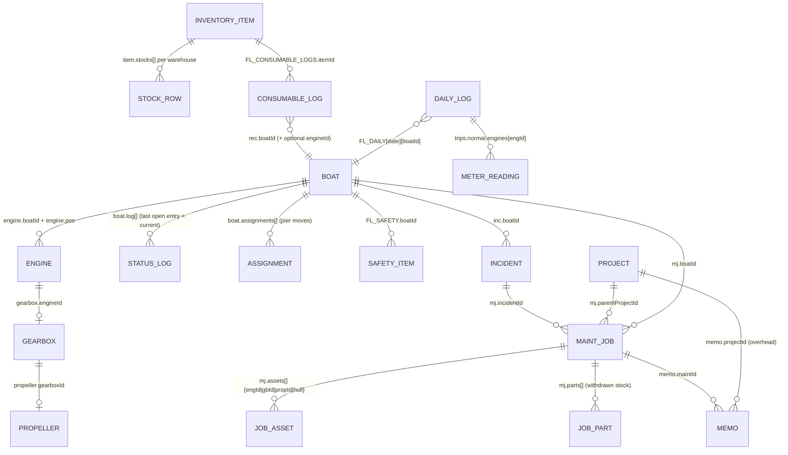
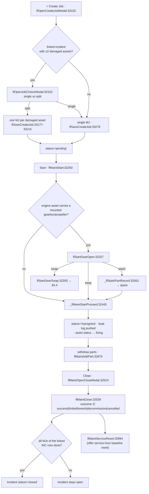

# 05 · Fleet Management

> Scope: everything under the sidebar group **Fleet Management** — boats, engines, gearboxes, propellers, the Daily Fleet Log, maintenance jobs, incidents, projects, inventory/memos, consumable requisitions, and the cost/insights/fuel analytics built on top of them. Code: `allotment_v2/allotment_v2.html` unless noted. Line numbers are as of **094dde1** and drift; grep the symbol name instead.

---

## 1. What this does & who uses it

The `fl*` module is the technical/engineering half of the app. Sales and Booking decide *how many people* go out; Fleet decides *which hulls are physically able to go out*, and tracks the money and hours it takes to keep them that way.

Users (inferred from UI language and the data): the pier/fleet supervisor at Tub Lamu and Visit Panwa, who
1. records what each boat did today (PAX, fuel litres, ฿/L, engine meter readings) in **Daily Fleet Log**;
2. opens an **Incident** (`INC-xxx`) when something breaks;
3. converts the incident into one or more **Maintenance Jobs** (`MJ-xxx`), starts them (which flips boat status → `fixing`/`unavailable`), withdraws parts from **Inventory**, raises **Memos** (`MO-xxx`) for purchases needing approval, and closes them;
4. registers and moves the physical assets — engine swaps, gearbox/propeller stashing, spare pools;
5. runs long jobs (drydock, overhaul) as **Projects** (`PRJ-xxx`) that own child MJs;
6. reads the analytics pages (Cost Analytics, Fleet Insights, Fuel Intelligence) for month-over-month spend and anomalies.

Everything in this module writes through **`flSave()`** (`:19696`) into the same single in-RAM blob as the rest of the app (see §8). Fleet is also the *only* writer of `d.boats` from this side — `flSave()` explicitly persists `BOATS` because the sales-side `save()` is never called from fleet code (`:19703-19705`).

A fleet-wide read-only mode exists: `flSave()` returns immediately if `window.laCanEditArea('fleet')` is false (`:19697`). Nothing else guards writes, so in view-only mode the in-RAM objects still mutate — only persistence is skipped **(gotcha)**.

---

## 2. Entry points

All fleet views are routed by `nav()` (`:6027`), which strips the `fl-` prefix and dispatches at `:6039-6052`. One special case: `data-view="fl-boatstatus"` is remapped to the shared `view-boats` (`:6032`) and rendered by the sales-side `renderBoats()`.

| view id | sidebar label | render fn:line | purpose |
|---|---|---|---|
| `view-fl-dashboard` | FL Dashboard | `flRenderDashboard`:21024 | one-day snapshot: boat availability, asset counts, spares, fuel, open MJ/INC, low stock, pending memos |
| `view-boats` (nav `fl-boatstatus`) | Boat Status | `renderBoats`:8569 | boat list grouped by *current* pier incl. `In Shop`; status timeline, detail panel |
| `view-fl-dailyreport` | Daily Fleet Log | `flRenderDR`:21792 | per-day, per-pier entry of Fuel L, ฿/L, engine meter readings; Save locks the pier |
| `view-fl-incident` | Job Assignment | `flRenderIncident`:33327 | incident register (`INC-xxx`), quick-fix, quick-swap of damaged gearbox/propeller |
| `view-fl-projects` | Projects | `flRenderProjects`:27162 | drydock/overhaul projects, timeline, gantt, YoY, phase tracker |
| `view-fl-maintenance` | Maintenance | `flRenderMaint`:28967 | MJ list + detail: start, parts withdrawal, engine swap, close |
| `view-fl-inventory` | Inventory / Memo | `flRenderInventory`:34612 | multi-warehouse stock, receive/transfer, memo approval chain |
| `view-fl-consumables` | เบิกของใช้ / น้ำมัน | `renderConsumables`:19834 | consumable requisition (oil/filters) → deducts stock, own cost bucket |
| `view-fl-cost` | Cost Analytics | `flRenderCostAnalytics`:29579 | spend by boat / asset category / job status, time-filtered |
| `view-fl-insights` | Fleet Insights | `flRenderInsights`:30185 | per-boat health scorecard, trends, recommendations |
| `view-fl-fuel` | Fuel · น้ำมัน | `renderFuelIntel`:29943 | fuel litres/cost/efficiency by boat, route family, week |
| `view-fl-asset` | Company Asset | `flRenderAsset`:22466 | tab host: Overview / Boats / Engines / Gearboxes / Propellers / Documents / Safety |

`view-fl-asset` tabs (`:5205-5220`, switched by `flGoAssetTab`:22475, dispatched in `flRenderAsset`:22466):

| tab | render fn:line |
|---|---|
| Overview | `flRenderOverview`:22543 (asset tree by boat) |
| Boats | `flRenderBoatList`:23279 → `flRenderBoatDetailPink`:23450 |
| Engines | `flRenderEngList`:23796 → `flRenderEngDetailPink`:24016 |
| Gearboxes | `flRenderGbList`:24263 → `flRenderGbDetailPink`:24462 |
| Propellers | `flRenderPropList`:24722 → `flRenderPropDetailPink`:24933 |
| Documents | `flRenderDocsList`:37841 (`FL_DOC_TYPES`:36402) |
| Safety | `flRenderSafetyList`:36506 (`FL_SAFETY_CATEGORIES`:20615) |

Each list view renders into a `*-pink-wrap` div; the older non-pink mounts (`#fl-boat-list`, `#fl-eng-detail`, …) still exist inside `display:none` wrappers (`:5215-5219`) and the legacy `flRenderBoatDetail(id)` / `flRenderEngDetail(id)` shims (`:23787`, `:24250`) delegate to the pink renderers.

---

## 3. Asset model

Six record families, all living in the same blob:

| in-memory | blob key | seed | shape notes |
|---|---|---|---|
| `BOATS` | `boats` | `DEFAULT_BOATS`:5586 | hull + legal + `log[]` status history + `assignments[]` + `repairHistory[]` + `docs[]` |
| `FL_ENGINES` | `fleet_engines` | `FL_DEFAULT_ENGINES`:19911 | `{id,brand,model,serial,hp,boatId,pos,status,baseHours,serviceInterval,lastServiceHours,lastServiceDate,spareLocation,retired,log[]}` |
| `FL_GEARBOXES` | `fleet_gearboxes` | `FL_DEFAULT_GEARBOXES`:19981 | `{id,boatId,engineId,brand,model,serial,status,baseHours,installHours,serviceInterval,lastServiceHours,shaftLength,modelSuffix,note(=position),spareLocation,onBoatId,onBoatPos,log[]}` |
| `FL_PROPELLERS` | `fleet_propellers` | `FL_DEFAULT_PROPELLERS`:20063 | `{id,boatId,gearboxId,brand,serial,diameter,pitch,size,blades,material,rotation,hubSize,cupping,cost,status,note,propPos,spareLocation,installHours,log[]}` |
| `FL_MAINT` | `fleet_maintenance` | `FL_DEFAULT_MAINTENANCE`:20126 | job `MJ-xxx`, see §4.3 |
| `FL_INCIDENTS` | `fleet_incidents` | `FL_DEFAULT_INCIDENTS`:20200 | `INC-xxx`, see §4.5 |
| `FL_INVENTORY` | `fleet_inventory` | `FL_DEFAULT_INVENTORY`:20272 | `{id,name,partNo,category,supplier,unit,cost,stocks[{location,qty,minQty}],qty(derived),history[]}` |
| `FL_MEMOS` | `fleet_memos` | `FL_DEFAULT_MEMOS`:20391 | `MO-xxx` purchase/labour approval memo |
| `FL_PROJECTS` | `fleet_projects` | — (built by `flProjMigrate`) | `PRJ-xxx`, see §4.7 |
| `FL_SAFETY` | `fleet_safety` | `_generateSafetySeed`:20628 | safety equipment per boat with inspection cadence |
| `FL_CONSUMABLE_LOGS` | `fleet_consumable_logs` | — | requisition rows |
| `FL_DAILY` | `fleet_daily` | — | `FL_DAILY[date][boatId] = {fuel, paxActual, trips:{normal:{engines:{engId:meter}}}}` |
| `FL_FUEL_PRICE` | `fleet_fuelprice` | — | `[date][pierKey|boatId] = ฿/L` |
| `FL_DR_LOCK` | `fleet_drlock` | — | `[date][pierKey] = true` (Daily Log locked) |

Declared at `:20605-20609`, loaded at `:18525-18530` / `:18581`, saved at `:19699-19702`.

### Link invariants

- **1 engine ↔ 1 gearbox ↔ 1 propeller.** The chain is by pointer, not by boat: `gearbox.engineId → engine.id`, `propeller.gearboxId → gearbox.id`. The Equipment bay builds each drive column exactly this way (`:22453`).
- A **spare** part is a detached part: `flOpenSwapModal` treats "spare" as *`spareLocation` is truthy* and explicitly notes `status==='spare'` is the legacy marker (`:33852-33856`). `_flStashPartRecord` (`:32061`) sets `status='spare'` **and** `spareLocation` **and** nulls `engineId`/`gearboxId` together — that is the canonical stash.
- During an engine swap a gearbox may be *parked on the boat*: `engineId=null` but `onBoatId`/`onBoatPos` set — "คาเรือ รอเครื่อง" (`:32301-32303`). The incoming engine adopts it (`:32374-32378`).

### Position vocabulary

`Port · C.Port · Center · C.Std · Std`. Canonicalised by `FL_POS_CANON`:23792 / `flPosLabel`:23794 (Suzuki "Starboard"/"Stbd"/"Starb" → `Std`); sort order via `FL_POS_RANK`:23793 / `flPosRank`:23795 (unknown → 98, sorts last). **Gotcha:** the Assign-Engine modal's position `<select>` is hard-coded HTML with a *different* vocabulary — `Port / Starboard / Centre / C.STBD / P1 / P2 / S1 / S2` (`:36218-36221`) — while `flOpenAssignEngModal` overwrites it with `getEngPositions(engineCount)` at runtime (`:36262-36264`). Do not read the static markup as the enum.



### Spare locations

`SPARE_LOC_LABELS`:22371 defines the keyed vocabulary — `pier:tublamu`, `pier:panwa`, `pier:central`, `shop:honda-phuket`, `shop:suzuki-phuket`, `shop:prop-shop-phuket`; plus dynamic `boat:<boatId>` handled by `flParseSpareLoc`:22379. `FL_STASH_LOCS`:32052 is the same list as pick-list options. Warehouses for *inventory* are a separate, plain-string vocabulary: `WAREHOUSE_LOCATIONS`:20715 = `['คลัง Tub Lamu','คลัง Visit Panwa','คลัง Ranong']` **(gotcha: two unrelated location vocabularies)**. Engines use yet a third, free-text list in the swap picker: `['อู่ซ่อม','คลังกลาง','คลัง Tub Lamu','คลัง Visit Panwa']` (`:32328`), and `flUnassignEng` hard-codes `'คลังกลาง'` (`:38093`).

---

## 4. Workflows

### 4.1 Log a daily meter reading (Daily Fleet Log)

**Trigger** — supervisor opens `Daily Fleet Log`, picks a date, types into the Fuel / ฿-L / engine-hour cells for a boat.

**Steps**
1. `nav()` → `flRenderDR()` (`:21792`). It first calls `bkV2CharterBoatHeal(ds)` so charter bookings' boats appear in the day (`:21796`).
2. Boat set = company boats that have at least one engine: `b.ownership!=='charter' && !b.retired && FL_ENGINES.some(e=>e.boatId===b.id)` (`:21799`). Grouped into Tub Lamu / Visit Panwa / Ranong sections by `getBoatCurrentPier(b)` (`:21800-21802`, sections built at `:22228-22230`).
3. PAX per boat is **read-only**, pulled from bookings via `flBoatBookingsFor(boatId, ds)`:12075 (`:21808`, rendered read-only at `:22125-22128`). `flSavePaxActual`:22349 still exists and still writes `FL_DAILY[ds][bid].paxActual`, but no input calls it any more **(dead-ish path)**.
4. Fuel litres → `onchange="flSaveFuel(ds,bid,val)"` (`:22112` → `:22258`).
5. ฿/L → `onchange="flSaveFuelPrice(ds,b.id,val)"` (`:22121` → `:22321`). Note the second argument is named `pierKey` but the row passes a **boat id** — per-boat price is stored in the same map as pier price.
6. Engine meter → `onchange="flSaveMeter(ds,bid,'normal',engId,val)"` (`:22140` → `:22357`). The trip bucket is always the literal `'normal'`; the `type` parameter is a leftover generalisation.
7. Each cell shows Δ vs `flPrevMeter(engId, ds)`:22245 (latest reading strictly before `ds`, skipping `<=0`).
8. **Save** button per pier → `flSaveDayLog(btn, pierKey, ds)`:22338 → blurs the focused field so the pending `onchange` commits → `flSave()` → `flDRSetLock(ds,pierKey,true)`:22330. The section becomes read-only ("บันทึกแล้ว") until **Edit** → `flDREdit`:22336.

**Data written**
- `FL_DAILY[ds][boatId].fuel` (float or `null`)
- `FL_DAILY[ds][boatId].trips.normal.engines[engineId]` (float or `null`)
- `FL_DAILY[ds][boatId].paxActual` (only via the legacy fn)
- `FL_FUEL_PRICE[ds][boatId]` (row input) or `FL_FUEL_PRICE[ds][pierKey]` (programmatic)
- `FL_DR_LOCK[ds][pierKey] = true`

**Validation / guards**
- `flSaveMeter` defensively creates `trips` and `trips[type].engines` — a boat entry saved fuel-first has no `trips`, which used to throw and silently lose the hours (`:22360`).
- Empty / `NaN` price **deletes** the key rather than storing `0` (`:22324`).
- Inputs carry `_DIS` (disabled) when the pier day is locked.
- A boat marked `fixing`/`unavailable` that nonetheless ran gets the "ออกแล้ว · เข้าซ่อมเย็น" chip and keeps its entry cells; a boat that is unavailable *and* did not run gets `noEntry` and no inputs (`:22088-22101`, evidence rule at `:21817-21821`).

**Failure modes**
- A `0` meter placeholder is *skipped* everywhere (`flEngHours`:22799, `flPrevMeter`:22252) — entering `0` does not zero the hours, but it also does not register as a reading.
- No price entered ⇒ fuel cost counts as ฿0 in `_fuelAgg` (`:29886`). `flFuelPriceEff`:22289 exists for P&L to fall back (boat → pier → sibling boat at the same pier → up to `FL_FUEL_BACK_DAYS`=30 days back) but the Daily Log and `_fuelAgg` deliberately use the strict `flFuelPriceForBoat`:22266 instead.
- Locking is per (date, pier). Moving a boat to another pier after locking leaves its row editable/locked according to the *new* pier's flag.

---

### 4.2 Change boat status / move a boat between piers

Boat status is an append-only interval list `boat.log[]`; the *effective* status for a date comes from `getCurStatus(boat, ds)`:5879, which sorts by `from` descending and, on ties, by **insertion order descending** (later-saved entry wins — this was a real bug: fix today then set Available today used to still read Fixing, `:5880-5885`).

Three ways status changes:

| path | fn | effect |
|---|---|---|
| manual status modal | saveStatus (`:9690-9696`) → `autoClosePrevLog`:9700 → `save('config')` | free-form entry with `loc`, `province`, `locType`, `reason` |
| via a maintenance job | `_flMaintStartProceed`:32443 / `flMaintClose`:32539 | pushes `fixing`/`unavailable` then restores |
| via a project | `flProjStart`:28621 / `flProjMarkComplete`:28740 / `flProjCancel`:28677 | pushes `unavailable` with `projectId` on the entry |

`autoClosePrevLog(b, newFrom, newTo)`:9700 closes/splits overlapping earlier entries so intervals do not overlap.

**Pier** is *derived*, not stored per-day — `getBoatCurrentPier(b, ds)`:9920, in priority order:
1. an `inprogress` MJ on that boat with a non-empty `location`, **and** the boat is not `available` on that date → `'shop'`;
2. an active `boat.assignments[]` row covering `ds` → `a.toPier`;
3. keyword match on the status entry's `loc` (`panwa` / `ranong|grand andaman|se la va` / `tub|tublamu|tab lamu`);
4. fallback `b.pier`.

**Pier assignment** — `flOpenNewAssignment(boatId)`:35397 → `flSaveAssignment`:35420. Validates from≠to, both dates present, end ≥ start. Writes `boat.assignments[] {id,type:'temporary'|'permanent',fromPier,toPier,startDate,endDate,reason,cost,status,createdDate}`; a `permanent` + currently-active assignment also rewrites `b.pier` (`:35457-35459`). **Gotcha:** this function writes `localStorage[LS_KEY].boats[...]` directly instead of calling `flSave()` (`:35462-35470`) — same for `flCancelAssignment`:35481 and `flAutoUpdateAssignments`:35505. If `ls.boats` is absent the change is in-memory only.

**Boat status list grouping** — `renderBoats`:8569 sections the list by `getBoatCurrentPier`: Tub Lamu / Visit Panwa / Ranong / 🔧 In Shop (`:8765-8774`), plus a charter block. The same grouping is repeated in `flRenderBoatList`:23410-23423 with an extra `Other` catch-all. **Note:** CLAUDE.md §3.1 describes the three tabs as pier + `log[last].s==='fixing'`; the code actually uses the derived `'shop'` pier (active MJ *with a location* + non-available status), so a boat that is `fixing` with no MJ location stays in its pier section.

**Retire** — `flRetireBoat(boatId,reason)`:32716 sets `retired/retiredDate/retiredReason` and pushes a `s:'retired'` log entry; `flUnretireBoat`:32727 reverses it with an `available` entry. Retired boats are filtered out of nearly every aggregate (`b.ownership!=='charter' && !b.retired`).

---

### 4.3 Open, start and close a maintenance job

**Trigger** — `+ Create Job` on the Maintenance page (`:29009`), or `flCreateMaintFromInc(incId)`:32144 from an incident, or `flProjCreateMJ(projId)`:28785 from a project.



**Create — `flSaveCreateJob`:33137**
- Required: boat + title (`:33141`). Warns (confirm) if the boat already has a non-done job (`:33144-33149`).
- Numbering: `MJ-` + `max(existing numeric suffix)+1`, deliberately *not* `length+1`, so deletions don't cause collisions (`:33224-33229`); `flAssertUniqueNo`:26086 throws + alerts on a duplicate.
- Split mode pre-computes the base number once and increments per asset (`:33186-33192`), sets `inc.maintId` to the first job and `inc.relatedMaintIds` to all (`:33208-33209`).
- Preventive/scheduled jobs with no incident read asset checkboxes from the modal (`:33244-33271`); asset `status` mirrors the chosen boat status (`available` → `ready`, else `fixing`).
- `boatStatus:'unavailable'` requires a reason (`:33274-33277`).
- Written record: `{id,no,boatId,type:'corrective'|'preventive'|'scheduled',title,detail,location,status:'pending',startDate,endDate:null,cost:0,incidentId,assets[],progressLog[],boatStatus,boatStatusReason,setFixing}` (`:33278-33289`), unshifted into `FL_MAINT`. `parentProjectId` added when created from a project (`:33292-33301`).

**Start — `flMaintStart`:32250 → `_flMaintStartProceed`:32443**
- `targetStatus = m.boatStatus || (m.setFixing===false ? 'available' : 'fixing')` (`:32448`) — `boatStatus` is the new field, `setFixing` the legacy one; both are still read everywhere.
- If the boat already ran that day (`_flBoatRanOn`:32436 — a Boat-Op `TRIPS` row or a confirmed booking assigned to it), the unavailability starts **tomorrow** (`_flDayAfter`:32434) so the day still counts as operated (`:32453-32463`).
- Asset statuses cascade to `fixing` **only when** `targetStatus==='fixing'` (`:32469`), but every asset gets a `service-start` log line regardless.

**Withdraw parts — `flMaintAddPart`:32874**
- Requires a part *and* a warehouse (`:32879-32880`); blocks if `invQtyAt(inv,location) < qty` (`:32884-32885`); deducts via `invRemoveAt`:20753.
- Appends to `inv.history[]` (`type:'withdraw'`, `jobId`) and to `m.parts[]` (merged by `invId+location+date+late`).
- Withdrawing after the job is closed is allowed but flagged `late:true, lateBy` and tagged in the log "ลงย้อนหลังหลังปิดงาน" (`:32893-32899`). Editing parts after close is gated by `flMaintCanEditParts`:31485 + `flMaintLateEditOn`:31486.
- Reverses via `flMaintRemovePart`:32908, which returns stock to the **same** warehouse.
- Both call `flMaintRefreshParts(jobId)`:31539 for a surgical DOM update — a full re-render here caused the documented scroll-jump.

**Close — `flMaintClose(id,outcome,note,awaitInvoice)`:32539**

Outcome table (`:32550-32556`):

| outcome | engine | gearbox | propeller | boat |
|---|---|---|---|---|
| `success` | ready | ready | active | available |
| `limited` | limited | limited | limited | available |
| `rework` | fixing | fixing | fixing | fixing |
| `decommission` | broken (+`retired`) | broken | broken | available |
| `cancelled` | (unchanged; `fixing`→`ready`) | (same) | (same→`active`) | available |

- **Respects the job's intent**: if `m.setFixing===false` the close does **not** touch boat status at all (`:32581-32589`).
- If other `inprogress` MJs remain on the boat, the strictest of their statuses is carried over (`unavailable > fixing > available`) instead of returning the boat to service (`:32590-32605`).
- Appends `boat.repairHistory[]` with the job's cost/assets/dates (`:32617-32623`).
- `decommission` on an engine also detaches its gearbox (`gb.engineId=null`) and logs on the attached propeller — the gearbox/propeller are *not* marked broken by the engine's retirement (`:32637-32646`).
- Gearbox close with `success|limited` records `gb.installHours = flEngHours(linkedEngine)` (`:32658`).
- Auto-closes the linked incident when every MJ of that incident is done and the outcome isn't `cancelled` (`:32688-32705`).
- Then offers the service-hour reset (`flMaintServiceReset`, §5).

**Data written** — `FL_MAINT[i].{status,endDate,outcome,closeNote,awaitingInvoice,progressLog[],cost}`, `boat.log[]`, `boat.repairHistory[]`, each asset's `status` + `log[]`, `FL_INCIDENTS[i].{status,closedDate,progressLog[]}`.

**Failure modes**
- `flMaintClose` sets `m.endDate = TODAY_STR` unconditionally; back-dating requires manual patching (the seed migrations do exactly that, e.g. `:32679-32681`).
- If the boat-restore is skipped for any reason the boat is left stuck `fixing` — that is precisely what the `flLoad` self-heal at `:18545-18565` exists to repair.
- `flDeleteMaint`:32993 removes the job outright; withdrawn parts are **not** returned to stock by deletion.

---

### 4.4 Swap an engine

The engine is the swappable unit. Gearbox + propeller stay at the boat's drive position and the incoming engine adopts them.

**Trigger** — either at Start Job (`flMaintStart` → `flStartGearOpen` → the "swap" button) or later from the engine row of an already-started job (`flMaintSwapEngine(jobId, idx)`:32416, which sets `reentry:true, onlyEngId`).

**Steps**
1. `flStartGearSwap`:32293 — for each engine asset:
   - every gearbox with `engineId===engine.id` gets `onBoatId=m.boatId`, `onBoatPos=engine.pos`, `engineId=null`, plus a `detach` log "คาเรือ รอเครื่อง";
   - the engine gets `boatId=null`, `status='fixing'`, `remove` log;
   - a `ctx.swaps[]` entry `{oldEngId,pos,filled:false}` is queued.
2. `flStartSwapRenderPicker`:32315 — candidates = every engine not in the outgoing set, not already on this boat, and `status!=='broken'`, sorted spares-first (`:32323-32324`). Also asks where the pulled engine goes (`ENG_LOCS`, `:32328`).
3. `flStartSwapInstall`:32348 —
   - pulled engine: `spareLocation = <chosen loc>` + `move` log; `m.location` synced (`:32355-32358`);
   - the incoming engine **sheds its own gearbox/propeller**: they stay `onBoat*` at the source boat, or go `spare` if it came from the spare pool (`:32361-32366`);
   - incoming engine: `boatId`, `pos`, `status` `spare`→`ready`, `install` log (`:32370-32372`);
   - the waiting gearbox at that boat+position adopts the new engine: `engineId=eNew.id`, `onBoatId/onBoatPos` cleared, `spare`→`ready` (`:32374-32378`). The propeller follows implicitly because it points at the gearbox.
4. `flStartSwapSkip`:32385 marks remaining positions `'skipped'`; `flStartSwapFinish`:32393 closes the modal and either refreshes the detail (re-entry) or runs the normal Start.

**Hours** — deliberately *not* reset or frozen: the meter travels with the engine and `flEngHours` is `baseHours + (latest − first reading)` across all boats (comment at `:32368-32369`).

**Other move paths**
- `flSaveAssignEng`:36293 — Assign/Replace from the boat detail. Detects a position clash and offers to bump the occupant to spare in `คลังกลาง` (`:36303-36329`); the replaced engine likewise goes `spare` + `คลังกลาง` (`:36332-36339`). **Does not** carry the gearbox/propeller — no `onBoat*` handling here **(gotcha: two different swap semantics)**.
- `flUnassignEng(engId,boatId)`:38087 — plain detach to spare.
- `flEquipSwapDo(targetId)`:22406 — the Equipment bay swaps two same-type pieces (engine↔engine exchanges `boatId`+`pos`; gearbox↔gearbox exchanges `engineId`; propeller↔propeller exchanges `gearboxId`) and auto-fixes `spare` status.
- `flOpenMoveSpare`:34157 / `flConfirmMove`:34219 — relocate a spare between pier/shop/boat locations.

**Validation / guards** — the picker is the only guard (broken engines excluded, same boat excluded). Nothing enforces shaft-length/suffix compatibility on an engine swap; the gearbox suffix maps only exist inside the `flLoad` migration (`:13906-13923`).

**Failure modes** — a gearbox left with `onBoatId` set and `engineId=null` and no follow-up install is an orphan "คาเรือ" part; nothing sweeps these (deliberately — see §6).

---

### 4.5 Record an incident (and quick-swap a damaged part)

**Trigger** — Job Assignment page → add incident (`flOpenAddIncidentModal`:34336).

**Steps**
1. `flSaveIncident`:34423 — required boat + date + title (`:34428`).
2. Damaged assets are collected from three checkbox classes plus a comma-separated free-text hull field (`:34430-34448`) into `damagedAssets[] {type,id,label}`.
3. `severity` is derived from `priority`: `>=4 → critical`, `>=3 → major`, else `minor` (`:34452`). **Gotcha:** the priority `<select>` and this mapping mean "major" is only priority 3; the dashboard counts `major`/`minor` only (`:21072-21073`), so `critical` incidents fall out of that particular split.
4. Numbering `INC-` + `max+1` (`:34479-34482`), `flAssertUniqueNo` guard.
5. **Quick Fix** checkbox → status `resolved` immediately, `resolvedDate`, a `quickfix` log line appended to each damaged asset (`:34493-34522`) — no MJ is created.
6. Edit mode short-circuits at `:34455-34473` and appends an `✎ แก้ไขรายละเอียด` progress line.

**Data written** — `FL_INCIDENTS` (unshifted) `{id,no,boatId,date,time,title,detail,remark,damagedAssets[],priority,severity,type:'incident',status:'open'|'resolved',maintId,quickFix,resolvedDate,progressLog[]}`; asset `log[]` on quick-fix.

**Quick swap of a damaged gearbox/propeller** — `flOpenSwapModal(incId,type,assetId)`:33842 → `flConfirmSwap(spareId)`:33921:
- candidate spares must have a truthy `spareLocation`, must not be at a `shop:*` location, and are restricted to the **boat's own pier or the boat itself** — cross-pier spares are intentionally invisible ("แบบ A · เข้ม", `:33852-33868`);
- compatibility is brand-only for gearboxes (model mismatch shows a ⚠ badge) and size-only for propellers (`:33859-33862`);
- the swap moves the spare into the damaged part's slot (`boatId`, `engineId`/`gearboxId`, `note`, `propPos`, `spareLocation=null`), sets `spare.baseHours = engine hours` (gearbox) or `spare.installHours` (propeller), and pushes the damaged part to `status='fixing'|'damaged'` + `spareLocation='shop:honda-phuket'` (hard-coded default, `:33997`);
- `usedHours` on the removed part is computed from its last `install` log entry (`:33950-33951`);
- flags `inc.damagedAssets[i].{swapped,swappedTo,swappedDate}`;
- if the swapped gearbox had propellers attached, `flOpenPropCascadeModal`:34028 asks keep / stock / repair (`flConfirmPropCascade`:34081).

**Failure modes** — spares stored at a shop are invisible; a boat whose `pier` is stale (the raw `b.pier`, not `getBoatCurrentPier`, is used at `:33864`) sees the wrong pier's spares.

---

### 4.6 Requisition a consumable (เบิกของใช้ / น้ำมัน)

Separate from repair jobs by design: it deducts stock and books cost in its **own** bucket so "Upkeep รวม = ค่าซ่อม(MJ) + ของใช้" (`:19709-19711`).

**Trigger** — `view-fl-consumables` → เบิก button → `flConsumeOpen`:19726.

**Steps**
1. Item typeahead (`flConsumeItemFilter`:19760 / `flConsumeItemPick`:19770), warehouse, qty, boat, optional engine (`flConsumeBoatChanged`:19782 filters engines by boat).
2. `flConsumePreview`:19788 shows cost `qty × item.cost` and remaining stock at that warehouse.
3. `flConsumeSubmit`:19798 — requires an item, `qty>=1`, and a boat (`:19801-19806`). If `qty > invQtyAt(...)` it asks for confirmation to go negative (`:19812`) and falls back to a raw decrement when `invRemoveAt` refuses (`:19813`).

**Data written**
- `item.stocks[].qty` decremented (`invRemoveAt`:20753 → `invSyncLegacy`:20718 recomputes `qty`/`totalQty`/`primaryLocation`)
- `item.history[]` `{date,type:'withdraw',qty,location,note,by,consumeId}`
- `FL_CONSUMABLE_LOGS[]` `{id,date,itemId,itemName,unit,qty,unitCost,cost,location,boatId,engineId,engineLabel,by,note}`

**Reversal** — `flConsumeDelete(id)`:19826 returns qty to the same warehouse and strips the matching `history` row by `consumeId`.

**Failure modes** — negative stock is reachable by design; the requisition cost is *not* included in `flMaintCalcCost` or Cost Analytics, only in `renderConsumables` (`flConsumeCostOf`:19717) alongside `flBoatRepairCostMonth`:19719.

---

### 4.7 Run a project (drydock / overhaul)

**Trigger** — visiting `view-fl-projects` runs `flProjMigrate(false)` first (`:27164`), then the list or detail.

**Migration/backfill chain** (`flProjMigrate`:26554): `flProjCleanupV2`:26371 (unlink non-scheduled MJs) → `flProjCleanupV3`:26522 (clear default +30d `planTo`) → `flProjCleanupV4`:26505 (backfill `originalPlanTo` baseline) → `flProjResyncMJLinks`:26471 → `flProjAutoCreateForScheduledMJs`:26400 → the one-shot boat-log scan (guarded by `d._fl_proj_migrated_v1`, `:26567`, `:26643`). The scan creates a project for every boat-log entry with `reason==='dry_dock'` or an `unavailable` stretch ≥14 days that isn't already tagged with `entry.projectId` (`:26575-26621`), then links overlapping `type==='scheduled'` MJs (`:26625-26639`).

**Lifecycle**

| action | fn | effect |
|---|---|---|
| create/edit | `flProjOpenModal`:28812 → `flProjSaveModal`:28862 | `PRJ-xxx` |
| start | `flProjStart`:28621 | `status='inprogress'`, `actualFrom`, boat log entry `s:'unavailable'` with `reason:'dry_dock'|'overhaul'` and `projectId` (`:28633-28642`) |
| hold | `flProjHold`:28649 | requires a reason; `status='on_hold'`, `holdReason`, `holdSince` |
| resume | `flProjResume`:28664 | back to `inprogress`, clears hold meta (history stays in `log[]`) |
| cancel | `flProjCancel`:28677 | requires a reason; offers to unlink open child MJs; closes the project's boat-log entry and pushes `available` |
| reopen | `flProjReopen`:28727 | cancelled → `planned` |
| complete | `flProjMarkComplete`:28740 | **cascade-closes every open child MJ** (`m.status='done'`, no outcome, no asset/boat cascade), sets `actualTo`, closes the boat log entry, pushes `available` |
| add MJ | `flProjCreateMJ`:28785 | opens Create Job pre-set to `scheduled` with `_projCreateForId` |
| phase | `flProjSetPhase`:26676 | `PROJ_PHASES`:26657 per type |

**Data written** — `FL_PROJECTS[i]` `{id,no,name,boatId,type,vendor,planFrom,planTo,originalPlanTo,actualFrom,actualTo,status,phase,plannedBudget,notes,holdReason,holdSince,cancelReason,cancelledOn,log[],plan[],docs[],photos[],vendorVisits[],createdAt,createdBy}`; `FL_MAINT[i].parentProjectId`; `boat.log[]` entries carrying `projectId`.

**Validation / guards** — status transitions are gated (`flProjStart` only from `planned`, `flProjHold` only from `inprogress`, etc.); hold/cancel demand a non-empty reason.

**Failure modes** — `flProjMarkComplete`'s cascade close bypasses `flMaintClose` entirely: child assets stay `fixing`, no `repairHistory`, no incident auto-close, no service-hour prompt **(important gotcha)**. `flProjStart`/`flProjCancel`/`flProjMarkComplete` call both `flSave()` and `save()` because they touch `BOATS`.

---

### 4.8 Purchase memo (MO) approval chain

Memos are how money enters a job. `flMaintCalcCost` only counts memos in `approved | received | paid`.

**Steps** — `flSaveMemo`:26139 creates the memo; `flAdvanceMemo(id)`:35841 walks the chain:
- parts / mixed: `created → pending_approval → approved → ordered → received → paid`
- labour-only: `created → pending_approval → approved → paid` (skips ordered/received) (`:35847-35848`)
- the `approved` step diverts to `flOpenApproveModal`:35869 → `flSaveApprove`:35876 (approver name required)
- the `received` step diverts to `flOpenReceiveMemo`:35898 → `flSaveReceive`:35234, which receives all parts items into **one** warehouse guessed from the boat's pier (`flMemoWarehouse`:35889) and creates missing inventory items automatically
- a memo with no parts items skips straight to `paid` (`:35917-35923`).

**Data written** — `FL_MEMOS[i].{status,currentStep,approvedBy,approvedDate,approveNote,...}`, `item.stocks[]`, `item.history[]`.

---

## 5. Derived numbers

### 5.1 Engine hours — `flEngHours(id)`:20791

```
hours = engine.baseHours + (latest meter reading − first meter reading)
```
scanning all of `FL_DAILY[*][*].trips[*].engines[id]`, **skipping any value `<= 0`** (a `0` placeholder otherwise blows the total up, `:22799`). With no readings at all it returns `baseHours`. Deliberately **not** scoped to the days the engine was on a given boat — the meter is physically on the engine and travels with it (comment `:20793-20794`).

Applied in: engine detail/list, `flMaintAddAsset` logs, close-job logs, gearbox lifetime, the assign-engine info card (`:36277`), the fuel L/hr metric.

### 5.2 Engine service countdown — `flEngServiceState(e)`:20810

```
base     = e.lastServiceHours ?? e.baseHours ?? 0
since    = max(0, curH − base)
next     = base + e.serviceInterval
left     = next − curH        (negative ⇒ overdue)
pct      = clamp(since / interval × 100, 0, 100)
```
It is a countdown from the **last recorded service**, not a modulo of total hours. `interval===0` returns a null-cycle object. Reset by `flEngMarkService`:20823 (prompt for the reading) or by `flMaintServiceReset` at job close.

**Not** applied in `flUpdateAssignEngInfo`:36278, which still uses the old modulo `ceil(curH/interval)*interval` **(inconsistency)**.

### 5.3 Gearbox lifetime + service — `flGbLifetimeHours(g)`:20841 / `flGbServiceState(g)`:20849

```
curH      = attached engine hours − g.baseHours   (0 if detached)
prevUsed  = Σ (log entries of type 'remove').usedHours
lifetime  = prevUsed + curH
interval  = g.serviceInterval || GB_DEF_SVC_INTERVAL(200)   (:20840)
base      = g.lastServiceHours ?? lifetime   ← never serviced ⇒ assume "now", so it doesn't spam overdue
```
Reset by `flGbMarkService`:20861; interval edited by `flGbSetInterval`:20876.

### 5.4 Per-asset maintenance cost share — `flMaintCostShare(m, kind)`:20888

```
share = flMaintCalcCost(m.id) / (count of m.assets having the matching id key)
        kind 'gb'→gbId · 'prop'→propId · else engId   (min 1)
```
Applied **only** on the Engine / Gearbox / Propeller detail pages, so a 4-engine oil change shows ~¼ each. Job totals, boat totals, project totals and the dashboard still count the job once (`:20886-20887`).

### 5.5 Job cost — `flMaintCalcCost(id)`:32829

```
memoCost  = Σ memo.amount   for memos with memo.maintId===job && status ∈ {paid,received,approved}
partsCost = Σ part.qty × part.cost  for m.parts[], EXCLUDING parts whose normalised name
            already appears in a 'parts'-type memo of this job (no double counting)
total     = partsCost + memoCost      → also written back to m.cost
```
`flMaintPartsCoveredByMemo(m)`:32847 returns the excluded amount for display.

### 5.6 Project cost / health

- `flProjCalcCost(projId)`:27080 = Σ `flMaintCalcCost` over `flProjChildMJs`:27077 (`m.parentProjectId===projId`).
- `flProjCostBreakdown`:27108 splits parts / labour / other by memo item `category`, and adds project-level memos (`memo.projectId`) as overhead.
- `flProjHealth(p)`:26690 — score starts at 100; −min(40, (budget% −100)×1.5) when over budget; −5 at 80–100 %; −min(35, daysLate×2); −15 if >80 % of the schedule elapsed with >50 % of child MJs still open; −10 while `on_hold`. Buckets: <40 CRITICAL, <70 AT RISK, else ON TRACK. Open-ended projects (`planTo` null) get no schedule penalty.
- `flProjYoYStats(year)`:26727 buckets projects by `actualTo || planFrom || createdAt`.

### 5.7 Cost Analytics — `costAggregate()`:29314

- Pool = MJs with status `done | inprogress | on_hold` (cancelled excluded), time-filtered by `endDate || startDate` against `_costTimeFilter` (`all | ytd | month | last30`).
- Each job's cost is split **evenly across its assets**, bucketed by asset type into `COST_CATS`:29288 (`hull|engine|gearbox|propeller|other|memo`); a job touching several assets of one category counts as **one** job for the counter but its money is still divided per piece (`:29353-29358`).
- Standalone memos (no `maintId`) with a `boatId` are charged to that boat, but only the share that never entered stock — `laMemoDirectShare(mo)`:29302 = value of items without `invId` ÷ total, so parts are not counted twice (once at purchase, once at withdrawal). The remainder falls into a central-cost bucket.

### 5.8 Fuel metrics — `_fuelAgg(month)`:29874 / `_fuelWkAgg`:29910

- A boat-day counts only if it actually ran: `info.pax>0 || routes present || fuel>0` (`:29882`) — "ไม่ออก = ไม่นับ ไม่ใช่ 0".
- `cost = fuel × flFuelPriceForBoat(ds, boat)`; missing price ⇒ ฿0 plus a `priceMissing` flag (`:29886`).
- `runH` per boat-day = **max** over that boat's engines of `(today's reading − flPrevMeter)` (`:29887`) — max, not sum, i.e. it approximates elapsed running time.
- Fuel is attributed to route families pro-rata by pax share (`:29892-29893`).
- Anomaly = a day whose fuel > 1.3 × the boat's month average, only when there are ≥3 fuelled days (`:29900`). The Daily Log has its own cruder anomaly: L/PAX > 20 (`:21839`).
- Weekly buckets are `ceil(dayOfMonth/7)` → W1..W5 (`:29927`). Metrics `_fuelWkVal`:29936: `0 L/hr` (null if no run hours), `1 L/day`, `2 L/pax` (null if no pax), `3 ฿` — null ≠ 0 by design.
- Month budget lives outside the fleet keys, in `d.fleet_fuelbudget[YYYY-MM]` written directly to localStorage by `fuelSetBudget`:29873 **(gotcha: bypasses `flSave`)**.

### 5.9 Fleet Insights health — `getHealth(s)`:30259
Per boat over the selected period: `jobs>=3 || cost>=100000` → Critical; `jobs>=1` → Watch; else Healthy. Period filter `_insightsTimeFilter` ∈ `month|quarter|ytd|all` (`:30199-30211`).

---

## 6. flLoad / flSave lifecycle

`FLEET_VERSION = 'fleet_v34'` (`:13768`). `flLoad()`:13815 runs once at module init (`:36192`), immediately followed by `flValidateDataIntegrity()` (`:36194`).

**Order of operations inside `flLoad()`**

1. **Auto-snapshot** (`:13818-13843`) — before any migration, if the blob has maintenance/memo/incident data, copy the whole state to `localStorage[LS_KEY + '_snap_' + Date.now()]`, keeping the newest 3. Snapshots larger than **1.5 MB are refused** and all existing snapshots are dropped instead (a full ~6 MB state can never fit Safari's ~5 MB quota, `:13829-13832`); a `QuotaExceededError` also purges all snapshots. Console helpers: `flListSnapshots()`:13773, `flRestoreSnapshot(N)`:13797 (confirm + overwrite + manual refresh).
2. **Version whitelist** (`:13848`) — a literal array `fleet_v2 … fleet_v34`. An unknown/absent version takes the **first-time path**, which is defensive: it only fills arrays that are *empty* (`:13862-13869`), never overwrites existing data, and logs the pre-existing counts.
3. **v2–v7 → current** (`:13876-13903`) — legacy one-off fixes plus a forced `fleet_gearboxes` refresh.
4. **v8–v33 → v34** (`:13905` onward) — the long tail: gearbox shaft/suffix normalisation via `suffixMap`/`catamaranMap`/`df325Map` (`:13906-13952`), `DF250 → DF250W` renames, seeding of spare gearboxes `g54–g57`, gearbox serial re-encoding `<BOAT>-<BASE>-<SUFFIX>-<POS>` / `SPARE-<BASE>-<SUFFIX>-NN` (`:13970-13998`), and a very large amount of **scenario seeding** (Megazip inventory items i31–i52, memos MO-002…MO-004, incidents INC-001…, jobs MJ-001…MJ-027) all guarded by `if(!existingIds.has(...))`. This block runs to roughly `:18400`.
5. **Deferred hooks** (`:18588-18700+`) — `d._app_hooks._inc008_pending_start`, `_mj019_pending_start`, `_mj021_close_pending`, … call the *real* `flMaintStart`/`flMaintClose` so the seeded scenario goes through the same cascade a user click would, then `delete` the hook and `flSave()`.
6. **Hydrate the globals** (`:18525-18530`, `:18581`) — note `FL_MAINT` passes through `flDedupeMaint`:19683 (dedupe by `no|boatId|title|type|startDate`, unnumbered jobs pass through untouched) and `FL_CONSUMABLE_LOGS` uses a strict `Array.isArray` check.
7. **Idempotent back-fill** (`:18531-18544`) — new `FL_DEFAULT_INVENTORY` rows whose `id` is missing are pushed. Adds only; never touches an existing row. This is the sanctioned pattern for "items appended to a seed list after users were already seeded".
8. **Sanctioned self-heals** — exactly two live here:
   - *boat stuck fixing* (`:18545-18565`): a boat whose latest **open** log entry is `fixing`/`unavailable`, whose `note` references an `MJ-\d+` that is now `done`, and which has no other `inprogress` MJ forcing downtime, gets that entry closed at the MJ's `endDate` and an `available` entry appended with note "Auto-restore".
   - *engine status vs active job* (`:18566-18580`): an engine that is an asset of an `inprogress` MJ reads `fixing` regardless of the job's `boatStatus`; an engine flagged `fixing` with no active job returns to `ready`. Skips `broken` and `spare`.
   Both are narrow, keyed on an unambiguous signal, and produce the same result on every run.
9. Safety seed if empty (`_generateSafetySeed`:20628), then `invSyncLegacy` over every inventory item (`:18584-18587`).

**`flSave()`**:19696 — read-modify-write of the whole blob: writes the 13 `fleet_*` keys plus `fleet_version` **plus `d.boats = BOATS`**, then one `localStorage.setItem` (which is the shimmed RAM store, see §8). No merge logic: whatever is in the globals wins for those keys, sibling keys are preserved because it re-reads first.

**Safe to add here**
- another idempotent id-keyed back-fill of a `FL_DEFAULT_*` list;
- a new whitelist entry + a migration branch when you bump `FLEET_VERSION`;
- a self-heal only if it matches the bar above: single unambiguous trigger, converges in one pass, logs what it changed, and cannot rewrite data a user legitimately entered.

**Not safe**
- broad "clean-up" sweeps (an over-eager spare-detach/dedupe self-heal was removed for exactly this reason — CLAUDE.md §4);
- writing seed data over a non-empty array;
- adding a persisted `fleet_*` key without also adding it to `flSave()` **and** the reload path at `:41570-41582` — a key that is saved but never loaded vanishes on refresh;
- snapshotting more state (the 1.5 MB ceiling is a hard Safari constraint).

---

## 7. Data model touched

Written by this module:

| store | writers |
|---|---|
| `boats` (`BOATS`) | `flSave` (bulk), `flMaintStart/Close`, `flProj*`, `flRetireBoat`/`flUnretireBoat`, `flSaveAssignment` (direct localStorage), `flOpenEditBoatModal`/save, `flSetBoatColor`:9369 |
| `fleet_engines` | assign/unassign/swap/equip, incident quick-fix, MJ start/close, `flSaveEngine`:35994, service reset |
| `fleet_gearboxes` | swap/stash/cascade, MJ close, `flSaveGearbox`:36068, `flGbMarkService`, `flGbSetInterval` |
| `fleet_propellers` | swap/stash/cascade, MJ close, `flSavePropeller`:36149 |
| `fleet_maintenance` | `flSaveCreateJob`, `flMaintStart/Close/Delete`, parts add/remove, asset add/remove, `flMaintTogglePin`, `flUpdateMaint`:33001, project link/unlink |
| `fleet_incidents` | `flSaveIncident`, `flConfirmSwap`, `flAddIncLog`:33803, `flDeleteIncident`:33538, auto-close on MJ close |
| `fleet_inventory` | `flMaintAddPart/RemovePart`, `flConsumeSubmit/Delete`, receive/transfer/edit (`flSaveReceive`:35234, `flSaveTransfer`:35368, `flSaveInvEdit`:35167, `flSaveAddStock`:35708) |
| `fleet_memos` | `flSaveMemo`:26139, `flAdvanceMemo`, `flSaveApprove`, `flCancelMemo`:26042, `flEditMemo`:26011 |
| `fleet_projects` | `flProj*` |
| `fleet_safety` | `flSaveSafety`:37796, `flSaveInspection`:37673, `flSafetyDelete`:37001 |
| `fleet_consumable_logs` | `flConsumeSubmit/Delete` |
| `fleet_daily` / `fleet_fuelprice` / `fleet_drlock` | Daily Fleet Log savers (§4.1) |
| `fleet_fuelbudget` | `fuelSetBudget`:29873 — **direct localStorage, not via `flSave`** |
| `_fl_proj_migrated_v1`, `_app_hooks.*` | migration bookkeeping written by `flProjMigrate` / `flLoad` |

Read but not written: `SB_BOOKINGS` (PAX per boat-day, charter detection), `TRIPS` (Boat-Op operating flags), `ROUTES`/`getRoute`, `bkV2RouteFamily`, `acctBookingTotal`.

---

## 8. Persistence path

1. Fleet code mutates the in-RAM globals, then calls `flSave()`.
2. `flSave()` does `JSON.parse(localStorage.getItem(LS_KEY))` → assigns the `fleet_*` keys + `boats` → `localStorage.setItem(LS_KEY, …)`.
3. `localStorage.getItem/setItem` for the `loveandaman_v2` key are **shimmed to an in-memory object** (`_mem`) at the top of the file (`:62`, `:153-164`). Nothing of this size ever reaches the real disk store.
4. The shim's `setItem` marks the state dirty and debounces `save(blob)` (`:211-223`), which computes a record-level diff against `BASE` and translates it to REST ops via `laDiffToOps`:167 → one transactional `POST /api/v1/_batch`. A key the REST index (`GET /api/v1` resources) does not know forces a fallback to the legacy whole-diff `POST /api/save` (`:184`, `:217`).
5. Guards on the way out: an empty/unparseable blob is never pushed (`_laBlobUsable`:210), a server-side shrink refusal (HTTP 409) shows a blocking banner and does **not** retry (`:220`), `beforeunload`/`pagehide` flush synchronously (`:225-236`).
6. On reload, `/api/load` re-populates `_mem`, and `_laReloadData` re-hydrates every fleet global with `Array.isArray` guards (`:41570-41582`). **Any new `fleet_*` key must be added there too.**

Snapshots (`LS_KEY + '_snap_*'`) are the *only* fleet writes that go to real localStorage, and only when the state is under 1.5 MB.

---

## 9. Cross-module contracts

**What other modules read from Fleet**

| consumer | reads | where |
|---|---|---|
| Booking / boat assign | `boat.cap` as the booking cap, `boat.licensePax` as the hard physical ceiling | `BA_CAP_TOL = 2`:45499 — assignment blocked above `cap + 2` (`:45520-45521`); `boatCapLicense(boatId)`:47007 = `licensePax || cap` is the hard block |
| Booking allotment | `getCurStatus(b, date).s === 'available'` to decide whether a boat is sellable | `renderBoats`/allotment paths, e.g. `:72317` seat-cap sum |
| Boat Operation / calendar | `getBoatCurrentPier(b, ds)` for grouping, `getBoatShopLocation(b)`:9958 for the subtitle | `:9920`, `:9958` |
| Trip P&L / accounting | `flFuelPriceEff(ds, boat)`:22289 + `flFuelSrcTxt`:22313 — the *lenient* price resolver with provenance, so a missing daily price doesn't book ฿0 | `:22267-22320`; a fallback constant `32` ฿/L exists at `:58475` |
| Trip P&L / fuel | `FL_DAILY[ds][boatId].fuel` | `_fuelAgg`, P&L |
| Safety seed | `boat.cap || boat.licensePax || 30` to size the life-jacket set | `:20644` |

**What Fleet reads from other modules**

- `SB_BOOKINGS` → `flBoatBookingsFor(boatId,date)`:12075 for PAX/routes/trips per boat-day (Daily Log, Fuel Intelligence). Cancelled statuses `['cancelled','rejected','cancelled_weather']` are excluded everywhere (`:21844`, `:29902`, `:32439`).
- `bkV2CharterBoatHeal(ds)` is invoked by `flRenderDR` (`:21796`) so charter bookings mirror `trip.charterBoatId → ops.boatId` before the day is summed.
- `TRIPS[ds][boatId]` for "did this boat run" (`_flBoatRanOn`:32436, operating counts at `:22198`).
- `bkV2RouteFamily`, `getRoute`, `acctBookingTotal` for the fuel-vs-revenue table.

---

## 10. Invariants & gotchas

1. **`flSave()` also persists `BOATS`.** Fleet mutates `b.log` constantly; the sales-side `save()` is not called from here, so without `d.boats=BOATS` every status change would vanish on refresh (`:19703-19705`). Conversely, project actions call **both** `flSave()` and `save()`.
2. **Current boat status = last *open* entry, ties broken by insertion order** (`getCurStatus`:5879). Never assume array order alone.
3. **`In Shop` is a derived pier, not a status.** `getBoatCurrentPier` returns `'shop'` only for an `inprogress` MJ that has a non-empty `location` *and* leaves the boat non-available (`:9928-9938`). A `fixing` job with no location keeps the boat in its physical pier group.
4. **Two boat-status fields coexist**: `m.boatStatus` (new: `available|fixing|unavailable` + `boatStatusReason`) and `m.setFixing` (legacy boolean). Always read them together: `m.boatStatus || (m.setFixing===false ? 'available' : 'fixing')`.
5. **`setFixing===false` means "don't touch the boat"** — both at start (`:32451`) and at close (`:32581-32589`). Closing such a job must not force the boat back to `available`.
6. **Closing one MJ does not free a boat that has other open MJs** — the strictest remaining status is carried over (`:32590-32605`).
7. **Meter readings `<= 0` are skipped** in `flEngHours` and `flPrevMeter`. A `0` is a placeholder, not data.
8. **Engine hours are continuous across boats.** Never "freeze" or rebase them on a swap (`:32368-32369`).
9. **Service countdown is relative to `lastServiceHours`,** not `curH % interval`. `flUpdateAssignEngInfo`:36278 still uses the old modulo — fix it if you touch that card.
10. **Gearbox "never serviced" defaults its baseline to *now*** (`:20853`) so the fleet doesn't light up red on day one.
11. **`flMaintCostShare` is detail-page-only.** Applying it to job/boat/project totals would under-count.
12. **Memo-paid parts are subtracted from `m.parts` cost** by normalised name (`_flCostNorm`) to avoid double counting (`:32837-32841`). Renaming a part breaks the match.
13. **A spare is `spareLocation` truthy** (with `status==='spare'` as the legacy signal). `_flStashPartRecord`:32061 sets both plus the null'd link — use it rather than hand-rolling.
14. **`onBoatId`/`onBoatPos` = "คาเรือ · รอเครื่อง"** — a gearbox waiting at a drive position for a replacement engine. It is *not* a spare and must not be swept into the spare pool.
15. **Three different location vocabularies**: `SPARE_LOC_LABELS`/`FL_STASH_LOCS` keys (`pier:*`, `shop:*`, `boat:*`) for parts; `WAREHOUSE_LOCATIONS` plain Thai strings for inventory; free-text `ENG_LOCS` + `'คลังกลาง'` for engines. They do not interoperate.
16. **Quick-swap spares are pier-locked and use `b.pier`, not `getBoatCurrentPier`** (`:33864`) — a boat temporarily at another pier still sees its home pier's spares.
17. **`flProjMarkComplete` bypasses `flMaintClose`** for its children: no outcome, no asset status restore, no `repairHistory`, no incident auto-close.
18. **Numbering is `max(existing)+1`, never `length+1`** for MJ/INC (and `flAssertUniqueNo` throws on collision). Gaps from deletions are expected; `flValidateDataIntegrity`:26098 logs them as informational.
19. **`flSaveAssignment` / `flCancelAssignment` / `flAutoUpdateAssignments` / `fuelSetBudget` write localStorage directly** instead of going through `flSave()`. If you refactor persistence, these four are easy to miss.
20. **Daily Log PAX is read-only** (`:22125-22128`); `flSavePaxActual` survives only as an API. `boatPax.eff` still prefers `paxActual` when present (`:21821`).
21. **Fleet is read-only when `laCanEditArea('fleet')` is false** — but only `flSave()` checks it, so the UI still mutates memory. Anything you add that persists must go through `flSave()`.
22. **`esc`/`escapeHTML` is not global.** Fleet renderers that build HTML define their own (`flRenderCostAnalytics`:29585 does; most others inline `${...}` unescaped). Adding a new top-level renderer without a local `esc` throws silently on click.
23. **Surgical re-render for lists.** `flMaintRefreshParts`:31539 and `fuelToggleBoat`:29870 (`scrollY` save/restore) exist because replacing a mount's `innerHTML` while a button inside it has focus scrolls the page to the top.
24. **Known gap (BACKLOG.md §"re-install"):** there is no one-click path to put a stashed gearbox/propeller back onto an engine. The workaround is the gearbox/propeller edit form (set status back to `ready`/`active`, pick the engine, which clears `spareLocation`).

---

## 11. Function index

| function | line | purpose |
|---|---|---|
| `flListSnapshots` | 13773 | console helper: list `LS_KEY_snap_*` backups with record counts |
| `flRestoreSnapshot` | 13797 | console helper: overwrite the blob with snapshot N (confirm + manual refresh) |
| `flLoad` | 13815 | snapshot → version whitelist → migrations → scenario seeds → hydrate globals → self-heals |
| `flDedupeMaint` | 19683 | dedupe MJs by `no|boatId|title|type|startDate`; unnumbered jobs pass through |
| `flSave` | 19696 | read-modify-write the blob: 13 `fleet_*` keys + `fleet_version` + `boats` |
| `flConsumeCostOf` | 19717 | requisition row cost = `qty × unitCost` |
| `flBoatRepairCostMonth` | 19719 | Σ `flMaintCalcCost` for a boat within a `YYYY-MM` |
| `flConsumeOpen` / `flConsumeSubmit` / `flConsumeDelete` | 19726 / 19798 / 19826 | consumable requisition modal, commit (stock + log), reversal |
| `renderConsumables` | 19834 | เบิกของใช้ page: month buckets, per-boat upkeep |
| `_generateSafetySeed` | 20628 | one-time safety-equipment seed per boat (`FL_SAFETY_CATEGORIES`:20615) |
| `invSyncLegacy` / `invQtyAt` / `invAddAt` / `invRemoveAt` / `invTransfer` | 20718 / 20733 / 20740 / 20753 / 20763 | multi-warehouse stock primitives over `item.stocks[]` |
| `flGetEng` / `flGetGb` | 20789 / 20790 | id lookups |
| `flEngHours` | 20791 | `baseHours + (latest − first meter)`, skipping `<=0` |
| `flEngServiceState` / `flEngMarkService` | 20810 / 20823 | engine oil-change countdown; log a service and rebase |
| `flGbLifetimeHours` / `flGbServiceState` / `flGbMarkService` / `flGbSetInterval` | 20841 / 20849 / 20861 / 20876 | gearbox lifetime hours and gear-oil cycle |
| `flMaintCostShare` | 20888 | job cost ÷ same-kind assets (asset detail pages only) |
| `flMaintServiceReset` / `flMaintServiceResetManual` | 20894 / 20925 | offer to rebase engine+gearbox service baselines when a service job closes |
| `flStatusPill` / `flFmtShort` | 20931 / 20936 | status pill markup; short Thai date |
| `flRenderDashboard` / `flDashShift` | 21024 / 20942 | fleet dashboard for one date; date stepper |
| `flRenderDR` / `flShiftDRDay` | 21792 / 21784 | Daily Fleet Log page; day stepper |
| `flPrevMeter` | 22245 | latest engine reading strictly before a date (skips `<=0`) |
| `flSaveFuel` / `flSaveFuelPrice` / `flSaveMeter` / `flSavePaxActual` | 22258 / 22321 / 22357 / 22349 | Daily Log field writers |
| `flFuelPrice` / `flFuelPriceForBoat` / `flFuelPriceEff` / `flFuelSrcTxt` | 22264 / 22266 / 22289 / 22313 | strict pier price, strict per-boat price, lenient resolver with provenance, provenance label |
| `flDRLocked` / `flDRSetLock` / `flDREdit` / `flSaveDayLog` | 22329 / 22330 / 22336 / 22338 | per-pier per-day lock of the Daily Log |
| `flParseSpareLoc` / `flGetBoatSpares` | 22379 / 22392 | decode a `spareLocation` key; spares carried on a boat |
| `flEquipOpen` / `flEquipSwapDo` / `flEquipRemove` / `flRenderEquip` | 22427 / 22406 / 22419 / 22428 | Equipment bay: swap or detach one piece at a time |
| `flRenderAsset` / `flGoAssetTab` / `flGoToAsset` | 22466 / 22475 / 22485 | Company Asset tab host and deep links |
| `flGoToMaint` / `flGoToMaintTab` / `flGoToAwaitingInvoice` / `flGoToMemoTab` | 22496 / 22523 / 22528 / 22535 | cross-view navigation helpers |
| `flRenderOverview` | 22543 | asset tree / fleet composition stats |
| `flRenderBoatList` / `flRenderBoatDetailPink` / `flSelBoat` | 23279 / 23450 / 23441 | boat registry list + detail |
| `flPosLabel` / `flPosRank` | 23794 / 23795 | canonical drive position label and sort rank |
| `flRenderEngList` / `flRenderEngDetailPink` / `flChangeEngStatus` | 23796 / 24016 / 24254 | engine registry |
| `flRenderGbList` / `flRenderGbDetailPink` | 24263 / 24462 | gearbox registry |
| `flRenderPropList` / `flRenderPropDetailPink` | 24722 / 24933 | propeller registry |
| `flAssertUniqueNo` / `flValidateDataIntegrity` | 26086 / 26098 | duplicate-number guard; post-load integrity console report |
| `flSaveMemo` / `flEditMemo` / `flCancelMemo` / `flPrintMemo` / `flViewMemo` | 26139 / 26011 / 26042 / 25556 / 25905 | purchase memo CRUD + print |
| `flProjMigrate` / `flProjResyncMJLinks` / `flProjAutoCreateForScheduledMJs` | 26554 / 26471 / 26400 | project backfill from boat logs + MJ linking |
| `flProjCleanupV2` / `V3` / `V4` | 26371 / 26522 / 26505 | one-shot project data cleanups |
| `flProjPhasesFor` / `flProjCurrentPhaseIdx` / `flProjSetPhase` | 26664 / 26665 / 26676 | phase model (`PROJ_PHASES`:26657) |
| `flProjHealth` / `flProjYoYStats` / `flProjInsight` | 26690 / 26727 / 26964 | project health score, YoY stats, narrative insight |
| `flProjChildMJs` / `flProjCalcCost` / `flProjMJCostBreakdown` / `flProjCostBreakdown` | 27077 / 27080 / 27085 / 27108 | project ↔ MJ cost rollups |
| `flRenderProjects` / `flProjRenderList` / `flProjRenderTimeline` / `flProjRenderGantt` / `flProjRenderDetail` | 27162 / 27174 / 27462 / 27735 / 27976 | project views |
| `flProjStart` / `Hold` / `Resume` / `Cancel` / `Reopen` / `MarkComplete` / `CreateMJ` | 28621 / 28649 / 28664 / 28677 / 28727 / 28740 / 28785 | project lifecycle |
| `flMaintLinkProjectPick` / `flMaintUnlinkProject` | 28924 / 28947 | attach/detach an MJ to a project |
| `flRenderMaint` / `flSelMaint` / `flRenderMaintDetailPink` | 28967 / 29266 / 31555 | maintenance list + detail |
| `costAggregate` / `costSetFilter` / `flRenderCostAnalytics` | 29314 / 29285 / 29579 | cost analytics aggregation and page |
| `laMemoDirectShare` | 29302 | share of a memo that is a direct boat expense (items without `invId`) |
| `_fuelAgg` / `_fuelWkAgg` / `_fuelWkVal` / `renderFuelIntel` | 29874 / 29910 / 29936 / 29943 | fuel intelligence aggregation and page |
| `flRenderInsights` | 30185 | health scorecard, trends, recommendations |
| `flMaintCanEditParts` / `flMaintLateEditOn` / `flMaintRefreshParts` | 31485 / 31486 / 31539 | post-close part editing gate; surgical parts re-render |
| `flMaintAutoAddEngines` / `flEngAddAllToJob` / `flEngSplitIntoJobs` / `flSplitExistingJob` | 31887 / 31902 / 31944 / 31998 | bulk engine handling on a job |
| `_flStashPartRecord` / `flMaintStashOpen` / `flMaintStashConfirm` | 32061 / 32070 / 32084 | detach a gearbox/propeller into the spare pool at a chosen location |
| `flCreateMaintFromInc` / `flOpenJobChoiceModal` / `flChooseJobMode` | 32144 / 32152 / 32176 | incident → job(s), single vs split |
| `flMaintAddLog` / `flPushLog` / `flMaintTogglePin` | 32184 / 32203 / 32216 | job progress log; pin a job |
| `flMaintStart` / `_flMaintStartProceed` / `_flBoatRanOn` / `_flDayAfter` | 32250 / 32443 / 32436 / 32434 | start a job; "ran today → downtime starts tomorrow" rule |
| `flStartGearOpen` / `flStartGearChoice` / `flStartGearSwap` | 32257 / 32270 / 32293 | keep / stash / swap decision for mounted gear at start |
| `flStartSwapRenderPicker` / `flStartSwapInstall` / `flStartSwapSkip` / `flStartSwapFinish` | 32315 / 32348 / 32385 / 32393 | replacement-engine picker loop |
| `flMaintSetRepairLoc` / `flMaintSwapEngine` | 32403 / 32416 | set job repair location (syncs pulled engines); swap from an already-started job |
| `flMaintOpenCloseModal` / `flMaintCloseSelectOutcome` / `flMaintCloseConfirm` / `flMaintClose` | 32510 / 32525 / 32530 / 32539 | close-job modal and the cascade |
| `flRetireBoat` / `flUnretireBoat` | 32716 / 32727 | retire / restore a hull |
| `flMaintAddAsset` / `flMaintRemoveAsset` | 32737 / 32806 | add/remove an asset on a job (sets asset status + logs) |
| `flMaintCalcCost` / `flMaintPartsCoveredByMemo` | 32829 / 32847 | job cost = parts (minus memo-covered) + counted memos |
| `flMaintFillLoc` / `flMaintAddPart` / `flMaintRemovePart` / `flMaintUpdateCost` | 32860 / 32874 / 32908 / 32931 | warehouse picker; withdraw / return parts; manual cost override |
| `flMaintCreateMemo` / `flProjAddMemo` | 32965 / 32938 | raise a memo from a job / from a project |
| `flDeleteMaint` / `flUpdateMaint` | 32993 / 33001 | delete a job; status transitions |
| `flOpenCreateJobModal` / `flSaveCreateJob` | 33102 / 33137 | create-job modal; numbering, split mode, asset pre-fill |
| `flRenderIncident` / `flSelIncident` / `flRenderIncDetailPink` / `flDeleteIncident` | 33327 / 33537 / 33552 / 33538 | incident register and detail |
| `flAddIncLog` / `flIncUpdateDmgDropdowns` | 33803 / 33813 | incident progress log; damaged-asset pickers |
| `flOpenSwapModal` / `flConfirmSwap` | 33842 / 33921 | quick-swap a damaged gearbox/propeller with a pier-local spare |
| `flOpenPropCascadeModal` / `flConfirmPropCascade` | 34028 / 34081 | decide what happens to propellers after a gearbox swap |
| `flOpenMoveSpare` / `flConfirmMove` / `flOpenAddSpare` / `flSaveAddSpare` | 34157 / 34219 / 34262 / 34285 | relocate / register spares |
| `flOpenAddIncidentModal` / `flIncToggleQuickFix` / `flSaveIncident` | 34336 / 34319 / 34423 | incident create/edit, quick-fix path |
| `flRenderInventory` / `invSyncLegacy`-driven filters | 34612 | inventory + memo page |
| `flOpenReceiveStock` / `flSaveReceive` / `flOpenTransfer` / `flSaveTransfer` / `flSaveInvEdit` | 35053 / 35234 / 35324 / 35368 / 35167 | stock receive, transfer, edit |
| `flOpenNewAssignment` / `flSaveAssignment` / `flCancelAssignment` / `flAutoUpdateAssignments` | 35397 / 35420 / 35481 / 35505 | pier assignment CRUD (writes localStorage directly) |
| `flOpenEditBoatStatus` / `flSaveEditBoatStatus` | 35535 / 35572 | change a running job's boat status |
| `flShowToast` | 35817 | transient toast |
| `flOrderItem` / `flAdvanceMemo` / `flOpenApproveModal` / `flSaveApprove` / `flMemoWarehouse` / `flOpenReceiveMemo` | 35824 / 35841 / 35869 / 35876 / 35889 / 35898 | memo lifecycle |
| `flOpenAddEngineModal` / `flSaveEngine` / `flOpenAddGearboxModal` / `flSaveGearbox` / `flOpenAddPropModal` / `flSavePropeller` | 35976 / 35994 / 36020 / 36068 / 36110 / 36149 | asset registration forms |
| `flOpenAssignEngModal` / `flUpdateAssignEngInfo` / `flSaveAssignEng` / `flUnassignEng` | 36236 / 36272 / 36293 / 38087 | assign / replace / detach an engine on a boat |
| `flOpenEditBoatModal` | 36357 | boat registry edit form |
| `flGuessDocType` / `flDocBetter` / `flDocCurrent` / `flDocStatus` / `flRenderDocsList` | 36414 / 36429 / 36438 / 36447 / 37841 | boat document matrix (`FL_DOC_TYPES`:36402) |
| `flRenderSafetyList` / `flSelSafety` / `flRenderSafetyDetailPink` / `flOpenLogInspectionModal` / `flSaveInspection` / `flSaveSafety` | 36506 / 36687 / 36696 / 37627 / 37673 / 37796 | safety equipment register and inspections |
| `getCurStatus` / `getBoat` / `autoClosePrevLog` / `getBoatCurrentPier` / `getBoatShopLocation` | 5879 / 5888 / 9700 / 9920 / 9958 | shared boat helpers the fleet module depends on |
| `flBoatBookingsFor` | 12075 | PAX / routes / trip count for a boat on a date (from bookings) |
| `renderBoats` | 8569 | Boat Status page (shared with the sales side) |
