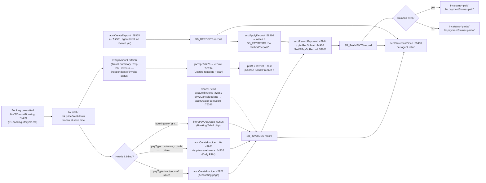

# 06 · Accounting & Finance

> Scope: money after a booking is priced — invoices, payments, deposits, VAT, agent statements and credit exposure (`#view-accounting`); pro-forma payment follow-up before travel (`#view-dailypfm`); per-trip profit & loss (`#view-trippl`); and the cost-template/break-even engine that feeds it (`#view-costing`). Code: `allotment_v2.html` unless noted. Line numbers are as of commit **`094dde1`** and drift; grep the symbol name instead.

---

## 1. What this does & who uses it

Once a booking is committed (see `docs/workflows/01-booking-lifecycle.md`) it carries a frozen `priceBreakdown`/`total`. Everything in this domain either **collects** that money (invoice → payment → deposit → statement) or **explains** it (Trip P&L, Costing). Nothing here re-prices a booking — `acctBookingBase()` only ever *reads* `bk.total`.

| Page | Who uses it | What for |
|---|---|---|
| Accounting (`#view-accounting`) | Accounting/finance staff | Raise invoices, record payments, take deposits, void, print docs, agent statements, aging |
| Daily PFM (`#view-dailypfm`) | Sales + accounting | Chase **proforma-agent** bookings for payment before their cutoff (18:00 the day before travel) |
| P&L รายทริป (`#view-trippl`) | Ops/finance management | Per-boat, per-day revenue − cost = profit, using real check-in pax and real supplier costs where known |
| ต้นทุน & จุดคุ้มทุน (`#view-costing`) | Finance/ops management | Define the cost-line template and per-route cost plans that Trip P&L's cost side runs on; compute break-even pax |

Roles: every write helper in this domain is gated by `laCanEditArea(area)` (`allotment_v2.html:455`) — a per-user `editAreas[]` array, bypassed only for `role==='admin'`. **The area name differs by store**, and this is the single most important gotcha in the domain — see §10.

---

## 2. Entry points

| View id | Sidebar label | Render fn : line | Purpose |
|---|---|---|---|
| `#view-accounting` | "Accounting" | `renderAccounting()` `:58990` | invoices list, KPIs, aging/collection dashboard |
| `#view-costing` | "ต้นทุน & จุดคุ้มทุน" | `ctRender()` `:57874` | cost template, per-route plans, break-even |
| `#view-trippl` | "P&L รายทริป" | `renderTripPL()` `:57685` | daily / monthly / analysis P&L by boat |
| `#view-dailypfm` | "Daily PFM" | `renderDailyPFM()` `:45062` | pro-forma payment follow-up queue |

Nav dispatch is the flat `if/else` ladder in `nav(el)` (`allotment_v2.html:6060-6087`):
```js
else if(view==='costing') ctRender();
else if(view==='trippl') renderTripPL();
...
else if(view==='dailypfm') renderDailyPFM();
else if(view==='accounting') renderAccounting();
```
No modal/overlay in this domain has its own top-level view — invoice/payment/deposit/statement all run inside `acctModal()` (`:59046`) or `acctOpenDoc()` (`:59335`) over the current page.

Booking-side entry points that reach into this domain: `bkV2PayChip(bk)` `:59481` (the Pay-status chip on the Tab-2 manifest row) and `bkV2RowPayAction(bkId)` `:59564` (click that chip → the same invoice/payment modal, without leaving Booking).

---

## 3. Money flow end to end



Key point: **the P&L side (Q→S) never reads `SB_INVOICES`.** Trip revenue comes straight from `bk.total`/`trip.subtotal` via `tsTripAmount()`, so a trip's profit is known the moment pax actually travel (from check-in), regardless of whether accounting has invoiced or collected the money yet. Invoicing/payment (D→L) and P&L (Q→S) are two independent consumers of the same frozen `priceBreakdown`.

---

## 4. Workflows

### 4.1 Raise an invoice (from Accounting)

**Trigger** "+ New invoice" button on `#view-accounting` → `acctNewInvoiceOpen()` `:59056`.

**Steps**
1. `acctNewInvoiceRender()` `:59057` lists agents that have at least one non-excluded, uninvoiced booking: `(SB_AGENTS).filter(a => SB_BOOKINGS.some(b => b.agentId===a.id && !ACCT_PAID_STATES.includes(b.status) && !acctBookingInvoice(b.id)))`.
2. Picking an agent (`_acctNewInvAgent`) re-renders the checklist of that agent's un-invoiced bookings, each pre-checked, amount = `acctBookingTotal(b)` `:42883`.
3. `acctNewInvoiceSum()` `:59091` live-totals the ticked checkboxes (no full re-render — keeps checkbox state).
4. Submit → `acctNewInvoiceCreate()` `:59096`: due days = `agent.creditDays || (payType==='invoice' ? 30 : 0)`, calls `acctCreateInvoice(agentId, ids, dueDays)` `:42921`.
5. `acctCreateInvoice` sums `acctBookingTotal(b)` over the picked ids, applies the agent's `vatMode` (see §5), builds the `SB_INVOICES` record, `sbInvoicesPersist()`, then stamps every booking with `invoiceId`/`paymentStatus:'invoiced'`, a history line (`bkV2AddHistory`), and `acctPersistBookings()`.

**Data written** — `SB_INVOICES[]` new record: `{id, number, agentId, bookingIds[], lineItems:[], subtotal, netAmount, vatMode, vatRate, vatAmount, depositApplied:0, total, issuedAt, dueAt, status:'issued', createdBy}`. Each booking: `invoiceId`, `paymentStatus:'invoiced'`, `history[]` entry.

**Validation/guards** — "Select at least one booking" if none ticked (`:59098`). `acctCreateInvoice` itself does no further validation; an empty `bookingIds` returns `null` (`:42923`).

**Failure modes** — a booking with status `quote` or `pending_approval` is **not** excluded from the "agents with un-invoiced bookings" list (only `ACCT_PAID_STATES` = `['cancelled','rejected','cancelled_weather']` is excluded) — it is possible to invoice a booking that never made it to `confirmed`. Nothing in this path checks that.

### 4.2 Raise a proforma invoice from Daily PFM (cutoff-driven)

**Trigger** individual "Issue PFM" button per row, or "Issue all" for the whole visible period.

**Steps**
1. `pfmBookingsForPeriod(date, mode)` `:44898` scopes to bookings whose agent is proforma (`pfmIsProforma(bk)` `:44879` = `sbGetAgent(bk.agentId).payType==='proforma'`) and which have a trip inside the selected day/week/month/year window.
2. Per row, `pfmIssueInvoice(bkId)` `:44926` refuses if `acctBookingInvoice(bkId)` already exists, else calls `acctCreateInvoice(b.agentId, [bkId], 0)` — **due immediately** (0 days), unlike the invoice-payType flow.
3. `pfmIssueAll()` `:45043` does the same over every booking in the current period that has no invoice yet, with one confirm.

**Data written** — same `SB_INVOICES` shape as §4.1, `dueDays=0`.

**Guards** — `pfmCutoff(date)` `:44881` = 18:00 the day before travel. Past cutoff + still unpaid + not extended/held → row is flagged `alert` (red, "เลย cutoff") and floats into the priority queue (`_prio`, `:45141`) regardless of period mode.

### 4.3 Record a payment

Three UI entry points, one function: `acctRecordPayment(invoiceId, amount, method, opt)` `:42944`.

**Trigger** — "บันทึกรับเงิน" button in the Accounting invoice-row modal (`acctPayOpen` `:59105` → `acctPaySubmit` `:59129`), the Daily PFM Record modal (`pfmRecordPayment` `:44934` → `pfmRecSubmit` `:44966`), or the Booking Tab-2 Pay chip (`bkV2RowPayAction` `:59564` → `bkV2PayDoRecord` `:59601`).

**Steps**
1. Amount defaults to the invoice's current balance (`acctInvoiceBalance(inv)` `:42889`), method is `transfer`/`cash`/`card`.
2. The Daily PFM path additionally supports a **payment-slip attachment**: upload / screen-capture (`getDisplayMedia`) / clipboard-paste, all funnelled through `pfmSlipUpload(file,kind)` `:44954` → `POST /api/attach` (max 6 MB, downsized to 1600px if an image), producing `{id, name, mime, size, kind, at}` refs held on `_pfmRec.slips[]` until submit.
3. `acctRecordPayment` pushes a `SB_PAYMENTS` row `{id, invoiceId, agentId, amount, method, date, type:'payment', ref?, slips?}`, `sbPaymentsPersist()`, recomputes `inv.status` (`paid` if balance ≤ 0 else `partial`), `sbInvoicesPersist()`, stamps every linked booking's `paymentStatus`, `bkV2AddHistory`, `acctPersistBookings()`.
4. The Daily PFM submit path (`pfmRecSubmit` `:44966`) additionally copies the slip refs onto `b.paymentSlips[]` (with `amount`/`at`/`by`) so they can be reviewed later independent of the payment record, via `acctPersistBookings()`.

**Data written** — `SB_PAYMENTS[]` new row; `inv.status`; `bk.paymentStatus`; (PFM path) `bk.paymentSlips[]`.

**Validation/guards** — amount must be `> 0` (`alert` otherwise) in every UI path. `acctRecordPayment` itself clamps to `Math.max(0, +amount||0)` and silently no-ops on `<= 0` or a missing invoice.

**Failure modes** — nothing stops **over-paying** an invoice (amount > balance); `acctInvoiceBalance` just clamps display to `Math.max(0, ...)`, so the excess payment is recorded but invisible as a "credit" anywhere — it neither creates a deposit nor is refunded automatically.

### 4.4 Take & apply a deposit

**Trigger** "+ รับมัดจำ" — from the Accounting invoice-table header (`acctDepositOpen('')` `:59388`) or from an agent's Statement modal (`acctDepositOpen(agentId)`).

**Steps**
1. `acctDepositRender()` `:59389` — pick agent (if not preset), amount, method, note.
2. `acctDepositSubmit()` `:59409` → `acctCreateDeposit(agentId, amount, method, note)` `:59365`: pushes `SB_DEPOSITS` row `{id, agentId, amount, method, note, date}`, `sbDepositsPersist()`. **Not tied to any invoice at creation time** — it's a standing agent-level credit.
3. Applying it: from the Pay-invoice modal, if `acctAgentDepositAvail(agentId) > 0` a "หักมัดจำ" button appears (`:59122`) → `acctPayUseDeposit(invId)` `:59380` → `acctApplyDeposit(agentId, invoiceId, amount)` `:59366`.
4. `acctApplyDeposit` walks the agent's deposits oldest-first, draws `min(remaining, need)` from each into new `SB_PAYMENTS` rows with `method:'deposit'`, `type:'deposit'`, `depositId`, until `need` is exhausted or deposits run out. Recomputes invoice status exactly as a cash payment would.

**Data written** — `SB_DEPOSITS[]` on creation; one or more `SB_PAYMENTS[]` rows (`type:'deposit'`) on application; invoice/booking status updates identical to §4.3.

**Validation/guards** — agent required, amount `> 0` on create. `acctPayUseDeposit` refuses ("No deposit available") if `min(balance, availableDeposit) <= 0`.

**Failure modes** — `acctDepositRemaining(dep)` `:59362` is computed by summing every `SB_PAYMENTS` row with that `depositId` — there is no reservation/locking, so two staff applying the same deposit to two different invoices in quick succession (before either re-renders) could both read the same "remaining" and jointly over-draw it. (inferred: no lock exists in this single-writer-blob model — see `docs/workflows/07-data-persistence-api.md` §3 for the general race-window shape.)

### 4.5 Void an invoice / issue a credit note

There is no separate "credit note" object — voiding is the correction mechanism, plus a fresh fee invoice for a genuine charge.

**Trigger** "Void" button per invoice row → `acctVoidConfirm(invId)` `:59136`.

**Steps**
1. Confirm ("Void this invoice? Linked bookings return to unpaid (credit re-held).").
2. `acctVoidInvoice(invoiceId)` `:42961`: `inv.status='void'`, `sbInvoicesPersist()`, then every linked booking gets `invoiceId=null`, `paymentStatus='unpaid'`, `acctPersistBookings()`.

**Data written** — `inv.status`, cleared `bk.invoiceId`/`bk.paymentStatus`.

**Guards/failure modes** — voiding does **not** reverse any `SB_PAYMENTS` rows already recorded against it — `acctInvoiceBalance` special-cases `status==='void'` to always return 0 (`:42889`), so a voided-but-partially-paid invoice simply stops showing a balance; the payment rows (and the money) are not touched or refunded automatically. `acctInvoicePaid(inv)` still sums them if anyone reads it directly.

This function is also the accounting half of **booking cancellation** (`docs/workflows/01-booking-lifecycle.md` §3.3): `bkV2CancelBooking` `:76325` calls `acctVoidInvoice` on the booking's existing invoice, then — if a cancellation charge was set — `acctCreateFeeInvoice(agentId, bookingId, amount, note, 'cancellation')` `:42937` raises a **standalone, VAT-free** invoice for just that charge (`lineItems:[{label, amount}]`, no `bookingIds` price roll-up). Weather cancellation resolves the same way (`docs/workflows/01-booking-lifecycle.md` §3.7): refund outcome pushes a negative `SB_PAYMENTS` row (`type:'refund'`, subtracted in `acctInvoicePaid` `:42886`) and voids the invoice; credit outcome calls `acctCreateDeposit` instead.

### 4.6 Print/view an invoice or receipt

**Trigger** "View" button on an invoice row, or `acctOpenDoc(invId, mode)` `:59335` called from Daily PFM / Booking's Pay chip.

**Steps**
1. `acctOpenDoc` builds `acctInvoiceDocHtml(inv)` `:59195` (or `acctReceiptDocHtml(inv)` `:59310` if `mode==='receipt'`, only offered when at least one payment exists) into a full-page A4 overlay `#acct-doc-modal`.
2. The invoice doc is a fixed Thai commercial-invoice layout: seller block (hardcoded `SELL`/`CONTACT`/`BANK` constants `:59205-59207`), buyer block from `agent.companyInfo`, one line per `acctDocLineItems(inv)` `:59148` (one row per booking's base + one row per `feeItems[]` entry; a standalone fee invoice renders its own `lineItems[]` instead), VAT summary, a Baht-in-words total (`_acctBahtText` `:59178`), a decorative deterministic QR (`_acctFauxQR` `:59187`, **not a real payment QR**), and a WHT line that is always ฿0 (see §10).
3. Print → `acctPrintDoc()` `:59354` toggles `body.acct-printing`, which the injected `@media print` CSS (`_acctInjectPrintCSS` `:59142`) uses to hide everything except `#acct-doc-modal` and print only `#acct-doc-sheet` at A4. Browser "Save as PDF" is the export mechanism — there is no server-side PDF generation.

**Data written** — none; this workflow is read-only.

### 4.7 Run an agent statement

**Trigger** click an agent's name on the invoice table, or "Statement" from anywhere that calls `acctStatementOpen(agentId)` `:59418`.

**Steps** — pure aggregation, no writes: total invoiced / paid / outstanding (from `SB_INVOICES` where `agentId` matches and `status!=='void'`), deposit available (`acctAgentDepositAvail`), credit usage (`agCreditState(agentId)` `:42900`, only shown when `payType==='invoice'` and a limit is set), an invoice table and a deposit table, and a "+ รับมัดจำ" shortcut into §4.4.

### 4.8 Accounting dashboard (aging / collection / top outstanding)

`acctDashboardHtml()` `:59456`, rendered inline above the invoice table on every `renderAccounting()` call (not a separate view).

- **Aging buckets** — `Not due / 1–30d / 31–60d / 60d+`, bucketed on `days = floor((now − dueAt) / 86400000)` per live (non-void) invoice with balance `> 0` (`:59461`).
- **Collection trend** — last 6 calendar months, summing `SB_PAYMENTS` where `type==='payment'` grouped by `date.slice(0,7)` (deposit-draws and refunds excluded from this chart specifically).
- **Top outstanding agents** — top 5 by summed live balance, click-through to `acctStatementOpen`.

### 4.9 Trip P&L — daily / monthly / analysis

**Trigger** `#view-trippl` → `renderTripPL()` `:57685`, tab bar `pxBar(e)` `:57116` (`pxTab('d'|'m'|'a')` `:56989`).

**Steps**
1. **Daily** (`pxDaily(e)` `:57144`) — `pxDay(date, pier)` `:56597` lists every boat with a `TRIPS[date][boatId]` entry (optionally filtered to one pier), calling `pxTrip(date, bid)` `:56478` per boat.
2. `pxTrip` builds a full per-boat-per-day P&L:
   - **Pax** — `pxPax(date, bid)` `:56339` sums *actual* travelling pax (booked minus pier-checked-in no-shows, `O.pierCheckin.noShow`), pro-rated by nationality when some pax didn't show, **not** the booked count. Revenue accumulator here (`o.rev`) is `Σ tsTripAmount(b,t)` — the same function Travel Summary uses (`allotment_v2.html:51566`, `docs/workflows/01-booking-lifecycle.md` doesn't cover it — it's the booking-domain shared revenue-per-trip helper: `t.ovnLeg` → 0; a multi-trip booking with a positive `t.subtotal` → that subtotal; else the booking's whole `priceBreakdown.total`/`total`).
   - **Cost** — `plan = pxPlanFor(routeId)` `:56325` resolves the Costing plan bound to this route/family (route-level binding wins over the older family-level one), then `ctCalc(plan, ctx, template)` `:56194` (§4.11) produces the line-item cost estimate. `ctx` pax/engine/fuel context comes from real numbers: `PX.tot/th/fr/chd`, the boat's real `engineCount` (`>=4` → `'4EN'` line variant), and an effective fuel price `flFuelPriceEff(date, boat)` (fleet domain) falling back to the plan's own `planFuel`.
   - **Real numbers override the formula per cost line**, in priority order: (1) `FL_DAILY[date][bid].fuel` litres × the resolved fuel price, if logged; (2) a closed meal-venue actual (`taGet(date,bid).meal`); (3) real van cost `pxVanCost(date,bid,routeId)` `:56448` (drivers actually assigned that day, cost split by pax share when one van serves two boats); (4) real longtail join/charter quantity from `bkV2AddOnFlags` (never the formula's per-head estimate — a documented incident, §10). Anything without a real number stays the formula estimate, tagged `src:'f'` (formula) vs `'r'` (real) vs `'p'` (plan-overridden) vs `'w'` (waiting — a meal venue is set but no actual submitted yet).
   - **Upsell** — `pxUpsell(date,bid)` `:56391` adds day-of `upgrades[]` (from the booking) and `SB_EXTRAS` rows for that trip date, at the **company-net** amount only (commission already excluded, so no separate commission cost line is needed).
   - **Freeze** — if `taGet(date,bid).closed` exists (§4.10), every row is overwritten from the frozen snapshot instead of recomputed — pax stay live (a fact of the day), money does not (a decision made once).
3. **Monthly** (`pxMonth(e)` `:57323`) and **Analysis** (`pxAnalysis(e)` `:57493`) aggregate the same `pxTrip` output over a date range, using `pxDayAgg`/`_pxAgg` memoization (`:57256-57293`) to avoid recomputing per-boat P&L for every day in a month view.

**Data written** — none by default (read-only aggregation over live bookings/fleet data) until closed (§4.10).

**Failure modes** — `pxPax`'s no-show pro-ration assumes an even nationality split among the pax who *didn't* show, which is a guess when a partial no-show is nationality-skewed. `plan=null` (no Costing plan bound to the route) still computes a cost of ฿0 for every formula line rather than refusing — the daily summary counts `nNoPlan` (`:57153`) precisely so staff notice this.

### 4.10 Close out ("freeze") a trip's P&L

**Trigger** "ปิดยอด" button on a trip card in Daily view → `pxClose(bid)` `:56610`.

**Steps**
1. `laGuardEdit('accounting')` — permission gate.
2. If already closed: confirm to **re-open**, `taSet(date,bid,{closed:null})` — reverts to live formula.
3. Else: confirm showing the exact revenue/cost/profit about to be frozen, then `taSet(date,bid,{closed:{rev,cost,profit,rows:[{id,l,amt,real}],pax,at,by}})`.

**Data written** — `TRIP_ACT[date::bid].closed` (see §7); `taSet` `:57712` is a read-modify-write into `laBlob().trip_actuals`.

**Why it exists** — a route price change or a cost-template edit next month must never retroactively change last month's already-reported profit. Closing snapshots the exact ฿ amounts used; only the pax count stays live (a fact, not a price).

### 4.11 Build/edit the cost template and a route's cost plan (Costing)

**Trigger** `#view-costing` → `ctRender()` `:57874`, tabs `plan`/`match`/`tpl`/`ovr` etc. via `ctSetTab(t)` `:57866`.

**Steps**
1. **Central template** (`ctTplHtml()` `:58703`) — one shared list of cost lines (`CT_DEFAULT.lines`, `:55975`), each `{id, g:group, l:label, vat:bool, parts:[{k:'fix'|'var'|'step', u, uTH?, uCh?, uChTH?, q, per:'boat'|null, fuel?, mode?, over?, every?, min?, add?}]}`. `ctAddLine`/`ctDelLine`/`ctLineName`/`ctLineGroup`/`ctLineVat` `:58930-58947` edit it; `ctVatSet(v)` `:58959` sets the single global `vatRate` (default 7).
2. **Per-route plan** (`ctPlanHtml()` `:57892`) — `ctPlans()` `:56062` is a user-defined list of `{id, name, famId, note, eng, boats, cap, pax, paxTH, price, priceCh, chPct, comm, fuel, ovr:{}, grp:{}, od:{}}`. `ctAddPlan`/`ctDupPlan`/`ctDelPlan` `:58690-58696`; `ctFamSetPlan(famId,pid)` `:58453` binds a plan to a route family (or `ctPlanSet('famId', routeId)` binds it to one specific route directly — route beats family per `pxPlanFor`).
3. **Overrides** (`ctOvrHtml()` `:58813`) — per-plan, per-line: `pl.ovr[lineId] = {off, p:[{...partial part override}]}` (blank field = inherit the central template's value) via `ctOvrToggle`/`ctOvrSet` `:58975/58981`; per-**group** off/±% via `ctGrpToggle`/`ctGrpPct` `:58963/58969` — `ctEffLine(line, plan)` `:56098` is the single merge point every reader (`ctCalc`, `ctPartDesc`, Trip P&L) goes through.
4. **Order-driven lines** ("§ctOd", `ln.od===true`, e.g. longtail join/charter, private van) price **quantity actually ordered**, not a per-head formula: `ctOdQty(pl, ln, ctx)` `:56174` prefers `ctx.odQty[lineId]` (the real count Trip P&L passes in) over the plan's own estimate `ctOdCfg` `:56161`.
5. **Break-even** — `ctBreakEven(plan, cap, template)` `:56259` walks pax `1..cap` calling `ctProfitAt(plan, n, template)` `:56232` (revenue at `n` pax at the plan's `price`/`priceCh`/`comm`, minus `ctCalc` cost at `n`) and returns the first `n` where profit turns positive. **A linear search, not a closed-form formula** — deliberately, because `step`-kind cost parts (fixed jumps every *k* pax) break a closed-form break-even equation (`:58258` code comment).

**Data written** — `laBlob().cost_template`, `.cost_plans`, `.van_rates` — all JSON **strings** written by `ctWrite(k,val)` `:55972`, read back by `ctRead(k)` `:55967`. This is a deliberate departure from every other store in the app: **there is no boot-time global for these** — every read goes straight to the live blob, so this data needs no entry in `window._laReloadData()` and cannot go stale after a soft-refresh (see §8).

**Validation/guards** — none beyond numeric coercion (`+v||0` everywhere). Deleting a line the user doesn't want is remembered in `t.dropped[]` so re-adding a future built-in default line doesn't resurrect a deliberately-removed one (`ctTplFill` `:56023`).

---

## 5. VAT & payment-type rules

**VAT** is computed once, at invoice creation, from the agent's `vatMode` (`acctCreateInvoice` `:42926-42929`), rate fixed at **7%**:

| `vatMode` | `net` | `vat` | `total` |
|---|---|---|---|
| `none` | `subtotal` | `0` | `subtotal` |
| `exclude` | `subtotal` | `round(net × 0.07)` | `net + vat` |
| `include` | `round(subtotal / 1.07)` | `subtotal − net` | `subtotal` |

`subtotal = Σ acctBookingTotal(booking)` over the invoiced booking ids, where `acctBookingTotal(bk) = acctBookingBase(bk) + Σ bk.feeItems[].amount` and `acctBookingBase(bk) = bk.total || bk.priceBreakdown.total` (`:42882-42883`). **This is already net of FOC and discounts** — see §6. A booking's `total` was itself computed under the agent's rate type in `bkV2CalcQuote` (`docs/workflows/02-sales-agents-pricing.md` §5) — VAT here is a second, independent layer applied only at invoicing time, never baked into the booking price.

Costing's VAT (`ctVatR(t)` `:56037`) is a **separate 7% concept** — it computes the **input-VAT-recoverable** net cost per cost line (`net = amt − amt×VATrate` when `line.vat===true`), used only inside Trip P&L / break-even cost math. It has no relationship to the invoice VAT above; they happen to share the same 7% rate by convention, not by code sharing.

`payType` (`invoice`/`proforma`/`cot`/`bt`, `SB_PAYMENT_TYPES` `docs/workflows/02-sales-agents-pricing.md:39296`) drives:

- **Due date** — `invoice`: `agent.creditDays` (default 30 if unset); `proforma` via Daily PFM: **0 days** (due on issue).
- **Credit exposure** — only `payType==='invoice'` participates in `agCreditState` (§6).
- **Daily PFM eligibility** — only `payType==='proforma'` bookings appear in `pfmBookingsFor`/`pfmBookingsForPeriod` at all (`:44879`, `:44885`, `:44903`).
- **Pay-chip color/label on the booking manifest** (`bkV2PayChip` `:59481`) — `invoice`/`credit` → blue; `proforma`/`prepaid` → amber; `cot` (Cash On Tour) → cyan; `bt` → neutral grey. For B2C bookings (`agentId==='a_b2c'`), the **billing-term chip and the money-received status are deliberately separate** — `bk.paymentSnapshot.paidStatus` (`paid`/`deposit`/`unpaid`, synced from the webshop) drives a second chip so a COT order that's actually fully paid shows **Paid**, not "collect cash on tour" (`:59525-59541`).
- `paymentSnapshot.method` on the booking (`docs/workflows/02-sales-agents-pricing.md` §5 Step 7) records `credit` vs `prepaid` at save time as a point-in-time snapshot — it does not update itself if the agent's `payType` changes later; only re-saving the booking refreshes it.

---

## 6. Aggregation rules

**Cancelled statuses are excluded everywhere in this domain**, same three values as the rest of the app (`docs/workflows/01-booking-lifecycle.md` §7.2): `ACCT_PAID_STATES = ['cancelled','rejected','cancelled_weather']` (`:42881`) — despite its name, this constant is the **exclusion list**, not a list of paid states. It gates: the "agents with un-invoiced bookings" list (`acctNewInvoiceRender` `:59059`), credit exposure (`agCreditState` `:42907`), and both Daily PFM booking scopes (`pfmBookingsFor`/`pfmBookingsForPeriod`). Trip P&L's `pxPax`/`pxAgents`/`pxUpsell`/`pxVanCost` each repeat the same three-status filter independently against `SB_BOOKINGS` (`:56343`, `:56374`, `:56394`, `:56424`, `:56451`) — a new P&L aggregate must add it too, it is **not** centralised into one helper in this domain.

**What counts as "the booking's money"** — `acctBookingBase(bk)` reads `bk.total` first, falling back to `bk.priceBreakdown.total` only if `total` is unset. Both are already net of:
- **FOC** — `priceBreakdown.focDiscount` is stored negative and already subtracted into `total` at commit time; FOC pax are never billed, but they **do** count as real travelling pax in Trip P&L's `pxPax` (they occupy a seat, they eat, they need a van).
- **Discounts/adjustments** — `priceBreakdown.discount` (negative) and `.extra` (positive, includes OVN charges) are likewise already folded into `total`.
- **Add-ons** — `bk.addOns[].amount` is frozen into `priceBreakdown.addOn` and thus into `total`; the invoice does **not** itemize add-ons separately — `acctDocLineItems` shows one row per booking (its whole base) plus one row per `feeItems[]` entry. A customer-facing invoice never shows "Longtail Join: ฿X" as its own line.

**Fee items** (`bk.feeItems[]`, written by reschedule — `docs/workflows/01-booking-lifecycle.md` §3.6) are additive on top of `acctBookingBase` in `acctBookingTotal`, and each renders as its own labelled row on the invoice (`acctDocLineItems` `:59162`).

**Charter vs seat** — accounting and Trip P&L revenue are agnostic to `bookingMode`; `tsTripAmount`/`acctBookingBase` read the same `total`/`subtotal` regardless of whether the trip was seat or charter. Trip P&L's pax count (`pxPax`) also does not distinguish — it counts whoever's `ops.boatId`/`t.charterBoatId` resolves to that boat, which is correct for a charter (the whole party is "the pax") but means a charter boat's revenue-per-head reads oddly (few or many pax, one lump price).

**OVN return legs** — `tsTripAmount` returns `0` for any `trip.ovnLeg===true` (`:51569`); the money is entirely on the outbound leg's `ovnCharge`. This is the same rule Travel Summary uses and prevents double-counting a two-leg overnight booking's revenue in daily P&L.

**Agent credit exposure** (`agCreditState(agentId)` `:42900`) — `used = Σ acctBookingTotal(bk)` over bookings where `agentId` matches, `payType==='invoice'`, status is not in the exclusion list and not `quote`/`draft`, **and** `!acctBookingPaid(bk)` (i.e. not already fully paid via some invoice). `available = limit − used`. Paying an invoice in full immediately frees that booking's credit; a partial payment does **not** — `acctBookingPaid` requires `acctInvoiceBalance(iv) <= 0`.

---

## 7. Data model touched

| Store | Shape | Written by | Notes |
|---|---|---|---|
| `SB_INVOICES` | `{id, number, agentId, bookingIds[], lineItems[], subtotal, netAmount, vatMode, vatRate, vatAmount, depositApplied, total, issuedAt, dueAt, status, createdBy, feeType?, note?, whtAmount?}` | `acctCreateInvoice` `:42921`, `acctCreateFeeInvoice` `:42937` | `status`: `issued`\|`partial`\|`paid`\|`void`, derived by `acctInvoiceState` `:42890`, never stored redundantly except the field itself |
| `SB_PAYMENTS` | `{id, invoiceId, agentId, amount, method, date, type:'payment'\|'deposit'\|'refund', ref?, slips?, depositId?}` | `acctRecordPayment` `:42944`, `acctApplyDeposit` `:59366`, weather-cancel refund path (`allotment_v2.html:60040`) | negative-effect rows use `type:'refund'` and are subtracted in `acctInvoicePaid` `:42886` |
| `SB_DEPOSITS` | `{id, agentId, amount, method, note, date}` | `acctCreateDeposit` `:59365` | agent-level, not invoice-level; drawn down via `SB_PAYMENTS` rows referencing `depositId` |
| `SB_EXTRAS` | day-of upsell rows `{bookingId, tripDate, service, total, toCompany, commission, seller, settle}` | booking-domain (`docs/workflows/01-booking-lifecycle.md` §4) | read by `pxUpsell` `:56391`; **not** part of `bk.total` |
| `bk.invoiceId` / `bk.paymentStatus` | string / `unpaid`\|`invoiced`\|`partial`\|`paid` | invoice/payment/void functions via `acctPersistBookings()` | mirrors the linked invoice's state onto the booking for fast manifest rendering |
| `bk.paymentSlips[]` | `[{id,name,mime,size,kind,at,by,amount}]` | `pfmRecSubmit` `:44972`, `pfmSlipsAttach` `:75640` | independent of the payment row's own `slips[]` — this is the booking's persistent view |
| `bk.ops.pfm` | `{decision:'approved'\|'hold', by, at, extendedBy?, alertedAt?, remindedAt?}` | `pfmApproveTravel` `:45025`, `pfmHold` `:45035`, `pfmRemindAll` `:45052` | day-1 only (see `bkOpsFor` in `docs/workflows/01-booking-lifecycle.md` §6) |
| `TRIP_ACT` (`trip_actuals`) | `{ "date::boatId": {fuel?, meal?, closed?} }` | `taSet` `:57712` | `closed` freezes a Trip P&L snapshot (§4.10); `fuel`/`meal` are real-cost overrides some other page may also write |
| `laBlob().cost_template` | `{vatRate, lines:[...], dropped:[]}` | `ctTplSave` `:56036` via `ctWrite` | stored as a **JSON string**, not a boot-loaded global — see §8 |
| `laBlob().cost_plans` | `[{id,name,famId,note,eng,boats,cap,pax,paxTH,price,priceCh,chPct,comm,fuel,ovr:{},grp:{},od:{}}]` | `ctPlansSave` `:56077` | same string-blob pattern |
| `laBlob().van_rates` | `{ groupKey: {base?, rt:{routeId:{base?,PK?,KL?}}} }` | `vanRatesSave` `:57757` | feeds `pxVanCost`'s real-cost fallback |
| `MEAL_VENUES` | `[{id,name,place,priceAd,priceCh,phone,note,active}]` | `mvPersist` `:56279` | normal boot-loaded array (unlike the three above) |

---

## 8. Persistence path

Two distinct patterns coexist in this domain — know which one you're editing before you add a field.

**A. Normal blob stores** (`SB_INVOICES`, `SB_PAYMENTS`, `SB_DEPOSITS`, `SB_EXTRAS`) — boot-loaded globals, each with its own persist helper doing the standard read-modify-write:
```js
function sbInvoicesPersist(){ if(!laCanEditArea('accounting')) return;
  const d=JSON.parse(localStorage.getItem(LS_KEY)||'{}'); d.sb_invoices=SB_INVOICES; localStorage.setItem(LS_KEY, JSON.stringify(d)); }
```
`sbInvoicesPersist` `:42846`, `sbPaymentsPersist` `:42847`, `sbDepositsPersist` `:42848` — all three gated on the **`'accounting'`** edit area. These follow the general write path in `docs/workflows/07-data-persistence-api.md` §3 (shim → `save()` → diff → `/api/v1/_batch`) and must be listed in `window._laReloadData()` to survive a soft-refresh (they are — `sb_invoices`/`sb_payments`/`sb_deposits` all appear in that doc's §5 store table).

`acctPersistBookings()` `:42877` is the write path for every booking-side field this domain touches (`invoiceId`, `paymentStatus`, `paymentSlips`, `ops.pfm`) — it is gated on **`'operations'`**, not `'accounting'` (see §10 gotcha #1). It also clears the charter-boat memo cache (`baChMemoClear`) since a payment/invoice change can imply a booking edit elsewhere.

**B. Live-blob scalars, no boot global** (`cost_template`, `cost_plans`, `van_rates`) — `ctRead(k)`/`ctWrite(k,val)` (`:55967`/`:55972`) go straight to `laBlob()[k]` on every call, storing the value **JSON-stringified as a single scalar string**. The in-code rationale, verbatim (`:55963`): *"ที่เก็บ: laBlob() เป็น JSON string เหมือน pck_svc_colors → ไม่ต้องเพิ่มคอลัมน์ DB"* ("stored as a JSON string like `pck_svc_colors` → no DB column needed"). Consequence: these three keys need **no entry in `window._laReloadData()`** — there is no cached global that could go stale on a soft-refresh, because there is no cached global at all. On the wire they land in `computeDiff`'s `sets` bucket → `{op:'meta'}` → the `app_meta` key-value table (`docs/workflows/07-data-persistence-api.md` §3.1/§6), not a dedicated SQL table. `TRIP_ACT` (`trip_actuals`) is a hybrid: it *is* a boot-loaded global (`var TRIP_ACT = {}`, loaded once at `:57705`) but persisted the same live-write way through `taSet` → `laBlob()`/`laBlobSave()`.

`MEAL_VENUES` is the one array in this domain that follows the fully standard pattern (boot IIFE + `Array.isArray` load + `mvPersist()` read-modify-write), and does appear in `_laReloadData()` (`docs/workflows/07-data-persistence-api.md` §5, `meal_venues` row).

---

## 9. Cross-module contracts

**Accounting ← Booking** (`docs/workflows/01-booking-lifecycle.md`)
- Reads `bk.total`/`bk.priceBreakdown.total` (`acctBookingBase`), `bk.feeItems[]` (`acctBookingTotal`), `bk.status` (exclusion filter everywhere).
- Writes back `bk.invoiceId`, `bk.paymentStatus`, `bk.paymentSlips[]`, `bk.ops.pfm`, `bk.history[]` (via `bkV2AddHistory`).
- Booking's cancel/reschedule/weather flows call **into** this domain: `acctVoidInvoice`, `acctCreateFeeInvoice`, `acctCreateDeposit` (see §4.5 and `docs/workflows/01-booking-lifecycle.md` §3.3/§3.6/§3.7).

**Accounting ← Sales/Agents** (`docs/workflows/02-sales-agents-pricing.md`)
- Reads `agent.payType`, `agent.vatMode`, `agent.creditDays`, `agent.creditLimit`, `agent.companyInfo` (printed on the invoice doc), `agent.contractVersion` (into `paymentSnapshot`, set at booking-commit time, not here).
- `agent.rateTypeId`/`seatRates` are never read in this domain — the price is already frozen on the booking by the time accounting sees it.

**Trip P&L / Costing ← Fleet** (not yet documented as its own workflow file)
- `pxTrip` reads `getBoat(bid).engineCount` (formula variant `3EN`/`4EN`), `flFuelPriceEff(date, boat)` (effective fuel price for the day), `FL_DAILY[date][bid]` (real fuel litres logged), `boatCapFor(bid,date)` (break-even ceiling).
- `pxVanCost` reads `SB_VEHICLES` (via `vehGet`) and each booking's assigned `O.vanId` (fleet/dispatch domain, `docs/workflows/01-booking-lifecycle.md` §6).

**Trip P&L ← Check-in / Travel Summary**
- `pxPax`/`pxAgents` read `ckTripOn`, `ckBookedPax`, `pckExpected`, `O.pierCheckin.noShow`, `pckVoidInfo` — the actual-attendance layer, not the booked pax. This is the same layer `getSeatsConsumed` subtracts no-shows from (`docs/workflows/01-booking-lifecycle.md` §6, "Booking → Check-in / Travel Summary").
- Both P&L and Travel Summary call the same `tsTripAmount(b,t)` `:51566` for per-trip revenue — a change to that function affects both pages identically.

**Daily PFM → Booking manifest** — `bkV2PayChip` (`:59497`) reads `bk.ops.pfm` directly so a decision made on the Daily PFM page (Extend/Hold) is visible on the Booking Tab-2 row without any extra sync step; both read/write the same `bk.ops.pfm` object.

---

## 10. Invariants & gotchas

1. **Edit-area mismatch between invoices and bookings.** `sbInvoicesPersist`/`sbPaymentsPersist`/`sbDepositsPersist` are gated on `laCanEditArea('accounting')`; `acctPersistBookings` (which every one of them calls to stamp `bk.invoiceId`/`paymentStatus`) is gated on `laCanEditArea('operations')`. A user with `accounting` rights but not `operations` can successfully create an invoice/payment (it saves), but the linked booking's `invoiceId`/`paymentStatus`/history update **silently stays in RAM only** and is lost on refresh — the booking will look un-invoiced again next session even though the invoice exists. Give accounting staff both areas, or fix the guard.
2. **`ACCT_PAID_STATES` is misleadingly named.** It is the three-value **exclusion** list (`cancelled`, `rejected`, `cancelled_weather`), not "states where the booking is paid." Read it as `ACCT_EXCLUDED_STATES`.
3. **WHT is always ฿0.** `acctInvoiceDocHtml` reads `inv.whtAmount` (`:59202`) but nothing anywhere writes that field — every printed invoice shows a ฿0.00 withholding-tax line regardless of reality. If WHT tracking is ever needed, this field needs a writer.
4. **The invoice's faux-QR is decorative, not a real PromptPay/payment QR** (`_acctFauxQR` `:59187`) — deterministic pixels seeded from the invoice number, purely visual.
5. **Over-payment is silently allowed.** `acctRecordPayment` does not cap `amount` at the invoice balance; excess money is recorded but not reflected as agent credit anywhere (no automatic deposit is created from it).
6. **Voiding an invoice does not reverse its payments.** `acctVoidInvoice` sets `status='void'` (which makes `acctInvoiceBalance` always return 0) but leaves `SB_PAYMENTS` rows in place; the cash movement itself needs a manual refund/deposit entry if the money must actually move.
7. **Deposit application has no locking.** `acctApplyDeposit` recomputes "remaining" fresh each call by summing existing payment rows — two concurrent applications against the same deposit can both read stale remaining and jointly over-draw it (single-writer-blob model, see `docs/workflows/07-data-persistence-api.md` §3).
8. **Trip P&L revenue is independent of invoicing.** A trip shows its true profit the moment pax check in, whether or not accounting has invoiced or collected a single baht — `tsTripAmount` reads the frozen booking price, never `SB_INVOICES`/`SB_PAYMENTS`. Don't expect Trip P&L and the Accounting "Outstanding" KPI to reconcile against each other; they answer different questions.
9. **Closing a trip (`pxClose`) freezes money, not pax.** Re-opening (`taSet(...,{closed:null})`) fully reverts to live formula recompute — a closed trip is not immutable, it's a snapshot that can be explicitly discarded.
10. **A trip with no Costing plan bound still "computes" ฿0 cost**, rather than refusing to show a number — `nNoPlan` in the daily summary is the only signal that the profit figure is meaningless for that boat/day. Always check that count before trusting a day's total.
11. **`cost_template`/`cost_plans`/`van_rates` bypass the usual "add it to `_laReloadData`" rule entirely** — they're read live from `laBlob()` on every call, not cached in a boot global. This is a deliberate, documented (`:55963`) departure from the store pattern in `docs/workflows/07-data-persistence-api.md` §4 — don't "fix" it by adding a boot-loader for these three keys; there's nothing to keep in sync.
12. **Longtail/charter/van cost lines must be quantity-driven from real orders, not the per-head formula.** A documented incident (`:56152-56153`): a 35-pax boat with 2 real longtail-join customers was costed at the formula's per-head rate × all 35 heads — 17× over. `ctOdQty`/`pxLongtail` exist specifically to feed the *real* ordered quantity into `ctCalc` for `od`-marked lines; any new order-driven cost line must be marked `od:true` and get its real quantity threaded through `ctx.odQty`, or it will repeat this bug.
13. **Add-ons are never itemized on a printed invoice** — they're folded into the booking's one base-price line via `priceBreakdown.addOn` → `total`. Only `feeItems[]` (reschedule fees, etc.) get their own invoice line.
14. **A booking can be invoiced before it's `confirmed`.** `acctNewInvoiceRender`'s "agents with un-invoiced bookings" filter only excludes the three cancelled-family statuses — a `quote` or `pending_approval` booking is not excluded from being picked into an invoice.

---

## 11. Function index

| Function | Line | Purpose |
|---|---|---|
| `renderAccounting` | 58990 | Accounting page: KPIs, dashboard, invoice table |
| `acctPersistBookings` | 42877 | Read-modify-write `SB_BOOKINGS` into the blob; gated `'operations'` |
| `acctBookingBase` | 42882 | `bk.total \|\| priceBreakdown.total` |
| `acctBookingTotal` | 42883 | base + `Σ feeItems.amount` |
| `acctFmt` | 42884 | `฿` currency formatter |
| `acctInvoicePaid` | 42885 | Σ payments (refunds subtracted) for an invoice |
| `acctInvoiceBalance` | 42889 | `max(0, total − paid)`, 0 if void |
| `acctInvoiceState` | 42890 | derives `issued`\|`partial`\|`paid`\|`void` |
| `acctBookingInvoice` | 42896 | find the live invoice covering a booking id |
| `acctBookingPaid` | 42897 | true if the booking's invoice balance is 0 |
| `agCreditState` | 42900 | credit limit/used/available for an agent |
| `acctNextInvoiceNo` | 42916 | `INV-YYMM-NNNN` sequence |
| `acctCreateInvoice` | 42921 | raise an invoice over booking ids, apply VAT |
| `acctCreateFeeInvoice` | 42937 | standalone fixed-amount fee invoice (e.g. cancellation) |
| `acctRecordPayment` | 42944 | record a payment row, update invoice/booking status |
| `acctVoidInvoice` | 42961 | void an invoice, clear booking invoice link |
| `acctStateChip` | 42969 | colored status pill |
| `acctModal` / `acctModalClose` | 59046 / 59053 | generic small modal shell |
| `acctNewInvoiceOpen/Render/Sum/Create` | 59056–59103 | new-invoice picker flow |
| `acctPayOpen/Submit` | 59105 / 59129 | record-payment modal |
| `acctVoidConfirm` | 59136 | confirm + void |
| `acctDocLineItems` | 59148 | invoice line items from bookings + feeItems |
| `acctInvoiceDocHtml` | 59195 | printable invoice HTML |
| `acctReceiptDocHtml` | 59310 | printable receipt HTML |
| `acctOpenDoc/Close/PrintDoc` | 59335–59354 | print-preview overlay |
| `acctDepositRemaining` | 59362 | deposit amount minus its draws |
| `acctAgentDepositAvail` | 59363 | Σ remaining deposits for an agent |
| `acctDepositHeldTotal` | 59364 | Σ remaining deposits, all agents |
| `acctCreateDeposit` | 59365 | new agent-level deposit |
| `acctApplyDeposit` | 59366 | draw deposit(s) into a payment against an invoice |
| `acctPayUseDeposit` | 59380 | UI shortcut: apply max available deposit |
| `acctDepositOpen/Render/Submit` | 59388–59416 | deposit-entry modal |
| `acctStatementOpen` | 59418 | per-agent statement modal |
| `acctDashboardHtml` | 59456 | aging / collection / top-outstanding cards |
| `bkV2PayChip` | 59481 | Pay-status chip on the booking manifest row |
| `bkV2CotChip` | 59548 | Cash-on-tour chip parser |
| `bkV2RowPayAction` | 59564 | booking-row → invoice/payment modal |
| `bkV2PayDoCreate/Record` | 59595 / 59601 | booking-row invoice/payment actions |
| `sbExtrasPersist` | 59612 | persist `SB_EXTRAS` |
| `renderDailyPFM` | 45062 | Daily PFM page |
| `pfmBookingsFor/ForPeriod` | 44882 / 44898 | proforma bookings scoped to a day/period |
| `pfmCutoff` | 44881 | 18:00 the day before travel |
| `pfmChartBuckets` | 44910 | collection-trend chart data |
| `pfmIssueInvoice` / `pfmIssueAll` | 44926 / 45043 | raise proforma invoice(s), due immediately |
| `pfmRecordPayment` / `pfmRecSubmit` | 44934 / 44966 | record-payment modal with slip attach |
| `pfmSlipUpload` | 44954 | upload/capture/paste a payment slip |
| `pfmApproveTravel` | 45025 | extend travel despite unpaid, past cutoff |
| `pfmHold` | 45035 | block travel until paid |
| `pfmRemindAll` | 45052 | log a reminder on every unpaid booking in period |
| `pfmViewSlips` / `pfmSlipsRender` | 75573 / 75585 | standalone slip gallery for a booking |
| `pfmPrintReport` | 75711 | printable PFM period report |
| `renderTripPL` | 57685 | Trip P&L page |
| `pxTrip` | 56478 | full per-boat-per-day P&L (revenue, cost, profit) |
| `pxPax` | 56339 | real travelling pax for a boat/day |
| `pxUpsell` | 56391 | day-of upgrades/extras, company-net |
| `pxVanCost` | 56448 | real van cost for a boat/day, split by pax share |
| `pxLongtail` | 56371 | real longtail join/charter quantity |
| `pxDay` / `pxMonth` / `pxAnalysis` | 56597 / 57323 / 57493 | daily / monthly / range aggregation |
| `pxClose` | 56610 | freeze a trip's P&L |
| `taGet` / `taSet` | 57711 / 57712 | read/write `TRIP_ACT` real-cost overrides |
| `tsTripAmount` | 51566 | shared per-trip revenue (booking domain) |
| `ctRender` | 57874 | Costing page |
| `ctTpl` / `ctTplSave` | 55999 / 56036 | central cost-line template |
| `ctPlans` / `ctPlan` / `ctPlanPut` | 56062 / 56078 / 56079 | per-route cost plans |
| `ctEffLine` | 56098 | merge template line + plan override |
| `ctCalc` | 56194 | compute all cost lines for a given pax/context |
| `ctProfitAt` / `ctBreakEven` | 56232 / 56259 | profit at N pax / first profitable N |
| `ctOdQty` / `ctOdRev` | 56174 / 56181 | order-driven line quantity/revenue |
| `ctRead` / `ctWrite` | 55967 / 55972 | live scalar-string blob read/write (no boot global) |
| `vanRate` / `vanDayCost` | 57778 / 57787 | resolved van day-rate for a route/zone |
| `mvCost` / `mvForTrip` | 56312 / 56305 | meal-venue cost for a trip's pax |
