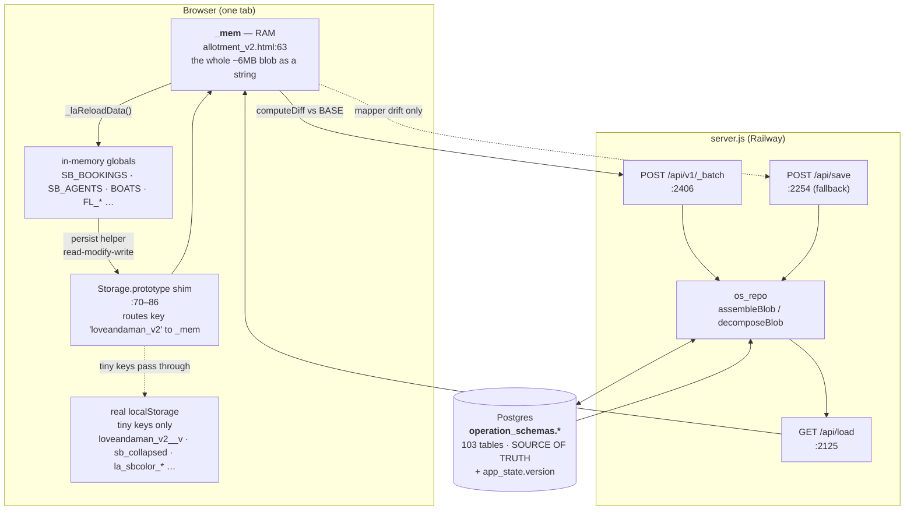

# 07 · Data Architecture, Persistence & API

> Scope: how a value typed into the LOVE Andaman ops app reaches Postgres and comes back — the RAM working copy, the boot/load path, the diff→REST write path, the mapper, the server API, migrations, deployment, and every way the round-trip silently loses data. Line numbers are as of **`094dde1`** and drift; grep the symbol name instead.

**Read this before §1 if you are about to run anything:** at `094dde1` the server does not boot. See [§0](#0-stop--head-is-broken).

---

## 0. STOP — HEAD is broken

`server.js:34-35` does:

```js
const osRepo  = require('./os-backend/src/mapping/os_repo.js');
const osModel = require('./os-backend/src/mapping/operation_schemas_model.json');
```

`os-backend/` was deleted wholesale by the HEAD commit `094dde1` ("chore: remove os-backend, erp, db/migrations, and stale mockups"). It is **not** gitignored (`.gitignore` only excludes `os-backend/data_snapshots/`), so this is a real deletion, not a local-checkout artifact. Verified:

```
$ node -e "require('./server.js')"
Error: Cannot find module './os-backend/src/mapping/os_repo.js'
    at Object.<anonymous> (D:\projects\LOVE_Andaman_Workspace\server.js:34:17)
```

The `require` is unconditional and at module top level — it fires in **blob mode too**, not just `DATA_BACKEND=relational`. The commit message claims "server.js:1494 treats a missing migration folder as a no-op, so boot is unaffected"; that is true of `db/migrations/`, and false of `os-backend/`. Three things went with it and have **no surviving copy anywhere in the repo**:

| File | Status | Consequence |
|---|---|---|
| `os-backend/src/mapping/os_repo.js` | **gone** | `assembleBlob` / `decomposeBlob` / `_plan` / `_children` — the entire blob↔rows engine |
| `os-backend/src/mapping/field_mapping.json` | **gone** | the mapper's field→column table. `find . -name "field_mapping*"` returns nothing |
| `os-backend/scripts/*` | **gone** | `check_mapping_drift.js`, `fast_import.js`, `migrate_dev_2026_07.js`, `update_mapping_*.js` — every procedure `HANDOFF_2026-07-04.md` §"Operational procedures" tells you to run |

`database_migration/operation_schemas_model.json` survives but is a **different, older file** (100,288 bytes vs the 117,509-byte copy `server.js` actually required at `HEAD~1`) — do not assume it is a drop-in replacement.

`db/migrations/` is also gone (18 `.sql` files). `runMigrations()` (`server.js:1495`) swallows the missing folder and returns a no-op, so boot would survive that alone — but as the commit itself notes, **a fresh database can no longer be provisioned from this repo**, and `tools/apply-migration.js` documents `db/migrations/003_v_seat_availability.sql` as its example argument, a path that no longer exists.

**Recovery:** `git checkout HEAD~1 -- os-backend db/migrations` restores all of it. Everything below describes the system as the code expects it to be, i.e. with `os-backend` present.

---

## 1. The three layers

| Layer | What it is | Allowed to hold | Never holds |
|---|---|---|---|
| **Postgres** | `operation_schemas.*` — 103 tables (`database_migration/operation_schemas_structure.sql` has exactly 103 `CREATE TABLE`), plus unqualified `app_state`, `attachments`, and `users` | **The truth.** Every business record. | — |
| **RAM (`_mem`)** | one JSON string, the whole ~6 MB state blob, held in a closure variable at `allotment_v2.html:63` | a working copy, re-fetched from `/api/load` on every page load | anything durable — a tab close without a flush loses it |
| **localStorage** | real browser storage | tiny UI/cache keys only (§1.2) | **the state blob — ever** |

`app_state` in relational mode is a **version counter only**: every write path stores `data=NULL` and bumps `version` (`server.js:1403`, `2077`, `1446`, `2177`). The blob column is only used in `DATA_BACKEND=blob` mode.



### 1.1 Why the blob must never touch real localStorage

Two independent failures, both real incidents recorded in the source:

1. **Quota.** The state is ~6 MB; the browser quota is ~5 MB. `setItem` throws `QuotaExceededError`, which aborted the whole boot `<script>` before `window.LA_UID` was defined → the "LA_UID is not defined" cascade across every fleet view (`HANDOFF_2026-07-04.md` §1; comment at `allotment_v2.html:64-69`).
2. **Safari doesn't override instance methods.** Assigning `localStorage.setItem = fn` does *not* replace the method in WebKit — the `Storage` named-property setter stores the function as a **data item** called `"setItem"`. The shim was therefore a silent no-op on Safari and every write hit real storage. Fixed by patching `Storage.prototype` instead and routing on `this` (`allotment_v2.html:70-74`), which also leaves `sessionStorage` untouched.

The boot code actively reclaims quota on poisoned devices — it deletes the old blob, the junk `setItem`/`getItem`/`removeItem` data items WebKit created, and any oversized `_snap_` copies (`allotment_v2.html:85-86`).

### 1.2 The allowed tiny keys

| Key | Store | Written at | Purpose |
|---|---|---|---|
| `loveandaman_v2__v` | localStorage | `_laMark()` :90 | server version this tab's data is synced to; survives reload, drives the unsaved-work recovery at :141 |
| `sb_collapsed`, `la_sbcolor_*`, `la_sbacc_*`, `la_pogrp` | localStorage | sidebar prefs | per-user UI, never synced |
| `la_view` | **sessionStorage** | `_laSaveView()` :284 | current view + booking tab + scroll, so an auto-refresh returns you where you were. Per-tab by design |
| `loveandaman_v2_snap_<ts>` | localStorage | `flLoad()` :13827 | fleet auto-snapshot — **effectively dead, see §9.7** |

Everything else — bookings, fleet, rates, agents, any business record — goes in the blob. Do not add new localStorage writes for them.

### 1.3 The two `save()` functions — a real trap

There are two, in different scopes, and they do unrelated things:

| | Scope | Signature | Job |
|---|---|---|---|
| `save` @ **:211** | inside the boot IIFE (`allotment_v2.html:10`) | `save(v, forceLegacy)` | the **cloud sync** — diff, translate to ops, POST |
| `save` @ **:5805** | global | `save(area)` | a **persist helper** — writes `routes`/`boats`/`trips` into the blob |

The global one shadows nothing (the IIFE one is closure-private), so both coexist. CLAUDE.md §2's "persist helpers `save()`…" means the one at **:5805**.

---

## 2. Boot & load sequence

All of this is one IIFE at `allotment_v2.html:10`, running in `<head>` before anything else.

1. **`window.LA_UID`** is defined first (`:16`) — deliberately before any early return, because a failed/401 boot used to leave it undefined and crash every fleet view on Safari.
2. **`GET /api/me`** via `sxr()` (`:46`), a *synchronous* XHR with up to 3 retries at 600 ms / 1400 ms / 1400 ms for status `0`, `404`, or `5xx` (`:28-35`). `404` is retried on purpose: it is the window during a Railway deploy where the old instance is down and the new one is not up.
   - `401` → `showLogin()`, **`return`** (`:47`).
   - other non-200 on **localhost** → **`return`** (`:49`) — the degraded path, §2.1.
   - other non-200 elsewhere → full-screen `bootFail()` overlay (`:52`).
3. **Install the storage shim** (`:70-86`). `Storage.prototype.{get,set,remove}Item` are replaced; only `this === window.localStorage && key === 'loveandaman_v2'` is diverted to `_mem`. `setItem` additionally arms a 1000 ms debounced `save(v)` — but only if `_syncReady && laCanEdit()` (`:81`), so view-only users never sync.
4. **`GET /api/load`** synchronously (`:98`). On 200 the response is `{data:<blob as string>, version, updated_by, updated_at}`.
5. **Reconcile server vs local** (`:132-151`) — this is the unsaved-work recovery:
   - `BASE` = a pure parse of the *server* string. Every later diff is against this.
   - If a local blob exists **and** `localStorage['loveandaman_v2__v'] === VER`, the local copy was synced to exactly this server version, so any difference is **this user's unsaved work** → keep it entirely and set `_recoverPush` (`:143-144`).
   - Otherwise the server has moved on → adopt the server blob, but **graft local-only records** (ids the server has never seen, e.g. a booking created seconds before a crash) via `_laGraftLocalOnly()` (`:92-97`). Additive only — it never overwrites a server record, so it cannot cause a revert.
   - No server blob at all → `seedFull(local)` pushes the local copy as `{baseVersion:0, full:<string>}` to `/api/save` (`:187`).
6. **`_syncReady = (ld.status===200 && !!ld.json)`** (`:164`). This is the **sync gate** and it is load-bearing — see §9.1.
7. **`GET /api/v1`** synchronously (`:166`) → `REST_RESOURCES = {entityName: 'array'|'map'}`. If this is null (blob mode returns 503) every save falls back to `/api/save`.
8. **Store globals populate.** There is **no single `load()`**. Each store has its own inline IIFE near its declaration, e.g. `SB_AGENTS` at `:39650` and `SB_BOOKINGS` at `:41533`, both shaped:
   ```js
   (function(){ try{ const d=JSON.parse(localStorage.getItem(LS_KEY)||'{}');
     if(Array.isArray(d.sb_bookings)) SB_BOOKINGS = d.sb_bookings; }catch(e){…} })();
   ```
   `getItem` is shimmed, so this reads `_mem`. Fleet has its own consolidated loader, `flLoad()` (`:13815`). Routes/boats/trips have `loadData()` (`:5785`).
9. **`_laStartSSE()`** (`:354-355`) opens `EventSource('/api/events')`; a 10 s `/api/version` poll (`:324`) is the fallback; a 3 s timer (`:357`) saves the view and soft-refreshes when idle.
10. **UI mounts** (`:397`) — user badge, `laApplyPerms()`, `_laRestoreView()` after 850 ms.

### 2.1 Degraded mode (localhost without `/api`)

`_laLocalHost()` (`:36`) matches `localhost`, `127.`, `192.168.`, `10.`, `[::1]`. If `/api/me` fails on such a host the IIFE **returns at `:49`** — before step 3. Consequences, in order of how much they will surprise you:

- **The shim is never installed.** `localStorage.setItem(LS_KEY, …)` writes the real blob to real localStorage. That works while the dataset is small and throws `QuotaExceededError` once it passes ~5 MB. This mode is only viable on a toy dataset.
- No `_syncReady`, no `BASE`, no auto-save — nothing reaches any server.
- No `LASTBY`, no SSE, no version poll.

`allotment_v2/start_server.command` is a plain static file server (`ruby -run -e httpd . -p 8765`, else `python3 -m http.server 8765`) — it serves no `/api`, so double-clicking it lands you here. CLAUDE.md §4 is right that this is a last-resort fallback; prefer `node server.js` with a real `DATABASE_URL`.

**`file://` is broken** for a different reason: `fetch`/XHR to `/api` has no origin to resolve against and cookies (the `sess` session) are not sent. Always use `http://localhost:…`.

### 2.2 Soft refresh (someone else saved)

`_laSoftRefresh()` (`:297`) re-fetches `/api/load`, writes it with `_orig(LS, j.data)` (`:73`, `:308`) — the **raw** setter that does *not* trigger a save — resets `BASE`/`VER`, then calls `window._laReloadData()` (`:41535`) to re-point every global at the new blob, then `_laRerender()` (`:41612`).

`_laBusy()` (`:266`) blocks a refresh while: unsaved changes exist, a booking form is open, focus is in an input, a modal is open, the doc-check drawer is open, an agent detail is open, or the user interacted in the last 2 s. If `_laReloadData()` returns false, it falls back to a full `location.reload()`.

---

## 3. The write path

```mermaid
sequenceDiagram
  participant U as User
  participant G as Global (SB_BOOKINGS…)
  participant P as Persist helper
  participant S as Shim setItem :80
  participant SV as save() :211
  participant API as server.js
  participant PG as Postgres

  U->>G: edit a record
  G->>P: bkV2CommitBooking / flSave / rtPersist …
  P->>P: d = JSON.parse(getItem(LS)||'{}')  ← reads _mem
  P->>P: d.<key> = <global>   (read-modify-write)
  P->>S: setItem(LS, JSON.stringify(d))
  S->>S: _mem = v
  Note over S: if _syncReady && laCanEdit()<br/>_dirty=true; debounce 1000ms
  S->>SV: save(v)
  SV->>SV: guard: _laBlobUsable(cur)? else ABORT
  SV->>SV: d = computeDiff(BASE, cur)
  SV->>SV: ops = laDiffToOps(d, cur)
  alt every key known to REST index
    SV->>API: POST /api/v1/_batch {baseVersion:VER, ops}
    API->>API: restTxn: BEGIN + pg_advisory_xact_lock(918273645)
    API->>API: behind = baseVersion < curVer
    loop each op
      API->>API: restApplyOp → decomposeBlob → DELETE+INSERT subtree
    end
    API->>PG: app_state.version = curVer+1
    API->>API: COMMIT
    API-->>SV: 200 {version, behind}
  else a key the index does not know
    SV->>API: POST /api/save {baseVersion:VER, diff}
    API->>API: relApplyAndSave: assemble whole blob, applyDiff,<br/>decompose, shrinkGuard, DELETE ALL + re-INSERT ALL
    API-->>SV: 200 {version, behind}
  end
  SV->>SV: BASE = cur; _laMark(VER); _dirty=false
  API-->>U: sseBroadcast({version}) → every other tab soft-refreshes
```

### 3.1 Step by step

1. **Persist helper** — every store has one, and the contract is **read-modify-write on the whole blob**. `flSave()` (`:19696`) is the canonical shape:
   ```js
   function flSave(){
     if(typeof window.laCanEditArea==='function' && !window.laCanEditArea('fleet')) return;
     const d=JSON.parse(localStorage.getItem(LS_KEY)||'{}');   // read
     d.fleet_engines=FL_ENGINES; d.fleet_gearboxes=FL_GEARBOXES; … d.boats=BOATS;   // modify
     localStorage.setItem(LS_KEY,JSON.stringify(d));           // write
   }
   ```
   `d = JSON.parse(...)` then assigning only your own keys is what stops you clobbering siblings. **Never** `setItem(LS_KEY, JSON.stringify({sb_bookings: …}))`.
   Note `flSave` also writes `d.boats` — the fleet side edits `boat.log` constantly but `save()` (the :5805 one) is the only other writer of `boats`, and fleet never calls it, so without this line every boat-status edit vanished on refresh.
2. **Shim `setItem`** (`:80`) → `_mem = v`, then `_dirty=true` and a 1000 ms debounce onto `save(v)`. Gated on `_syncReady && laCanEdit()`.
3. **`save(v, forceLegacy)`** (`:211`):
   - **Empty-blob guard** — `_laBlobUsable(cur)` (`:210`) requires a plain object with ≥1 key. An empty or unparseable blob **never** means "the user deleted everything"; it means the state is not ready or was just cleared. Without this, one save wipes the database. (Real incident 30 Jul 2026: the server bounced `trips` 94→0.)
   - `computeDiff(BASE, cur)` (`:247`) classifies every top-level key:
     - **collection** (`cols`) — a non-empty array whose every element is an object with `id`. Produces `{idf:'id', up:[…], patch:[…], del:[…]}`. A *changed* record becomes a per-**field** `patch` via `_deepDiff` (`:241`), so two users editing different fields of the same booking both survive; only records where `_deepDiff` can't apply fall back to a whole-record `up`.
     - **object map** (`objs`) — a plain object → `{p,d}` per-sub-key diff, no clobber.
     - **scalar / everything else** (`sets`) — whole-value replace, `null` = delete.
4. **`laDiffToOps(d, cur)`** (`:167`) translates the diff into REST ops using `REST_RESOURCES`:
   | diff bucket | op emitted |
   |---|---|
   | `cols[k].up[]` | `{op:'put', r:k, id, body:rec}` |
   | `cols[k].patch[]` | `{op:'patch', r:k, id, body:{m:<deep diff>, full:<current record as fallback>}}` |
   | `cols[k].del[]` | `{op:'del', r:k, id}` |
   | `objs[k].p{}` | `{op:'put', r:k, id:<sub-key>, body:v}` |
   | `objs[k].d[]` | `{op:'del', r:k, id:<sub-key>}` |
   | `sets[k]`, k in index | `{op:'putall', r:k, body:v}` |
   | `sets[k]`, k not in index | `{op:'meta', id:k, body:v}` → `app_meta` |
   **It returns `null` if any `cols`/`objs` key is missing from `REST_RESOURCES`** (`:171`, `:178`), logging `"[sync] diff has a key the REST index does not know -> legacy /api/save"`. That `null` is the fallback trigger.
5. **POST** to `/api/v1/_batch` if `ops`, else `/api/save` (`:215`). Response handling (`:216-222`):
   | status | behaviour |
   |---|---|
   | 200 | `VER=r.version`, `BASE=cur`, `_laMark(VER)`, `_dirty=false`. If `r.behind` → queue a soft refresh |
   | 400/404 **on the batch path** | retry once as `save(v, true)` — forced legacy |
   | 403 | permanent: "no edit rights" banner, **stop** |
   | 401 | "session expired, data still local" banner |
   | 409 | `_laShrinkBlocked(detail)` — persistent red banner + Reload button. **Does not retry and does not advance `BASE`** |
   | other 5xx / 0 | amber banner + retry in 5 s |
6. **Flush on unload** — `_laFlush()` (`:225`) on `beforeunload` and `pagehide` re-runs the same diff and posts it **synchronously** (`x.open(…, false)`), falling back to `navigator.sendBeacon`. Synchronous on purpose: a fast refresh would otherwise reload stale data and appear to revert the edit. It repeats the empty-blob guard (`:226`).
   `removeItem` (`:79`) therefore also clears `_dirty` and the pending timer — otherwise a Reset-then-reload had `_laFlush` read `null`, treat it as "delete everything", and post it synchronously.

### 3.2 Server side — `/api/v1/_batch`

`restTxn(username, baseVersion, ops)` (`server.js:2066`):

1. `BEGIN` + `SELECT pg_advisory_xact_lock(918273645)` — **the same lock number the legacy path uses** (`:1373`), so per-entity and whole-blob saves serialize against each other.
2. `behind = baseVersion !== -1 && baseVersion != null && baseVersion < curVer` — advisory only. **This is optimistic concurrency, not a rejection:** being behind never blocks the write; it tells the client to refresh afterwards. Correctness comes from the per-field `patch` merge, not from the version.
3. Each op through `restApplyOp` (`:2014`):
   - `put` — `decomposeBlob({appKey: [body]})`, `DELETE FROM <table> WHERE pk=$1` (children cascade), re-insert the whole subtree parents-first (`_restInsertRows` :1995).
   - `patch` — re-`restLoad`s the record **inside the open transaction** (so it sees earlier ops in the same batch), `applyObj`s the deep diff onto the server's *current* record, then recurses as a `put`. Falls back to `body.full` if the record is gone.
   - `del` — delete by pk, children cascade.
   - `putall` — shrink-guarded (§3.4), then `DELETE FROM <table>` and re-insert the whole collection.
   - `meta` — upsert one scalar into `app_meta`.
4. `app_state.version = curVer + 1`, single row, `data` stays NULL.
5. `COMMIT`, then `sseBroadcast({version, updated_by})` (`:2416`) → every other tab refreshes.
6. Every batch is logged with the username and first 25 ops (`:2415`) — added 2026-07-10 because per-entity saves previously had no user trail and an incident was untraceable.

### 3.3 The legacy `/api/save` fallback

`relApplyAndSave` (`server.js:1369`) is the whole-blob path: `SELECT *` from all 103 tables, `assembleBlob`, `applyDiff`, `decomposeBlob`, shrink-guard, `DELETE FROM` every table children-first (`OS_DESC`), re-`INSERT` every table parents-first (`OS_ASC`). ~14k rows for a one-field edit.

In relational mode landing here is **logged as an anomaly** (`:2262-2266`):
```
[save] LEGACY whole-blob path · user=… · diff sets=[…] cols=[…] objs=[…]
  — run os-backend/scripts/check_mapping_drift.js if this repeats
```
Three legitimate causes: a first-push seed (`payload.full`), an old client, or **mapping drift**. If it repeats, a key the client persists has no REST resource — fix the mapping, don't ignore it. (The drift-check script it names is one of the files §0 says is gone.)

### 3.4 The shrink guard (`SHRINK_GUARD` → 409)

`shrinkGuard(curCount, incCount)` (`server.js:149`) refuses any save that would wipe or heavily shrink a top-level table that currently holds data. Thresholds `GUARD_MINROWS=5`, `GUARD_LOSS_ABS=20`, `GUARD_LOSS_FRAC=0.5` (`:148`): a table with ≥5 rows is protected if the incoming count is 0, **or** it loses ≥20 rows *and* drops below half. Bypass an intentional bulk clear with `payload.confirm` (whole-blob) / `op.confirm` (per-entity `putall`).

This is the server-side twin of the client's empty-blob guard, and it is what saved the data on 30 Jul 2026 when the client posted `trips` 94→0.

---

## 4. Adding a new persisted field

**This is the thing people get wrong, and the failure is silent.** The symptom is always identical and always misread as a UI bug: *you fill the field in, it saves with no error, you refresh, it's gone.* There are four different root causes with that one symptom (§9.2–§9.5). Work the checklist.

1. **Add the field to the client global** and give it a default. Never rename or delete an existing field — mark it inactive instead.
2. **Persist it.** Extend the store's existing persist helper. Read-modify-write; assign only your keys.
3. **Load it — in BOTH places.** This is the most-missed step, because there are two independent load paths:
   - the store's own boot IIFE / `flLoad()` / `loadData()`;
   - **`window._laReloadData()` at `allotment_v2.html:41535`**, used by every soft-refresh and by the async-load recovery.
   Miss the second and the value survives a hard reload but vanishes the moment a colleague saves anything (that fires an SSE refresh). The source says so itself at `:41561`:
   > *"ต้องโหลดตรงนี้ด้วย ไม่งั้น key ที่ persist แล้วแต่ไม่มีใครโหลด = หายทุกครั้งที่ refresh (บั๊กนี้เคยกิน `sb_bookings` มาแล้ว)"*
4. **Use the right load condition.** Arrays: `if(Array.isArray(d.k)) G = d.k;` — accepts an empty array so a deliberately-cleared list **stays cleared** and does not revert to seed (`sb_agents` :39650 spells this out). Maps: `if(d.k) G = d.k;`. Optional globals declared elsewhere also need `typeof G !== 'undefined'` (see the pier block :41590-41603).
5. **Add the column to the mapper** — `os-backend/src/mapping/field_mapping.json`. Choose the kind:
   - plain value → `scalar`
   - nested object/array that you don't want to shred into a child table → `json_text` (this is what `ops.vanSplits`, `ops.boatSplits`, `pierPayments`, `ops.pierNote` all do)
   - open-ended keyed map (dates, ids) → a `map_key` + `map_value_json` table, **not** one column per key. `trips` is the standing counter-example: it hardcodes `b1_route`, `b2_route`… and silently dropped `b8`/`b14`/`b15` until someone noticed boats disappearing from schedules (`server.js:1637-1644`).
6. **Add the column to `operation_schemas_model.json`** — `OS_COLS` is built from it (`server.js:38`) and drives the `INSERT` column list on every save.
7. **Create the column in the database.** Either a new file in `db/migrations/` (auto-run at boot, §7) or an `ALTER TABLE … ADD COLUMN IF NOT EXISTS` in the `initDb()` relational block (`server.js:1590-1723`). The initDb block is where ~30 fields already live; it is idempotent and runs before the app serves.
8. **Redeploy and read `/api/version`.** `map.tables`/`map.columns` and `db.missing` must both be 0.

### 4.1 Worked example — `ops.pierNote`

Booking gained "what the customer said at the pier" = `{t, at, by}`. Third time the same bug shipped (`server.js:1624-1629`). What it took:

| Step | Change |
|---|---|
| client field | `bk.ops.pierNote = {t,at,by}` on the booking record |
| persist | already covered — booking's helper writes `d.sb_bookings` wholesale |
| load | already covered — `_laReloadData` :41538 reloads `sb_bookings` wholesale |
| **edit-preserve** | `bkV2CommitBooking`'s `if(editing)` block must carry `ops` over — it rebuilds a fresh object (CLAUDE.md §3.4) |
| mapper | `ops.pierNote` → `ops_piernote`, kind `json_text` (whole blob in one column, so later fields inside the note need no backend change) |
| model | `ops_piernote text` on `sb_bookings` **and** `sb_bookings__trips` |
| DDL | `server.js:1627-1629` — `ALTER TABLE … ADD COLUMN IF NOT EXISTS "ops_piernote" text`, for both tables |

Note it lands on **two** tables. `ops` exists at booking level and at trip level; adding it to only one loses half the data. `ops_vancheckin` / `ops_piercheckin` / `ops_boatsplits` are all done in pairs for the same reason.

### 4.2 The `DEFAULT_*` / append-to-default trap

Seeds (`DEFAULT_*`, `SB_*`, `FL_*`) fill **empty first-run arrays only**. `flLoad()`'s first-time path (`:13861-13869`):

```js
if(!d.fleet_engines || d.fleet_engines.length === 0) d.fleet_engines = FL_DEFAULT_ENGINES;
```

Once a row exists, the seed is never consulted again. So **appending an item to `FL_DEFAULT_ENGINES` does not reach any already-seeded database.** To ship new default rows you must write an idempotent merge in `flLoad()` that pushes only missing ids — and per CLAUDE.md §4, keep it targeted and idempotent: an over-eager self-heal was removed for rewriting legitimate data.

`FLEET_VERSION` (`:13768`, currently `'fleet_v34'`) gates the fleet migration ladder in `flLoad()`. Bump it and add a branch for structural fleet changes. `DATA_VERSION` (`:5782`, currently `'2026o'`) is written by `save()` (`:5810`) but — since the 2026-07-10 incident — **`loadData()` deliberately ignores it** (`:5790-5795`):

> *"a version-tag mismatch must NEVER reset boats/routes to DEFAULT … a transient missing `version` scalar used to reset them to seed here, then a save pushed the seed over everyone's data."*

So `DATA_VERSION` is now a written-but-unused marker. Treat any proposal to re-arm it as a migration, not a version check.

---

## 5. Store inventory

Blob keys and their globals, from `_laReloadData()` (`allotment_v2.html:41535-41608`) — the single most complete list in the codebase. `SQL table` is the `operation_schemas` table of the same name unless noted (the mapper's default `appKey` for a non-map top-level table **is** the table name — `os_repo.js` `buildPlan`).

| RAM key | Global | Load condition (line) | Persist | Notes |
|---|---|---|---|---|
| `sb_bookings` | `SB_BOOKINGS` | `Array.isArray` :41538 · boot :41533 | booking commit | + child tables `sb_bookings__{trips,passengers,addons,adjustments,feeitems,history,over,partialcancels,upgrades}` |
| `sb_invoices` | `SB_INVOICES` | `Array.isArray` :41539 | accounting | |
| `sb_payments` | `SB_PAYMENTS` | `Array.isArray` :41540 | accounting | |
| `sb_deposits` | `SB_DEPOSITS` | `Array.isArray` :41541 | accounting | |
| `sb_extras` | `SB_EXTRAS` | `Array.isArray` :41542 | — | separate store; unaffected by booking edit-preserve |
| `sb_seat_locks` | `SB_SEAT_LOCKS` | `Array.isArray` :41543 | — | tree via `parentid`; see §6 availability note |
| `sb_agents` | `SB_AGENTS` | `Array.isArray` :41544 · boot :39650 | `sbAgentsPersist()` | empty array **stays empty**, does not revert to seed |
| `sb_rate_types` | `SB_RATE_TYPES` | `Array.isArray` :41545 | `rtPersist()` | + `sb_rate_types__seatrates` child |
| `sb_contracts` | `SB_CONTRACTS` | `Array.isArray` + `typeof` :41546 | — | + `sb_contracts__programperiods` |
| `sb_vehicles` | `SB_VEHICLES` | `Array.isArray` :41547 | — | `dayroute`/`daystatus` are open-ended maps → key-value rows |
| `sb_markets` | `SB_MARKETS` | `Array.isArray` + `laApplySort` :41552 | — | **sorted on load** — see §10 |
| `sb_sales` | `SB_SALES` | `Array.isArray` :41553 | — | |
| `sb_staff` | `SB_STAFF` | `Array.isArray` :41554 | — | |
| `sb_addon_types` | `SB_ADDON_TYPES` | `Array.isArray` :41555 | `rtPersist` family | feeds `RT_ADDON_DEFS` |
| `sb_nationalities` | `SB_CUSTOM_NATIONALITIES` | `Array.isArray` :41556 | — | |
| `sb_pickup_areas` | `SB_PICKUP_AREAS` | `Array.isArray` + `typeof` :41557 | — | |
| `sb_pickup_times` | `SB_PICKUP_TIMES` | truthy + `typeof` :41558 | — | map |
| `sb_pickup_time_profiles` | `SB_PICKUP_TIME_PROFILES` | `Array.isArray` + `typeof` :41559 | — | |
| `agent_artifacts` | `_CT_ARTIFACTS` | truthy + `typeof` :41560 | — | open-ended map |
| `contract_templates` | `SB_CONTRACT_TEMPLATES` | truthy + `typeof` :41563 | — | table created in `initDb` :1653 |
| `sb_market_stats` | `SB_MARKET_STATS` | truthy :41564 | — | date-keyed map |
| `sb_market_monthly` | `SB_MARKET_MONTHLY` | truthy :41565 | — | |
| `sb_weather` | `SB_WEATHER_CLOSURES` | truthy :41566 | — | |
| `trips` | `TRIPS` | truthy :41567 | `save('operations')` :5805 | ⚠ per-boat **hardcoded columns** `bN_route/type/booked/charterbookingid`; a new boat needs manual columns (`server.js:1637`) |
| `boats` | `BOATS` | `Array.isArray` :41568 | `save('config')` :5805 **and** `flSave()` :19705 | |
| `routes` | `ROUTES` | `Array.isArray` + `laApplySort` :41569 | `save('config')` :5805 | + `routes__seasons`, `routes__overrides` (open map) |
| `fleet_engines` | `FL_ENGINES` | `Array.isArray` :41570 | `flSave()` :19696 | |
| `fleet_gearboxes` | `FL_GEARBOXES` | `Array.isArray` :41571 | `flSave()` | |
| `fleet_propellers` | `FL_PROPELLERS` | `Array.isArray` :41572 | `flSave()` | |
| `fleet_incidents` | `FL_INCIDENTS` | `Array.isArray` :41573 | `flSave()` | |
| `fleet_maintenance` | `FL_MAINT` | `Array.isArray` + `flDedupeMaint` :41574 | `flSave()` | deduped on load |
| `fleet_inventory` | `FL_INVENTORY` | `Array.isArray` :41575 | `flSave()` | |
| `fleet_memos` | `FL_MEMOS` | `Array.isArray` :41576 | `flSave()` | `fleet_memos__items.qty/discountpct` widened to `double precision` (`server.js:1668`) |
| `fleet_projects` | `FL_PROJECTS` | `Array.isArray` :41577 | `flSave()` | |
| `fleet_safety` | `FL_SAFETY` | `Array.isArray` :41578 | `flSave()` | |
| `fleet_consumable_logs` | `FL_CONSUMABLE_LOGS` | `Array.isArray` :41579 | `flSave()` | |
| `fleet_daily` | `FL_DAILY` | truthy :41580 | `flSave()` | + `fleet_daily__trips` (day,boat,tripKey→JSON) and `fleet_daily__boat` (`initDb` :1697) |
| `fleet_drlock` | `FL_DR_LOCK` | truthy :41581 | `flSave()` | migrated to a single `value` JSON column (`initDb` :1677) |
| `fleet_fuelprice` | `FL_FUEL_PRICE` | truthy :41582 | `flSave()` / `flSaveFuelPrice` :22321 | same `value` JSON migration |
| `fleet_version` | — | (gate, not a store) | `flSave()` :19701 | `'fleet_v34'` |
| `vanjob_pickup_th` | `VANJOB_PICKUP_TH` | truthy + `typeof` :41583 | — | open map |
| `vanjob_sreq` | `VANJOB_SREQ` | truthy + `typeof` :41584 | — | open map |
| `vanjob_sent` | `VANJOB_SENT` | truthy + `typeof` :41585 | — | open map |
| `vanjob_driver` | `VANJOB_DRIVER` | truthy + `typeof` :41586 | — | keyed `date::vanId` |
| `boat_capovr` | `BOAT_CAP_OVR` | truthy + `typeof` :41587 | — | keyed `YYYY-MM-DD::boatId`; table `initDb` :1632; read by the B2C availability API |
| `meal_venues` | `MEAL_VENUES` | `Array.isArray` + `typeof` :41588 | — | |
| `trip_actuals` | `TRIP_ACT` | truthy + `typeof` :41589 | — | |
| `pier_kinds` | `PIER_KINDS` | `Array.isArray` + `typeof` :41590 | — | |
| `pier_items` | `PIER_ITEMS` | `Array.isArray` + `typeof` :41591 | — | |
| `pier_moves` | `PIER_MOVES` | `Array.isArray` + `typeof` :41592 | — | |
| `pier_staff` | `PIER_STAFF` | `Array.isArray` + `typeof` :41593 | — | `.sect`/`.note` were the 14 Aug 2026 mapping-drift casualty |
| `pier_duty` | `PIER_DUTY` | truthy + `typeof` :41594 | — | |
| `pier_team` | `PIER_TEAM` | truthy + `typeof` :41595 | — | |
| `pier_job` | `PIER_JOB` | truthy + `typeof` :41596 | — | |
| `pier_lic_types` | `PIER_LIC_TYPES` | `Array.isArray` **&& `.length`** :41597 | — | ⚠ non-empty required — a cleared list reverts to seed |
| `pier_lic_classes` | `PIER_LIC_CLASSES` | `Array.isArray` **&& `.length`** :41598 | — | ⚠ same |
| `pier_licenses` | `PIER_LICENSES` | `Array.isArray` + `typeof` :41599 | — | |
| `pier_cfg` | `PIER_CFG` | truthy + `typeof` :41600 | — | |
| `pier_codes` | `PIER_CODES` | `Array.isArray` **&& `.length`** :41601 | — | ⚠ same |
| `pier_shift` | `PIER_SHIFT` | truthy + `typeof` :41602 | — | |
| `pier_sect` | `PIER_SECT` | `Array.isArray` + `typeof` :41603 | — | `pier_sect` was the other 14 Aug drift casualty |
| `travel_sum` | `TRAVEL_SUM` | truthy + `typeof` :41604 | — | keyed `YYYY-MM-DD::bookingId`; table `initDb` :1634 |
| `ts_cot` | `TS_COT` | truthy + `typeof` :41605 | — | table `initDb` :1636 |
| `cal_route_names` | `CAL_ROUTE_NAMES` | truthy + `typeof`, **string-or-object** :41606 | — | tolerates a JSON string |
| `version` | — | **deliberately unused** :5790 | `save()` :5810 | `DATA_VERSION='2026o'` |
| *(top-level scalars)* | — | — | `sets` → `{op:'meta'}` | land in `app_meta` (6 rows) |

Attachments are **not in the blob** — they live in the unqualified `attachments` table as BYTEA and the booking keeps only an `att_…` ref. A blob synced without its attachment rows shows broken previews (`HANDOFF` §Gotchas).

---

## 6. server.js API surface

All routes are in one `http.createServer` handler (`server.js:2083-2657`), matched top-to-bottom on `u = url.split('?')[0]`. Auth is a signed cookie `sess` — HMAC-SHA256 over a base64url JSON payload (`sign`/`verify` :1827-1828), **stateless**: no server-side session table, only `exp` and a per-user logout epoch (`LOGOUT_AFTER` :1836, `revoked()` :1837) checked in `verify`.

Auth column legend: **none** · **session** = valid `sess` cookie · **edit** = session and (`role==='admin'` or `edit!==false`) · **admin** · **apikey** = `X-Api-Key` vs `B2C_API_KEY`.

### Auth
| Method | Path | Purpose | Auth | Handler |
|---|---|---|---|---|
| POST | `/api/login` | verify scrypt password, mint 30-day `sess` cookie | none | :2088 |
| GET/POST | `/api/logout` | revoke server-side **first**, then clear cookie (Safari may ignore the clear) | none | :2114 |
| GET | `/api/me` | current user + perms + `editAreas` | none (401 if no session) | :2122 |

### Data
| Method | Path | Purpose | Auth | Handler |
|---|---|---|---|---|
| GET | `/api/load` | full blob. Relational: `relSyncB2C()` → version check → `_loadCache` hit or `relLoad()` (103 parallel `SELECT`s) → `assembleBlob`. Cached by `app_state.version`, compressed per encoding | session | :2125 |
| POST | `/api/save` | legacy whole-blob diff. **Fallback only** in relational mode; logs a LEGACY warning | edit | :2254 |
| GET | `/api/version` | `{version, updated_by, updated_at, b2c, mig, map, db}` — the health dashboard. Client polls every 10 s | session | :2216 |
| GET | `/api/events` | SSE stream; server pushes `{version, updated_by}` on every write | session | :2245 |

### Per-entity REST v1 — requires `DATA_BACKEND=relational`, else **503**
| Method | Path | Purpose | Auth | Handler |
|---|---|---|---|---|
| GET | `/api/v1` | resource index `{name: 'array'\|'map'}` | session | :2404 |
| GET | `/api/v1/<entity>[/<id>]` | list / one record with children assembled | session | :2425 |
| POST | `/api/v1/<entity>[/<id>]` | create (201) | edit | :2433 |
| PUT | `/api/v1/<entity>/<id>` | replace | edit | :2433 |
| DELETE | `/api/v1/<entity>/<id>` | delete, children cascade | edit | :2432 |
| POST | `/api/v1/_batch` | `{baseVersion, ops[]}` — many ops, ONE transaction. **The normal write path** | edit | :2406 |

### Attachments
| Method | Path | Purpose | Auth | Handler |
|---|---|---|---|---|
| POST | `/api/attach` | upload base64, max 6 MB | edit | :2288 |
| GET | `/api/attach?booking=<id>` | list metadata | session | :2305 |
| GET | `/api/attach/<id>` | stream one file inline | session | :2311 |
| DELETE | `/api/attach/<id>` | delete | edit | :2321 |
| POST | `/api/mailimg` | store a Daily-Report chart PNG, max 3 MB, `booking_id='__mailimg__'`, 120-day sweep | session | :2333 |
| GET | `/m/<id>.png` | **public** read of a mail image | **none** | :2351 |

`/m/` is deliberately unauthenticated — the recipient's mail client has no session. It is safe because the id is a random 10-byte token **and** the query is filtered to `booking_id='__mailimg__'`, so real booking documents cannot leak through it (`:2330-2332`).

### Admin
| Method | Path | Purpose | Auth | Handler |
|---|---|---|---|---|
| GET | `/api/users` | list users | admin | :2367 |
| POST | `/api/users` | create (409 on duplicate) | admin | :2368 |
| DELETE | `/api/users?id=N` | delete (cannot delete self) | admin | :2373 |
| POST | `/api/users/password` | reset a password | admin | :2376 |
| POST | `/api/users/perms` | set perms / role / `edit_areas` / dept / `sales_id` | admin | :2381 |

### B2C integration
| Method | Path | Purpose | Auth | Handler |
|---|---|---|---|---|
| GET | `/api/b2c/availability` | sellable seats + pricing for a route/date range | **apikey** | :2463 |
| POST | `/api/b2c/reset` | wipe every `b2c_` booking + children, full re-sync | session | :2151 |
| GET | `/api/b2c/raw?id=` | read-only source inspector | session | :2189 |
| GET | `/api/b2c/health` | uptime probe: 200 healthy / 503 not | none (error text hidden unless session) | :2240 |

`/api/b2c/availability` is the one endpoint an outside system consumes, and its header comment (`:2445-2462`) is a **contract**: `seatsAvailable` is the answer; do not re-derive it. It already accounts for per-day cap overrides clamped to `licensepax`, chartered boats removed from the pool, agent seat locks subtracted, `pending_approval` counted as consuming, and closed days forced to 0. `status` explains a zero: `open` / `sold_out` / `not_deployed` / `closed`. It deliberately does **not** expose the two tiers staff can reach (drawing an agent's locks, over-cap-within-license with manager approval).

### Static
Everything else falls through to a file read rooted at `__dirname` with a `fp.startsWith(ROOT)` traversal guard (`:2636`). `/` → `/allotment_v2/allotment_v2.html`. ETag = sha1 prefix, `Cache-Control: no-cache` (revalidate every time), 304 on `If-None-Match`. Text assets are brotli q11 / gzip cached per `(path, etag)`; `prewarmStatic()` (`:2661`) pays the ~7 s q11 compression of the 4.9 MB app file at startup so no user waits for it. `/api/load` uses brotli **q5** instead because its cache key is `app_state.version`, which every write invalidates (`:1870-1878`).

---

## 7. Schema & migrations

### How `operation_schemas` is organised

103 tables. Naming and conventions, from `database_migration/operation_schemas_data_dictionary.md`:

- **Parent tables** = one top-level app collection each, PK `id` (text).
- **Child tables** = `parent__field`, one per nested array/map, PK `row_pk` (synthetic), FK `<parent>_id`. Depth is literally the count of `__` (`_osDepth` `server.js:135`), which is how insert order (`OS_ASC`, parents first) and delete order (`OS_DESC`, children first) are derived.
- **Array order** is preserved in an `idx` column. **Map keys** in a `key` column.
- **Nested objects/arrays** that aren't shredded are stored as JSON text.
- **`app_meta`** holds loose top-level scalars as `(key, value)` — the `{op:'meta'}` target.
- **Ordering is explicit**, because Postgres does not guarantee row order and an updated row moves to the heap tail. `OS_ORDER` (`server.js:163-174`) builds an `ORDER BY` per table: children by `(fk, idx)`, parents by `sort NULLS LAST, pk` if a `sort` column exists, else by pk. Without this, a hand-arranged list silently reshuffled itself between sessions.

The mapper (`os_repo.js`, §0) is driven entirely by `field_mapping.json`. `buildPlan()` derives, per table: `pkCol`, `fkCol`, `idxCol`, `rowPkCol`, `keyCol`, `valueCol`, `dataCols[]`, and a `container` of `'array'` / `'map'` / `'scalars'`. `container` + `appKey` are what `REST_RES` (`server.js:1961`) turns into the `/api/v1` resource index the client reads. **A table absent from `field_mapping.json` gets no resource, so its key falls out of the REST index and every save touching it drops to legacy.**

### Where migrations live and how to add one

`db/migrations/*.sql`, auto-run at boot by `runMigrations()` (`server.js:1492`), called from `initDb()` **after** the hand-written ensure block (`:1737`) so a migration can rely on those tables. *(Currently empty — §0.)*

Rules baked into the runner, each for a reason spelled out at `:1459-1485`:

- **One `pg_try_advisory_lock(4820261)`** — a second booting instance skips rather than blocking the pool.
- **Baseline.** If `schema_migrations` is empty but `operation_schemas` already has tables, every existing migration is recorded as applied **without running** (`:1515-1527`). Re-running is not harmless: `003` recreates `v_seat_availability` from the repo file, and the repo file has drifted from what prod actually runs. Only files added *after* the baseline execute. A genuinely empty database runs the whole set in order.
- **`*rollback*` files are skipped** (`:1497`). `004` ships as a pair and filename order puts the undo first (`004_rollback_…` < `004_v_…`); running the folder blindly would apply an undo then the thing it undoes.
- **One transaction per file**, and the run **stops at the first failure** (`:1554`) — a later migration may depend on it.
- **A failure never blocks boot.** It is logged loudly and published on `/api/version` under `mig` (`:2224-2227`), because the outage this replaces was caused by silence.
- **Editing an applied file is detected via sha1 and warned about, not re-run** (`:1532`). Add a new file instead.

Adding one: drop `NNN_description.sql` into `db/migrations/`, use `ADD COLUMN IF NOT EXISTS` / `CREATE TABLE IF NOT EXISTS`, deploy, then check `/api/version` → `mig.applied` and `db.missing`.

Manual application (a view, a rollback, a one-off): `node tools/apply-migration.js <file.sql>` — reads `OPS_DATABASE_URL`/`DATABASE_URL` from the environment and **never prints it**, runs inside one transaction, and finishes with verification queries against `v_seat_availability`. `--check` connects and runs only the checks.

> ⚠ **Known trap, recorded in this workspace's memory:** prod and `db/migrations/003_v_seat_availability.sql` disagree **in both directions**. Build any view migration from `pg_get_viewdef` against the live database, never from the repo file.

### The two drift checks

Both run at boot, both publish to `/api/version`, and they catch *different* failures that present identically to the user:

| | `MAP_DRIFT` (`server.js:52`) | `DB_DRIFT` (`server.js:83`) |
|---|---|---|
| Compares | `operation_schemas_model.json` vs `field_mapping.json` | `operation_schemas_model.json` vs `information_schema.columns` |
| When | module load, once | after migrations, when the schema is final |
| Failure it finds | table/column the model declares but the mapper doesn't map | column the model declares but the database lacks |
| Mechanism of loss | `DELETE`d on every save, never re-`INSERT`ed, never returned by `assembleBlob` | one missing column aborts the whole multi-row `INSERT` → transaction rolls back → **nothing** saves |
| Real case | 14 Aug 2026: `pier_sect`, `pier_staff.sect/note`, `routes.code` | the 12 Aug outage — 10 `pier_*` tables in the mapping, absent from prod |

`/api/version` returns `{map:{tables,columns,detail}, db:{checked,missing,extraInDb,detail,at}}`. **Both must be 0.**

---

## 8. Deployment & environments

**Railway**, Nixpacks, `startCommand: npm start` → `node server.js`, restart `ON_FAILURE` max 5 (`railway.json`). Node ≥18, one runtime dependency: `pg` (`package.json`). `.railwayignore` trims the deploy to what `server.js` actually serves — note it still says *"os-backend kept: server.js requires its os_repo mapping engine in relational mode"*, which is now a comment describing a directory that no longer exists (§0).

### Environment variables

| Var | Default | Effect |
|---|---|---|
| `PORT` | `3000` | listen port (Railway injects it) |
| `DATABASE_URL` | — | **absent ⇒ no pool ⇒ login and sync disabled** (`:1415`). SSL auto-enabled when the URL contains `rlwy`/`railway`, or via `PGSSL` (`:1411`) |
| `DATA_BACKEND` | `blob` | `relational` switches storage to `operation_schemas`, moves the users table to `operation_schemas.users`, and enables `/api/v1` (503 otherwise) |
| `SESSION_SECRET` | random per boot | **set it** — otherwise every redeploy invalidates all sessions |
| `ADMIN_USER` / `ADMIN_PASS` | — | seeds one admin **only when the users table is empty** (`:1729`) |
| `B2C_DB_URL` | — | external B2C Postgres; enables the LISTEN/NOTIFY listener and the 45 s poller |
| `B2C_SCHEMA` | `public` | schema holding B2C tables (`love_kingdom` on shared dev) |
| `B2C_API_KEY` | — | required by `/api/b2c/availability`; unset ⇒ endpoint always 401 |
| `B2C_POLL_MS` | `45000` | background sync interval |
| `B2C_SYNC_DAYS_BACK` / `B2C_SYNC_MAX_ROWS` | `90` / `20000` | sync window |
| `OPS_DATABASE_URL` | — | `tools/apply-migration.js` only |

> ⚠ **doc drift — `README.md`.** It tells you to set **`APP_USER` / `APP_PASS`**. Those names appear nowhere in `server.js`; the code reads `ADMIN_USER` / `ADMIN_PASS` (`:19-20`). The same README also says *"all runtime data lives in the browser's localStorage"* and *"Each browser keeps its own data in localStorage"* — the exact model §1 exists to prevent. Treat README.md as pre-migration.

### The two environments

Per `HANDOFF_2026-07-04.md` §"The two environments" — **verify before trusting, this is a 2026-07-04 snapshot**:

| | PROD | DEV |
|---|---|---|
| Railway project | `operation-system` | `ERP-Loveandaman` |
| Service | `LOVE_Andaman_Workspace` | `Allotment_service(FrontEnd)` |
| `DATA_BACKEND` | `blob` *(as of 2026-07-04)* | `relational` |
| Source of truth | `public.app_state` blob | `operation_schemas.*` |
| Users / attachments | `public.users` / `public.attachments` | `allotment.users` / `allotment.attachments` |

**The dev service must connect as role `allotment_app`** (search_path `allotment, public`), not `postgres` — connecting as `postgres` hits a *different app's* `public.users` and yields login 500 with empty data. Prod's `norm` schema is a stale relational snapshot; ignore it.

> The whole `db/`+`initDb` relational apparatus in the current code — `operation_schemas` DDL, `/api/v1`, the drift checks — only does anything under `DATA_BACKEND=relational`. If prod is still `blob`, all of it is dormant there and `/api/v1` returns 503, which is exactly how this code was safe to merge to main (`HANDOFF` §Next steps 1). **Confirm the live value before assuming which path a bug is on.**

### Local development

- **Preferred:** `node server.js` with a real `DATABASE_URL` → `http://localhost:3000`, full `/api`, real behaviour.
- **`allotment_v2/start_server.command`** serves static files only on `:8765` (`ruby -run -e httpd`, else `python3 -m http.server`). No `/api` ⇒ the degraded path of §2.1. CLAUDE.md points at `http://localhost:8765/allotment_v2.html`; that URL works but gives you no backend.
- **`file://` never works.** No origin for `/api`, no cookies for the `sess` session.
- **One tab only.** Two tabs each hold their own `_mem` and their own `BASE`; both diff against their own snapshot and race the 1 s debounce.
- **Never test in an artifact preview** — isolated storage, no backend.

---

## 9. Failure modes & recovery

### 9.1 Empty state saved over live data
**Symptom:** a whole collection collapses to 0 rows for everyone.
**Cause:** the client saved while `_mem` was empty. Happened 30 Jul 2026 14:14 — `/api/load` returned 502, `_syncReady` was set unconditionally, `flLoad()` saw an empty state, took its "first-time" branch, seeded empty arrays, wrote the blob, and the 1 s debounce posted `trips` 94→0. A 4-second window that then healed itself, so it looked like "just a blip".
**Defences, all three now in place:**
- `_syncReady` is only true when real data arrived (`:164`), and the async-load path clears `_dirty` and the pending timer when data lands (`:121`);
- `_laBlobUsable()` refuses to diff an empty blob (`:210`, repeated in `_laFlush` `:226`);
- server-side `shrinkGuard` → 409 (`server.js:149`).
**Recovery:** none needed if the guard fired. If it didn't, restore from a Postgres backup — the client has nothing.

### 9.2 Persisted but never loaded
**Symptom:** field saves, survives a hard reload, **vanishes when a colleague saves anything**.
**Cause:** registered in the boot loader but not in `_laReloadData()` (`:41535`), which every SSE-driven soft refresh calls. Has previously eaten `sb_bookings` (`:41561`).
**Fix:** add the `if(...) GLOBAL = d.key;` line at `:41535`. **Recovery: none** — the value never left the tab.

### 9.3 Mapping drift (field in the model, not in `field_mapping.json`)
**Symptom:** saves with no error, gone on the next load-from-cloud.
**Cause:** `decomposeBlob` doesn't know the column so it writes nothing; `assembleBlob` doesn't emit the key. Worse, tables in the model but not the mapping are `DELETE`d on every save and never re-inserted.
**Detect:** boot log `[map] operation_schemas_model.json has table(s)/column(s) that field_mapping.json does not map`, and `/api/version` → `map.tables`/`map.columns`.
**Fix:** add the entry to `field_mapping.json`. Historically also `os-backend/scripts/check_mapping_drift.js <blob.json>` — *gone, §0*.

### 9.4 DB drift (column in the model, not in the table)
**Symptom:** identical to 9.3, but **the whole batch fails**, not one field.
**Cause:** `_restInsertRows` builds the column list from `OS_COLS` without checking existence. One missing column aborts the `INSERT`, the transaction rolls back, nothing saves.
**Detect:** boot log `[db] operation_schemas is MISSING column(s)…`, `/api/version` → `db.missing`.
**Fix:** `ALTER TABLE … ADD COLUMN IF NOT EXISTS` as a migration or in the `initDb` block.

### 9.5 Edit wipes sibling data on a booking
**Symptom:** editing a booking clears its boat/van assignment, upgrades, fees, cancellation history…
**Cause:** `bkV2CommitBooking` rebuilds a fresh object; the `if(editing)` block must carry over `ops`, `upgrades`, `feeItems`, `reschedule`, `partialCancels`, `cancellation`, `cancelCategory`, `history`, `weatherResolve`, `rebook`, `invoiceId`, `paymentStatus`. Missing one wipes it on **every** edit. (CLAUDE.md §3.4 / §6.)
**Recovery:** none once saved.

### 9.6 Clobbered sibling keys
**Symptom:** saving in module A erases module B's data.
**Cause:** a persist helper that writes `setItem(LS_KEY, JSON.stringify({myKey: …}))` instead of read-modify-write.
**Fix:** always `const d = JSON.parse(localStorage.getItem(LS_KEY)||'{}')` first.

### 9.7 The fleet snapshots do not exist
CLAUDE.md §4 lists `flLoad()` auto-snapshot + `flListSnapshots()` / `flRestoreSnapshot(N)` as a runtime safety system. **On the real dataset it is dead**, for two independent reasons:

1. `flLoad()` refuses to write a snapshot over 1.5 MB and instead deletes every existing one (`:13831-13832`). The real state is ~6 MB, so no snapshot is ever written.
2. Even if one were, the boot shim deletes **all** `loveandaman_v2_snap_*` keys on every page load (`:85-86`), as part of reclaiming quota.

`flListSnapshots()` will report 0 on any production browser. The functions still work — they are just never fed. Also note `flRestoreSnapshot()` calls `localStorage.setItem(LS_KEY, snapData)` (`:13810`), which goes through the shim and therefore **pushes the restored snapshot to the server**. It is not a local-only operation.

**Real recovery paths:** the Postgres backup, and `git checkout HEAD~1 -- os-backend` for the import scripts.

### 9.8 Boot fails on Safari
**Symptom:** empty app, or `LA_UID is not defined` across fleet views.
**Causes seen:** `QuotaExceededError` killing the boot script (fixed by the prototype shim + quota reclaim); WebKit aborting long synchronous XHR on slow links (fixed by `_laAsyncLoad` `:103`, behind a blocking overlay so nobody edits empty state); a sign-out cookie whose attributes didn't match the login cookie, so Safari refused to overwrite it (fixed at `server.js:2119` — same `SameSite=Lax; Secure`, both `Max-Age=0` **and** a past `Expires`, and server-side revocation happens **first** because the cookie clear is best-effort).

### 9.9 Two clients, same record
**Not** a failure — this is designed for. `computeDiff` emits a per-**field** `patch`, and `restApplyOp`'s `patch` re-reads the server's current record inside the transaction and merges onto it. Two users editing different fields of one booking both survive. `baseVersion` only sets `behind`, which triggers a refresh *after* the write; it never rejects.

### 9.10 Save rejected — the banner decision table
| Status | Banner | Retries? | What to do |
|---|---|---|---|
| 403 | red, "no edit rights" | no | re-login or ask an admin |
| 401 | amber, "session expired" | no | log in; data is still in `_mem` |
| 409 `SHRINK_GUARD` | red, blocking, + Reload button | **no**, and `BASE` is not advanced | **Reload.** The correct data is on the server; the local copy is the wrong one |
| 5xx / 0 | amber | yes, 5 s | leave the tab open |

---

## 10. Invariants & gotchas

1. **The blob never touches real localStorage.** Quota + the Safari prototype trap. §1.1.
2. **`app_state.data` is NULL in relational mode.** `app_state` is a version counter and a `updated_by` stamp. Don't read it for data.
3. **Optimistic concurrency is advisory.** `behind` never blocks a write. Safety comes from the per-field patch merge and the advisory lock, not from the version.
4. **Both write paths share `pg_advisory_xact_lock(918273645)`** (`server.js:1373`, `:2070`). If you add a third write path, use the same number.
5. **A new persisted field needs FOUR registrations** — persist helper, *both* client load paths, `field_mapping.json`, `operation_schemas_model.json` — plus a real column. Miss any and the data silently disappears. §4.
6. **`Array.isArray(x)` accepts `[]` on purpose.** A cleared list must stay cleared. Three pier stores break this rule with `&& x.length` (`:41597`, `:41598`, `:41601`) — clearing those reverts them to seed. Deliberate or not, know it before you copy the pattern.
7. **Seeds only fill empty arrays.** Appending to a `DEFAULT_*`/`FL_*` list never reaches a seeded database. §4.2.
8. **`DATA_VERSION` is written but never checked** (`:5790`). Re-arming it is a migration, not a version bump.
9. **`_orig(LS, v)` (`:73`) writes without triggering a save.** Use it for anything applying server data; use `setItem` only for user edits.
10. **`removeItem` must also clear `_dirty` and the timer** (`:79`) — otherwise the unload flush interprets the cleared blob as "delete everything".
11. **`ORDER BY` is not optional.** Postgres returns no guaranteed order and moves updated rows to the heap tail. `OS_ORDER` (`server.js:163`) fixes it server-side; `laApplySort` re-applies it client-side on `routes` and `sb_markets` in **both** `loadData` and `_laReloadData` (`:41552`, `:41569`). Forgetting the client half made lists reshuffle after every cloud refresh (`:41548-41551`).
12. **`trips` has hardcoded per-boat columns** (`b1_route`, `b1_type`, …). `b8`/`b14`/`b15` were missing from the start and their assignments vanished on sync (`server.js:1637-1644`). Every new boat needs manual columns. Flagged as fragile in the source; see BACKLOG.
13. **`_bindVal` coerces bad scalars rather than letting them wedge a batch** (`server.js:114`). `""` into a bigint → NULL; `3.6` into a bigint → rounded. One bad value used to throw mid-transaction and wedge a user's save forever on retry (a bulk agent import shipped `creditDays:""`).
14. **Attachments are outside the blob.** Copy them separately, into the app's schema — `allotment.attachments`, not `public.attachments`, or previews 404.
15. **`fast_import` does not bump `app_state.version`**, so open clients won't notice an import. Hard-refresh.
16. **`/api/load` cache invalidates on every write.** That's why it uses brotli q5, not q11. Don't "optimise" it upward.
17. **View-only users never sync** (`:81` gates on `laCanEdit()`; helpers gate per-area via `laCanEditArea` — `flSave` `:19697`, `save(area)` `:5806`). A view-only user's edits stay in RAM and are lost on reload, by design; the amber "ดูอย่างเดียว" badge says so.
18. **`/api/version` is the first thing to check on any "data disappears" report.** `map.*` and `db.*` must be 0 and `mig.failed`/`mig.pending` must be 0.

### Documentation drift found

| Doc | Claim | Reality |
|---|---|---|
| `README.md` | "all runtime data lives in the browser's `localStorage`"; "Each browser keeps its own data in localStorage" | Postgres is the store; the blob must never be in localStorage (§1) |
| `README.md` | set `APP_USER` / `APP_PASS` | code reads `ADMIN_USER` / `ADMIN_PASS` (`server.js:19-20`) |
| `README.md` | "serves on `http://localhost:3000` → opens the app" | `npm start` serves on 3000 but opens nothing |
| `SYSTEM_MAP.md` §0 | "All state persists in **one** localStorage key `loveandaman_v2` … after that localStorage is the source of truth" | stale; CLAUDE.md §2 already flags SYSTEM_MAP's store notes as unreliable, and it is right |
| `SYSTEM_MAP.md` §6 | "localStorage key (under `loveandaman_v2`)" column | these are RAM-blob keys / SQL tables, not localStorage |
| `CLAUDE.md` §0, §3.3, §6, and the §13–§87 pointer | "Per-feature history lives in **CHANGELOG.md** — grep it" (~6 references) | **`CHANGELOG.md` does not exist and was never tracked in git** (`git log --all -- CHANGELOG.md` is empty) |
| `CLAUDE.md` §4 | `flLoad()` auto-snapshot + `flListSnapshots()`/`flRestoreSnapshot(N)` listed as a live safety system | dead on the real dataset — §9.7 |
| `CLAUDE.md` §4 | "Double-click `start_server.command`" | the file is at `allotment_v2/start_server.command`, not the repo root; and it gives you no `/api` (§2.1) |
| `.railwayignore` | "os-backend kept: server.js requires its os_repo mapping engine" | `os-backend/` was deleted at HEAD (§0) |
| `tools/apply-migration.js` header | example `db/migrations/003_v_seat_availability.sql` | `db/migrations/` was deleted at HEAD |
| `HANDOFF_2026-07-04.md` | "44 top-level entities", "107 tables" | dictionary and `operation_schemas_structure.sql` both say **103** tables. The handoff is a 2026-07-04 snapshot; the count moved |
| `HANDOFF_2026-07-04.md` §Operational procedures | run `os-backend/scripts/*` | every one of those scripts is deleted (§0) |
| `server.js:2` header | "Data is one JSON blob (loveandaman_v2) in Postgres" | true only in `DATA_BACKEND=blob`; the file's own §relational block contradicts it |

---

## 11. Function/route index

### Client — `allotment_v2/allotment_v2.html` (boot IIFE at :10)
| Symbol | Line | Role |
|---|---|---|
| `LS` / `LS_KEY` | :11 / :5781 | `'loveandaman_v2'` |
| `window.LA_UID` | :16 | collision-safe record ids |
| `bust`, `sx`, `sxr` | :18, :19, :28 | cache-busted sync XHR + boot retry |
| `_laLocalHost` | :36 | degraded-mode predicate |
| `bootFail` | :38 | blocking boot-error overlay |
| `_mem`, `_syncReady` | :63 | the RAM blob + the sync gate |
| `Storage.prototype` shim | :70-86 | `getItem`/`setItem`/`removeItem` |
| `_orig` | :73 | raw write, **no** save trigger |
| `_laMark` | :90 | writes `loveandaman_v2__v` |
| `_laGraftLocalOnly` | :92 | rescue local-only records at load |
| `_laAsyncLoad` | :103 | overlay + retry when sync load fails |
| `laDiffToOps` | :167 | diff → REST ops, or `null` on drift |
| `seedFull` | :187 | first push of a local blob |
| `_laShrinkBlocked` | :194 | the 409 blocking banner |
| `_laBlobUsable` | :210 | **the empty-blob guard** |
| `save(v, forceLegacy)` | :211 | **the cloud sync** |
| `_laFlush` | :225 | synchronous save on unload |
| `_deepDiff` | :241 | per-field diff |
| `computeDiff` | :247 | blob diff → `{sets, cols, objs}` |
| `_laBusy` | :266 | refresh suppression |
| `_laSaveView` / `_laRestoreView` | :278 / :287 | `sessionStorage.la_view` |
| `_laSoftRefresh` | :297 | in-place refresh, no reload |
| `_laStartSSE` | :354 | `EventSource('/api/events')` |
| `loadData` | :5785 | `routes` / `boats` / `trips` |
| `save(area)` | :5805 | persist `routes`/`boats`/`trips` |
| `DATA_VERSION` | :5782 | `'2026o'` — written, unchecked |
| `flListSnapshots` / `flRestoreSnapshot` | :13773 / :13797 | see §9.7 |
| `FLEET_VERSION` | :13768 | `'fleet_v34'` |
| `flLoad` | :13815 | fleet load + seed + migration ladder |
| `flSave` | :19696 | fleet persist (also writes `boats`) |
| `sbAgentsPersist` | grep | agents persist |
| `rtPersist` | grep | rate-types persist |
| `_laReloadData` | :41535 | **the consolidated re-load — register new keys here** |
| `_laRerender` | :41612 | re-render current view, keep scroll |

### Server — `server.js`
| Symbol | Line | Role |
|---|---|---|
| `DATA_BACKEND`, `OS_SCHEMA`, `USERS_T` | :26-32 | mode switches |
| `osRepo` / `osModel` require | :34-35 | **broken at HEAD — §0** |
| `MAP_DRIFT` / `mapDriftSummary` | :52 / :73 | mapper-vs-model check |
| `dbDriftCheck` / `dbDriftSummary` | :83 / :110 | model-vs-database check |
| `_bindVal` | :114 | scalar coercion |
| `OS_ASC` / `OS_DESC` | :136-137 | insert / delete order |
| `shrinkGuard` / `shrinkErr` | :149 / :158 | save-safety, → 409 |
| `OS_ORDER` / `ordSql` | :163 / :175 | deterministic row order |
| `relLoad` | :177 | 103 parallel SELECTs → `assembleBlob` |
| `relSyncB2C` | :983 | B2C upsert into `operation_schemas` |
| `relApplyAndSave` | :1369 | legacy whole-blob write |
| `startB2CListener` | :1428 | LISTEN/NOTIFY + reconnect |
| `runMigrations` / `migSummary` | :1492 / :1566 | `db/migrations` autorun |
| `initDb` | :1572 | DDL ensure block + migrations + drift + admin seed |
| `hashPw` / `verifyPw` | :1823 / :1824 | scrypt |
| `sign` / `verify` / `revoked` | :1827 / :1828 / :1837 | stateless session cookie |
| `compress` / `pickEncoding` | :1884 / :1883 | brotli q11 static, q5 dynamic |
| `sendLoadPayload` / `_loadCache` | :1915 / :1896 | `/api/load` cache by version |
| `sseBroadcast` | :1927 | push version bumps |
| `applyObj` / `applyDiff` | :1929 / :1938 | server-side diff merge |
| `REST_RES` | :1960 | resource index from `os_repo._plan` |
| `restLoad` / `restGet` | :1968 / :1986 | scoped subtree read |
| `_restInsertRows` | :1995 | batched parents-first insert |
| `restApplyOp` | :2014 | put / patch / del / putall / meta |
| `restTxn` | :2066 | one transaction, one version bump |
| HTTP handler | :2083-2657 | every route (§6) |
| `prewarmStatic` | :2661 | brotli-q11 the app HTML at boot |
| B2C poller | :2681 | `relSyncB2C` every `B2C_POLL_MS` |

### Repo files
| Path | Role |
|---|---|
| `server.js` | the whole backend, 2,690 lines |
| `allotment_v2/allotment_v2.html` | the whole frontend, 83,629 lines |
| `database_migration/operation_schemas_data_dictionary.md` | 103 tables, every column, row counts — **read this before touching the schema** |
| `database_migration/operation_schemas_structure.sql` | the DDL, 103 `CREATE TABLE` |
| `database_migration/operation_schemas_model.json` | ⚠ a stale copy of the model (§0) |
| `database_migration/b2c_v_booking_passengers.sql` | the B2C passenger view `relSyncB2C` probes |
| `db/rt.cjs`, `db/test_seat_lock_race.mjs` | seat-lock concurrency checks (`npm test` in `db/`) |
| `tools/apply-migration.js` | manual `.sql` apply, one transaction, secret never printed |
| `tools/safari-smoke.js` | `npm run safari` (playwright) |
| `railway.json`, `.railwayignore`, `package.json` | deploy config |
| `allotment_v2/start_server.command` | static-only local server, port 8765 (§2.1) |
