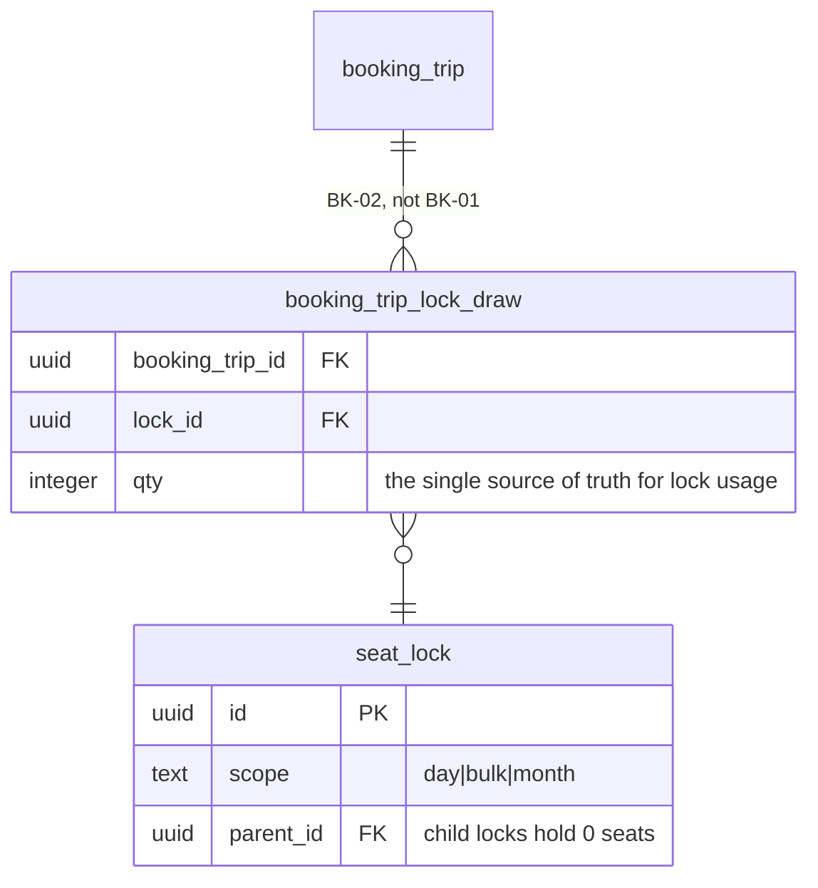

# ERD — the booking aggregate (BK-01)

20 tables in `operation_schemas`, created by migrations `0001`–`0006`.
`booking` is the aggregate root; every other table cascades from it.

Field-by-field provenance is in [MAPPING.md](./MAPPING.md).

## How to read it

- **`||--o{`** one-to-many. Empty means **zero rows** — never a placeholder.
- **`||--o|`** zero-or-one. These tables key on `booking_id`, so "this never
  happened" is the absence of a row, not a row full of nulls, and a second one
  is impossible rather than merely unexpected.
- **`intended FK ->`** in a comment marks a column whose target table **does not
  exist yet**. It is declared with the right type and a `COMMENT ON COLUMN`
  naming the target; the constraint lands when that table is migrated and P0-09
  has triaged the orphans that would otherwise make it fail. Only columns marked
  `FK` carry a real enforced constraint today, and every one of those points at
  `booking` or `booking_trip`.

```mermaid
erDiagram
    booking ||--o{ booking_trip : "trips"
    booking ||--o{ booking_passenger : "named pax"
    booking ||--o{ booking_ops : "one row per SERVICE DAY"
    booking ||--o{ booking_addon : ""
    booking ||--o{ booking_adjustment : ""
    booking ||--o{ booking_fee_item : ""
    booking ||--o{ booking_upgrade : ""
    booking ||--o{ booking_alt_pickup : ""
    booking ||--o{ booking_history : "append-only"
    booking ||--o{ booking_partial_cancel : ""
    booking ||--o{ booking_attachment : "metadata only"
    booking ||--o| booking_price_breakdown : ""
    booking ||--o| booking_approval : "over capacity"
    booking ||--o| booking_foc_approval : ""
    booking ||--o| booking_cancellation : ""
    booking ||--o| booking_reschedule : ""
    booking ||--o| booking_weather_resolve : ""
    booking ||--o| booking_b2c_link : ""
    booking_trip ||--o{ booking_trip_pax : "one row per (kind, class)"

    booking {
        uuid id PK
        text code UK "BK-26080001 — natural key"
        smallint schema_ver
        boolean legacy_v1 "v1 rows are read-only"
        text source_system "ops|b2c|erp|agent"
        date booking_date
        text voucher_ref "UK among ACTIVE bookings"
        text status "CHECK — 8 values"
        text agent_id "intended FK -> agent"
        text rate_type_id "intended FK -> rate_type (RT-01)"
        text sold_by "intended FK -> sales staff; null = inherit agent.sales"
        text lead_pax
        text pickup_area_id "intended FK -> pickup_area"
        text pickup_zone "PK|KL|NoTransfer"
        jsonb payment_snapshot "frozen at create"
        jsonb market_snapshot "frozen at create"
        text price_mode "rate|manual"
        numeric manual_total
        text_array incomplete "soft-missing flags"
        text purpose "sale|staff_welfare|staff_inspection"
        text staff_id "intended FK -> staff"
        timestamptz created_at
    }

    booking_trip {
        uuid id PK
        uuid booking_id FK
        smallint trip_index "UK with booking_id"
        text route_id "intended FK -> route"
        date trip_date
        text booking_mode "seat|charter"
        text charter_boat_id "intended FK -> boat; required when charter"
        text ovn "overnight package"
        smallint ovn_of_trip_index
        integer seat_source_locked
        integer seat_source_general
        numeric subtotal
    }

    booking_trip_pax {
        uuid booking_trip_id PK "and FK -> booking_trip"
        text pax_kind PK "AD|CHD|INF|FOC"
        text nationality_class PK "FR|TH — a rate class, not a passport"
        integer qty "CHECK >= 0; absent row = zero"
    }

    booking_passenger {
        uuid id PK
        uuid booking_id FK
        smallint seq
        text name
        text pax_kind
        boolean is_foc
        boolean is_lead "at most one per booking"
    }

    booking_ops {
        uuid id PK
        uuid booking_id FK
        date service_date "UK with booking_id"
        text boat_id "intended FK -> boat"
        text van_id "intended FK -> vehicle"
        text van_return_id "intended FK -> vehicle; per-booking"
        integer van_group
        integer van_seq
        jsonb van_splits
        jsonb pfm "finance-owned, opaque"
    }

    booking_price_breakdown {
        uuid booking_id PK "and FK -> booking"
        numeric seat
        numeric addon
        numeric foc_discount "CHECK <= 0 — stays negative"
        numeric discount "CHECK <= 0 — stays negative"
        numeric extra
        numeric total
    }

    booking_addon {
        uuid id PK
        uuid booking_id FK
        text type "RT_ADDON_DEFS key — open set"
        numeric amount
        integer qty
    }

    booking_adjustment {
        uuid id PK
        uuid booking_id FK
        text kind
        text mode "amount|percent"
        numeric value "signed"
    }

    booking_fee_item {
        uuid id PK
        uuid booking_id FK
        text type
        numeric amount
        timestamptz raised_at "raised AFTER the sale"
    }

    booking_upgrade {
        uuid id PK
        uuid booking_id FK
        text upgrade_code
        numeric sell_price
        numeric to_company
        numeric commission
        numeric customer_paid
        text seller "intended FK -> staff"
    }

    booking_alt_pickup {
        uuid id PK
        uuid booking_id FK
        text who
        integer qty
        text area_id "intended FK -> pickup_area"
        jsonb pax "driver instruction, not a priced qty"
    }

    booking_history {
        uuid id PK
        uuid booking_id FK
        timestamptz at
        integer seq "orders same-millisecond entries"
        text kind
        text actor
        jsonb data
    }

    booking_approval {
        uuid booking_id PK "and FK -> booking"
        text status "pending|approved|rejected"
        text target_status
        jsonb over "capacity snapshot the approver saw"
        integer tot_over
        timestamptz requested_at
    }

    booking_foc_approval {
        uuid booking_id PK "and FK -> booking"
        integer pax_count
        text status
        timestamptz requested_at
    }

    booking_cancellation {
        uuid booking_id PK "and FK -> booking"
        timestamptz cancelled_at
        text category
        text group_name
        numeric charge_amount
    }

    booking_partial_cancel {
        uuid id PK
        uuid booking_id FK
        date trip_date
        smallint trip_index
        jsonb pax_removed "historical delta"
        numeric refund
        numeric charged_amount
        numeric waived_amount
    }

    booking_reschedule {
        uuid booking_id PK "and FK -> booking"
        date from_date
        date to_date
        numeric charge_amount
        text collect
    }

    booking_weather_resolve {
        uuid booking_id PK "and FK -> booking"
        text event_id "intended FK -> weather_event"
        text outcome
        date new_date
    }

    booking_attachment {
        uuid id PK
        uuid booking_id FK "the FK the old shape could not have"
        text legacy_attachment_id UK "-> allotment.attachments; bytes stay there"
        text filename
        integer size_bytes
    }

    booking_b2c_link {
        uuid booking_id PK "and FK -> booking"
        text lk_booking_id "-> love_kingdom.bookings"
        smallint leg_index "the _n suffix; NOT NULL so UK bites"
        jsonb owned_fields "which side wins per field"
    }
```

## Not modelled here

`trip.lockDraws[]` is deliberately absent from the BK-01 tables. It becomes
`booking_trip_lock_draw` in **BK-02**, where `used` turns into a derived view
over it rather than a stored counter — the change that deletes `bkV2LockAudit`,
`bkV2LockCoverage`, `bkV2LockFixUsed` and `bkV2LockFixTree`. One owner of the
lock schema, so there is nothing to keep in sync.

## Boundaries

`booking_attachment` and `booking_b2c_link` are where this schema touches the
other two. Both intentionally stop short of the cross-schema foreign key:

| Link                                      | Target                      | Why the FK is not here yet                                                                                    |
| ----------------------------------------- | --------------------------- | ------------------------------------------------------------------------------------------------------------- |
| `booking_attachment.legacy_attachment_id` | `allotment.attachments(id)` | 118 of 3,038 attachment rows are already orphaned. P0-09 relinks or soft-deletes them; the FK is added after. |
| `booking_b2c_link.lk_booking_id`          | `love_kingdom.bookings(id)` | 22 ops bookings carry a b2c id with no love_kingdom row behind it. Same triage, same order.                   |

A cross-schema FK is legal in Postgres and is the right first step in both cases
— the constraint is deferred because of the data, not the schema.
